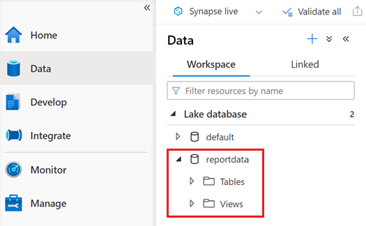
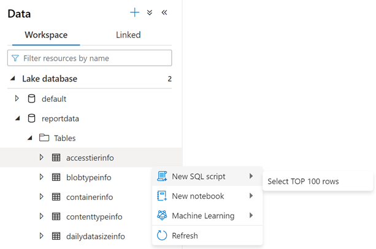
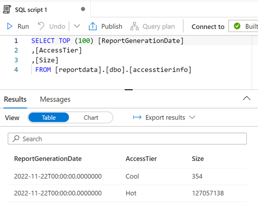
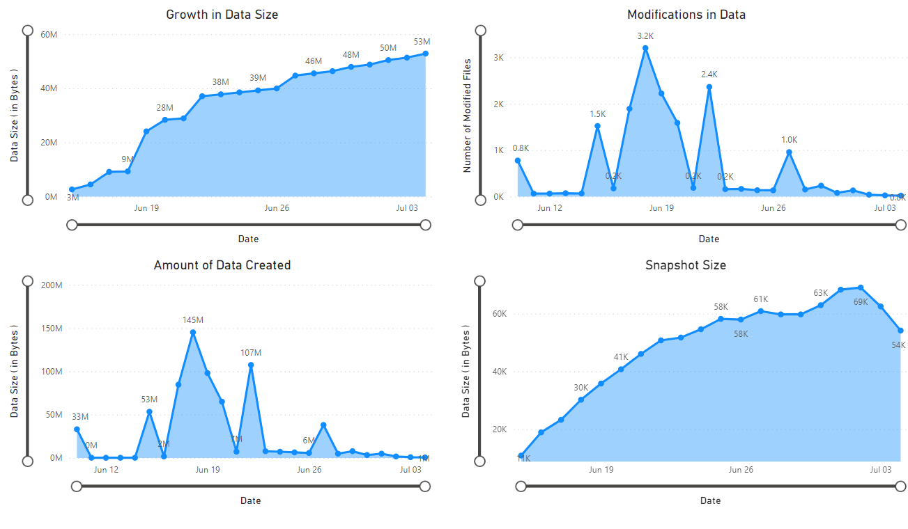
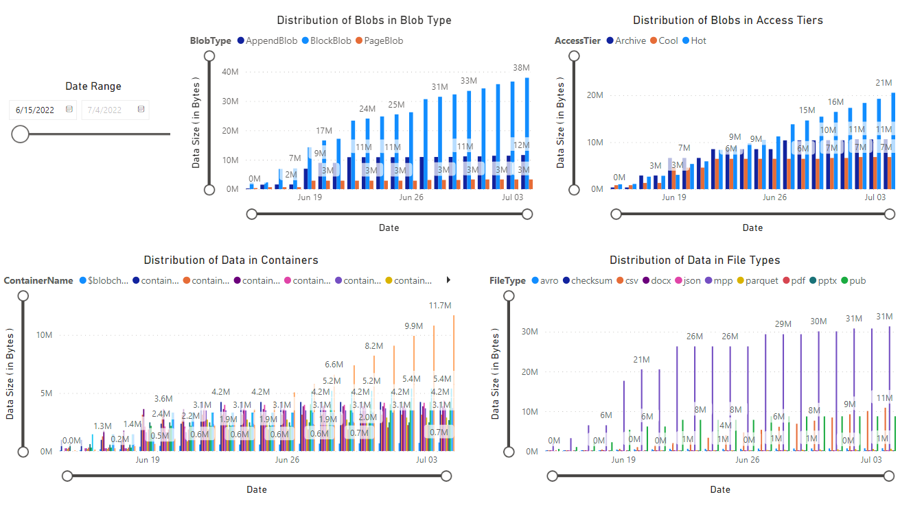

# Tutorial: Analyze blob inventory reports

By understanding how your blobs and containers are stored, organized, and used in production, you can better optimize the tradeoffs between cost and performance.

This tutorial shows you how to generate and visualize statistics such as data growth over time, data added over time, number of files modified, blob snapshot sizes, access patterns over each tier, and how data is distributed both currently and over time (For example: data across tiers, file types, in containers, and blob types). 

In this tutorial, you learn how to:

> [!div class="checklist"]
> * Generate a blob inventory report
> * Set up a Synapse workspace
> * Set up Synapse Studio
> * Generate analytic data in Synapse Studio
> * Visualize results in Power BI

## Prerequisites

- An Azure subscription - [create an account for free](https://azure.microsoft.com/free/?WT.mc_id=A261C142F)

- An Azure storage account - [create a storage account](../common/storage-account-create.md) 
  
  Make sure that your user identity has the [Storage Blob Data Contributor role](assign-azure-role-data-access.md) assigned to it.

## Generate an inventory report

Enable blob inventory reports for your storage account. See [Enable Azure Storage blob inventory reports](blob-inventory-how-to.md). 

You might have to wait up to 24 hours after enabling inventory reports for your first report to be generated.

## Set up a Synapse workspace

1. Create an Azure Synapse workspace. See [Create an Azure Synapse workspace](../../synapse-analytics//get-started-create-workspace.md). 

   > [!NOTE]
   > As part of creating the workspace, you'll create a storage account that has a hierarchical namespace. Azure Synapse stores Spark tables and application logs to this account. Azure Synapse refers to this account as the _primary storage account_. To avoid confusion, this article uses the term _inventory report account_ to refer to the account which contains inventory reports.

2. In the Synapse workspace, assign the **Contributor** role to your user identity. See [Azure RBAC: Owner role for the workspace](../../synapse-analytics/get-started-add-admin.md#azure-rbac-owner-role-for-the-workspace).

3. Give the Synapse workspace permission to access the inventory reports in your storage account by navigating to your inventory report account, and then assigning the **Storage Blob Data Contributor** role to the system managed identity of the workspace. See [Assign Azure roles using the Azure portal](../../role-based-access-control/role-assignments-portal.md).

4. Navigate to primary storage account and assign the **Blob Storage Contributor** role to your user identity.

## Set up Synapse Studio

1. Open your Synapse workspace in Synapse Studio. See [Open Synapse Studio](../../synapse-analytics/get-started-create-workspace.md#open-synapse-studio).

2. In Synapse Studio, Make sure that your identity is assigned the role of **Synapse Administrator**. See [Synapse RBAC: Synapse Administrator role for the workspace](../../synapse-analytics/get-started-add-admin.md#synapse-rbac-synapse-administrator-role-for-the-workspace).

3. Create an Apache Spark pool. See [Create a serverless Apache Spark pool](../../synapse-analytics/get-started-analyze-spark.md#create-a-serverless-apache-spark-pool).

## Set up and run the sample notebook

In this section, you'll generate statistical data that you'll visualize in a report. To simplify this tutorial, this section uses a sample configuration file and a sample PySpark notebook. The notebook contains a collection of queries that execute in Azure Synapse Studio. 

#### Modify and upload the sample configuration file

1. Download the [BlobInventoryStorageAccountConfiguration.json](https://github.com/microsoft/Blob-Inventory-Report-Analytics/blob/main/src/BlobInventoryStorageAccountConfiguration.json) file.

2. Update the following placeholders of that file:

   - Set `storageAccountName` to the name of your inventory report account.
   
   - Set `destinationContainer` to the name of the container that holds the inventory reports.
   
   - Set `blobInventoryRuleName` to the name of the inventory report rule that has generated the results that you'd like to analyze.
   
   - Set `accessKey` to the account key of the inventory report account.

3. Upload this file to the container in your primary storage account that you specified when you created the Synapse workspace. 

#### Import the sample PySpark Notebook

1. Download the [ReportAnalysis.ipynb](https://github.com/microsoft/Blob-Inventory-Report-Analytics/blob/main/src/ReportAnalysis.ipynb) sample notebook.

   > [!NOTE]
   > Make sure to save this file with the `.ipynb` extension.

2. Open your Synapse workspace in Synapse Studio. See [Open Synapse Studio](../../synapse-analytics/get-started-create-workspace.md#open-synapse-studio).

3. In Synapse Studio, select the **Develop** tab.

4. Select the plus sign **(+)** to add an item.

5. Select **Import**, browse to the sample file that you downloaded, select that file, and select **Open**.

   The **Properties** dialog box appears.

6. In the **Properties** dialog box, select the **Configure session** link.

   > [!div class="mx-imgBorder"]
   >  

   The **Configure session** dialog box opens.

7. In the **Attach to** drop-down list of the **Configure session** dialog box, select the Spark pool that you created earlier in this article. Then, select the **Apply** button.

#### Modify the Python notebook

1. In the first cell of the python notebook, set the value of the `storage_account` variable to the name of the primary storage account. 

2. Update the value of the `container_name` variable to the name of the container in that account that you specified when you created the Synapse workspace.

3. Select the **Publish** button.

#### Run the PySpark notebook

1. In the PySpark notebook, select **Run all**.

   It will take a few minutes to start the Spark session and another few minutes to process the inventory reports. The first run could take a while if there are numerous inventory reports to process. Subsequent runs will only process the new inventory reports created since the last run.

   > [!NOTE]
   > If you make any changes to the notebook will the notebook is running, make sure to publish those changes by using the **Publish** button.
   
2. Verify that the notebook ran successfully by selecting the **Data** tab.

   A database named **reportdata** should appear in the **Workspace** tab of the **Data** pane. If this database doesn't appear, then you might have to refresh the web page.
   
   > [!div class="mx-imgBorder"]
   > 
   
   The database contains a set of tables. Each table contains information obtained by running the queries from the PySpark notebook. 

3. To examine the contents of a table, expand the **Tables** folder of the **reportdata** database. Then, right-click a table, select **Select SQL script**, and then select **Select TOP 100 rows**.

   > [!div class="mx-imgBorder"]
   >  

4. You can modify the query as needed and then select **Run** to view the results.

   > [!div class="mx-imgBorder"]
   >  

## Visualize the data

1. Download the [ReportAnalysis.pbit](https://github.com/microsoft/Blob-Inventory-Report-Analytics/blob/main/src/ReportAnalysis.pbit) sample report file.

2. Open Power BI Desktop. For installation guidance, see [Get Power BI Desktop](/power-bi/fundamentals/desktop-get-the-desktop).

2. In Power BI, select **File**, **Open report**, and then **Browse reports**. 

3. In the **Open** dialog box, change the file type to **Power BI template files (*.pbit)**. 

   > [!div class="mx-imgBorder"]
   >  

4. Browse to the location of the **ReportAnalysis.pbit** file that you downloaded, and then select **Open**.

   A dialog box appears which asks you to provide the name of the Synapse workspace and the data base name. 

5. In the dialog box, set the **synapse_workspace_name** field to the workspace name and set the **database_name** field to `reportdata`. Then, select the **Load** button.

   > [!div class="mx-imgBorder"]
   >  

   A report appears which provides visualizations of the data retrieved by the notebook. The following images show the types of the charts and graphs that appear in this report.

   > [!div class="mx-imgBorder"]
   >  

   > [!div class="mx-imgBorder"]
   >  

   > [!div class="mx-imgBorder"]
   >  

## Next steps

- Set up an Azure Synapse pipeline to keep running your notebook at regular intervals. That way you can process new inventory reports as they're created. After the initial run, each of the next runs will analyze incremental data and then update the tables with the results of that analysis. For guidance, see [Integrate with pipelines](../../synapse-analytics/get-started-pipelines.md).

- Learn about ways to analyze individual containers in your storage account. See these articles:

  [Calculate blob count and total size per container using Azure Storage inventory](calculate-blob-count-size.md)
  
  [How to calculate Container Level Statistics in Azure Blob Storage with Azure Databricks](https://techcommunity.microsoft.com/t5/azure-paas-blog/how-to-calculate-container-level-statistics-in-azure-blob/ba-p/3614650)

- Learn about ways to optimize your costs based on the analysis of your blobs and containers. See these articles:

  [Plan and manage costs for Azure Blob Storage](../common/storage-plan-manage-costs.md)

  [Estimate the cost of archiving data](archive-cost-estimation.md)

  [Optimize costs by automatically managing the data lifecycle](lifecycle-management-overview.md)