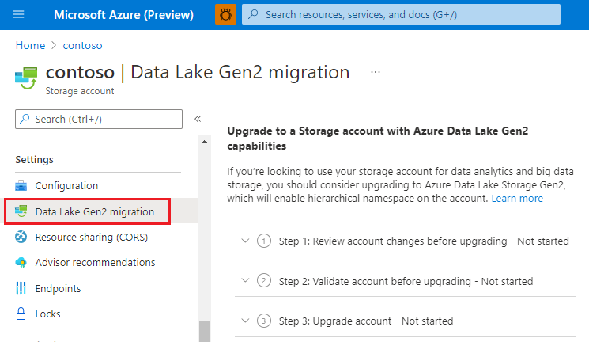
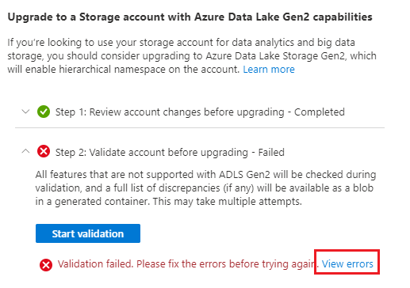

#  Upgrade Azure Blob Storage with Azure Data Lake Storage Gen2 capabilities

This article helps you unlock capabilities such as file and directory-level security and faster operations. These capabilities are widely used by big data analytics workloads and are referred to collectively as Azure Data Lake Storage Gen2. 

To learn more about these capabilities and evaluate the impact of this upgrade on workloads, applications, costs, service integrations, tools, features, and documentation, see [Upgrading Azure Blob Storage with Azure Data Lake Storage Gen2 capabilities](upgrade-to-data-lake-storage-gen2.md).

> [!IMPORTANT]
> An upgrade is one-way. There's no way to revert your account once you've performed the upgrade. We recommend that you validate your upgrade in a non production environment.

## Enable the ability to upgrade your account

To upgrade your account, you must register the `HnsOnMigration` feature with your subscription. 

### Register the feature

### [Portal](#tab/azure-portal)

1. Sign in to the [Azure portal](https://portal.azure.com/).

2. Locate your subscription and in configuration page of your subscription, select **Preview features**.

3. In the **Preview features** page, select the **ADLS enable Hierarchical Namespace for existing account** feature, and then select **Register**.

   > [!div class="mx-imgBorder"]
   > 

#### [PowerShell](#tab/powershell)

1. Open a Windows PowerShell command window.

1. Sign in to your Azure subscription with the `Connect-AzAccount` command and follow the on-screen directions.

   ```powershell
   Connect-AzAccount
   ```

2. If your identity is associated with more than one subscription, then set your active subscription.

   ```powershell
   $context = Get-AzSubscription -SubscriptionId <subscription-id>
   Set-AzContext $context
   ```

   Replace the `<subscription-id>` placeholder value with the ID of your subscription.

3. Register the `HnsOnMigration` feature by using the [Register-AzProviderFeature](/powershell/module/az.resources/register-azproviderfeature) command.

   ```powershell
   Register-AzProviderFeature -ProviderNamespace Microsoft.Storage -FeatureName HnsOnMigration
   ```

   > [!NOTE]
   > The registration process might not complete immediately. Make sure to verify that the feature is registered before using it.

#### [Azure CLI](#tab/azure-cli)

1. Open the [Azure Cloud Shell](../../cloud-shell/overview.md), or if you've [installed](/cli/azure/install-azure-cli) the Azure CLI locally, open a command console application such as Windows PowerShell.

2. If your identity is associated with more than one subscription, then set your active subscription to subscription of the storage account.

   ```azurecli-interactive
   az account set --subscription <subscription-id>
   ```

   Replace the `<subscription-id>` placeholder value with the ID of your subscription.

3. Register the `HnsOnMigration` feature by using the [az feature register](/cli/azure/feature#az_feature_register) command.

   ```azurecli
   az feature register --namespace Microsoft.Storage --name HnsOnMigration
   ```

   > [!NOTE]
   > The registration process might not complete immediately. Make sure to verify that the feature is registered before using it.

---

### Verify that the feature is registered

#### [PowerShell](#tab/powershell)

To verify that the registration is complete, use the [Get-AzProviderFeature](/powershell/module/az.resources/get-azproviderfeature) command.

```powershell
Get-AzProviderFeature -ProviderNamespace Microsoft.Storage -FeatureName HnsOnMigration
```

#### [Azure CLI](#tab/azure-cli)

To verify that the registration is complete, use the [az feature](/cli/azure/feature#az_feature_show) command.

```azurecli
az feature show --namespace Microsoft.Storage --name HnsOnMigration
```

---

## Perform the upgrade

1. Sign in to the [Azure portal](https://portal.azure.com/) to get started.

2. Locate your storage account and display the account overview.

3. Select **Data Lake Gen2 migration**.

   The **Upgrade to a Storage account with Azure Data Lake Gen2 capabilities** configuration page appears.

   > [!div class="mx-imgBorder"]
   > 

4. Expand the **Step 1: Review account changes before upgrading** section and click **Review and agree to changes**.

5. In the **Review account changes** page, select the checkbox and then click **Agree to changes**.

6. Expand the **Step 2: Validate account before upgrading** section and then click **Start validation**.

   If validation fails, select the **View Errors** link

   > [!div class="mx-imgBorder"]
   > 

   Then, from the context menu of the **error.json** file, select **Download**.

   > [!div class="mx-imgBorder"]
   > 

   Open the downloaded file to determine why the validation might have failed to complete successfully. 

   The following JSON indicates that an incompatible feature is enabled on the account. In this case, you would disable the feature and then start the validation process again.

   ```json
   {
    "startTime": "2021-08-04T18:40:31.8465320Z",
    "id": "45c84a6d-6746-4142-8130-5ae9cfe013a0",
    "incompatibleFeatures": [
        "Blob Delete Retention Enabled"
    ],
    "blobValidationErrors": [],
    "scannedBlobCount": 0,
    "invalidBlobCount": 0,
    "endTime": "2021-08-04T18:40:34.9371480Z"
   }
   ```

7. After your account has been successfully validated, expand the **Step 3: Upgrade account** section, and then click **Start upgrade**.

   > [!IMPORTANT]
   > Read and write operations are disabled while your account is being upgraded. 

   When the migration has completed successfully, a message similar to the following appears. 

   > [!div class="mx-imgBorder"]
   > 

## Migrate data, workloads, and applications 

1. Configure [services in your workloads](data-lake-storage-integrate-with-azure-services.md) to point to either the **Blob service** endpoint or the **Data Lake storage** endpoint.

   > [!div class="mx-imgBorder"]
   > 
  
3. For Hadoop workloads that use Windows Azure Storage Blob driver or [WASB](https://hadoop.apache.org/docs/current/hadoop-azure/index.html) driver, make sure to modify them to use the the [Azure Blob File System (ABFS)](https://hadoop.apache.org/docs/stable/hadoop-azure/abfs.html) driver. Unlike the WASB driver that makes requests to the **Blob service** endpoint, the ABFS driver will make requests to the **Data Lake Storage** endpoint of your account.

2. Test custom applications to ensure that they work as expected with your upgraded account. 

   [Multi-protocol access on Data Lake Storage](data-lake-storage-multi-protocol-access.md) enables most applications to continue using Blob APIs without modification. If you encounter issues or you want to use APIs to work with directory operations and ACLs, consider moving some of your code to use Data Lake Storage Gen2 APIs. See guides for [.NET](data-lake-storage-directory-file-acl-dotnet.md), [Java](data-lake-storage-directory-file-acl-java.md), [Python](data-lake-storage-directory-file-acl-python.md), [Node.js](data-lake-storage-acl-javascript.md), and [REST](/rest/api/storageservices/data-lake-storage-gen2). 

3. Test any custom scripts to ensure that they work as expected with your upgraded account. 

   As is the case with Blob APIs, many of your scripts will likely work without requiring you to modify them. As needed, upgrade script files to use Data Lake Storage Gen2 [PowerShell cmdlets](data-lake-storage-directory-file-acl-powershell.md), and [Azure CLI commands](data-lake-storage-directory-file-acl-cli.md).
 

## See also

[Introduction to Azure Data Lake storage Gen2](data-lake-storage-introduction.md)