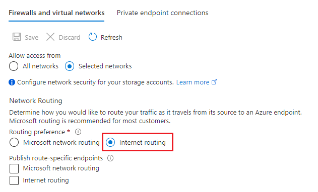

# Configure network routing preference for Azure Storage

This article describes how you can configure the routing preference and route-specific endpoints for your storage account. The default routing preference for a storage account is via the Microsoft global network. Traffic between clients on the internet and your storage account will be routed via the ISP network when you choose **Internet** as your routing preference option. In addition, you can configure additional route-specific endpoints for your storage account.

## Change the routing preference for the default public endpoint

By default, the routing preference for the public endpoint of the storage account is set to Microsoft global network. To change this to Internet routing:

1.	Navigate to your storage account in the portal.
2.	Under Settings in the left navigation pane, select **Networking**.

    > [!div class="mx-imgBorder"]
    > 

3.	In the **Firewalls and virtual networks** tab, under **Network Routing**, change the **Routing preference** setting to **Internet routing**.
4.	Click **Save**.

    > [!div class="mx-imgBorder"]
    > 

## Configure a route-specific endpoint

In addition to changing the preference for the default public endpoint of the storage account, you can also configure a route-specific endpoint. For instance, you can set the routing preference for the default endpoint to *Internet routing*, and publish a route-specific endpoint that enables traffic between clients on the internet and your storage account to be routed via the Microsoft global network:

1.	Navigate to your storage account in the portal.
2.	Under **Settings** in the left navigation pane, select **Networking**.
3.	In the Firewalls and virtual networks tab, under Publish route-specific endpoints, select the **Microsoft network routing**.
4.	Click **Save**.

    > [!div class="mx-imgBorder"]
    > 

To access the endpoint name for the route-specific endpoint you’ve configured:

1.	Under **Settings** in the left navigation pane, select **Properties**.

    > [!div class="mx-imgBorder"]
    > 

2.	The **Microsoft network routing** endpoint is shown for each service that supports routing preferences.

    > [!div class="mx-imgBorder"]
    > 

## See also

- [Network routing preference](network-routing-preference.md)
- [Configure Azure Storage firewalls and virtual networks](storage-network-security.md)
- [Security recommendations for Blob storage](../blobs/security-recommendations.md)
