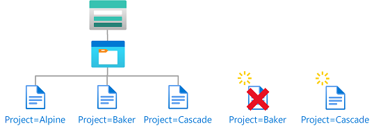
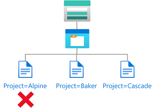
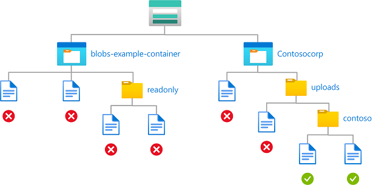
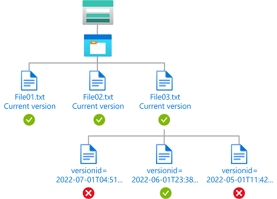
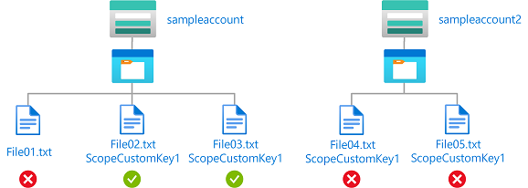
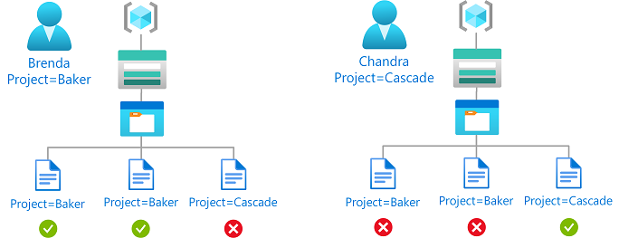
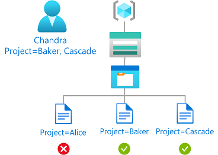

# Example Azure role assignment conditions (preview)

> [!IMPORTANT]
> Azure ABAC and Azure role assignment conditions are currently in preview.
> This preview version is provided without a service level agreement, and it's not recommended for production workloads. Certain features might not be supported or might have constrained capabilities.
> For more information, see [Supplemental Terms of Use for Microsoft Azure Previews](https://azure.microsoft.com/support/legal/preview-supplemental-terms/).

This article list some examples of role assignment conditions.

## Prerequisites

For information about the prerequisites to add or edit role assignment conditions, see [Conditions prerequisites](../../role-based-access-control/conditions-prerequisites.md).

## Blob index tags

### Example: Read blobs with a blob index tag

This condition allows users to read blobs with a [blob index tag](../blobs/storage-blob-index-how-to.md) key of Project and a value of Cascade. Attempts to access blobs without this key-value tag will not be allowed.

You must add this condition to any role assignments that include the following action.

> [!div class="mx-tableFixed"]
> | Action | Notes |
> | --- | --- |
> | `Microsoft.Storage/storageAccounts/blobServices/containers/blobs/read` |  |


```
(
 (
  !(ActionMatches{'Microsoft.Storage/storageAccounts/blobServices/containers/blobs/read'} AND SubOperationMatches{'Blob.Read.WithTagConditions'})
 )
 OR 
 (
  @Resource[Microsoft.Storage/storageAccounts/blobServices/containers/blobs/tags:Project<$key_case_sensitive$>] StringEquals 'Cascade'
 )
)
```

#### Azure portal

Here are the settings to add this condition using the Azure portal.

> [!div class="mx-tableFixed"]
> | Condition #1 | Setting |
> | --- | --- |
> | Actions | [Read content from a blob with tag conditions](storage-auth-abac-attributes.md#read-content-from-a-blob-with-tag-conditions) |
> | Attribute source | Resource |
> | Attribute | [Blob index tags [Values in key]](storage-auth-abac-attributes.md#blob-index-tags-values-in-key) |
> | Key | {keyName} |
> | Operator | [StringEquals](../../role-based-access-control/conditions-format.md#stringequals) |
> | Value | {keyValue} |

:::image type="content" source="./media/storage-auth-abac-examples/blob-index-tags-read-portal.png" alt-text="Screenshot of condition editor in Azure portal showing read access to blobs with a blob index tag." lightbox="./media/storage-auth-abac-examples/blob-index-tags-read-portal.png":::

#### Azure PowerShell

Here's how to add this condition using Azure PowerShell.

```azurepowershell
$condition = "((!(ActionMatches{'Microsoft.Storage/storageAccounts/blobServices/containers/blobs/read'} AND SubOperationMatches{'Blob.Read.WithTagConditions'})) OR (@Resource[Microsoft.Storage/storageAccounts/blobServices/containers/blobs/tags:Project<`$key_case_sensitive`$>] StringEquals 'Cascade'))"
$testRa = Get-AzRoleAssignment -Scope $scope -RoleDefinitionName $roleDefinitionName -ObjectId $userObjectID
$testRa.Condition = $condition
$testRa.ConditionVersion = "2.0"
Set-AzRoleAssignment -InputObject $testRa -PassThru
```

Here's how to test this condition.

```azurepowershell
$bearerCtx = New-AzStorageContext -StorageAccountName $storageAccountName
Get-AzStorageBlob -Container <containerName> -Blob <blobName> -Context $bearerCtx 
```

### Example: New blobs must include a blob index tag

This condition requires that any new blobs must include a [blob index tag](../blobs/storage-blob-index-how-to.md) key of Project and a value of Cascade.

There are two actions that allow you to create new blobs, so you must target both. You must add this condition to any role assignments that include one of the following actions.

> [!div class="mx-tableFixed"]
> | Action | Notes |
> | --- | --- |
> | `Microsoft.Storage/storageAccounts/blobServices/containers/blobs/write` |  |
> | `Microsoft.Storage/storageAccounts/blobServices/containers/blobs/add/action` |  |



```
(
 (
  !(ActionMatches{'Microsoft.Storage/storageAccounts/blobServices/containers/blobs/write'} AND SubOperationMatches{'Blob.Write.WithTagHeaders'})
  AND
  !(ActionMatches{'Microsoft.Storage/storageAccounts/blobServices/containers/blobs/add/action'} AND SubOperationMatches{'Blob.Write.WithTagHeaders'})
 )
 OR 
 (
  @Request[Microsoft.Storage/storageAccounts/blobServices/containers/blobs/tags:Project<$key_case_sensitive$>] StringEquals 'Cascade'
 )
)
```

#### Azure portal

Here are the settings to add this condition using the Azure portal.

> [!div class="mx-tableFixed"]
> | Condition #1 | Setting |
> | --- | --- |
> | Actions | [Write to a blob with blob index tags](storage-auth-abac-attributes.md#write-to-a-blob-with-blob-index-tags)<br/>[Write to a blob with blob index tags](storage-auth-abac-attributes.md#write-to-a-blob-with-blob-index-tags) |
> | Attribute source | Request |
> | Attribute | [Blob index tags [Values in key]](storage-auth-abac-attributes.md#blob-index-tags-values-in-key) |
> | Key | {keyName} |
> | Operator | [StringEquals](../../role-based-access-control/conditions-format.md#stringequals) |
> | Value | {keyValue} |

:::image type="content" source="./media/storage-auth-abac-examples/blob-index-tags-new-blobs-portal.png" alt-text="Screenshot of condition editor in Azure portal showing new blobs must include a blob index tag." lightbox="./media/storage-auth-abac-examples/blob-index-tags-new-blobs-portal.png":::

#### Azure PowerShell

Here's how to add this condition using Azure PowerShell.

```azurepowershell
$condition = "((!(ActionMatches{'Microsoft.Storage/storageAccounts/blobServices/containers/blobs/write'} AND SubOperationMatches{'Blob.Write.WithTagHeaders'}) AND !(ActionMatches{'Microsoft.Storage/storageAccounts/blobServices/containers/blobs/add/action'} AND SubOperationMatches{'Blob.Write.WithTagHeaders'})) OR (@Request[Microsoft.Storage/storageAccounts/blobServices/containers/blobs/tags:Project<`$key_case_sensitive`$>] StringEquals 'Cascade'))"
$testRa = Get-AzRoleAssignment -Scope $scope -RoleDefinitionName $roleDefinitionName -ObjectId $userObjectID
$testRa.Condition = $condition
$testRa.ConditionVersion = "2.0"
Set-AzRoleAssignment -InputObject $testRa -PassThru
```

Here's how to test this condition.

```azurepowershell
$localSrcFile = # path to an example file, can be an empty txt
$ungrantedTag = @{'Project'='Baker'}
$grantedTag = @{'Project'='Cascade'}
# Get new context for request
$bearerCtx = New-AzStorageContext -StorageAccountName $storageAccountName
# try ungranted tags
$content = Set-AzStorageBlobContent -File $localSrcFile -Container example2 -Blob "Example2.txt" -Tag $ungrantedTag -Context $bearerCtx
# try granted tags
$content = Set-AzStorageBlobContent -File $localSrcFile -Container example2 -Blob "Example2.txt" -Tag $grantedTag -Context $bearerCtx
```

### Example: Existing blobs must have blob index tag keys

This condition requires that any existing blobs be tagged with at least one of the allowed [blob index tag](../blobs/storage-blob-index-how-to.md) keys: Project or Program. This condition is useful for adding governance to existing blobs.

There are two actions that allow you to update tags on existing blobs, so you must target both. You must add this condition to any role assignments that include one of the following actions.

> [!div class="mx-tableFixed"]
> | Action | Notes |
> | --- | --- |
> | `Microsoft.Storage/storageAccounts/blobServices/containers/blobs/write` |  |
> | `Microsoft.Storage/storageAccounts/blobServices/containers/blobs/tags/write` |  |


```
(
 (
  !(ActionMatches{'Microsoft.Storage/storageAccounts/blobServices/containers/blobs/write'} AND SubOperationMatches{'Blob.Write.WithTagHeaders'})
  AND
  !(ActionMatches{'Microsoft.Storage/storageAccounts/blobServices/containers/blobs/tags/write'})
 )
 OR 
 (
  @Request[Microsoft.Storage/storageAccounts/blobServices/containers/blobs/tags&$keys$&] ForAllOfAnyValues:StringEquals {'Project', 'Program'}
 )
)
```

#### Azure portal

Here are the settings to add this condition using the Azure portal.

> [!div class="mx-tableFixed"]
> | Condition #1 | Setting |
> | --- | --- |
> | Actions | [Write to a blob with blob index tags](storage-auth-abac-attributes.md#write-to-a-blob-with-blob-index-tags)<br/>[Write blob index tags](storage-auth-abac-attributes.md#write-blob-index-tags) |
> | Attribute source | Request |
> | Attribute | [Blob index tags [Keys]](storage-auth-abac-attributes.md#blob-index-tags-keys) |
> | Operator | [ForAllOfAnyValues:StringEquals](../../role-based-access-control/conditions-format.md#forallofanyvalues) |
> | Value | {keyName1}<br/>{keyName2} |

:::image type="content" source="./media/storage-auth-abac-examples/blob-index-tags-keys-portal.png" alt-text="Screenshot of condition editor in Azure portal showing existing blobs must have blob index tag keys." lightbox="./media/storage-auth-abac-examples/blob-index-tags-keys-portal.png":::

#### Azure PowerShell

Here's how to add this condition using Azure PowerShell.

```azurepowershell
$condition = "((!(ActionMatches{'Microsoft.Storage/storageAccounts/blobServices/containers/blobs/write'} AND SubOperationMatches{'Blob.Write.WithTagHeaders'}) AND !(ActionMatches{'Microsoft.Storage/storageAccounts/blobServices/containers/blobs/tags/write'})) OR (@Request[Microsoft.Storage/storageAccounts/blobServices/containers/blobs/tags&`$keys`$&] ForAllOfAnyValues:StringEquals {'Project', 'Program'}))"
$testRa = Get-AzRoleAssignment -Scope $scope -RoleDefinitionName $roleDefinitionName -ObjectId $userObjectID
$testRa.Condition = $condition
$testRa.ConditionVersion = "2.0"
Set-AzRoleAssignment -InputObject $testRa -PassThru
```

Here's how to test this condition.

```azurepowershell
$localSrcFile = # path to an example file, can be an empty txt
$ungrantedTag = @{'Mode'='Baker'}
$grantedTag = @{'Program'='Alpine';'Project'='Cascade'}
# Get new context for request
$bearerCtx = New-AzStorageContext -StorageAccountName $storageAccountName
# try ungranted tags
$content = Set-AzStorageBlobContent -File $localSrcFile -Container example3 -Blob "Example3.txt" -Tag $ungrantedTag -Context $bearerCtx
# try granted tags
$content = Set-AzStorageBlobContent -File $localSrcFile -Container example3 -Blob "Example3.txt" -Tag $grantedTag -Context $bearerCtx
```

### Example: Existing blobs must have a blob index tag key and values

This condition requires that any existing blobs to have a [blob index tag](../blobs/storage-blob-index-how-to.md) key of Project and values of Cascade, Baker, or Skagit. This condition is useful for adding governance to existing blobs.

There are two actions that allow you to update tags on existing blobs, so you must target both. You must add this condition to any role assignments that include one of the following actions.

> [!div class="mx-tableFixed"]
> | Action | Notes |
> | --- | --- |
> | `Microsoft.Storage/storageAccounts/blobServices/containers/blobs/write` |  |
> | `Microsoft.Storage/storageAccounts/blobServices/containers/blobs/tags/write` |  |



```
(
 (
  !(ActionMatches{'Microsoft.Storage/storageAccounts/blobServices/containers/blobs/write'} AND SubOperationMatches{'Blob.Write.WithTagHeaders'})
  AND
  !(ActionMatches{'Microsoft.Storage/storageAccounts/blobServices/containers/blobs/tags/write'})
 )
 OR 
 (
  @Request[Microsoft.Storage/storageAccounts/blobServices/containers/blobs/tags&$keys$&] ForAnyOfAnyValues:StringEquals {'Project'}
  AND
  @Request[Microsoft.Storage/storageAccounts/blobServices/containers/blobs/tags:Project<$key_case_sensitive$>] ForAllOfAnyValues:StringEquals {'Cascade', 'Baker', 'Skagit'}
 )
)
```

#### Azure portal

Here are the settings to add this condition using the Azure portal.

> [!div class="mx-tableFixed"]
> | Condition #1 | Setting |
> | --- | --- |
> | Actions | [Write to a blob with blob index tags](storage-auth-abac-attributes.md#write-to-a-blob-with-blob-index-tags)<br/>[Write blob index tags](storage-auth-abac-attributes.md#write-blob-index-tags) |
> | Attribute source | Request |
> | Attribute | [Blob index tags [Keys]](storage-auth-abac-attributes.md#blob-index-tags-keys) |
> | Operator | [ForAnyOfAnyValues:StringEquals](../../role-based-access-control/conditions-format.md#foranyofanyvalues) |
> | Value | {keyName} |
> | Operator | And |
> | **Expression 2** |  |
> | Attribute source | Request |
> | Attribute | [Blob index tags [Values in key]](storage-auth-abac-attributes.md#blob-index-tags-values-in-key) |
> | Key | {keyName} |
> | Operator | [ForAllOfAnyValues:StringEquals](../../role-based-access-control/conditions-format.md#forallofanyvalues) |
> | Value | {keyValue1}<br/>{keyValue2}<br/>{keyValue3} |

:::image type="content" source="./media/storage-auth-abac-examples/blob-index-tags-key-values-portal.png" alt-text="Screenshot of condition editor in Azure portal showing existing blobs must have a blob index tag key and values." lightbox="./media/storage-auth-abac-examples/blob-index-tags-key-values-portal.png":::

#### Azure PowerShell

Here's how to add this condition using Azure PowerShell.

```azurepowershell
$condition = "((!(ActionMatches{'Microsoft.Storage/storageAccounts/blobServices/containers/blobs/write'} AND SubOperationMatches{'Blob.Write.WithTagHeaders'}) AND !(ActionMatches{'Microsoft.Storage/storageAccounts/blobServices/containers/blobs/tags/write'})) OR (@Request[Microsoft.Storage/storageAccounts/blobServices/containers/blobs/tags&`$keys`$&] ForAnyOfAnyValues:StringEquals {'Project'} AND @Request[Microsoft.Storage/storageAccounts/blobServices/containers/blobs/tags:Project<`$key_case_sensitive`$>] ForAllOfAnyValues:StringEquals {'Cascade', 'Baker', 'Skagit'}))"
$testRa = Get-AzRoleAssignment -Scope $scope -RoleDefinitionName $roleDefinitionName -ObjectId $userObjectID
$testRa.Condition = $condition
$testRa.ConditionVersion = "2.0"
Set-AzRoleAssignment -InputObject $testRa -PassThru
```

Here's how to test this condition.

```azurepowershell
$localSrcFile = <pathToLocalFile>
$ungrantedTag = @{'Project'='Alpine'}
$grantedTag1 = @{'Project'='Cascade'}
$grantedTag2 = @{'Project'='Baker'}
$grantedTag3 = @{'Project'='Skagit'}
# Get new context for request
$bearerCtx = New-AzStorageContext -StorageAccountName $storageAccountName
# try ungranted tags
Set-AzStorageBlobTag -Container example4 -Blob "Example4.txt" -Tag $ungrantedTag -Context $bearerCtx
# try granted tags
Set-AzStorageBlobTag -Container example4 -Blob "Example4.txt" -Tag $grantedTag1 -Context $bearerCtx
Set-AzStorageBlobTag -Container example4 -Blob "Example4.txt" -Tag $grantedTag2 -Context $bearerCtx
Set-AzStorageBlobTag -Container example4 -Blob "Example4.txt" -Tag $grantedTag3 -Context $bearerCtx
```

## Blob container names or paths

### Example: Read, write, or delete blobs in named containers

This condition allows users to read, write, or delete blobs in storage containers named blobs-example-container. This condition is useful for sharing specific storage containers with other users in a subscription.

There are five actions for read, write, and delete of existing blobs. You must add this condition to any role assignments that include one of the following actions.

> [!div class="mx-tableFixed"]
> | Action | Notes |
> | --- | --- |
> | `Microsoft.Storage/storageAccounts/blobServices/containers/blobs/delete` |  |
> | `Microsoft.Storage/storageAccounts/blobServices/containers/blobs/read` |  |
> | `Microsoft.Storage/storageAccounts/blobServices/containers/blobs/write` |  |
> | `Microsoft.Storage/storageAccounts/blobServices/containers/blobs/add/action` |  |
> | `Microsoft.Storage/storageAccounts/blobServices/containers/blobs/runAsSuperUser/action` | If role definition includes this action, such as Storage Blob Data Owner.<br/>If the storage accounts included in this condition have hierarchical namespace enabled or might be enabled in the future. |

Suboperations are not used in this condition because the subOperation is needed only when conditions are authored based on tags.


Storage Blob Data Owner

```
(
 (
  !(ActionMatches{'Microsoft.Storage/storageAccounts/blobServices/containers/blobs/delete'})
  AND
  !(ActionMatches{'Microsoft.Storage/storageAccounts/blobServices/containers/blobs/read'})
  AND
  !(ActionMatches{'Microsoft.Storage/storageAccounts/blobServices/containers/blobs/write'})
  AND
  !(ActionMatches{'Microsoft.Storage/storageAccounts/blobServices/containers/blobs/add/action'})
  AND
  !(ActionMatches{'Microsoft.Storage/storageAccounts/blobServices/containers/blobs/runAsSuperUser/action'})
 )
 OR 
 (
  @Resource[Microsoft.Storage/storageAccounts/blobServices/containers:name] StringEquals 'blobs-example-container'
 )
)
```

Storage Blob Data Contributor

```
(
 (
  !(ActionMatches{'Microsoft.Storage/storageAccounts/blobServices/containers/blobs/delete'})
  AND
  !(ActionMatches{'Microsoft.Storage/storageAccounts/blobServices/containers/blobs/read'})
  AND
  !(ActionMatches{'Microsoft.Storage/storageAccounts/blobServices/containers/blobs/write'})
  AND
  !(ActionMatches{'Microsoft.Storage/storageAccounts/blobServices/containers/blobs/add/action'})
 )
 OR 
 (
  @Resource[Microsoft.Storage/storageAccounts/blobServices/containers:name] StringEquals 'blobs-example-container'
 )
)
```


#### Azure portal

Here are the settings to add this condition using the Azure portal.

> [!div class="mx-tableFixed"]
> | Condition #1 | Setting |
> | --- | --- |
> | Actions | [Delete a blob](storage-auth-abac-attributes.md#delete-a-blob)<br/>[Read a blob](storage-auth-abac-attributes.md#read-a-blob)<br/>[Write to a blob](storage-auth-abac-attributes.md#write-to-a-blob)<br/>[Create a blob or snapshot, or append data](storage-auth-abac-attributes.md#create-a-blob-or-snapshot-or-append-data)<br/>[All data operations for accounts with hierarchical namespace enabled](storage-auth-abac-attributes.md#all-data-operations-for-accounts-with-hierarchical-namespace-enabled) (if applicable) |
> | Attribute source | Resource |
> | Attribute | [Container name](storage-auth-abac-attributes.md#container-name) |
> | Operator | [StringEquals](../../role-based-access-control/conditions-format.md#stringequals) |
> | Value | {containerName} |

:::image type="content" source="./media/storage-auth-abac-examples/containers-read-write-delete-portal.png" alt-text="Screenshot of condition editor in Azure portal showing read, write, or delete blobs in named containers." lightbox="./media/storage-auth-abac-examples/containers-read-write-delete-portal.png":::

#### Azure PowerShell

Here's how to add this condition using Azure PowerShell.

```azurepowershell
$condition = "((!(ActionMatches{'Microsoft.Storage/storageAccounts/blobServices/containers/blobs/delete'}) AND !(ActionMatches{'Microsoft.Storage/storageAccounts/blobServices/containers/blobs/read'}) AND !(ActionMatches{'Microsoft.Storage/storageAccounts/blobServices/containers/blobs/write'}) AND !(ActionMatches{'Microsoft.Storage/storageAccounts/blobServices/containers/blobs/add/action'}) AND !(ActionMatches{'Microsoft.Storage/storageAccounts/blobServices/containers/blobs/runAsSuperUser/action'})) OR (@Resource[Microsoft.Storage/storageAccounts/blobServices/containers:name] StringEquals 'blobs-example-container'))"
$testRa = Get-AzRoleAssignment -Scope $scope -RoleDefinitionName $roleDefinitionName -ObjectId $userObjectID
$testRa.Condition = $condition
$testRa.ConditionVersion = "2.0"
Set-AzRoleAssignment -InputObject $testRa -PassThru
```

Here's how to test this condition.

```azurepowershell
$localSrcFile = <pathToLocalFile>
$grantedContainer = "blobs-example-container"
$ungrantedContainer = "ungranted"
# Get new context for request
$bearerCtx = New-AzStorageContext -StorageAccountName $storageAccountName
# Ungranted Container actions
$content = Set-AzStorageBlobContent -File $localSrcFile -Container $ungrantedContainer -Blob "Example5.txt" -Context $bearerCtx
$content = Get-AzStorageBlobContent -Container $ungrantedContainer -Blob "Example5.txt" -Context $bearerCtx
$content = Remove-AzStorageBlob -Container $ungrantedContainer -Blob "Example5.txt" -Context $bearerCtx
# Granted Container actions
$content = Set-AzStorageBlobContent -File $localSrcFile -Container $grantedContainer -Blob "Example5.txt" -Context $bearerCtx
$content = Get-AzStorageBlobContent -Container $grantedContainer -Blob "Example5.txt" -Context $bearerCtx
$content = Remove-AzStorageBlob -Container $grantedContainer -Blob "Example5.txt" -Context $bearerCtx
```

### Example: Read blobs in named containers with a path

This condition allows read access to storage containers named blobs-example-container with a blob path of readonly/*. This condition is useful for sharing specific parts of storage containers for read access with other users in the subscription.

You must add this condition to any role assignments that include the following actions.

> [!div class="mx-tableFixed"]
> | Action | Notes |
> | --- | --- |
> | `Microsoft.Storage/storageAccounts/blobServices/containers/blobs/read` |  |
> | `Microsoft.Storage/storageAccounts/blobServices/containers/blobs/runAsSuperUser/action` | If role definition includes this action, such as Storage Blob Data Owner.<br/>If the storage accounts included in this condition have hierarchical namespace enabled or might be enabled in the future. |


Storage Blob Data Owner

```
(
 (
  !(ActionMatches{'Microsoft.Storage/storageAccounts/blobServices/containers/blobs/read'} AND NOT SubOperationMatches{'Blob.List'})
  AND
  !(ActionMatches{'Microsoft.Storage/storageAccounts/blobServices/containers/blobs/runAsSuperUser/action'})
 )
 OR 
 (
  @Resource[Microsoft.Storage/storageAccounts/blobServices/containers:name] StringEquals 'blobs-example-container'
  AND
  @Resource[Microsoft.Storage/storageAccounts/blobServices/containers/blobs:path] StringLike 'readonly/*'
 )
)
```

Storage Blob Data Reader, Storage Blob Data Contributor

```
(
 (
  !(ActionMatches{'Microsoft.Storage/storageAccounts/blobServices/containers/blobs/read'} AND NOT SubOperationMatches{'Blob.List'})
 )
 OR 
 (
  @Resource[Microsoft.Storage/storageAccounts/blobServices/containers:name] StringEquals 'blobs-example-container'
  AND
  @Resource[Microsoft.Storage/storageAccounts/blobServices/containers/blobs:path] StringLike 'readonly/*'
 )
)
```

#### Azure portal

Here are the settings to add this condition using the Azure portal.

> [!div class="mx-tableFixed"]
> | Condition #1 | Setting |
> | --- | --- |
> | Actions | [Read a blob](storage-auth-abac-attributes.md#read-a-blob)<br/>[All data operations for accounts with hierarchical namespace enabled](storage-auth-abac-attributes.md#all-data-operations-for-accounts-with-hierarchical-namespace-enabled) (if applicable) |
> | Attribute source | Resource |
> | Attribute | [Container name](storage-auth-abac-attributes.md#container-name) |
> | Operator | [StringEquals](../../role-based-access-control/conditions-format.md#stringequals) |
> | Value | {containerName} |
> | **Expression 2** |  |
> | Operator | And |
> | Attribute source | Resource |
> | Attribute | [Blob path](storage-auth-abac-attributes.md#blob-path) |
> | Operator | [StringLike](../../role-based-access-control/conditions-format.md#stringlike) |
> | Value | {pathString} |

:::image type="content" source="./media/storage-auth-abac-examples/containers-path-read-portal.png" alt-text="Screenshot of condition editor in Azure portal showing read access to blobs in named containers with a path." lightbox="./media/storage-auth-abac-examples/containers-path-read-portal.png":::

#### Azure PowerShell

Here's how to add this condition using Azure PowerShell.

```azurepowershell
$condition = "((!(ActionMatches{'Microsoft.Storage/storageAccounts/blobServices/containers/blobs/read'} AND NOT SubOperationMatches{'Blob.List'}) AND !(ActionMatches{'Microsoft.Storage/storageAccounts/blobServices/containers/blobs/runAsSuperUser/action'})) OR (@Resource[Microsoft.Storage/storageAccounts/blobServices/containers:name] StringEquals 'blobs-example-container' AND @Resource[Microsoft.Storage/storageAccounts/blobServices/containers/blobs:path] StringLike 'readonly/*'))"
$testRa = Get-AzRoleAssignment -Scope $scope -RoleDefinitionName $roleDefinitionName -ObjectId $userObjectID
$testRa.Condition = $condition
$testRa.ConditionVersion = "2.0"
Set-AzRoleAssignment -InputObject $testRa -PassThru
```

Here's how to test this condition.

```azurepowershell
$grantedContainer = "blobs-example-container"
# Get new context for request
$bearerCtx = New-AzStorageContext -StorageAccountName $storageAccountName
# Try to get ungranted blob
$content = Get-AzStorageBlobContent -Container $grantedContainer -Blob "Ungranted.txt" -Context $bearerCtx
# Try to get granted blob
$content = Get-AzStorageBlobContent -Container $grantedContainer -Blob "readonly/Example6.txt" -Context $bearerCtx
```

### Example: Read or list blobs in named containers with a path

This condition allows read access and also list access to storage containers named blobs-example-container with a blob path of readonly/*. Condition #1 applies to read actions excluding list blobs. Condition #2 applies to list blobs. This condition is useful for sharing specific parts of storage containers for read or list access with other users in the subscription.

You must add this condition to any role assignments that include the following actions.

> [!div class="mx-tableFixed"]
> | Action | Notes |
> | --- | --- |
> | `Microsoft.Storage/storageAccounts/blobServices/containers/blobs/read` |  |
> | `Microsoft.Storage/storageAccounts/blobServices/containers/blobs/runAsSuperUser/action` | If role definition includes this action, such as Storage Blob Data Owner.<br/>If the storage accounts included in this condition have hierarchical namespace enabled or might be enabled in the future. |


Storage Blob Data Owner

```
(
 (
  !(ActionMatches{'Microsoft.Storage/storageAccounts/blobServices/containers/blobs/read'} AND NOT SubOperationMatches{'Blob.List'})
  AND
  !(ActionMatches{'Microsoft.Storage/storageAccounts/blobServices/containers/blobs/runAsSuperUser/action'})
 )
 OR 
 (
  @Resource[Microsoft.Storage/storageAccounts/blobServices/containers:name] StringEquals 'blobs-example-container'
  AND
  @Resource[Microsoft.Storage/storageAccounts/blobServices/containers/blobs:path] StringStartsWith 'readonly/'
 )
)
AND
(
 (
  !(ActionMatches{'Microsoft.Storage/storageAccounts/blobServices/containers/blobs/read'} AND SubOperationMatches{'Blob.List'})
  AND
  !(ActionMatches{'Microsoft.Storage/storageAccounts/blobServices/containers/blobs/runAsSuperUser/action'})
 )
 OR 
 (
  @Resource[Microsoft.Storage/storageAccounts/blobServices/containers:name] StringEquals 'blobs-example-container'
  AND
  @Request[Microsoft.Storage/storageAccounts/blobServices/containers/blobs:prefix] StringStartsWith 'readonly/'
 )
)
```

Storage Blob Data Reader, Storage Blob Data Contributor

```
(
 (
  !(ActionMatches{'Microsoft.Storage/storageAccounts/blobServices/containers/blobs/read'} AND NOT SubOperationMatches{'Blob.List'})
 )
 OR 
 (
  @Resource[Microsoft.Storage/storageAccounts/blobServices/containers:name] StringEquals 'blobs-example-container'
  AND
  @Resource[Microsoft.Storage/storageAccounts/blobServices/containers/blobs:path] StringStartsWith 'readonly/'
 )
)
AND
(
 (
  !(ActionMatches{'Microsoft.Storage/storageAccounts/blobServices/containers/blobs/read'} AND SubOperationMatches{'Blob.List'})
 )
 OR 
 (
  @Resource[Microsoft.Storage/storageAccounts/blobServices/containers:name] StringEquals 'blobs-example-container'
  AND
  @Request[Microsoft.Storage/storageAccounts/blobServices/containers/blobs:prefix] StringStartsWith 'readonly/'
 )
)
```

#### Azure portal

Here are the settings to add this condition using the Azure portal.

> [!NOTE]
> The Azure portal uses prefix='' to list blobs from container's root directory. After the condition is added with the list blobs operation using prefix StringStartsWith 'readonly/', targeted users won't be able to list blobs from container's root directory in the Azure portal.

> [!div class="mx-tableFixed"]
> | Condition #1 | Setting |
> | --- | --- |
> | Actions | [Read a blob](storage-auth-abac-attributes.md#read-a-blob)<br/>[All data operations for accounts with hierarchical namespace enabled](storage-auth-abac-attributes.md#all-data-operations-for-accounts-with-hierarchical-namespace-enabled) (if applicable) |
> | Attribute source | Resource |
> | Attribute | [Container name](storage-auth-abac-attributes.md#container-name) |
> | Operator | [StringEquals](../../role-based-access-control/conditions-format.md#stringequals) |
> | Value | {containerName} |
> | **Expression 2** |  |
> | Operator | And |
> | Attribute source | Resource |
> | Attribute | [Blob path](storage-auth-abac-attributes.md#blob-path) |
> | Operator | [StringStartsWith](../../role-based-access-control/conditions-format.md#stringstartswith) |
> | Value | {pathString} |

> [!div class="mx-tableFixed"]
> | Condition #2 | Setting |
> | --- | --- |
> | Actions | [List blobs](storage-auth-abac-attributes.md#list-blobs)<br/>[All data operations for accounts with hierarchical namespace enabled](storage-auth-abac-attributes.md#all-data-operations-for-accounts-with-hierarchical-namespace-enabled) (if applicable) |
> | Attribute source | Resource |
> | Attribute | [Container name](storage-auth-abac-attributes.md#container-name) |
> | Operator | [StringEquals](../../role-based-access-control/conditions-format.md#stringequals) |
> | Value | {containerName} |
> | **Expression 2** |  |
> | Operator | And |
> | Attribute source | Request |
> | Attribute | [Blob prefix](storage-auth-abac-attributes.md#blob-prefix) |
> | Operator | [StringStartsWith](../../role-based-access-control/conditions-format.md#stringstartswith) |
> | Value | {pathString} |

### Example: Write blobs in named containers with a path

This condition allows a partner (an Azure AD guest user) to drop files into storage containers named Contosocorp with a path of uploads/contoso/*. This condition is useful for allowing other users to put data in storage containers.

You must add this condition to any role assignments that include the following actions.

> [!div class="mx-tableFixed"]
> | Action | Notes |
> | --- | --- |
> | `Microsoft.Storage/storageAccounts/blobServices/containers/blobs/write` |  |
> | `Microsoft.Storage/storageAccounts/blobServices/containers/blobs/add/action` |  |
> | `Microsoft.Storage/storageAccounts/blobServices/containers/blobs/runAsSuperUser/action` | If role definition includes this action, such as Storage Blob Data Owner.<br/>If the storage accounts included in this condition have hierarchical namespace enabled or might be enabled in the future. |



Storage Blob Data Owner

```
(
 (
  !(ActionMatches{'Microsoft.Storage/storageAccounts/blobServices/containers/blobs/write'})
  AND
  !(ActionMatches{'Microsoft.Storage/storageAccounts/blobServices/containers/blobs/add/action'})
  AND
  !(ActionMatches{'Microsoft.Storage/storageAccounts/blobServices/containers/blobs/runAsSuperUser/action'})
 )
 OR 
 (
  @Resource[Microsoft.Storage/storageAccounts/blobServices/containers:name] StringEquals 'contosocorp'
  AND
  @Resource[Microsoft.Storage/storageAccounts/blobServices/containers/blobs:path] StringLike 'uploads/contoso/*'
 )
)
```

Storage Blob Data Contributor

```
(
 (
  !(ActionMatches{'Microsoft.Storage/storageAccounts/blobServices/containers/blobs/write'})
  AND
  !(ActionMatches{'Microsoft.Storage/storageAccounts/blobServices/containers/blobs/add/action'})
 )
 OR 
 (
  @Resource[Microsoft.Storage/storageAccounts/blobServices/containers:name] StringEquals 'contosocorp'
  AND
  @Resource[Microsoft.Storage/storageAccounts/blobServices/containers/blobs:path] StringLike 'uploads/contoso/*'
 )
)
```

#### Azure portal

Here are the settings to add this condition using the Azure portal.

> [!div class="mx-tableFixed"]
> | Condition #1 | Setting |
> | --- | --- |
> | Actions | [Write to a blob](storage-auth-abac-attributes.md#write-to-a-blob)<br/>[Create a blob or snapshot, or append data](storage-auth-abac-attributes.md#create-a-blob-or-snapshot-or-append-data)<br/>[All data operations for accounts with hierarchical namespace enabled](storage-auth-abac-attributes.md#all-data-operations-for-accounts-with-hierarchical-namespace-enabled) (if applicable) |
> | Attribute source | Resource |
> | Attribute | [Container name](storage-auth-abac-attributes.md#container-name) |
> | Operator | [StringEquals](../../role-based-access-control/conditions-format.md#stringequals) |
> | Value | {containerName} |
> | **Expression 2** |  |
> | Operator | And |
> | Attribute source | Resource |
> | Attribute | [Blob path](storage-auth-abac-attributes.md#blob-path) |
> | Operator | [StringLike](../../role-based-access-control/conditions-format.md#stringlike) |
> | Value | {pathString} |

:::image type="content" source="./media/storage-auth-abac-examples/containers-path-write-portal.png" alt-text="Screenshot of condition editor in Azure portal showing write access to blobs in named containers with a path." lightbox="./media/storage-auth-abac-examples/containers-path-write-portal.png":::

#### Azure PowerShell

Here's how to add this condition using Azure PowerShell.

```azurepowershell
$condition = "((!(ActionMatches{'Microsoft.Storage/storageAccounts/blobServices/containers/blobs/write'}) AND !(ActionMatches{'Microsoft.Storage/storageAccounts/blobServices/containers/blobs/add/action'}) AND !(ActionMatches{'Microsoft.Storage/storageAccounts/blobServices/containers/blobs/runAsSuperUser/action'})) OR (@Resource[Microsoft.Storage/storageAccounts/blobServices/containers:name] StringEquals 'contosocorp' AND @Resource[Microsoft.Storage/storageAccounts/blobServices/containers/blobs:path] StringLike 'uploads/contoso/*'))"
$testRa = Get-AzRoleAssignment -Scope $scope -RoleDefinitionName $roleDefinitionName -ObjectId $userObjectID
$testRa.Condition = $condition
$testRa.ConditionVersion = "2.0"
Set-AzRoleAssignment -InputObject $testRa -PassThru
```

Here's how to test this condition.

```azurepowershell
$grantedContainer = "contosocorp"
$localSrcFile = <pathToLocalFile>
$bearerCtx = New-AzStorageContext -StorageAccountName $storageAccountName
# Try to set ungranted blob
$content = Set-AzStorageBlobContent -Container $grantedContainer -Blob "Example7.txt" -Context $bearerCtx -File $localSrcFile
# Try to set granted blob
$content = Set-AzStorageBlobContent -Container $grantedContainer -Blob "uploads/contoso/Example7.txt" -Context $bearerCtx -File $localSrcFile
```

### Example: Read blobs with a blob index tag and a path

This condition allows a user to read blobs with a [blob index tag](../blobs/storage-blob-index-how-to.md) key of Program, a value of Alpine, and a blob path of logs*. The blob path of logs* also includes the blob name.

You must add this condition to any role assignments that include the following action.

> [!div class="mx-tableFixed"]
> | Action | Notes |
> | --- | --- |
> | `Microsoft.Storage/storageAccounts/blobServices/containers/blobs/read` |  |


```
(
 (
  !(ActionMatches{'Microsoft.Storage/storageAccounts/blobServices/containers/blobs/read'} AND SubOperationMatches{'Blob.Read.WithTagConditions'})
 )
 OR 
 (
  @Resource[Microsoft.Storage/storageAccounts/blobServices/containers/blobs/tags:Program<$key_case_sensitive$>] StringEquals 'Alpine'
 )
)
AND
(
 (
  !(ActionMatches{'Microsoft.Storage/storageAccounts/blobServices/containers/blobs/read'} AND NOT SubOperationMatches{'Blob.List'})
 )
 OR 
 (
  @Resource[Microsoft.Storage/storageAccounts/blobServices/containers/blobs:path] StringLike 'logs*'
 )
)
```

#### Azure portal

Here are the settings to add this condition using the Azure portal.

> [!div class="mx-tableFixed"]
> | Condition #1 | Setting |
> | --- | --- |
> | Actions | [Read content from a blob with tag conditions](storage-auth-abac-attributes.md#read-content-from-a-blob-with-tag-conditions) |
> | Attribute source | Resource |
> | Attribute | [Blob index tags [Values in key]](storage-auth-abac-attributes.md#blob-index-tags-values-in-key) |
> | Key | {keyName} |
> | Operator | [StringEquals](../../role-based-access-control/conditions-format.md#stringequals) |
> | Value | {keyValue} |

:::image type="content" source="./media/storage-auth-abac-examples/blob-index-tags-path-read-condition-1-portal.png" alt-text="Screenshot of condition 1 editor in Azure portal showing read access to blobs with a blob index tag and a path." lightbox="./media/storage-auth-abac-examples/blob-index-tags-path-read-condition-1-portal.png":::

> [!div class="mx-tableFixed"]
> | Condition #2 | Setting |
> | --- | --- |
> | Actions | [Read a blob](storage-auth-abac-attributes.md#read-a-blob) |
> | Attribute source | Resource |
> | Attribute | [Blob path](storage-auth-abac-attributes.md#blob-path) |
> | Operator | [StringLike](../../role-based-access-control/conditions-format.md#stringlike) |
> | Value | {pathString} |

:::image type="content" source="./media/storage-auth-abac-examples/blob-index-tags-path-read-condition-2-portal.png" alt-text="Screenshot of condition 2 editor in Azure portal showing read access to blobs with a blob index tag and a path." lightbox="./media/storage-auth-abac-examples/blob-index-tags-path-read-condition-2-portal.png":::

#### Azure PowerShell

Here's how to add this condition using Azure PowerShell.

```azurepowershell
$condition = "((!(ActionMatches{'Microsoft.Storage/storageAccounts/blobServices/containers/blobs/read'} AND SubOperationMatches{'Blob.Read.WithTagConditions'})) OR (@Resource[Microsoft.Storage/storageAccounts/blobServices/containers/blobs/tags:Program<`$key_case_sensitive`$>] StringEquals 'Alpine')) AND ((!(ActionMatches{'Microsoft.Storage/storageAccounts/blobServices/containers/blobs/read'} AND NOT SubOperationMatches{'Blob.List'})) OR (@Resource[Microsoft.Storage/storageAccounts/blobServices/containers/blobs:path] StringLike 'logs*'))"
$testRa = Get-AzRoleAssignment -Scope $scope -RoleDefinitionName $roleDefinitionName -ObjectId $userObjectID
$testRa.Condition = $condition
$testRa.ConditionVersion = "2.0"
Set-AzRoleAssignment -InputObject $testRa -PassThru
```

Here's how to test this condition.

```azurepowershell
$grantedContainer = "contosocorp"
# Get new context for request
$bearerCtx = New-AzStorageContext -StorageAccountName $storageAccountName
# Try to get ungranted blobs
# Wrong name but right tags
$content = Get-AzStorageBlobContent -Container $grantedContainer -Blob "AlpineFile.txt" -Context $bearerCtx
# Right name but wrong tags
$content = Get-AzStorageBlobContent -Container $grantedContainer -Blob "logsAlpine.txt" -Context $bearerCtx
# Try to get granted blob
$content = Get-AzStorageBlobContent -Container $grantedContainer -Blob "logs/AlpineFile.txt" -Context $bearerCtx
```

## Blob versions or blob snapshots

### Example: Read current blob versions and a specific blob version

This condition allows a user to read current blob versions as well as read blobs with a version ID of 2022-06-01T23:38:32.8883645Z. The user cannot read other blob versions.

> [!NOTE]
> The condition includes a `NOT Exists` expression for the version ID attribute. This expression is included so that the Azure portal can list list the current version of the blob.

You must add this condition to any role assignments that include the following action.

> [!div class="mx-tableFixed"]
> | Action | Notes |
> | --- | --- |
> | `Microsoft.Storage/storageAccounts/blobServices/containers/blobs/read` |  |



```
(
 (
  !(ActionMatches{'Microsoft.Storage/storageAccounts/blobServices/containers/blobs/read'} AND NOT SubOperationMatches{'Blob.List'})
 )
 OR 
 (
  @Request[Microsoft.Storage/storageAccounts/blobServices/containers/blobs:versionId] DateTimeEquals '2022-06-01T23:38:32.8883645Z'
  OR
  NOT Exists @Request[Microsoft.Storage/storageAccounts/blobServices/containers/blobs:versionId]
 )
)
```

#### Azure portal

Here are the settings to add this condition using the Azure portal.

> [!div class="mx-tableFixed"]
> | Condition #1 | Setting |
> | --- | --- |
> | Actions | [Read a blob](storage-auth-abac-attributes.md#read-a-blob) |
> | Attribute source | Request |
> | Attribute | [Version ID](storage-auth-abac-attributes.md#version-id) |
> | Operator | [DateTimeEquals](../../role-based-access-control/conditions-format.md#datetime-comparison-operators) |
> | Value | &lt;blobVersionId&gt; |
> | **Expression 2** |  |
> | Operator | Or |
> | Attribute source | Request |
> | Attribute | [Version ID](storage-auth-abac-attributes.md#version-id) |
> | Exists | [Checked](../../role-based-access-control/conditions-format.md#exists) |
> | Negate this expression | Checked |

### Example: Delete old blob versions

This condition allows a user to delete versions of a blob that are older than 06/01/2022 to perform clean up.

You must add this condition to any role assignments that include the following actions.

> [!div class="mx-tableFixed"]
> | Action | Notes |
> | --- | --- |
> | `Microsoft.Storage/storageAccounts/blobServices/containers/blobs/delete` |  |
> | `Microsoft.Storage/storageAccounts/blobServices/containers/blobs/deleteBlobVersion/action` |  |


```
(
 (
  !(ActionMatches{'Microsoft.Storage/storageAccounts/blobServices/containers/blobs/delete'})
  AND
  !(ActionMatches{'Microsoft.Storage/storageAccounts/blobServices/containers/blobs/deleteBlobVersion/action'})
 )
 OR 
 (
  @Request[Microsoft.Storage/storageAccounts/blobServices/containers/blobs:versionId] DateTimeLessThan '2022-06-01T00:00:00.0Z'
 )
)
```

#### Azure portal

Here are the settings to add this condition using the Azure portal.

> [!div class="mx-tableFixed"]
> | Condition #1 | Setting |
> | --- | --- |
> | Actions | [Delete a blob](storage-auth-abac-attributes.md#delete-a-blob)<br/>[Delete a version of a blob](storage-auth-abac-attributes.md#delete-a-version-of-a-blob) |
> | Attribute source | Request |
> | Attribute | [Version ID](storage-auth-abac-attributes.md#version-id) |
> | Operator | [DateTimeLessThan](../../role-based-access-control/conditions-format.md#datetime-comparison-operators) |
> | Value | &lt;blobVersionId&gt; |

### Example: Read current blob versions and any blob snapshots

This condition allows a user to read current blob versions and any blob snapshots.

You must add this condition to any role assignments that include the following action.

> [!div class="mx-tableFixed"]
> | Action | Notes |
> | --- | --- |
> | `Microsoft.Storage/storageAccounts/blobServices/containers/blobs/read` |  |


```
(
 (
  !(ActionMatches{'Microsoft.Storage/storageAccounts/blobServices/containers/blobs/read'} AND NOT SubOperationMatches{'Blob.List'})
 )
 OR 
 (
  Exists @Request[Microsoft.Storage/storageAccounts/blobServices/containers/blobs:snapshot]
  OR
  NOT Exists @Request[Microsoft.Storage/storageAccounts/blobServices/containers/blobs:versionId]
  OR
  @Resource[Microsoft.Storage/storageAccounts:isHnsEnabled] BoolEquals true
 )
)
```

#### Azure portal

Here are the settings to add this condition using the Azure portal.

> [!div class="mx-tableFixed"]
> | Condition #1 | Setting |
> | --- | --- |
> | Actions | [Read a blob](storage-auth-abac-attributes.md#read-a-blob) |
> | Attribute source | Request |
> | Attribute | [Snapshot](storage-auth-abac-attributes.md#snapshot) |
> | Exists | [Checked](../../role-based-access-control/conditions-format.md#exists) |
> | **Expression 2** |  |
> | Operator | Or |
> | Attribute source | Request |
> | Attribute | [Version ID](storage-auth-abac-attributes.md#version-id) |
> | Exists | [Checked](../../role-based-access-control/conditions-format.md#exists) |
> | Negate this expression | Checked |
> | **Expression 3** |  |
> | Operator | Or |
> | Attribute source | Resource |
> | Attribute | [Is hierarchical namespace enabled](storage-auth-abac-attributes.md#is-hierarchical-namespace-enabled) |
> | Operator | [BoolEquals](../../role-based-access-control/conditions-format.md#boolean-comparison-operators) |
> | Value | True |

## Hierarchical namespace

### Example: Read only storage accounts with hierarchical namespace enabled

This condition allows a user to only read blobs in storage accounts with [hierarchical namespace](../blobs/data-lake-storage-namespace.md) enabled. This condition is applicable only at resource group scope or above.

You must add this condition to any role assignments that include the following actions.

> [!div class="mx-tableFixed"]
> | Action | Notes |
> | --- | --- |
> | `Microsoft.Storage/storageAccounts/blobServices/containers/blobs/read` |  |
> | `Microsoft.Storage/storageAccounts/blobServices/containers/blobs/runAsSuperUser/action` | If role definition includes this action, such as Storage Blob Data Owner. |


Storage Blob Data Owner

```
(
 (
  !(ActionMatches{'Microsoft.Storage/storageAccounts/blobServices/containers/blobs/read'} AND NOT SubOperationMatches{'Blob.List'})
  AND
  !(ActionMatches{'Microsoft.Storage/storageAccounts/blobServices/containers/blobs/runAsSuperUser/action'})
 )
 OR 
 (
  @Resource[Microsoft.Storage/storageAccounts:isHnsEnabled] BoolEquals true
 )
)
```

Storage Blob Data Reader, Storage Blob Data Contributor

```
(
 (
  !(ActionMatches{'Microsoft.Storage/storageAccounts/blobServices/containers/blobs/read'} AND NOT SubOperationMatches{'Blob.List'})
 )
 OR 
 (
  @Resource[Microsoft.Storage/storageAccounts:isHnsEnabled] BoolEquals true
 )
)
```

#### Azure portal

Here are the settings to add this condition using the Azure portal.

> [!div class="mx-tableFixed"]
> | Condition #1 | Setting |
> | --- | --- |
> | Actions | [Read a blob](storage-auth-abac-attributes.md#read-a-blob)<br/>[All data operations for accounts with hierarchical namespace enabled](storage-auth-abac-attributes.md#all-data-operations-for-accounts-with-hierarchical-namespace-enabled) (if applicable) |
> | Attribute source | Resource |
> | Attribute | [Is hierarchical namespace enabled](storage-auth-abac-attributes.md#is-hierarchical-namespace-enabled) |
> | Operator | [BoolEquals](../../role-based-access-control/conditions-format.md#boolean-comparison-operators) |
> | Value | True |

## Encryption scope

### Example: Read blobs with specific encryption scopes

This condition allows a user to read blobs encrypted with encryption scope `validScope1` or `validScope2`.

You must add this condition to any role assignments that include the following action.

> [!div class="mx-tableFixed"]
> | Action | Notes |
> | --- | --- |
> | `Microsoft.Storage/storageAccounts/blobServices/containers/blobs/read` |  |


```
(
 (
  !(ActionMatches{'Microsoft.Storage/storageAccounts/blobServices/containers/blobs/read'} AND NOT SubOperationMatches{'Blob.List'})
 )
 OR 
 (
  @Resource[Microsoft.Storage/storageAccounts/encryptionScopes:name] ForAnyOfAnyValues:StringEquals {'validScope1', 'validScope2'}
 )
)
```

#### Azure portal

Here are the settings to add this condition using the Azure portal.

> [!div class="mx-tableFixed"]
> | Condition #1 | Setting |
> | --- | --- |
> | Actions | [Read a blob](storage-auth-abac-attributes.md#read-a-blob) |
> | Attribute source | Resource |
> | Attribute | [Encryption scope name](storage-auth-abac-attributes.md#encryption-scope-name) |
> | Operator | [ForAnyOfAnyValues:StringEquals](../../role-based-access-control/conditions-format.md#foranyofanyvalues) |
> | Value | &lt;scopeName&gt; |

### Example: Read or write blobs in named storage account with specific encryption scope

This condition allows a user to read or write blobs in a storage account named `sampleaccount` and encrypted with encryption scope `ScopeCustomKey1`. If blobs are not encrypted or decrypted with `ScopeCustomKey1`, request will return forbidden.

You must add this condition to any role assignments that include the following actions.

> [!div class="mx-tableFixed"]
> | Action | Notes |
> | --- | --- |
> | `Microsoft.Storage/storageAccounts/blobServices/containers/blobs/read` |  |
> | `Microsoft.Storage/storageAccounts/blobServices/containers/blobs/write` |  |
> | `Microsoft.Storage/storageAccounts/blobServices/containers/blobs/add/action` |  |

> [!NOTE]
> Since encryption scopes for different storage accounts could be different, it's recommended to use the `storageAccounts:name` attribute with the `encryptionScopes:name` attribute to restrict the specific encryption scope to be allowed.



```
(
 (
  !(ActionMatches{'Microsoft.Storage/storageAccounts/blobServices/containers/blobs/read'} AND NOT SubOperationMatches{'Blob.List'})
  AND
  !(ActionMatches{'Microsoft.Storage/storageAccounts/blobServices/containers/blobs/write'})
  AND
  !(ActionMatches{'Microsoft.Storage/storageAccounts/blobServices/containers/blobs/add/action'})
 )
 OR 
 (
  @Resource[Microsoft.Storage/storageAccounts:name] StringEquals 'sampleaccount'
  AND
  @Resource[Microsoft.Storage/storageAccounts/encryptionScopes:name] ForAnyOfAnyValues:StringEquals {'ScopeCustomKey1'}
 )
)
```

#### Azure portal

Here are the settings to add this condition using the Azure portal.

> [!div class="mx-tableFixed"]
> | Condition #1 | Setting |
> | --- | --- |
> | Actions | [Read a blob](storage-auth-abac-attributes.md#read-a-blob)<br/>[Write to a blob](storage-auth-abac-attributes.md#write-to-a-blob)<br/>[Create a blob or snapshot, or append data](storage-auth-abac-attributes.md#create-a-blob-or-snapshot-or-append-data) |
> | Attribute source | Resource |
> | Attribute | [Account name](storage-auth-abac-attributes.md#account-name) |
> | Operator | [StringEquals](../../role-based-access-control/conditions-format.md#stringequals) |
> | Value | &lt;accountName&gt; |
> | **Expression 2** |  |
> | Operator | And |
> | Attribute source | Resource |
> | Attribute | [Encryption scope name](storage-auth-abac-attributes.md#encryption-scope-name) |
> | Operator | [ForAnyOfAnyValues:StringEquals](../../role-based-access-control/conditions-format.md#foranyofanyvalues) |
> | Value | &lt;scopeName&gt; |

## Principal attributes

### Example: Read or write blobs based on blob index tags and custom security attributes

This condition allows read or write access to blobs if the user has a [custom security attribute](../../active-directory/fundamentals/custom-security-attributes-overview.md) that matches the [blob index tag](../blobs/storage-blob-index-how-to.md).
 
For example, if Brenda has the attribute `Project=Baker`, she can only read or write blobs with the `Project=Baker` blob index tag. Similarly, Chandra can only read or write blobs with `Project=Cascade`.

You must add this condition to any role assignments that include the following actions.

> [!div class="mx-tableFixed"]
> | Action | Notes |
> | --- | --- |
> | `Microsoft.Storage/storageAccounts/blobServices/containers/blobs/read` |  |
> | `Microsoft.Storage/storageAccounts/blobServices/containers/blobs/write` |  |
> | `Microsoft.Storage/storageAccounts/blobServices/containers/blobs/add/action` |  |

For more information, see [Allow read access to blobs based on tags and custom security attributes](../../role-based-access-control/conditions-custom-security-attributes.md).



```
(
 (
  !(ActionMatches{'Microsoft.Storage/storageAccounts/blobServices/containers/blobs/read'} AND SubOperationMatches{'Blob.Read.WithTagConditions'})
 )
 OR 
 (
  @Principal[Microsoft.Directory/CustomSecurityAttributes/Id:Engineering_Project] StringEquals @Resource[Microsoft.Storage/storageAccounts/blobServices/containers/blobs/tags:Project<$key_case_sensitive$>]
 )
)
AND
(
 (
  !(ActionMatches{'Microsoft.Storage/storageAccounts/blobServices/containers/blobs/write'} AND SubOperationMatches{'Blob.Write.WithTagHeaders'})
  AND
  !(ActionMatches{'Microsoft.Storage/storageAccounts/blobServices/containers/blobs/add/action'} AND SubOperationMatches{'Blob.Write.WithTagHeaders'})
 )
 OR 
 (
  @Principal[Microsoft.Directory/CustomSecurityAttributes/Id:Engineering_Project] StringEquals @Request[Microsoft.Storage/storageAccounts/blobServices/containers/blobs/tags:Project<$key_case_sensitive$>]
 )
)
```

#### Azure portal

Here are the settings to add this condition using the Azure portal.

> [!div class="mx-tableFixed"]
> | Condition #1 | Setting |
> | --- | --- |
> | Actions | [Read content from a blob with tag conditions](storage-auth-abac-attributes.md#read-content-from-a-blob-with-tag-conditions) |
> | Attribute source | [Principal](../../role-based-access-control/conditions-format.md#principal-attributes) |
> | Attribute | &lt;attributeset&gt;_&lt;key&gt; |
> | Operator | [StringEquals](../../role-based-access-control/conditions-format.md#stringequals) |
> | Option | Attribute |
> | Attribute source | Resource |
> | Attribute | [Blob index tags [Values in key]](storage-auth-abac-attributes.md#blob-index-tags-values-in-key) |
> | Key | &lt;key&gt; |

> [!div class="mx-tableFixed"]
> | Condition #2 | Setting |
> | --- | --- |
> | Actions | [Write to a blob with blob index tags](storage-auth-abac-attributes.md#write-to-a-blob-with-blob-index-tags)<br/>[Write to a blob with blob index tags](storage-auth-abac-attributes.md#write-to-a-blob-with-blob-index-tags) |
> | Attribute source | [Principal](../../role-based-access-control/conditions-format.md#principal-attributes) |
> | Attribute | &lt;attributeset&gt;_&lt;key&gt; |
> | Operator | [StringEquals](../../role-based-access-control/conditions-format.md#stringequals) |
> | Option | Attribute |
> | Attribute source | Request |
> | Attribute | [Blob index tags [Values in key]](storage-auth-abac-attributes.md#blob-index-tags-values-in-key) |
> | Key | &lt;key&gt; |

### Example: Read blobs based on blob index tags and multi-value custom security attributes

This condition allows read access to blobs if the user has a [custom security attribute](../../active-directory/fundamentals/custom-security-attributes-overview.md) with any values that matches the [blob index tag](../blobs/storage-blob-index-how-to.md).
 
For example, if Chandra has the Project attribute with the values Baker and Cascade, she can only read blobs with the `Project=Baker` or `Project=Cascade` blob index tag.

You must add this condition to any role assignments that include the following action.

> [!div class="mx-tableFixed"]
> | Action | Notes |
> | --- | --- |
> | `Microsoft.Storage/storageAccounts/blobServices/containers/blobs/read` |  |

For more information, see [Allow read access to blobs based on tags and custom security attributes](../../role-based-access-control/conditions-custom-security-attributes.md).



```
(
 (
  !(ActionMatches{'Microsoft.Storage/storageAccounts/blobServices/containers/blobs/read'} AND SubOperationMatches{'Blob.Read.WithTagConditions'})
 )
 OR 
 (
  @Resource[Microsoft.Storage/storageAccounts/blobServices/containers/blobs/tags:Project<$key_case_sensitive$>] ForAnyOfAnyValues:StringEquals @Principal[Microsoft.Directory/CustomSecurityAttributes/Id:Engineering_Project]
 )
)
```

#### Azure portal

Here are the settings to add this condition using the Azure portal.

> [!div class="mx-tableFixed"]
> | Condition #1 | Setting |
> | --- | --- |
> | Actions | [Read content from a blob with tag conditions](storage-auth-abac-attributes.md#read-content-from-a-blob-with-tag-conditions) |
> | Attribute source | Resource |
> | Attribute | [Blob index tags [Values in key]](storage-auth-abac-attributes.md#blob-index-tags-values-in-key) |
> | Key | &lt;key&gt; |
> | Operator | [ForAnyOfAnyValues:StringEquals](../../role-based-access-control/conditions-format.md#foranyofanyvalues) |
> | Option | Attribute |
> | Attribute source | [Principal](../../role-based-access-control/conditions-format.md#principal-attributes) |
> | Attribute | &lt;attributeset&gt;_&lt;key&gt; |

## Next steps

- [Tutorial: Add a role assignment condition to restrict access to blobs using the Azure portal (preview)](storage-auth-abac-portal.md)
- [Actions and attributes for Azure role assignment conditions in Azure Storage (preview)](storage-auth-abac-attributes.md)
- [Azure role assignment condition format and syntax (preview)](../../role-based-access-control/conditions-format.md)
- [Troubleshoot Azure role assignment conditions (preview)](../../role-based-access-control/conditions-troubleshoot.md)
