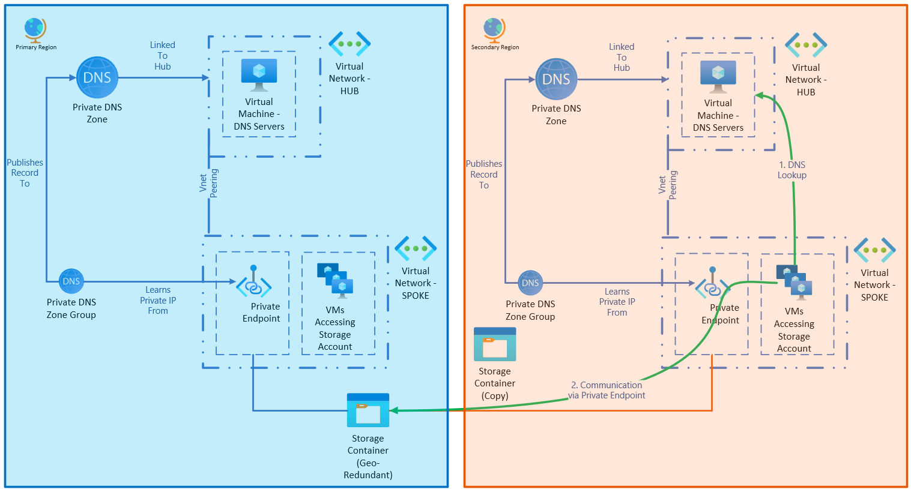
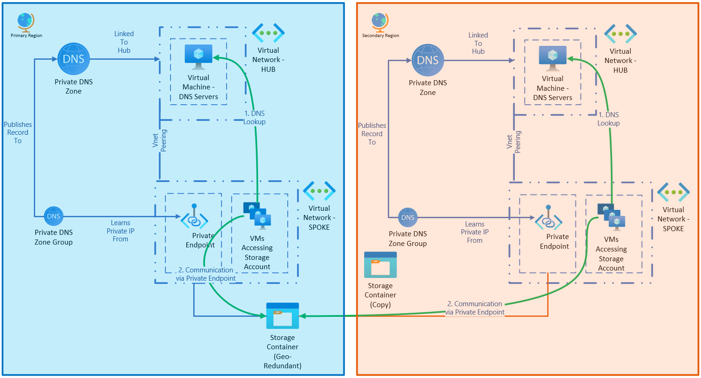

# Failover Considerations for Storage Accounts with Private Endpoints

Storage accounts work different than many other Azure services when it comes to high availability configurations.  Instead of having a secondary instance that is deployed by the customer to a region of their selection, storage accounts configured to be [geo-redundant](./storage-account-overview#types-of-storage-accounts.md) use a specific secondary region based on the main region, to align with [regional pairs](azure/reliability/cross-region-replication-azure).  Customers can fail over to the secondary region, or the storage account will automatically fail over when a regional outage occurs.

This means that customers don't need to plan to have a second storage account already running in their second region; the geo-redundant configuration of the storage account will address this.  You could have multiple storage accounts and use customer managed operations to move data between them, but this is an uncommon pattern.

When a storage account is failed over, the name of the service itself doesn't change.  If you are using the public endpoint for ingress, then systems can use the same DNS resolution to access the service regardless of its fail over state.

This is true when both the storage account and the systems accessing it are failed over to a secondary region, as well as when just the storage account is failed over.  This resilience limits the amount of BCDR tasks needed for the storage account.

However, there are additional considerations needed if you are using [private endpoints](../../private-link/private-endpoint-dns.md).  This article provides an example architecture of a geo-replicated storage account using private endpoints for secure networking, and what is needed for each BCDR scenario.

> [!NOTE]
> Not all storage account types support geo-redundant storage (GRS) or read-access geo-redundant storage (RA-GRS).  For example, data lakes deployed with premium block blob can only be locally redundant or zone redundant in a single region.  Review [Azure Storage redundancy](./storage-redundancy.md) to make sure your scenario is supported.

## Example Architecture

This architecture uses a primary and secondary region that can be used to handle active/active or failover scenarios.  Each has a hub deployed with necessary networking infrastructure, and a spoke where the application that leverages the storage account is housed.

The geo-redundant storage account is deployed in the primary region, but has private endpoints for its blob endpoint in both regions.  

The two private endpoints cannot use the same Private DNS Zone for the same endpoint - so in turn, each region will have its own Private DNS Zone.  This zone will then be attached to the hub network for the region, and be used by their region following the [DNS forwarder scenario](../../private-link/private-endpoint-dns.md#virtual-network-and-on-premises-workloads-using-a-dns-forwarder) for private endpoints.

As a result, regardless of the region of the VM trying to access the private endpoint, there is a local endpoint available that can access the storage blob, regardless of the region the storage account is currently operating in.

For connections from a data center, a VPN connection would be made to the hub network in the region.  However, for DNS resolution, each data center would have its conditional forwarding set up to only one of the two DNS resolver server sets, to ensure that it resolves to the closest network location.

### Architecture Concepts

This architecture leverages functionality of private endpoints that may not be commonly encountered when doing single region deployments.

First, an individual service can have multiple private endpoints attached to it.  For example, a storage account could have a private endpoint for its blob containers located in multiple different virtual networks, and each one will function on their own.

However, this is not used in many hub and spoke scenarios because a private DNS zone can only have one record for a private endpoint.  If you register your first private endpoint to your private DNS zone, additional private endpoints would need to use other zones.

In addition, the private endpoints are not required to be in the same region as the resource they are connecting to.  A storage account in East US 2 can have a private endpoint deployed in Central US, to give one example.

So long as there is an alternate private DNS zone for that region, resources in the second can resolve and interact with the storage account.

While it is common to use private endpoints in the same region, to reduce costs, this functionality can help in a variety of situations, such as connecting a service available only in a different region from the main deployments.

### Cross Region Traffic Costs

Having private endpoints in a secondary region does incur additional costs, though.

In addition to the cost of the private endpoint itself (see [Azure Private Link pricing](https://azure.microsoft.com/pricing/details/private-link/)), there is a cost for sending the traffic between regions.  Note that the cost is for each private endpoint, so the above design would have two endpoints.

Global virtual network peering, which connects virtual networks in multiple regions, has a cost based off of the zone your networks are in.  See [Virtual Network pricing](https://azure.microsoft.com/pricing/details/virtual-network) for more information.

Global peering can be used to enable services to communicate to each other during a service failure in a region, but would support fewer scenarios and may have more manual activities involved in activating a failover.  An organization should review the costs of operating in a highly available or resilient architecture, and compare that to the risks of longer durations to restore service.

## Failover Scenarios

This topology supports the following scenarios, and each scenario has its own considerations for DNS failover.

| Scenario | Description | DNS Considerations |
|---|---|---|
| [Scenario 1 - Storage Account Failover](#scenario-1---storage-account-failover) | A service interruption to the storage account hosted in the primary region requires it to be failed over to a secondary region. | No changes required. |
| [Scenario 2 - Other Services Failover](#scenario-2---other-services-failover) | A service interruption to services in the primary region require them to be failed over to a secondary region.  The storage account does not need to be failed over.  | If the DNS servers hosted in the primary region are among those impacted by the outage, then the conditional forwarders from on-prem need to be updated to the secondary region. |
| [Scenario 3 - Whole Region Outage](#scenario-3---whole-region-outage) | A service interruption to multiple services in a region require both the storage account and other services to be failed over. | Conditional forwarders from on-prem DNS need to be updated to the secondary region. |
| [Scenario 4 - Running in HA](#scenario-4---running-in-ha) | The services and storage accounts are working in Azure in an active/active configuration. | If a region's DNS or storage account is impacted, conditional forwarders on-prem need to be updated to un-impacted regions. |

### Scenario 1 - Storage Account Failover

In this scenario, an issue with the storage account requires it to be failed over to the secondary regions.  With storage accounts that are zone redundant as well as geo-redundant, these outages are uncommon, but should still be planned for.

When the storage account is failed over to the paired secondary region, network routing stays the same.  No changes to DNS are needed - each region can continue to use its local endpoint to communicate with the storage account.

Connections from an on-prem data center connected by VPN would continue to operate as well.  Each endpoint can respond to connections routed to it, and both hub networks are able to resolve to a valid endpoint.

After failover, the service will operate as illustrated:

When the service is restored in the primary region, the storage account can be failed back.

### Scenario 2 - Other Services Failover

In this scenario, there is an issue with the services that connect to the storage account.  In our environment, this is diagrammed as being virtual machines, but they could be application services or other services.

These resources need to be failed over to the secondary region following their own process.  VMs might use Azure Site Recovery to replicate VMs prior to the outage, or you might deploy a new instance of your web app in the secondary region.

Once the services are active in the secondary region, they can begin to connect to the storage account through its regional endpoint.  No changes are needed for it to support connections.

Connections from an on-prem data center connected by VPN would continue to operate as long as the service outage doesn't impact the DNS resolution services in the hub.  If the hub is disabled, such as due to a VM service outage, then the conditional forwarders in the data center would need to be adjusted to point to the secondary region until the service is restored.

After failover, the service will operate as illustrated:

When the service is restored in the primary region, the services can be failed back and on-prem DNS reset.

> [!NOTE]
> If you only need to connect to the storage account from on-prem for administrative tasks, a jump box in the secondary region could be used instead of updating DNS in the primary region.  On-prem DNS only needs to be updated if you need direct connection to the storage account from systems on-prem.

### Scenario 3 - Whole Region Outage

In this scenario, there is a regional outage of sufficient scope as both the storage account and other services need to be failed over.

This operates like a combination of Scenario 1 and Scenario 2.  The storage account is failed over, as are the Azure services.  The primary region is effectively unable to operate, but the services can continue to operate in the secondary region until the service is restored.

Similar to Scenario 2, if the primary hub is unable to handle DNS responses to its endpoint, or there are other networking outages, then the conditional forwarders on-prem should be updated to the secondary region.

After failover, the service will operate as illustrated:

When the services are restored, resources can be failed back, and on-prem DNS can be reset back to its normal configuration.

### Scenario 4 - Running in HA

In this scenario, you have your workload running in an active/active mode.  There is compute resources running in both the primary and secondary region, and clients are connecting to either region based off of load balancing rules.

In it, both services can communicate to the storage account through their regional private endpoints.  See [Azure network round-trip latency statistics](../../networking/azure-network-latency.md) to review latency between regions.

If there is a regional outage, the load balancing front end should redirect all application traffic to the active region.

For connectivity from on-prem data center locations, if a region's DNS or storage account is impacted by an outage, then conditional forwarders from the data center need to be set to regions that are still available.  This will not impact the solution in Azure itself.

While both regions are healthy, the service will operate as illustrated:

