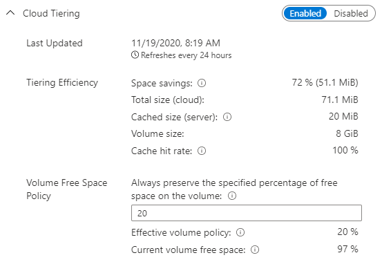

# Monitoring cloud tiering
There are two main ways you can monitor your cloud tiering policy: through the server endpoint and through Azure Monitor.

## Monitoring via server endpoint

1. Go to your **Storage Sync Service**
1. Select your sync group
1. Select the server endpoint name who's cloud tiering policy you want to monitor
1. Scroll down to the cloud tiering section.

**Space savings** tells you how much space you're saving by enabling cloud tiering. For example, if your local volume size is large enough to hold all of your data, you would have 0% space savings. If you have 0% or a low percent of space savings, it might be an indicator that cloud tiering isn't beneficial for you with your current local cache size. 

**Cache hit rate** tells you what percent of files you open are in your local cache. Cache hit rate is calculated by files opened directly from cache/total number of files open. For example, a cache hit rate of 100% means that all the files that you opened in the last hour were already in your local cache. This indicates your current policy is working well if your goal is to reduce egress.

> [!NOTE]
> Workloads with random access patterns typically have lower cache hit rates. 

**Total size (cloud)** is the size of your files that were synced to the cloud. 

**Cached size (server)** is the total size of your files that are on your server, both downloaded and tiered. Sometimes, the cached size may be bigger than the total size of your files in the cloud. Variables such as the cluster size of the volume on the server can cause this. If cached size is larger than you would like, you might want to consider increasing your volume free space policy. 

**Effective volume policy** is the policy that Azure File Sync uses to determine how much free space to leave on the volume your server endpoint is on. When there are multiple server endpoints on the same volume, the highest volume free space policy amongst the server endpoints becomes the effective volume policy for all the server endpoints on that volume. For example, if there are two server endpoints on the same volume, one with 30% volume free space and another with 50% volume free space, the effective volume free space policy for both server endpoints will be 50%.

**Current volume free space** is the volume free space currently available on your on-premises server. If you have high egress but more volume free space available before your volume free space policy kicks in, you should consider disabling your date policy. Another issue might be that out of the currently tiered files, the most recently accessed file is larger than your volume free space remaining before the policy kicks in. In this case, consider increasing your local volume size. 

## Monitoring via Azure Monitor

1. Go to your **Storage Sync Service**.
1. In the table of contents, select **Metrics**. This should display a user interface to create charts. 

There are three different metrics you can use to monitor your egress specifically from cloud tiering:

- Cloud Tiering Recall Size
    - This is the total size of the data recalled in bytes and can be used to identify how much data is being recalled.
- Cloud Tiering Recall Size By Application
    - This is the total size of data recalled in bytes by an application and can be used to identify what's recalling the data.
- Cloud Tiering Recall Throughput
    - This measures how quickly the data is being recalled in bytes and should be used if you have concerns about performance. 

To be more specific on what you want your graphs to display, consider using **Add Filter** and **Apply Splitting**.
 
For more information on the different types of metrics for Azure File Sync, see this link. To learn more about how to use metrics, see [Getting started with Azure Metrics Explorer.](https://docs.microsoft.com/azure/azure-monitor/platform/metrics-getting-started) If you would like to change your cloud tiering policy, see [Choosing a cloud tiering policy](storage-sync-choosing-cloud-tiering-policy.md).

