# Table design patterns

This article describes some patterns appropriate for use with Table service solutions. Also, you will see how you can practically address some of the issues and trade-offs discussed in other Table storage design articles. The following diagram summarizes the relationships between the different patterns:  

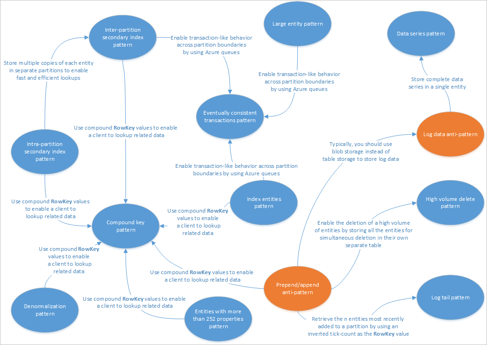

The pattern map above highlights some relationships between patterns (blue) and anti-patterns (orange) that are documented in this guide. There are many other patterns that are worth considering. For example, one of the key scenarios for Table Service is to use the [Materialized View Pattern](/previous-versions/msp-n-p/dn589782(v=pandp.10)) from the [Command Query Responsibility Segregation (CQRS)](/previous-versions/msp-n-p/jj554200(v=pandp.10)) pattern.  

## Intra-partition secondary index pattern

Store multiple copies of each entity using different **RowKey** values (in the same partition) to enable fast and efficient lookups and alternate sort orders by using different **RowKey** values. Updates between copies can be kept consistent using entity group transactions (EGTs).  

### Context and problem

The Table service automatically indexes entities using the **PartitionKey** and **RowKey** values. This enables a client application to retrieve an entity efficiently using these values. For example, using the table structure shown below, a client application can use a point query to retrieve an individual employee entity by using the department name and the employee ID (the **PartitionKey** and **RowKey** values). A client can also retrieve entities sorted by employee ID within each department.

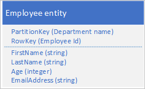

If you also want to be able to find an employee entity based on the value of another property, such as email address, you must use a less efficient partition scan to find a match. This is because the table service does not provide secondary indexes. In addition, there is no option to request a list of employees sorted in a different order than **RowKey** order.  

### Solution

To work around the lack of secondary indexes, you can store multiple copies of each entity with each copy using a different **RowKey** value. If you store an entity with the structures shown below, you can efficiently retrieve employee entities based on email address or employee ID. The prefix values for the **RowKey**, "empid_" and "email_" enable you to query for a single employee or a range of employees by using a range of email addresses or employee IDs.  


The following two filter criteria (one looking up by employee ID and one looking up by email address) both specify point queries:  

* $filter=(PartitionKey eq 'Sales') and (RowKey eq 'empid_000223')  
* $filter=(PartitionKey eq 'Sales') and (RowKey eq 'email_jonesj@contoso.com')  

If you query for a range of employee entities, you can specify a range sorted in employee ID order, or a range sorted in email address order by querying for entities with the appropriate prefix in the **RowKey**.  

* To find all the employees in the Sales department with an employee ID in the range 000100 to 000199 use:
  $filter=(PartitionKey eq 'Sales') and (RowKey ge 'empid_000100') and (RowKey le 'empid_000199')  
* To find all the employees in the Sales department with an email address starting with the letter 'a' use:
  $filter=(PartitionKey eq 'Sales') and (RowKey ge 'email_a') and (RowKey lt 'email_b')  
  
  The filter syntax used in the examples above is from the Table service REST API, for more information, see [Query Entities](/rest/api/storageservices/Query-Entities).  

### Issues and considerations

Consider the following points when deciding how to implement this pattern:  

* Table storage is relatively cheap to use so the cost overhead of storing duplicate data should not be a major concern. However, you should always evaluate the cost of your design based on your anticipated storage requirements and only add duplicate entities to support the queries your client application will execute.  
* Because the secondary index entities are stored in the same partition as the original entities, you should ensure that you do not exceed the scalability targets for an individual partition.  
* You can keep your duplicate entities consistent with each other by using EGTs to update the two copies of the entity atomically. This implies that you should store all copies of an entity in the same partition. For more information, see the section [Using Entity Group Transactions](table-storage-design.md#entity-group-transactions).  
* The value used for the **RowKey** must be unique for each entity. Consider using compound key values.  
* Padding numeric values in the **RowKey** (for example, the employee ID 000223), enables correct sorting and filtering based on upper and lower bounds.  
* You do not necessarily need to duplicate all the properties of your entity. For example, if the queries that look up the entities using the email address in the **RowKey** never need the employee's age, these entities could have the following structure:

   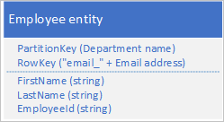

* It is typically better to store duplicate data and ensure that you can retrieve all the data you need with a single query, than to use one query to locate an entity and another to look up the required data.  

### When to use this pattern

Use this pattern when your client application needs to retrieve entities using a variety of different keys, when your client needs to retrieve entities in different sort orders, and where you can identify each entity using a variety of unique values. However, you should be sure that you do not exceed the partition scalability limits when you are performing entity lookups using the different **RowKey** values.  

### Related patterns and guidance

The following patterns and guidance may also be relevant when implementing this pattern:  

* [Inter-partition secondary index pattern](#inter-partition-secondary-index-pattern)
* [Compound key pattern](#compound-key-pattern)
* Entity Group Transactions
* [Working with heterogeneous entity types](#working-with-heterogeneous-entity-types)

## Inter-partition secondary index pattern

Store multiple copies of each entity using different **RowKey** values in separate partitions or in separate tables to enable fast and efficient lookups and alternate sort orders by using different **RowKey** values.  

### Context and problem

The Table service automatically indexes entities using the **PartitionKey** and **RowKey** values. This enables a client application to retrieve an entity efficiently using these values. For example, using the table structure shown below, a client application can use a point query to retrieve an individual employee entity by using the department name and the employee ID (the **PartitionKey** and **RowKey** values). A client can also retrieve entities sorted by employee ID within each department.  


If you also want to be able to find an employee entity based on the value of another property, such as email address, you must use a less efficient partition scan to find a match. This is because the table service does not provide secondary indexes. In addition, there is no option to request a list of employees sorted in a different order than **RowKey** order.  

You are anticipating a high volume of transactions against these entities and want to minimize the risk of the Table service throttling your client.  

### Solution

To work around the lack of secondary indexes, you can store multiple copies of each entity with each copy using different **PartitionKey** and **RowKey** values. If you store an entity with the structures shown below, you can efficiently retrieve employee entities based on email address or employee ID. The prefix values for the **PartitionKey**, "empid_" and "email_" enable you to identify which index you want to use for a query.  


The following two filter criteria (one looking up by employee ID and one looking up by email address) both specify point queries:  

* $filter=(PartitionKey eq 'empid_Sales') and (RowKey eq '000223')
* $filter=(PartitionKey eq 'email_Sales') and (RowKey eq 'jonesj@contoso.com')  

If you query for a range of employee entities, you can specify a range sorted in employee ID order, or a range sorted in email address order by querying for entities with the appropriate prefix in the **RowKey**.  

* To find all the employees in the Sales department with an employee ID in the range **000100** to **000199** sorted in employee ID order use:
  $filter=(PartitionKey eq 'empid_Sales') and (RowKey ge '000100') and (RowKey le '000199')  
* To find all the employees in the Sales department with an email address that starts with 'a' sorted in email address order use:
  $filter=(PartitionKey eq 'email_Sales') and (RowKey ge 'a') and (RowKey lt 'b')  

The filter syntax used in the examples above is from the Table service REST API, for more information, see [Query Entities](/rest/api/storageservices/Query-Entities).  

### Issues and considerations

Consider the following points when deciding how to implement this pattern:  

* You can keep your duplicate entities eventually consistent with each other by using the [Eventually consistent transactions pattern](#eventually-consistent-transactions-pattern) to maintain the primary and secondary index entities.  
* Table storage is relatively cheap to use so the cost overhead of storing duplicate data should not be a major concern. However, you should always evaluate the cost of your design based on your anticipated storage requirements and only add duplicate entities to support the queries your client application will execute.  
* The value used for the **RowKey** must be unique for each entity. Consider using compound key values.  
* Padding numeric values in the **RowKey** (for example, the employee ID 000223), enables correct sorting and filtering based on upper and lower bounds.  
* You do not necessarily need to duplicate all the properties of your entity. For example, if the queries that look up the entities using the email address in the **RowKey** never need the employee's age, these entities could have the following structure:
  
   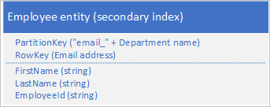

* It is typically better to store duplicate data and ensure that you can retrieve all the data you need with a single query than to use one query to locate an entity using the secondary index and another to look up the required data in the primary index.  

### When to use this pattern

Use this pattern when your client application needs to retrieve entities using a variety of different keys, when your client needs to retrieve entities in different sort orders, and where you can identify each entity using a variety of unique values. Use this pattern when you want to avoid exceeding the partition scalability limits when you are performing entity lookups using the different **RowKey** values.  

### Related patterns and guidance

The following patterns and guidance may also be relevant when implementing this pattern:  

* [Eventually consistent transactions pattern](#eventually-consistent-transactions-pattern)  
* [Intra-partition secondary index pattern](#intra-partition-secondary-index-pattern)  
* [Compound key pattern](#compound-key-pattern)  
* Entity Group Transactions  
* [Working with heterogeneous entity types](#working-with-heterogeneous-entity-types)  

## Eventually consistent transactions pattern

Enable eventually consistent behavior across partition boundaries or storage system boundaries by using Azure queues.  

### Context and problem

EGTs enable atomic transactions across multiple entities that share the same partition key. For performance and scalability reasons, you might decide to store entities that have consistency requirements in separate partitions or in a separate storage system: in such a scenario, you cannot use EGTs to maintain consistency. For example, you might have a requirement to maintain eventual consistency between:  

* Entities stored in two different partitions in the same table, in different tables, or in different storage accounts.  
* An entity stored in the Table service and a blob stored in the Blob service.  
* An entity stored in the Table service and a file in a file system.  
* An entity stored in the Table service yet indexed using the Azure Cognitive Search service.  

### Solution
By using Azure queues, you can implement a solution that delivers eventual consistency across two or more partitions or storage systems.
To illustrate this approach, assume you have a requirement to be able to archive old employee entities. Old employee entities are rarely queried and should be excluded from any activities that deal with current employees. To implement this requirement, you store active employees in the **Current** table and old employees in the **Archive** table. Archiving an employee requires you to delete the entity from the **Current** table and add the entity to the **Archive** table, but you cannot use an EGT to perform these two operations. To avoid the risk that a failure causes an entity to appear in both or neither tables, the archive operation must be eventually consistent. The following sequence diagram outlines the steps in this operation. More detail is provided for exception paths in the text following.  

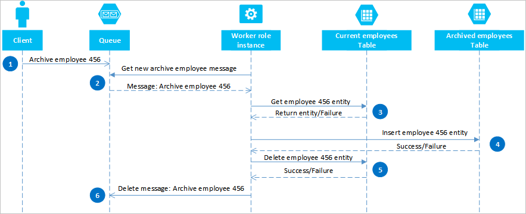

A client initiates the archive operation by placing a message on an Azure queue, in this example to archive employee #456. A worker role polls the queue for new messages; when it finds one, it reads the message and leaves a hidden copy on the queue. The worker role next fetches a copy of the entity from the **Current** table, inserts a copy in the **Archive** table, and then deletes the original from the **Current** table. Finally, if there were no errors from the previous steps, the worker role deletes the hidden message from the queue.  

In this example, step 4 inserts the employee into the **Archive** table. It could add the employee to a blob in the Blob service or a file in a file system.  

### Recovering from failures

It is important that the operations in steps **4** and **5** must be *idempotent* in case the worker role needs to restart the archive operation. If you are using the Table service, for step **4** you should use an "insert or replace" operation; for step **5** you should use a "delete if exists" operation in the client library you are using. If you are using another storage system, you must use an appropriate idempotent operation.  

If the worker role never completes step **6**, then after a timeout the message reappears on the queue ready for the worker role to try to reprocess it. The worker role can check how many times a message on the queue has been read and, if necessary, flag it is a "poison" message for investigation by sending it to a separate queue. For more information about reading queue messages and checking the dequeue count, see [Get Messages](/rest/api/storageservices/Get-Messages).  

Some errors from the Table and Queue services are transient errors, and your client application should include suitable retry logic to handle them.  

### Issues and considerations

Consider the following points when deciding how to implement this pattern:  

* This solution does not provide for transaction isolation. For example, a client could read the **Current** and **Archive** tables when the worker role was between steps **4** and **5**, and see an inconsistent view of the data. The data will be consistent eventually.  
* You must be sure that steps 4 and 5 are idempotent in order to ensure eventual consistency.  
* You can scale the solution by using multiple queues and worker role instances.  

### When to use this pattern

Use this pattern when you want to guarantee eventual consistency between entities that exist in different partitions or tables. You can extend this pattern to ensure eventual consistency for operations across the Table service and the Blob service and other non-Azure Storage data sources such as database or the file system.  

### Related patterns and guidance

The following patterns and guidance may also be relevant when implementing this pattern:  

* Entity Group Transactions  
* [Merge or replace](#merge-or-replace)  

> [!NOTE]
> If transaction isolation is important to your solution, you should consider redesigning your tables to enable you to use EGTs.  
>
>

## Index entities pattern

Maintain index entities to enable efficient searches that return lists of entities.  

### Context and problem

The Table service automatically indexes entities using the **PartitionKey** and **RowKey** values. This enables a client application to retrieve an entity efficiently using a point query. For example, using the table structure shown below, a client application can efficiently retrieve an individual employee entity by using the department name and the employee ID (the **PartitionKey** and **RowKey**).  

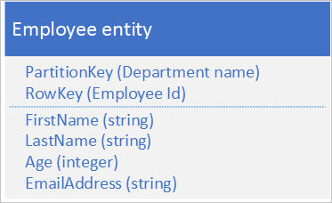

If you also want to be able to retrieve a list of employee entities based on the value of another non-unique property, such as their last name, you must use a less efficient partition scan to find matches rather than using an index to look them up directly. This is because the table service does not provide secondary indexes.  

### Solution

To enable lookup by last name with the entity structure shown above, you must maintain lists of employee IDs. If you want to retrieve the employee entities with a particular last name, such as Jones, you must first locate the list of employee IDs for employees with Jones as their last name, and then retrieve those employee entities. There are three main options for storing the lists of employee IDs:  

* Use blob storage.  
* Create index entities in the same partition as the employee entities.  
* Create index entities in a separate partition or table.  

<u>Option #1: Use blob storage</u>  

For the first option, you create a blob for every unique last name, and in each blob store a list of the **PartitionKey** (department) and **RowKey** (employee ID) values for employees that have that last name. When you add or delete an employee, you should ensure that the content of the relevant blob is eventually consistent with the employee entities.  

<u>Option #2:</u> Create index entities in the same partition  

For the second option, use index entities that store the following data:  


The **EmployeeIDs** property contains a list of employee IDs for employees with the last name stored in the **RowKey**.  

The following steps outline the process you should follow when you are adding a new employee if you are using the second option. In this example, we are adding an employee with ID 000152 and a last name Jones in the Sales department:  

1. Retrieve the index entity with a **PartitionKey** value "Sales" and the **RowKey** value "Jones." Save the ETag of this entity to use in step 2.  
2. Create an entity group transaction (that is, a batch operation) that inserts the new employee entity (**PartitionKey** value "Sales" and **RowKey** value "000152"), and updates the index entity (**PartitionKey** value "Sales" and **RowKey** value "Jones") by adding the new employee ID to the list in the EmployeeIDs field. For more information about entity group transactions, see Entity Group Transactions.  
3. If the entity group transaction fails because of an optimistic concurrency error (someone else has just modified the index entity), then you need to start over at step 1 again.  

You can use a similar approach to deleting an employee if you are using the second option. Changing an employee's last name is slightly more complex because you will need to execute an entity group transaction that updates three entities: the employee entity, the index entity for the old last name, and the index entity for the new last name. You must retrieve each entity before making any changes in order to retrieve the ETag values that you can then use to perform the updates using optimistic concurrency.  

The following steps outline the process you should follow when you need to look up all the employees with a given last name in a department if you are using the second option. In this example, we are looking up all the employees with last name Jones in the Sales department:  

1. Retrieve the index entity with a **PartitionKey** value "Sales" and the **RowKey** value "Jones."  
2. Parse the list of employee Ids in the EmployeeIDs field.  
3. If you need additional information about each of these employees (such as their email addresses), retrieve each of the employee entities using **PartitionKey** value "Sales" and **RowKey** values from the list of employees you obtained in step 2.  

<u>Option #3:</u> Create index entities in a separate partition or table  

For the third option, use index entities that store the following data:  

:::image type="content" source="./media/storage-table-design-guide/storage-table-design-IMAGE15.png" alt-text="Screenshot that shows the Employee index entity that contains a list of employee IDs for employees with the last name stored in the RowKey and PartitionKey.":::

The **EmployeeDetails** property contains a list of employee IDs and department name pairs for employees with the last name stored in the `RowKey`.

With the third option, you cannot use EGTs to maintain consistency because the index entities are in a separate partition from the employee entities. Ensure that the index entities are eventually consistent with the employee entities.  

### Issues and considerations

Consider the following points when deciding how to implement this pattern:  

* This solution requires at least two queries to retrieve matching entities: one to query the index entities to obtain the list of **RowKey** values, and then queries to retrieve each entity in the list.  
* Given that an individual entity has a maximum size of 1 MB, option #2 and option #3 in the solution assume that the list of employee IDs for any given last name is never greater than 1 MB. If the list of employee IDs is likely to be greater than 1 MB in size, use option #1 and store the index data in blob storage.  
* If you use option #2 (using EGTs to handle adding and deleting employees, and changing an employee's last name) you must evaluate if the volume of transactions will approach the scalability limits in a given partition. If this is the case, you should consider an eventually consistent solution (option #1 or option #3) that uses queues to handle the update requests and enables you to store your index entities in a separate partition from the employee entities.  
* Option #2 in this solution assumes that you want to look up by last name within a department: for example, you want to retrieve a list of employees with a last name Jones in the Sales department. If you want to be able to look up all the employees with a last name Jones across the whole organization, use either option #1 or option #3.
* You can implement a queue-based solution that delivers eventual consistency (see the [Eventually consistent transactions pattern](#eventually-consistent-transactions-pattern) for more details).  

### When to use this pattern

Use this pattern when you want to look up a set of entities that all share a common property value, such as all employees with the last name Jones.  

### Related patterns and guidance

The following patterns and guidance may also be relevant when implementing this pattern:  

* [Compound key pattern](#compound-key-pattern)  
* [Eventually consistent transactions pattern](#eventually-consistent-transactions-pattern)  
* Entity Group Transactions  
* [Working with heterogeneous entity types](#working-with-heterogeneous-entity-types)  

## Denormalization pattern

Combine related data together in a single entity to enable you to retrieve all the data you need with a single point query.  

### Context and problem

In a relational database, you typically normalize data to remove duplication resulting in queries that retrieve data from multiple tables. If you normalize your data in Azure tables, you must make multiple round trips from the client to the server to retrieve your related data. For example, with the table structure shown below you need two round trips to retrieve the details for a department: one to fetch the department entity that includes the manager's ID, and then another request to fetch the manager's details in an employee entity.  


### Solution

Instead of storing the data in two separate entities, denormalize the data and keep a copy of the manager's details in the department entity. For example:  

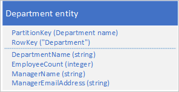

With department entities stored with these properties, you can now retrieve all the details you need about a department using a point query.  

### Issues and considerations

Consider the following points when deciding how to implement this pattern:  

* There is some cost overhead associated with storing some data twice. The performance benefit (resulting from fewer requests to the storage service) typically outweighs the marginal increase in storage costs (and this cost is partially offset by a reduction in the number of transactions you require to fetch the details of a department).  
* You must maintain the consistency of the two entities that store information about managers. You can handle the consistency issue by using EGTs to update multiple entities in a single atomic transaction: in this case, the department entity, and the employee entity for the department manager are stored in the same partition.  

### When to use this pattern

Use this pattern when you frequently need to look up related information. This pattern reduces the number of queries your client must make to retrieve the data it requires.  

### Related patterns and guidance

The following patterns and guidance may also be relevant when implementing this pattern:  

* [Compound key pattern](#compound-key-pattern)  
* Entity Group Transactions  
* [Working with heterogeneous entity types](#working-with-heterogeneous-entity-types)

## Compound key pattern

Use compound **RowKey** values to enable a client to look up related data with a single point query.  

### Context and problem

In a relational database, it is natural to use joins in queries to return related pieces of data to the client in a single query. For example, you might use the employee ID to look up a list of related entities that contain performance and review data for that employee.  

Assume you are storing employee entities in the Table service using the following structure:  


You also need to store historical data relating to reviews and performance for each year the employee has worked for your organization and you need to be able to access this information by year. One option is to create another table that stores entities with the following structure:  

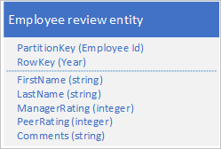

Notice that with this approach you may decide to duplicate some information (such as first name and last name) in the new entity to enable you to retrieve your data with a single request. However, you cannot maintain strong consistency because you cannot use an EGT to update the two entities atomically.  

### Solution

Store a new entity type in your original table using entities with the following structure:  

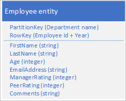

Notice how the **RowKey** is now a compound key made up of the employee ID and the year of the review data that enables you to retrieve the employee's performance and review data with a single request for a single entity.  

The following example outlines how you can retrieve all the review data for a particular employee (such as employee 000123 in the Sales department):  

$filter=(PartitionKey eq 'Sales') and (RowKey ge 'empid_000123') and (RowKey lt '000123_2012')&$select=RowKey,Manager Rating,Peer Rating,Comments  

### Issues and considerations

Consider the following points when deciding how to implement this pattern:  

* You should use a suitable separator character that makes it easy to parse the **RowKey** value: for example, **000123_2012**.  
* You are also storing this entity in the same partition as other entities that contain related data for the same employee, which means you can use EGTs to maintain strong consistency.
* You should consider how frequently you will query the data to determine whether this pattern is appropriate.  For example, if you will access the review data infrequently and the main employee data often you should keep them as separate entities.  

### When to use this pattern

Use this pattern when you need to store one or more related entities that you query frequently.  

### Related patterns and guidance

The following patterns and guidance may also be relevant when implementing this pattern:  

* Entity Group Transactions  
* [Working with heterogeneous entity types](#working-with-heterogeneous-entity-types)  
* [Eventually consistent transactions pattern](#eventually-consistent-transactions-pattern)  

## Log tail pattern

Retrieve the *n* entities most recently added to a partition by using a **RowKey** value that sorts in reverse date and time order.  

### Context and problem

A common requirement is been able to retrieve the most recently created entities, for example the 10 most recent expense claims submitted by an employee. Table queries support a **$top** query operation to return the first *n* entities from a set: there is no equivalent query operation to return the last n entities in a set.  

### Solution

Store the entities using a **RowKey** that naturally sorts in reverse date/time order by using so the most recent entry is always the first one in the table.  

For example, to be able to retrieve the 10 most recent expense claims submitted by an employee, you can use a reverse tick value derived from the current date/time. The following C# code sample shows one way to create a suitable "inverted ticks" value for a **RowKey** that sorts from the most recent to the oldest:  

`string invertedTicks = string.Format("{0:D19}", DateTime.MaxValue.Ticks - DateTime.UtcNow.Ticks);`  

You can get back to the date time value using the following code:  

`DateTime dt = new DateTime(DateTime.MaxValue.Ticks - Int64.Parse(invertedTicks));`  

The table query looks like this:  

`https://myaccount.table.core.windows.net/EmployeeExpense(PartitionKey='empid')?$top=10`  

### Issues and considerations

Consider the following points when deciding how to implement this pattern:  

* You must pad the reverse tick value with leading zeroes to ensure the string value sorts as expected.  
* You must be aware of the scalability targets at the level of a partition. Be careful not create hot spot partitions.  

### When to use this pattern

Use this pattern when you need to access entities in reverse date/time order or when you need to access the most recently added entities.  

### Related patterns and guidance

The following patterns and guidance may also be relevant when implementing this pattern:  

* [Prepend / append anti-pattern](#prepend-append-anti-pattern)  
* [Retrieving entities](#retrieving-entities)  

## High volume delete pattern

Enable the deletion of a high volume of entities by storing all the entities for simultaneous deletion in their own separate table; you delete the entities by deleting the table.  

### Context and problem

Many applications delete old data that no longer needs to be available to a client application, or that the application has archived to another storage medium. You typically identify such data by a date: for example, you have a requirement to delete records of all login requests that are more than 60 days old.  

One possible design is to use the date and time of the login request in the **RowKey**:  

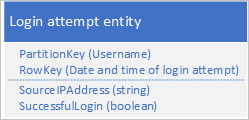

This approach avoids partition hotspots because the application can insert and delete login entities for each user in a separate partition. However, this approach may be costly and time consuming if you have a large number of entities because first you need to perform a table scan in order to identify all the entities to delete, and then you must delete each old entity. You can reduce the number of round trips to the server required to delete the old entities by batching multiple delete requests into EGTs.  

### Solution

Use a separate table for each day of login attempts. You can use the entity design above to avoid hotspots when you are inserting entities, and deleting old entities is now simply a question of deleting one table every day (a single storage operation) instead of finding and deleting hundreds and thousands of individual login entities every day.  

### Issues and considerations

Consider the following points when deciding how to implement this pattern:  

* Does your design support other ways your application will use the data such as looking up specific entities, linking with other data, or generating aggregate information?  
* Does your design avoid hot spots when you are inserting new entities?  
* Expect a delay if you want to reuse the same table name after deleting it. It's better to always use unique table names.  
* Expect some throttling when you first use a new table while the Table service learns the access patterns and distributes the partitions across nodes. You should consider how frequently you need to create new tables.  

### When to use this pattern

Use this pattern when you have a high volume of entities that you must delete at the same time.  

### Related patterns and guidance

The following patterns and guidance may also be relevant when implementing this pattern:  

* Entity Group Transactions
* [Modifying entities](#modifying-entities)  

## Data series pattern

Store complete data series in a single entity to minimize the number of requests you make.  

### Context and problem

A common scenario is for an application to store a series of data that it typically needs to retrieve all at once. For example, your application might record how many IM messages each employee sends every hour, and then use this information to plot how many messages each user sent over the preceding 24 hours. One design might be to store 24 entities for each employee:  

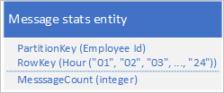

With this design, you can easily locate and update the entity to update for each employee whenever the application needs to update the message count value. However, to retrieve the information to plot a chart of the activity for the preceding 24 hours, you must retrieve 24 entities.  

### Solution

Use the following design with a separate property to store the message count for each hour:  

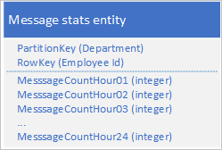

With this design, you can use a merge operation to update the message count for an employee for a specific hour. Now, you can retrieve all the information you need to plot the chart using a request for a single entity.  

### Issues and considerations

Consider the following points when deciding how to implement this pattern:  

* If your complete data series does not fit into a single entity (an entity can have up to 252 properties), use an alternative data store such as a blob.  
* If you have multiple clients updating an entity simultaneously, you will need to use the **ETag** to implement optimistic concurrency. If you have many clients, you may experience high contention.  

### When to use this pattern

Use this pattern when you need to update and retrieve a data series associated with an individual entity.  

### Related patterns and guidance

The following patterns and guidance may also be relevant when implementing this pattern:  

* [Large entities pattern](#large-entities-pattern)  
* [Merge or replace](#merge-or-replace)  
* [Eventually consistent transactions pattern](#eventually-consistent-transactions-pattern) (if you are storing the data series in a blob)  

## Wide entities pattern
Use multiple physical entities to store logical entities with more than 252 properties.  

### Context and problem

An individual entity can have no more than 252 properties (excluding the mandatory system properties) and cannot store more than 1 MB of data in total. In a relational database, you would typically get round any limits on the size of a row by adding a new table and enforcing a 1-to-1 relationship between them.  

### Solution

Using the Table service, you can store multiple entities to represent a single large business object with more than 252 properties. For example, if you want to store a count of the number of IM messages sent by each employee for the last 365 days, you could use the following design that uses two entities with different schemas:  


If you need to make a change that requires updating both entities to keep them synchronized with each other, you can use an EGT. Otherwise, you can use a single merge operation to update the message count for a specific day. To retrieve all the data for an individual employee you must retrieve both entities, which you can do with two efficient requests that use both a **PartitionKey** and a **RowKey** value.  

### Issues and considerations

Consider the following points when deciding how to implement this pattern:  

* Retrieving a complete logical entity involves at least two storage transactions: one to retrieve each physical entity.  

### When to use this pattern

Use this pattern when  need to store entities whose size or number of properties exceeds the limits for an individual entity in the Table service.  

### Related patterns and guidance

The following patterns and guidance may also be relevant when implementing this pattern:  

* Entity Group Transactions
* [Merge or replace](#merge-or-replace)

## Large entities pattern

Use blob storage to store large property values.  

### Context and problem

An individual entity cannot store more than 1 MB of data in total. If one or several of your properties store values that cause the total size of your entity to exceed this value, you cannot store the entire entity in the Table service.  

### Solution

If your entity exceeds 1 MB in size because one or more properties contain a large amount of data, you can store data in the Blob service and then store the address of the blob in a property in the entity. For example, you can store the photo of an employee in blob storage and store a link to the photo in the **Photo** property of your employee entity:  

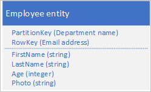

### Issues and considerations

Consider the following points when deciding how to implement this pattern:  

* To maintain eventual consistency between the entity in the Table service and the data in the Blob service, use the [Eventually consistent transactions pattern](#eventually-consistent-transactions-pattern) to maintain your entities.
* Retrieving a complete entity involves at least two storage transactions: one to retrieve the entity and one to retrieve the blob data.  

### When to use this pattern

Use this pattern when you need to store entities whose size exceeds the limits for an individual entity in the Table service.  

### Related patterns and guidance

The following patterns and guidance may also be relevant when implementing this pattern:  

* [Eventually consistent transactions pattern](#eventually-consistent-transactions-pattern)  
* [Wide entities pattern](#wide-entities-pattern)

<a name="prepend-append-anti-pattern"></a>

## Prepend/append anti-pattern

Increase scalability when you have a high volume of inserts by spreading the inserts across multiple partitions.  

### Context and problem

Prepending or appending entities to your stored entities typically results in the application adding new entities to the first or last partition of a sequence of partitions. In this case, all of the inserts at any given time are taking place in the same partition, creating a hotspot that prevents the table service from load-balancing inserts across multiple nodes, and possibly causing your application to hit the scalability targets for partition. For example, if you have an application that logs network and resource access by employees, then an entity structure as shown below could result in the current hour's partition becoming a hotspot if the volume of transactions reaches the scalability target for an individual partition:  

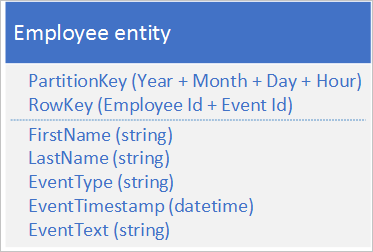

### Solution

The following alternative entity structure avoids a hotspot on any particular partition as the application logs events:  

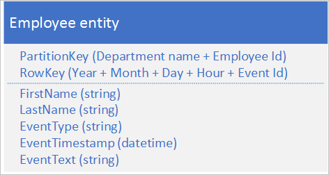

Notice with this example how both the **PartitionKey** and **RowKey** are compound keys. The **PartitionKey** uses both the department and employee ID to distribute the logging across multiple partitions.  

### Issues and considerations

Consider the following points when deciding how to implement this pattern:  

* Does the alternative key structure that avoids creating hot partitions on inserts efficiently support the queries your client application makes?  
* Does your anticipated volume of transactions mean that you are likely to reach the scalability targets for an individual partition and be throttled by the storage service?  

### When to use this pattern

Avoid the prepend/append anti-pattern when your volume of transactions is likely to result in throttling by the storage service when you access a hot partition.  

### Related patterns and guidance

The following patterns and guidance may also be relevant when implementing this pattern:  

* [Compound key pattern](#compound-key-pattern)  
* [Log tail pattern](#log-tail-pattern)  
* [Modifying entities](#modifying-entities)  

## Log data anti-pattern

Typically, you should use the Blob service instead of the Table service to store log data.  

### Context and problem

A common use case for log data is to retrieve a selection of log entries for a specific date/time range: for example, you want to find all the error and critical messages that your application logged between 15:04 and 15:06 on a specific date. You do not want to use the date and time of the log message to determine the partition you save log entities to: that results in a hot partition because at any given time, all the log entities will share the same **PartitionKey** value (see the section [Prepend/append anti-pattern](#prepend-append-anti-pattern)). For example, the following entity schema for a log message results in a hot partition because the application writes all log messages to the partition for the current date and hour:  

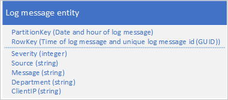

In this example, the **RowKey** includes the date and time of the log message to ensure that log messages are stored sorted in date/time order, and includes a message ID in case multiple log messages share the same date and time.  

Another approach is to use a **PartitionKey** that ensures that the application writes messages across a range of partitions. For example, if the source of the log message provides a way to distribute messages across many partitions, you could use the following entity schema:  

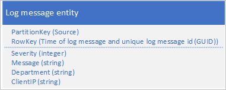

However, the problem with this schema is that to retrieve all the log messages for a specific time span you must search every partition in the table.

### Solution

The previous section highlighted the problem of trying to use the Table service to store log entries and suggested two, unsatisfactory, designs. One solution led to a hot partition with the risk of poor performance writing log messages; the other solution resulted in poor query performance because of the requirement to scan every partition in the table to retrieve log messages for a specific time span. Blob storage offers a better solution for this type of scenario and this is how Azure Storage Analytics stores the log data it collects.  

This section outlines how Storage Analytics stores log data in blob storage as an illustration of this approach to storing data that you typically query by range.  

Storage Analytics stores log messages in a delimited format in multiple blobs. The delimited format makes it easy for a client application to parse the data in the log message.  

Storage Analytics uses a naming convention for blobs that enables you to locate the blob (or blobs) that contain the log messages for which you are searching. For example, a blob named "queue/2014/07/31/1800/000001.log" contains log messages that relate to the queue service for the hour starting at 18:00 on 31 July 2014. The "000001" indicates that this is the first log file for this period. Storage Analytics also records the timestamps of the first and last log messages stored in the file as part of the blob's metadata. The API for blob storage enables you to locate blobs in a container based on a name prefix: to locate all the blobs that contain queue log data for the hour starting at 18:00, you can use the prefix "queue/2014/07/31/1800."  

Storage Analytics buffers log messages internally and then periodically updates the appropriate blob or creates a new one with the latest batch of log entries. This reduces the number of writes it must perform to the blob service.  

If you are implementing a similar solution in your own application, you must consider how to manage the trade-off between reliability (writing every log entry to blob storage as it happens) and cost and scalability (buffering updates in your application and writing them to blob storage in batches).  

### Issues and considerations

Consider the following points when deciding how to store log data:  

* If you create a table design that avoids potential hot partitions, you may find that you cannot access your log data efficiently.  
* To process log data, a client often needs to load many records.  
* Although log data is often structured, blob storage may be a better solution.  

## Implementation considerations

This section discusses some of the considerations to bear in mind when you implement the patterns described in the previous sections. Most of this section uses examples written in C# that use the Storage Client Library (version 4.3.0 at the time of writing).  

## Retrieving entities

As discussed in the section Design for querying, the most efficient query is a point query. However, in some scenarios you may need to retrieve multiple entities. This section describes some common approaches to retrieving entities using the Storage Client Library.  

### Executing a point query using the Storage Client Library

The easiest way to execute a point query is to use the **GetEntityAsync** method as shown in the following C# code snippet that retrieves an entity with a **PartitionKey** of value "Sales" and a **RowKey** of value "212":  

```csharp
EmployeeEntity employee = await employeeTable.GetEntityAsync<EmployeeEntity>("Sales", "212");
```

Notice how this example expects the entity it retrieves to be of type **EmployeeEntity**.  

### Retrieving multiple entities using LINQ

You can use LINQ to retrieve multiple entities from the Table service when working with Microsoft Azure Cosmos DB Table Standard Library.

```azurecli
dotnet add package Azure.Data.Tables
```

To make the below examples work, you'll need to include namespaces:

```csharp
using System.Linq;
using Azure.Data.Tables
```

Retrieving multiple entities can be achieved by specifying a query with a **filter** clause. To avoid a table scan, you should always include the **PartitionKey** value in the filter clause, and if possible the **RowKey** value to avoid table and partition scans. The table service supports a limited set of comparison operators (greater than, greater than or equal, less than, less than or equal, equal, and not equal) to use in the filter clause.

In the following example, `employeeTable` is a [TableClient](/dotnet/api/azure.data.tables.tableclient) object. This example finds all the employees whose last name starts with "B" (assuming that the **RowKey** stores the last name) in the sales department (assuming the **PartitionKey** stores the department name):  

```csharp
var employees = employeeTable.Query<EmployeeEntity>(e => (e.PartitionKey == "Sales" && e.RowKey.CompareTo("B") >= 0 && e.RowKey.CompareTo("C") < 0));  
```

Notice how the query specifies both a **RowKey** and a **PartitionKey** to ensure better performance.  

The following code sample shows equivalent functionality without using LINQ syntax:  

```csharp
var employees = employeeTable.Query<EmployeeEntity>(filter: $"PartitionKey eq 'Sales' and RowKey ge 'B' and RowKey lt 'C'");  
```

> [!NOTE]
> The sample **Query** methods include the three filter conditions.  
>
>

### Retrieving large numbers of entities from a query

An optimal query returns an individual entity based on a **PartitionKey** value and a **RowKey** value. However, in some scenarios you may have a requirement to return many entities from the same partition or even from many partitions.  

You should always fully test the performance of your application in such scenarios.  

A query against the table service may return a maximum of 1,000 entities at one time and may execute for a maximum of five seconds. If the result set contains more than 1,000 entities, if the query did not complete within five seconds, or if the query crosses the partition boundary, the Table service returns a continuation token to enable the client application to request the next set of entities. For more information about how continuation tokens work, see [Query Timeout and Pagination](/rest/api/storageservices/Query-Timeout-and-Pagination).  

If you are using the Table Client Library, it can automatically handle continuation tokens for you as it returns entities from the Table service. The following C# code sample using the Table Client Library automatically handles continuation tokens if the table service returns them in a response:  

```csharp
var employees = employeeTable.Query<EmployeeEntity>("PartitionKey eq 'Sales'")

foreach (var emp in employees)
{
    // ...
}  
```

You can also specify the maximum number of entities that are returned per page. The following example shows how to query entities with `maxPerPage`:

```csharp
var employees = employeeTable.Query<EmployeeEntity>(maxPerPage: 10);

// Iterate the Pageable object by page
foreach (var page in employees.AsPages())
{
    // Iterate the entities returned for this page
    foreach (var emp in page.Values)
    {
        // ...
    }
}
```

In more advanced scenarios, you may want to store the continuation token returned from the service so that your code controls exactly when the next pages is fetched. The following example shows a basic scenario of how the token can be fetched and applied to paginated results:  

```csharp
string continuationToken = null;
bool moreResultsAvailable = true;
while (moreResultsAvailable)
{
    var page = employeeTable
        .Query<EmployeeEntity>()
        .AsPages(continuationToken, pageSizeHint: 10)
        .FirstOrDefault(); // pageSizeHint limits the number of results in a single page, so we only enumerate the first page

    if (page == null)
        break;

    // Get the continuation token from the page
    // Note: This value can be stored so that the next page query can be executed later
    continuationToken = page.ContinuationToken;

    var pageResults = page.Values;
    moreResultsAvailable = pageResults.Any() && continuationToken != null;

    // Iterate the results for this page
    foreach (var result in pageResults)
    {
        // ...
    }
} 
```

By using continuation tokens explicitly, you can control when your application retrieves the next segment of data. For example, if your client application enables users to page through the entities stored in a table, a user may decide not to page through all the entities retrieved by the query so your application would only use a continuation token to retrieve the next segment when the user had finished paging through all the entities in the current segment. This approach has several benefits:  

* It enables you to limit the amount of data to retrieve from the Table service and that you move over the network.  
* It enables you to perform asynchronous IO in .NET.  
* It enables you to serialize the continuation token to persistent storage so you can continue in the event of an application crash.  

> [!NOTE]
> A continuation token typically returns a segment containing 1,000 entities, although it may be fewer. This is also the case if you limit the number of entries a query returns by using **Take** to return the first n entities that match your lookup criteria: the table service may return a segment containing fewer than n entities along with a continuation token to enable you to retrieve the remaining entities.  
>
>

The following C# code shows how to modify the number of entities returned inside a segment:  

```csharp
employees.max = 50;  
```

### Server-side projection

A single entity can have up to 255 properties and be up to 1 MB in size. When you query the table and retrieve entities, you may not need all the properties and can avoid transferring data unnecessarily (to help reduce latency and cost). You can use server-side projection to transfer just the properties you need. The following example  retrieves just the **Email** property (along with **PartitionKey**, **RowKey**, **Timestamp**, and **ETag**) from the entities selected by the query.  

```csharp
var subsetResults  = query{
    for employee in employeeTable.Query<EmployeeEntity>("PartitionKey eq 'Sales'") do
    select employee.Email
}
foreach (var e in subsetResults)
{
    Console.WriteLine("RowKey: {0}, EmployeeEmail: {1}", e.RowKey, e.Email);
}  
```

Notice how the **RowKey** value is available even though it was not included in the list of properties to retrieve.  

## Modifying entities

The Storage Client Library enables you to modify your entities stored in the table service by inserting, deleting, and updating entities. You can use EGTs to batch multiple inserts, update, and delete operations together to reduce the number of round trips required and improve the performance of your solution.  

Exceptions thrown when the Storage Client Library executes an EGT typically include the index of the entity that caused the batch to fail. This is helpful when you are debugging code that uses EGTs.  

You should also consider how your design affects how your client application handles concurrency and update operations.  

### Managing concurrency

By default, the table service implements optimistic concurrency checks at the level of individual entities for **Insert**, **Merge**, and **Delete** operations, although it is possible for a client to force the table service to bypass these checks. For more information about how the table service manages concurrency, see  [Managing Concurrency in Microsoft Azure Storage](../blobs/concurrency-manage.md).  

### Merge or replace

The **Replace** method of the **TableOperation** class always replaces the complete entity in the Table service. If you do not include a property in the request when that property exists in the stored entity, the request removes that property from the stored entity. Unless you want to remove a property explicitly from a stored entity, you must include every property in the request.  

You can use the **Merge** method of the **TableOperation** class to reduce the amount of data that you send to the Table service when you want to update an entity. The **Merge** method replaces any properties in the stored entity with property values from the entity included in the request, but leaves intact any properties in the stored entity that are not included in the request. This is useful if you have large entities and only need to update a small number of properties in a request.  

> [!NOTE]
> The **Replace** and **Merge** methods fail if the entity does not exist. As an alternative, you can use the **InsertOrReplace** and **InsertOrMerge** methods that create a new entity if it doesn't exist.  
>
>

## Working with heterogeneous entity types

The Table service is a *schema-less* table store that means that a single table can store entities of multiple types providing great flexibility in your design. The following example illustrates a table storing both employee and department entities:  

<table>
<tr>
<th>PartitionKey</th>
<th>RowKey</th>
<th>Timestamp</th>
<th></th>
</tr>
<tr>
<td></td>
<td></td>
<td></td>
<td>
<table>
<tr>
<th>FirstName</th>
<th>LastName</th>
<th>Age</th>
<th>Email</th>
</tr>
<tr>
<td></td>
<td></td>
<td></td>
<td></td>
</tr>
</table>
</tr>
<tr>
<td></td>
<td></td>
<td></td>
<td>
<table>
<tr>
<th>FirstName</th>
<th>LastName</th>
<th>Age</th>
<th>Email</th>
</tr>
<tr>
<td></td>
<td></td>
<td></td>
<td></td>
</tr>
</table>
</tr>
<tr>
<td></td>
<td></td>
<td></td>
<td>
<table>
<tr>
<th>DepartmentName</th>
<th>EmployeeCount</th>
</tr>
<tr>
<td></td>
<td></td>
</tr>
</table>
</td>
</tr>
<tr>
<td></td>
<td></td>
<td></td>
<td>
<table>
<tr>
<th>FirstName</th>
<th>LastName</th>
<th>Age</th>
<th>Email</th>
</tr>
<tr>
<td></td>
<td></td>
<td></td>
<td></td>
</tr>
</table>
</td>
</tr>
</table>

Each entity must still have **PartitionKey**, **RowKey**, and **Timestamp** values, but may have any set of properties. Furthermore, there is nothing to indicate the type of an entity unless you choose to store that information somewhere. There are two options for identifying the entity type:  

* Prepend the entity type to the **RowKey** (or possibly the **PartitionKey**). For example, **EMPLOYEE_000123** or **DEPARTMENT_SALES** as **RowKey** values.  
* Use a separate property to record the entity type as shown in the table below.  

<table>
<tr>
<th>PartitionKey</th>
<th>RowKey</th>
<th>Timestamp</th>
<th></th>
</tr>
<tr>
<td></td>
<td></td>
<td></td>
<td>
<table>
<tr>
<th>EntityType</th>
<th>FirstName</th>
<th>LastName</th>
<th>Age</th>
<th>Email</th>
</tr>
<tr>
<td>Employee</td>
<td></td>
<td></td>
<td></td>
<td></td>
</tr>
</table>
</tr>
<tr>
<td></td>
<td></td>
<td></td>
<td>
<table>
<tr>
<th>EntityType</th>
<th>FirstName</th>
<th>LastName</th>
<th>Age</th>
<th>Email</th>
</tr>
<tr>
<td>Employee</td>
<td></td>
<td></td>
<td></td>
<td></td>
</tr>
</table>
</tr>
<tr>
<td></td>
<td></td>
<td></td>
<td>
<table>
<tr>
<th>EntityType</th>
<th>DepartmentName</th>
<th>EmployeeCount</th>
</tr>
<tr>
<td>Department</td>
<td></td>
<td></td>
</tr>
</table>
</td>
</tr>
<tr>
<td></td>
<td></td>
<td></td>
<td>
<table>
<tr>
<th>EntityType</th>
<th>FirstName</th>
<th>LastName</th>
<th>Age</th>
<th>Email</th>
</tr>
<tr>
<td>Employee</td>
<td></td>
<td></td>
<td></td>
<td></td>
</tr>
</table>
</td>
</tr>
</table>

The first option, prepending the entity type to the **RowKey**, is useful if there is a possibility that two entities of different types might have the same key value. It also groups entities of the same type together in the partition.  

The techniques discussed in this section are especially relevant to the discussion [Inheritance relationships](table-storage-design-modeling.md#inheritance-relationships) earlier in this guide in the article [Modeling relationships](table-storage-design-modeling.md).  

> [!NOTE]
> You should consider including a version number in the entity type value to enable client applications to evolve POCO objects and work with different versions.  
> 
> 

The remainder of this section describes some of the features in the Storage Client Library that facilitate working with multiple entity types in the same table.  

### Retrieving heterogeneous entity types

If you are using the Table Client Library, you have three options for working with multiple entity types.  

If you know the type of the entity stored with a specific **RowKey** and **PartitionKey** values, then you can specify the entity type when you retrieve the entity as shown in the previous two examples that retrieve entities of type **EmployeeEntity**: [Executing a point query using the Storage Client Library](#executing-a-point-query-using-the-storage-client-library) and [Retrieving multiple entities using LINQ](#retrieving-multiple-entities-using-linq).  

The second option is to use the **TableEntity** type (a property bag) instead of a concrete POCO entity type (this option may also improve performance because there is no need to serialize and deserialize the entity to .NET types). The following C# code potentially retrieves multiple entities of different types from the table, but returns all entities as **TableEntity** instances. It then uses the **EntityType** property to determine the type of each entity:  

```csharp
Pageable<TableEntity> entities = employeeTable.Query<TableEntity>(x =>
    x.PartitionKey ==  "Sales" && x.RowKey.CompareTo("B") >= 0 && x.RowKey.CompareTo("F") <= 0)

foreach (var entity in entities)
{
    if (entity.GetString("EntityType") == "Employee")
    {
        // use entityTypeProperty, RowKey, PartitionKey, Etag, and Timestamp
    }
}  
```

To retrieve other properties you must use the **GetString** method on the **entity**  of the **TableEntity** class.  

### Modifying heterogeneous entity types

You do not need to know the type of an entity to delete it, and you always know the type of an entity when you insert it. However, you can use **TableEntity** type to update an entity without knowing its type and without using a POCO entity class. The following code sample retrieves a single entity, and checks the **EmployeeCount** property exists before updating it.  

```csharp
var result = employeeTable.GetEntity<TableEntity>(partitionKey, rowKey);
TableEntity department = result.Value;
if (department.GetInt32("EmployeeCount") == null)
{
    throw new InvalidOperationException("Invalid entity, EmployeeCount property not found.");
}
 employeeTable.UpdateEntity(department, ETag.All, TableUpdateMode.Merge);
```

## Controlling access with Shared Access Signatures

You can use Shared Access Signature (SAS) tokens to enable client applications to modify (and query) table entities without the need to include your storage account key in your code. Typically, there are three main benefits to using SAS in your application:  

* You do not need to distribute your storage account key to an insecure platform (such as a mobile device) in order to allow that device to access and modify entities in the Table service.  
* You can offload some of the work that web and worker roles perform in managing your entities to client devices such as end-user computers and mobile devices.  
* You can assign a constrained and time limited set of permissions to a client (such as allowing read-only access to specific resources).  

For more information about using SAS tokens with the Table service, see [Using Shared Access Signatures (SAS)](../../storage/common/storage-sas-overview.md).  

However, you must still generate the SAS tokens that grant a client application to the entities in the table service: you should do this in an environment that has secure access to your storage account keys. Typically, you use a web or worker role to generate the SAS tokens and deliver them to the client applications that need access to your entities. Because there is still an overhead involved in generating and delivering SAS tokens to clients, you should consider how best to reduce this overhead, especially in high-volume scenarios.  

It is possible to generate a SAS token that grants access to a subset of the entities in a table. By default, you create a SAS token for an entire table, but it is also possible to specify that the SAS token grant access to either a range of **PartitionKey** values, or a range of **PartitionKey** and **RowKey** values. You might choose to generate SAS tokens for individual users of your system such that each user's SAS token only allows them access to their own entities in the table service.  

## Asynchronous and parallel operations

Provided you are spreading your requests across multiple partitions, you can improve throughput and client responsiveness by using asynchronous or parallel queries.
For example, you might have two or more worker role instances accessing your tables in parallel. You could have individual worker roles responsible for particular sets of partitions, or simply have multiple worker role instances, each able to access all the partitions in a table.  

Within a client instance, you can improve throughput by executing storage operations asynchronously. The Storage Client Library makes it easy to write asynchronous queries and modifications. For example, you might start with the synchronous method that retrieves all the entities in a partition as shown in the following C# code:  

```csharp
private static void ManyEntitiesQuery(TableClient employeeTable, string department)
{
    TableContinuationToken continuationToken = null;
    do
    {
        var employees = employeeTable.Query<EmployeeEntity>($"PartitionKey eq {department}");
        foreach (var emp in employees.AsPages())
        {
            // ...
            continuationToken = emp.ContinuationToken;
        }
        
    } while (continuationToken != null);
}  
```

You can easily modify this code so that the query runs asynchronously as follows:  

```csharp
private static async Task ManyEntitiesQueryAsync(TableClient employeeTable, string department)
{
    TableContinuationToken continuationToken = null;
    do
    {
        var employees = await employeeTable.QueryAsync<EmployeeEntity>($"PartitionKey eq {department}");
        foreach (var emp in employees.AsPages())
        {
            // ...
            continuationToken = emp.ContinuationToken;
        }

    } while (continuationToken != null);
}  
```

In this asynchronous example, you can see the following changes from the synchronous version:  

* The method signature now includes the **async** modifier and returns a **Task** instance.  
* Instead of calling the **Query** method to retrieve results, the method now calls the **QueryAsync** method and uses the **await** modifier to retrieve results asynchronously.  

The client application can call this method multiple times (with different values for the **department** parameter), and each query will run on a separate thread.

You can also insert, update, and delete entities asynchronously. The following C# example shows a simple, synchronous method to insert or replace an employee entity:  

```csharp
private static void SimpleEmployeeUpsert(
    TableClient employeeTable,
    EmployeeEntity employee)
{
    var result = employeeTable.UpdateEntity(employee, Azure.ETag.All, TableUpdateMode.Replace);
    Console.WriteLine("HTTP Status: {0}", result.Status);
}  
```

You can easily modify this code so that the update runs asynchronously as follows:  

```csharp
private static async Task SimpleEmployeeUpsertAsync(
    TableClient employeeTable,
    EmployeeEntity employee)
{
    var result = await employeeTable.UpdateEntityAsync(employee, Azure.ETag.All, TableUpdateMode.Replace);
    Console.WriteLine("HTTP Status: {0}", result.Result.Status);
}  
```

In this asynchronous example, you can see the following changes from the synchronous version:  

* The method signature now includes the **async** modifier and returns a **Task** instance.  
* Instead of calling the **Execute** method to update the entity, the method now calls the **ExecuteAsync** method and uses the **await** modifier to retrieve results asynchronously.  

The client application can call multiple asynchronous methods like this one, and each method invocation will run on a separate thread.  

## Next steps

- [Modeling relationships](table-storage-design-modeling.md)
- [Design for querying](table-storage-design-for-query.md)
- [Encrypting table data](table-storage-design-encrypt-data.md)
- [Design for data modification](table-storage-design-for-modification.md)
