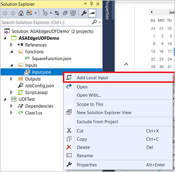
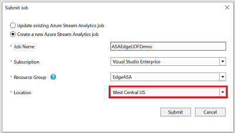

# Tutorial: Write a C# user-defined function for Azure Stream Analytics job (Preview)

C# user-defined functions (UDFs) created in Visual Studio allow you to extend the Azure Stream Analytics query language with your own functions. You can reuse existing code (including DLLs) and use mathematical or complex logic with C#. There are three ways to implement UDFs: 

- CodeBehind files in a Stream Analytics project
- UDFs from a local C# project
- UDFs from an existing package from a storage account. 

This tutorial uses the CodeBehind method to implement a basic C# function. The UDF feature for Stream Analytics jobs is currently in preview and shouldn't be used in production workloads.

In this tutorial, you learn how to:

> [!div class="checklist"]
> * Create a C# user defined function using CodeBehind.
> * Test your Stream Analytics job locally.
> * Publish your job to Azure.

## Prerequisites

Before you start, make sure you've completed the following prerequisites:

* If you don't have an Azure subscription, create a [free account](https://azure.microsoft.com/free/?WT.mc_id=A261C142F).
* Install [Stream Analytics tools for Visual Studio](stream-analytics-tools-for-visual-studio-install.md) and the **Azure development** or **Data Storage and Processing** workloads.
* Take a look at the existing [Stream Analytics Edge development guide](stream-analytics-tools-for-visual-studio-edge-jobs.md) if you're building an IoT Edge job.

## Create a container in your Azure Storage Account

The container you create is used to store the compiled C# package. If you create an Edge job, this storage account is also used to deploy the package to your IoT Edge device. Use a dedicated container for each Stream Analytics job. Reusing the same container for multiple Stream Analytics Edge jobs isn't supported. If you already have a storage account with existing containers, you may use them. If not, you need to [create a new container](../storage/blobs/storage-quickstart-blobs-portal.md). 

## Create a Stream Analytics project in Visual Studio

1. Start Visual Studio.

2. Select **File > New > Project**.

3. In the templates list on the left, select **Stream Analytics**, and then select **Azure Stream Analytics Edge Application** or **Azure Stream Analytics Application**.

4.  Input the project **Name**, **Location**, and **Solution name**, and select **OK**.

    

## Configure assembly package path

1. Open Visual Studio and navigate to the **Solution Explorer**.

2. Double-click the job configuration file, `JobConfig.json`.

3. Expand the **User-Defined Code Configuration** section, and fill out the configuration with the following suggested values:

   |**Setting**|**Suggested Value**|
   |-------|---------------|
   |Global Storage Settings Resource|Choose data source from current account|
   |Global Storage Settings Subscription| < your subscription >|
   |Global Storage Settings Storage Account| < your storage account >|
   |Custom Code Storage Settings Resource|Choose data source from current account|
   |Custom Code Storage Settings Storage Account|< your storage account >|
   |Custom Code Storage Settings Container|< your storage container >|


## Write a C# UDF with CodeBehind
A CodeBehind file is a C# file associated with a single ASA query script. Visual Studio tools automatically zips the CodeBehind file and upload it to your Azure storage account upon submission. All classes must be defined as *public* and all objects must be defined as *static public*.

1. In **Solution Explorer**, expand **Script.asql** to find the **Script.asaql.cs** CodeBehind file.

2. Replace the code with the following sample:

    ```csharp
        using System; 
        using System.Collections.Generic; 
        using System.IO; 
        using System.Linq; 
        using System.Text; 
    
        namespace ASAEdgeUDFDemo 
        { 
            public class Class1 
            { 
                // Public static function 
                public static Int64 SquareFunction(Int64 a) 
                { 
                    return a * a; 
                } 
            } 
        } 
    ```

## Implement the UDF

1. In **Solution Explorer**, open the **Script.asaql** file.

2. Replace the existing query with the following query:

    ```sql
        SELECT machine.temperature, udf.ASAEdgeUDFDemo_Class1_SquareFunction(try_cast(machine.temperature as bigint))
        INTO Output
        FROM Input 
    ```

## Local testing

1. Download the [temperature simulator sample data file](https://raw.githubusercontent.com/Azure/azure-stream-analytics/master/Sample%20Data/TemperatureSampleData.json).

2. In **Solution Explorer**, expand **Inputs**, right-click **Input.json**, and select **Add Local Input**.

   

3. Specify the local input file path for the sample data you downloaded and **Save**.

    

4. Click **Run Locally** in the script editor. Once the local run has successfully saved the output results, press any key to see the results in table format. 

    

5. You can also select **Open Results Folder** to see the raw files in JSON and CSV format.

    

## Debug a UDF
You can debug your C# UDF locally the same way you debug standard C# code. 

1. Add breakpoints in your C# function.

    

2. Press **F5** to start debugging. The program stops at your breakpoints as expected.

    

## Publish your job to Azure
Once you've tested your query locally, select **Submit to Azure** in the script editor to publish the job to Azure.



## Deploy to IoT Edge devices
If you chose to build a Stream Analytics Edge job, it can now be deployed as an IoT Edge module. Follow the [IoT Edge quickstart](../iot-edge/quickstart.md) to create an IoT Hub, register an IoT Edge device, and install and start the IoT Edge runtime on your device. Then follow the [deploy the job](../iot-edge/tutorial-deploy-stream-analytics.md#deploy-the-job) tutorial to deploy your Stream Analytics job as an IoT Edge module. 

## Next steps

In this tutorial, you created a simple C# user-defined function using CodeBehind, published your job to Azure, and deployed the job to Azure or IoT Edge device. 

To learn more about the different ways to use C# user-defined functions for Stream Analytics jobs, continue to this article:

> [!div class="nextstepaction"]
> [Write C# functions for Azure Stream Analytics](stream-analytics-edge-csharp-udf-methods.md)