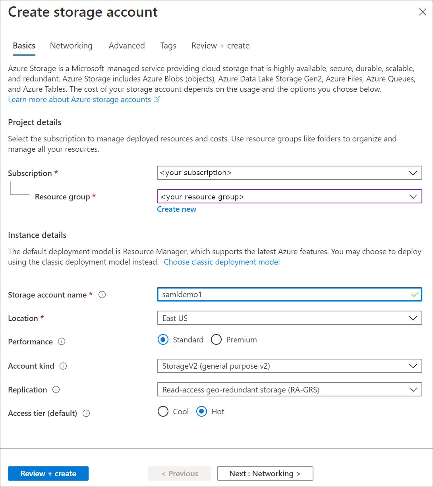
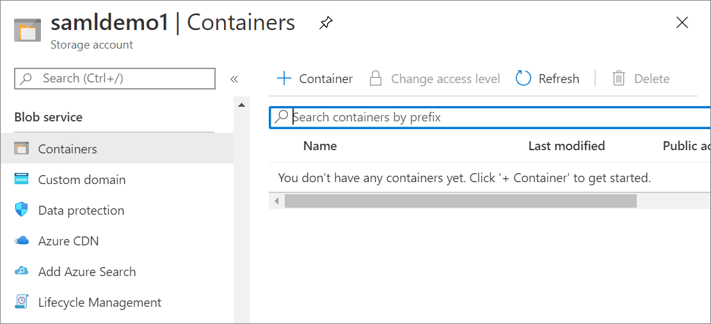
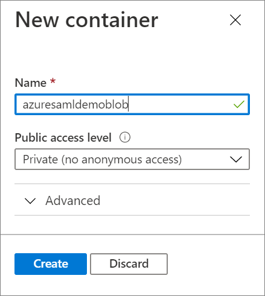
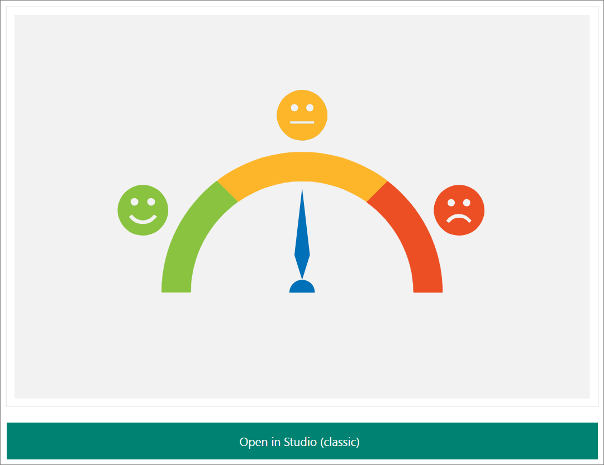

# Do sentiment analysis with Azure Stream Analytics and Azure Machine Learning Studio (classic)

This article shows you how to set up a simple Azure Stream Analytics job that uses Azure Machine Learning Studio (classic) for sentiment analysis. You use a Studio (classic) sentiment analytics model from the Cortana Intelligence Gallery to analyze streaming text data and determine the sentiment score.

> [!TIP]
> It is highly recommended to use [Azure Machine Learning UDFs](machine-learning-udf.md) instead of Azure Machine Learning Studio (classic) UDF for improved performance and reliability.

You can apply what you learn from this article to scenarios such as these:

* Analyzing real-time sentiment on streaming Twitter data.
* Analyzing records of customer chats with support staff.
* Evaluating comments on forums, blogs, and videos.
* Many other real-time, predictive scoring scenarios.

The Streaming Analytics job that you create applies the sentiment analytics model as a user-defined function (UDF) on the sample text data from the blob store. The output (the result of the sentiment analysis) is written to the same blob store in a different CSV file. 

## Prerequisites

Before you start, make sure you have the following:

* An active Azure subscription.

* A CSV file with some Twitter data in it. You can download a sample file from [GitHub](https://github.com/Azure/azure-stream-analytics/blob/master/Sample%20Data/sampleinput.csv), or you can create your own file. In a real-world scenario, you would get the data directly from a Twitter data stream.

## Create a storage container and upload the CSV input file

In this step, you upload a CSV file to your storage container.

1. In the Azure portal, select **Create a resource** > **Storage** > **Storage account**.

2. Fill out the *Basics* tab with the following details and leave the default values for the remaining fields:

   |Field  |Value  |
   |---------|---------|
   |Subscription|Choose your subscription.|
   |Resource group|Choose your resource group.|
   |Storage account name|Enter a name for your storage account. The name must be unique across Azure.|
   |Location|Choose a location. All resources should use the same location.|
   |Account kind|BlobStorage|

   

3. Select **Review + Create**. Then, select **Create** to deploy your storage account.

4. When the deployment is complete, navigate to your storage account. Under **Blob service**, select **Containers**. Then select **+ Container** to create a new container.

   

5. Provide a name for the container and verify that **Public access level** is set to **Private**. When you're done, select **Create**.

   

6. Navigate to the newly created container and select **Upload**. Upload the **sampleinput.csv** file that you downloaded earlier.

   

## Add the sentiment analytics model from the Cortana Intelligence Gallery

Now that the sample data is in a blob, you can enable the sentiment analysis model in Cortana Intelligence Gallery.

1. Go to the [predictive sentiment analytics model](https://gallery.cortanaintelligence.com/Experiment/Predictive-Mini-Twitter-sentiment-analysis-Experiment-1) page in the Cortana Intelligence Gallery.  

2. Select **Open in Studio (classic)**.  
   
     

3. Sign in to go to the workspace. Select a location.

4. Select **Run** at the bottom of the page. The process runs, which takes about a minute.

     

5. After the process has run successfully, select **Deploy Web Service** at the bottom of the page.

     

6. To validate that the sentiment analytics model is ready to use, select the **Test** button. Provide text input such as "I love Microsoft".

     

   If the test works, you see a result similar to the following example:

     

7. In the **Apps** column, select the **Excel 2010 or earlier workbook** link to download an Excel workbook. The workbook contains the API key and the URL that you need later to set up the Stream Analytics job.

      

## Create a Stream Analytics job that uses the Studio (classic) model

You can now create a Stream Analytics job that reads the sample tweets from the CSV file in blob storage.

### Create the job

Go to the [Azure portal](https://portal.azure.com) and create a Stream Analytics job. If you're not familiar with this process, see [Create a Stream Analytics job by using the Azure portal](stream-analytics-quick-create-portal.md).

### Configure the job input

The job gets its input from the CSV file that you uploaded earlier to blob storage.

1. Navigate to your Stream Analytics job. Under **Job Topology**, select the **Inputs** option. Select **Add Stream Input** >**Blob storage**.

2. Fill out the **Blob Storage** details with the following values:

   |Field  |Value  |
   |---------|---------|
   |Input alias|Give your input a name. Remember this alias for when you write your query.|
   |Subscription|Select your subscription.|
   |Storage account|Select the storage account you made in the previous step.|
   |Container|Select the container you created in the previous step.|
   |Event serialization format|CSV|

3. Select **Save**.

### Configure the job output

The job sends results to the same blob storage where it gets input.

1. Navigate to your Stream Analytics job. Under **Job Topology**, select the **Outputs** option. Select **Add** > **Blob storage**.

2. Fill out the **Blob Storage** form with these values:

   |Field  |Value  |
   |---------|---------|
   |Input alias|Give your input a name. Remember this alias for when you write your query.|
   |Subscription|Select your subscription.|
   |Storage account|Select the storage account you made in the previous step.|
   |Container|Select the container you created in the previous step.|
   |Event serialization format|CSV|

3. Select **Save**.

### Add the Studio (classic) function

Earlier you published a Studio (classic) model to a web service. In this scenario, when the Stream Analysis job runs, it sends each sample tweet from the input to the web service for sentiment analysis. The Studio (classic) web service returns a sentiment (`positive`, `neutral`, or `negative`) and a probability of the tweet being positive.

In this section, you define a function in the Stream Analysis job. The function can be invoked to send a tweet to the web service and get the response back.

1. Make sure you have the web service URL and API key that you downloaded earlier in the Excel workbook.

2. Navigate to your Stream Analytics job. Then select **Functions** > **+ Add** > **Azure ML Studio**

3. Fill out the **Azure Machine Learning function** form with the following values:

   |Field  |Value  |
   |---------|---------|
   | Function alias | Use the name `sentiment` and select **Provide Azure Machine Learning function settings manually**, which gives you an option to enter the URL and key.      |
   | URL| Paste the web service URL.|
   |Key | Paste the API key. |

4. select **Save**.

### Create a query to transform the data

Stream Analytics uses a declarative, SQL-based query to examine the input and process it. In this section, you create a query that reads each tweet from input and then invokes the Studio (classic) function to perform sentiment analysis. The query then sends the result to the output that you defined (blob storage).

1. Return to the Stream Analytics job overview.

2. Under **Job Topology**, select **Query**.

3. Enter the following query:

    ```SQL
    WITH sentiment AS (  
    SELECT text, sentiment1(text) as result 
    FROM <input>  
    )  

    SELECT text, result.[Score]  
    INTO <output>
    FROM sentiment  
    ```    

   The query invokes the function you created earlier (`sentiment`) to perform sentiment analysis on each tweet in the input.

4. select **Save** to save the query.

## Start the Stream Analytics job and check the output

You can now start the Stream Analytics job.

### Start the job

1. Return to the Stream Analytics job overview.

2. select **Start** at the top of the page.

3. In **Start job**, select **Custom**, and then select one day prior to when you uploaded the CSV file to blob storage. When you're done, select **Start**.  

### Check the output

1. Let the job run for a few minutes until you see activity in the **Monitoring** box.

2. If you have a tool that you normally use to examine the contents of blob storage, use that tool to examine the container. Alternatively, do the following steps in the Azure portal:

      1. In the Azure portal, find your storage account, and within the account, find the container. You see two files in the container: the file that contains the sample tweets and a CSV file generated by the Stream Analytics job.
      2. Right-click the generated file and then select **Download**.

3. Open the generated CSV file. You see something like the following example:  

     

### View metrics

You also can view Studio (classic) function-related metrics. The following function-related metrics are displayed in the **Monitoring** box of the job overview:

* **Function Requests** indicates the number of requests sent to a Studio (classic) web service.  
* **Function Events** indicates the number of events in the request. By default, each request to a Studio (classic) web service contains up to 1,000 events.

## Next steps

* [Introduction to Azure Stream Analytics](stream-analytics-introduction.md)
* [Azure Stream Analytics Query Language Reference](/stream-analytics-query/stream-analytics-query-language-reference)
* [Integrate REST API and Machine Learning Studio (classic)](stream-analytics-how-to-configure-azure-machine-learning-endpoints-in-stream-analytics.md)
* [Azure Stream Analytics Management REST API Reference](/rest/api/streamanalytics/)