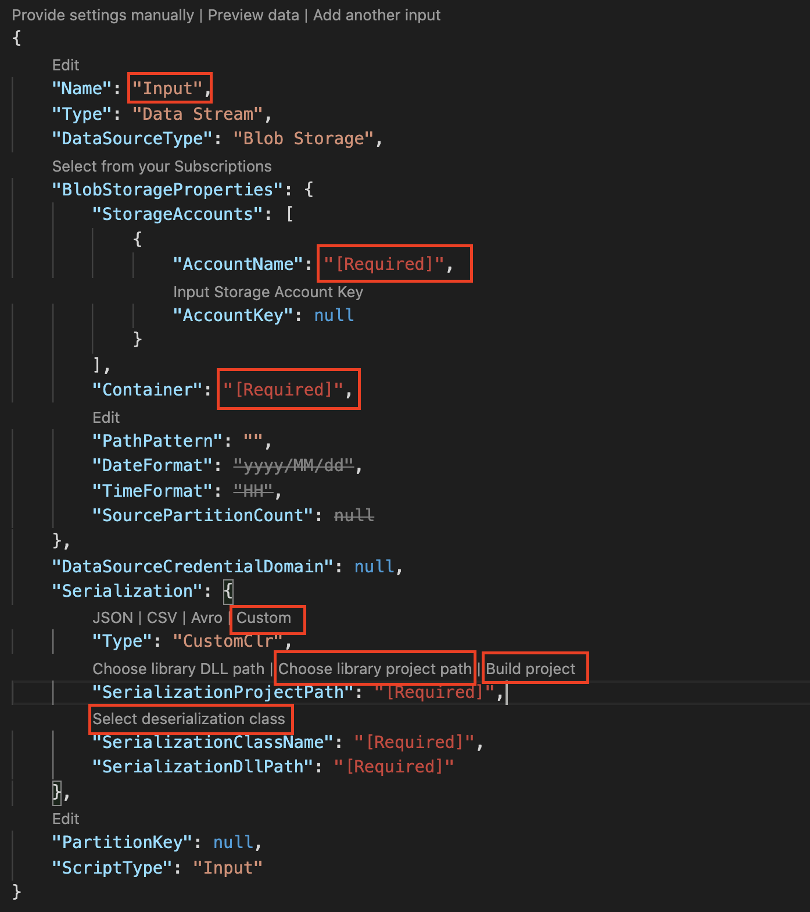
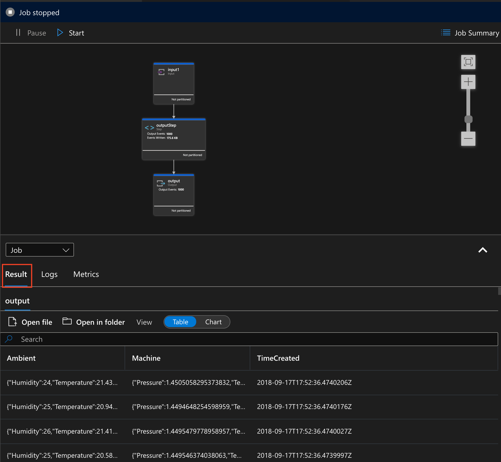
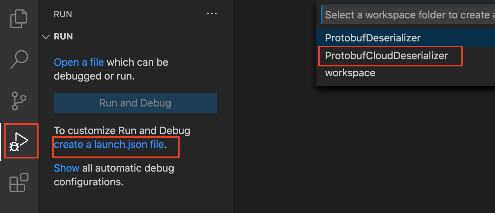
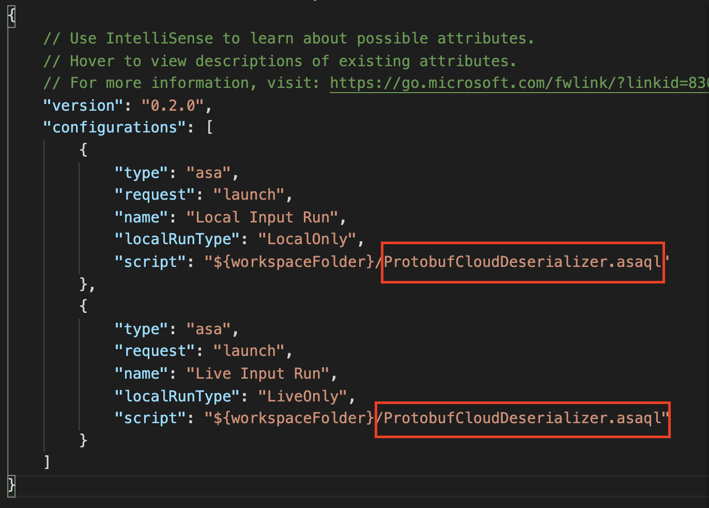

# Custom .NET deserializers for Azure Stream Analytics

Azure Stream Analytics has [built-in support for three data formats](stream-analytics-parsing-json.md): JSON, CSV, and Avro. With custom .NET deserializers, you can read data from other formats such as [Protocol Buffer](https://developers.google.com/protocol-buffers/), [Bond](https://github.com/Microsoft/bond) and other user defined formats for both cloud and edge jobs.


## Custom .NET deserializers in Visual Studio Code

You can create, test and debug a custom .NET deserializer for an Azure Stream Analytics cloud job using Visual Studio Code. 

### Prerequisites
* Install [.NET core SDK](https://dotnet.microsoft.com/download) and restart Visual Studio Code.

* Use this [quickstart](quick-create-visual-studio-code.md) to learn how to create a Stream Analytics job using Visual Studio Code.

### Create a custom deserializer

1. Open a terminal and run following command to create a .NET class library in Visual Studio Code for your custom deserializer called **ProtobufDeserializer**.

  ```dotnetcli
  dotnet new classlib -o ProtobufDeserializer
  ```

2. Go to the **ProtobufDeserializer** project directory and install the [Microsoft.Azure.StreamAnalytics](https://www.nuget.org/packages/Microsoft.Azure.StreamAnalytics/) and [Google.Protobuf](https://www.nuget.org/packages/Google.Protobuf/) NuGet packages. 

  ```dotnetcli
  dotnet add package Microsoft.Azure.StreamAnalytics
  ```

  ```dotnetcli
  dotnet add package Google.Protobuf
  ```

3. Add the [MessageBodyProto class](https://github.com/Azure/azure-stream-analytics/blob/master/CustomDeserializers/Protobuf/MessageBodyProto.cs) and the [MessageBodyDeserializer class](https://github.com/Azure/azure-stream-analytics/blob/master/CustomDeserializers/Protobuf/MessageBodyDeserializer.cs) to your project. 


4. Build the **ProtobufDeserializer** project.

### Add an Azure Stream Analytics project

1. Open Visual Studio Code and select **Ctrl+Shift+P** to open the command palette. Then enter ASA and select **ASA: Create New Project**. Name it **ProtobufCloudDeserializer**.

### Configure a Stream Analytics job

1. Double-click **JobConfig.json**. Use the default configurations, except for the following settings:

   |Setting|Suggested Value|
   |-------|---------------|
   |Global Storage Settings Resource|Choose data source from current account|
   |Global Storage Settings Subscription| < your subscription >|
   |Global Storage Settings Storage Account| < your storage account >|
   |CustomCodeStorage Settings Storage Account|< your storage account >|
   |CustomCodeStorage Settings Container|< your storage container >|

2. Under **Inputs** folder open **input.json**. Select **Add live input** and add an input from Azure Data Lake Storage Gen2/Blob storage, choose **Select from your Azure subscription**. Use the default configurations, except for the following settings:

   |Setting|Suggested Value|
   |-------|---------------|
   |Name|Input|
   |Subscription|< your subscription >|
   |Storage Account|< your storage account >|
   |Container|< your storage container >|
   |Serialization Type|Choose **Custom**|
   |SerializationProjectPath|Select **Choose library project path** from CodeLens and select the **ProtobufDeserializer** library project created in previous section. Select **build project** to build the project|
   |SerializationClassName|Select **select deserialization class** from CodeLens to auto populate the class name and DLL path|
   |Class Name|MessageBodyProto.MessageBodyDeserializer|

    


3. Add the following query to the **ProtobufCloudDeserializer.asaql** file.

   ```sql
   SELECT * FROM Input
   ```

4. Download the [sample protobuf input file](https://github.com/Azure/azure-stream-analytics/blob/master/CustomDeserializers/Protobuf/SimulatedTemperatureEvents.protobuf). In the **Inputs** folder, right-click **input.json** and select **Add local input**. Then, double-click **local_input1.json** and use the default configurations, except for the following settings.

   |Setting|Suggested Value|
   |-------|---------------|
   |Select local file path|Click CodeLens to select < The file path for the downloaded sample protobuf input file>|

### Execute the Stream Analytics job

1. Open **ProtobufCloudDeserializer.asaql** and select **Run Locally** from CodeLens then choose **Use Local Input** from the dropdown list.

2. Observe the results in **Results** tab in job diagram view on the right. You can also click the steps in the job diagram to view intermediate result. More details please see [Debug locally using job diagram](debug-locally-using-job-diagram-vs-code).   

   


You have successfully implemented a custom deserializer for your Stream Analytics job! In this tutorial, you tested the custom deserializer locally with local input data. You can also test it [using live data input in the cloud](visual-studio-code-local-run-live-input.md). For running the job in the cloud, you would properly configure the input and output. Then submit the job to Azure from Visual Studio Code to run your job in the cloud using the custom deserializer you just implemented.

### Debug your deserializer

You can debug your .NET deserializer locally the same way you debug standard .NET code. 

1. Add breakpoints in your .NET function.

2. Click **Run** from Visual Studio Code Activity bar and select **create a launch.json file**. Choose **ProtobufCloudDeserializer** and then **Azure Stream Analytics** from the dropdown list. Edit the **launch.json** file to replace <ASAScript>.asaql with ProtobufCloudDeserializer.asaql.

   

    

   


3. Press **F5** to start debugging. The program will stop at your breakpoints as expected. This works for both local input and live input data.

   


## Clean up resources

When no longer needed, delete the resource group, the streaming job, and all related resources. Deleting the job avoids billing the streaming units consumed by the job. If you're planning to use the job in future, you can stop it and restart it later when you need. If you are not going to continue to use this job, delete all resources created by this tutorial by using the following steps:

1. From the left-hand menu in the Azure portal, select **Resource groups** and then select the name of the resource you created.  

2. On your resource group page, select **Delete**, type the name of the resource to delete in the text box, and then select **Delete**.

## Next steps

In this tutorial, you learned how to implement a custom .NET deserializer for the protocol buffer input serialization. To learn more about creating custom deserializers, continue to the following article:

> [!div class="nextstepaction"]
> [Create different .NET deserializers for Azure Stream Analytics jobs](custom-deserializer-examples.md)
