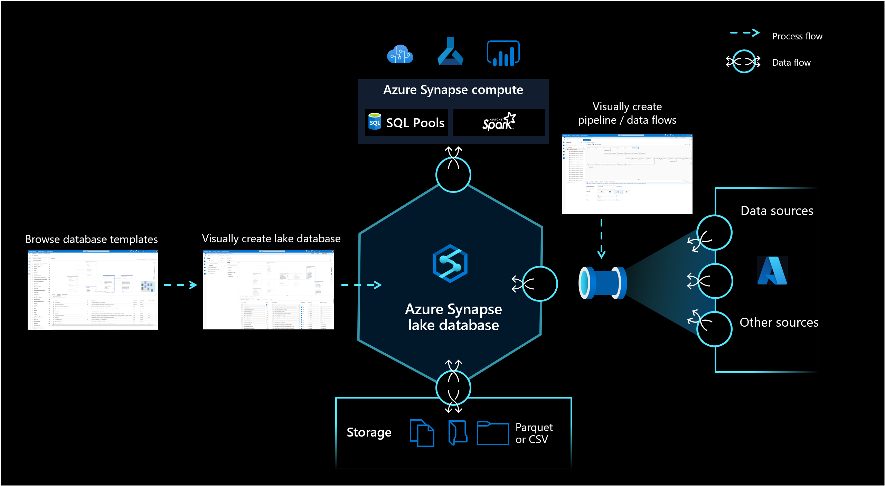

# Lake database

The lake database in Azure Synapse Analytics enables customers to bring together database design, meta information about the data that is stored and a possibility to describe how and where the data should stored. Lake database adresses the challenge of today's data lakes where it is very hard to understand how data is structured.  

## Database designer

The new database designer gives you the possibility to create a data model for your lake database and add additional information to it. Every Entity and Attribute can be described to provide more information along the model which not only contains Entities but relationships as well. Particular the lack to model relationships has been a challenge for the interaction on the data lake. This is now addressed with an integrated designer that now provides possibilities that just have been available in databases but not on the lake. Also the capability to add descriptions and possible demo values to the model allows people wo hare interacting with it in the future to have information where they need it to get a better understanding about the data. 

## Data storage 

Lake databases use a data lake on the Azure Storage account to store the data of the database. The data can be stored in the Parquet of CSV format and different settings can be used to optimize the storage. Every lake database uses a linked service to define the location of the root data and for every Entity separate folders are created on the data lake. By default all Tables within a lake database use the same format but the formats and location of the data can be changed per entity if that is requested. 

## Database compute

The lake database are exposed in Synapse SQL on demand and Apache Spark. This provides the user with the capability to decouple storage from compute. The metadata that is associated with the lake database makes it easy for different compute engines to not only provide an integrated experience but also use additional information (e.g. relationships) that is originally not supported on the data lake. 
