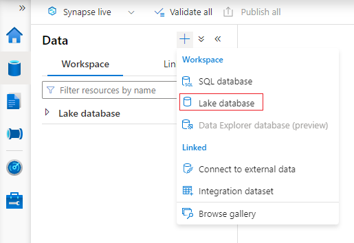
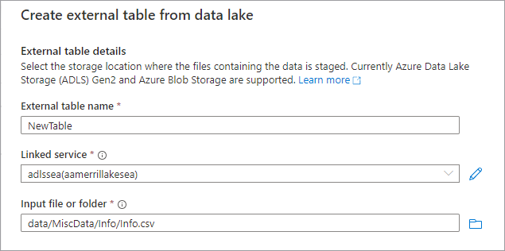

# How-to: Create an empty lake database

In this article, you will learn how to create an empty [lake database](./concepts-lake-database.md) in Azure Synapse using the database designer. The database designer allows you to easily create and deploy a database without writing any code. 

## Prerequisites

- At least Synapse User role permissions are required for exploring a lake database template from Gallery.
- Synapse Administrator, Synapse Contributor, or Synapse Artifact Publisher permissions are required on the Synapse workspace for creating a lake database.
- Storage Blob Data Contributor permissions are required on data lake.

## Create lake database from database template
1. From your Azure Synapse Analytics workspace **Home** hub, select the **Data** tab on the left. This will open the **Data** tab where you can see the list of databases that already exist in your workspace.
2. Hover over the **+** button and select, then choose **Lake database (preview)**.

3. The database designer tab will open with an empty database.
4. The database designer has **Properties** on the right that need to be configured.
    - **Name** - Give your database a name. Names cannot be edited after the database is published, so make sure the name you choose is correct.
    - **Description** - Giving your database a description is optional, but it allows users to understand the purpose of the database.
    - **Storage settings for database** - This section contains the default storage information for tables in the database. This default is applied to each table in the database unless it is overridden on the table itself.
    - **Linked service** - It is the default linked service used to store your data in Azure Data Lake Storage. This will show the default linked service associated with the Synapse workspace, but you can change this to any ADLS storage account you like. 
    - **Input folder** - Used to set the default container and folder path within that linked service using the file browser.
    - **Data format** - Lake databases in Azure Synapse support parquet and delimited text as the storage formats for data.
> [!NOTE]
> You can always override the default storage settings on a table by table basis, and the default remains customizable. If you are not sure what to choose, you can revisit this later. 
5. To add a table to the database, select the **+ Table** button. 
    - **Custom** will add a new table to the canvas.
    - **From template** will open the gallery and let you select a database template to use when adding a new table. See [Create lake database from database template](./create-lake-database-from-lake-database-templates.md) for more information
    - **From data lake** lets you import a table schema using data already in your lake.
6. Select **Custom**. A new table will appear on the canvas called Table_1.
7. You can then customize Table_1, including the table name, description, storage settings, columns, and relationships. See [Modify a lake database](./modify-lake-database.md) for more details.
8. Add a new table from the data lake by selecting **+ Table** and then **From data lake**.
9. The **Create external table from data lake** pane will appear. Fill out the pane with the below details and select **Continue**.
    - **External table name** the name you want to give the table you are creating.
    - **Linked service** the linked service containing the Azure Data Lake Storage location where your data file lives.
    - **Input file or folder** use the file browser to navigate to and select a file on your lake you want to create a table using.

    - On the next screen, Azure Synapse will preview the file and detect the schema.
    - You will land on the **New external table** page where you can update any settings related to the data format, as well as **Preview Data** to check if Synapse identified the file correctly.
    - When you are happy with the settings, select **Create**.
    - A new table with the name you selected will be added to the canvas, and the **Storage settings for table** section will show the file that you specified.
10.   With the database customized, it's now time to publish it. If you are using Git integration with your Synapse workspace, you must commit your changes and merge them into the collaboration branch. [Learn more about source control in Azure Synapse](././cicd/../../cicd/source-control.md) If you are using Synapse Live mode, you can click "publish".
    - Your database will be validated for errors before it is published. Any errors found will be showing in the notifications tab with instructions on how to remedy the error.
    
      
      Publishing will create your database schema in the Azure Synapse Metastore. This will allow the database and table objects to be visible to other Azure services and allow the metadata from your database to flow into apps like Power BI or Purview.

11. You have now created an empty lake database in Azure Synapse, and added tables to it using the **Custom** and **From data lake** options.

## Next steps
Continue to explore the capabilities of the database designer using the links below. 
- [Modify a lake database](./modify-lake-database.md)
- [Learn more about lake databases](./concepts-lake-database.md)
- [Create a lake database from lake database template](./create-lake-database-from-lake-database-templates.md)
