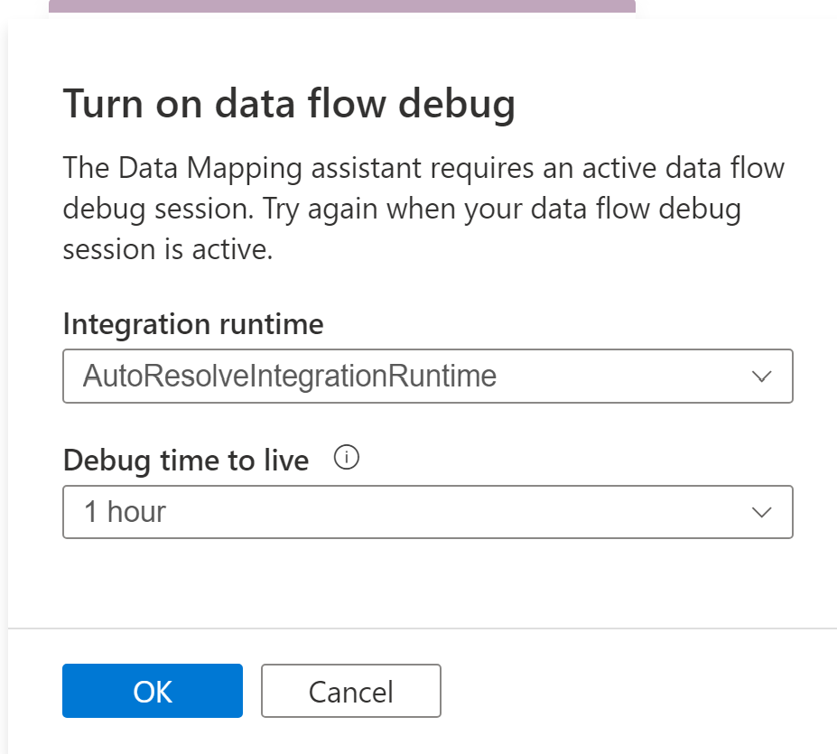
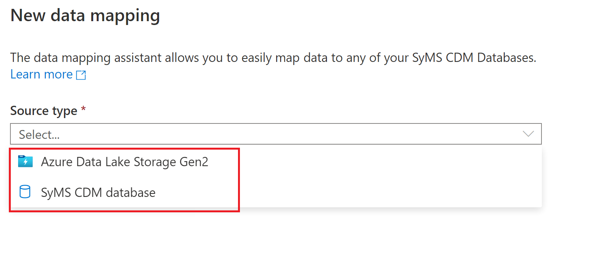
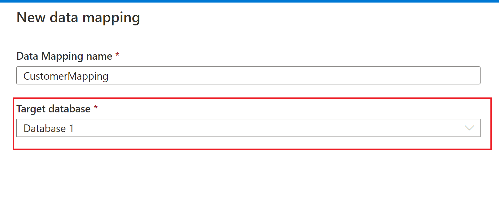

# Map Data in Azure Synapse Analytics

## What is the Map data tool?

The Map Data tool is a guided process to help users create ETL mappings and mapping data flows from their source data to Synapse lake database tables without writing code. This process starts with the user choosing the destination tables in Synapse lake databases and then mapping their source data into these tables. 

For more information on Synapse lake databases see [Overview of Azure Synapse database templates - Azure Synapse Analytics | Microsoft Docs](overview-database-templates.md)

Map Data provides for a guided experience where the user can generate a mapping data flow without having to start with a blank canvas and quickly generate a scalable mapping data flow runnable in Synapse pipelines.

[!NOTE] 
The Map Data feature in Synapse Analytics pipelines is currently in public preview

## Getting started

The Map Data tool is started from within the Synapse lake database experience. From here, you can select the Map Data tool to begin the process. 

Map Data needs compute available to assist users with previewing data and reading schema of their source files. Upon using Map Data for the first time in a session you will need to warm up a cluster.

To begin, choose your data source that you want to map to your lake database tables. Currently supported data sources are Azure Data Lake Storage Gen 2 and Synapse lake databases.

### File type options
When choosing a file store such as Azure Data Lake Storage Gen 2 the following file types are supported:

* Common Data Model
* Delimited Text
* Parquet

## Create data mapping
Name your data mapping and select the Synapse lake database destination.

## Source to target mapping
Choose a Primary source table to map to the Synapse lake database destination table.

### New mapping
Use the New Mapping button to add a mapping method to create a mapping or transformation.

### Additional source
Use the Additional source button to join to and add another source to your mapping.

### Preview data
The **Data Preview** tab gives you an interactive snapshot of the data of each transform. For more information, see [Data preview in debug mode](../../data-factory/concepts-data-flow-debug-mode.md#data-preview).

### Mapping methods

The following mapping methods are supported:

* [Direct](../../data-factory/data-flow-select.md)
* [Surrogate Key](../../data-factory/data-flow-surrogate-key.md)
* [Lookup](../../data-factory/data-flow-lookup.md)
* [Unpivot](../../data-factory/data-flow-unpivot.md)
* [Aggregate](../../data-factory/data-flow-aggregate.md)
	* Sum
	* Minimum
	* Maximum
	* First
	* Last
	* Standard Deviation
	* Average
	* Mean
* [Derived Column](../../data-factory/data-flow-derived-column.md)
	* Trim
	* Upper
	* Lower
	* Advanced 

## Create pipeline

Once you are done with your Map Data transformations select the Create pipeline button to generate a mapping data flow and pipeline to debug and run your transformation.