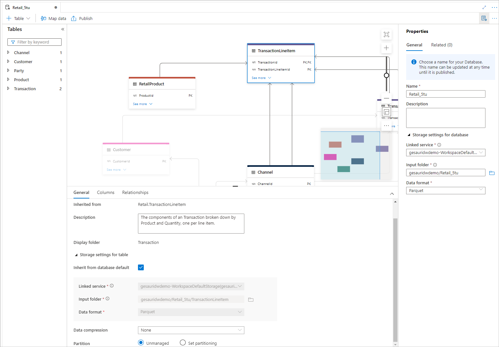

# Quickstart: Create a new Lake database leveraging database templates

This quick start gives you a run through of an end-2-end scenario on how you can apply the database templates to create a lake database, align data to your new model, and use the integrated experience to analyze the data. 

## Prerequisites
- At least Synapse User role permissions are required for exploring a lake database template from Gallery.
- Synapse Administrator, or Synapse Contributor permissions are required on the Synapse workspace for creating a lake database.
- Storage Blob Data Contributor permissions are required on data lake.

## Create a lake database from database templates

Use the new database templates (preview) functionality to create a lake database that you can use to configure your data model for the database. 

For our scenario we will use the Retail database template and select the following entities: 
 - **RetailProduct** - A product is anything that can be offered to a market that might satisfy a need by potential customers. That product is the sum of all physical, psychological, symbolic, and service attributes associated with it.
 - **Transaction** - The lowest level of executable work or customer activity.
A transaction consists of one or more discrete events.
 - **TransactionLineItem** - The components of a Transaction broken down by Product and Quantity, one per line item.
 - **Party** - A party is an individual, organization, legal entity, social organization, or business unit of interest to the business.
 - **Customer** - A customer is an individual or legal entity that has or has purchased a product or service.
 - **Channel** - A channel is a means by which products or services are sold and/or distributed.
The easiest way to find them is by using the search box above the different business areas that contain the tables. 
 

 
 
 ## Configure lake database
 
After you have created the database, make sure the storage account & filepath is set to a location where you wish to store the data. The path will default to the primary storage account within Synapse analytics but can be changed to your needs. 
  
 
 
To save your layout and make it available within Synapse Publish all changes. This step completes the setup of the lake database and makes it available to all components within Synapse Analytics and outside. 


## Ingest data to lake database

To ingest data to the lake database, you can execute [pipelines](../synapse-analytics/data-integration/) with code free data flow mappings, which have a **Workspace DB** connector to load data directly to the database table. You can also use the interactive Spark notebooks to ingest data to the lake database tables:

```Spark
%%sql
INSERT INTO `retail_mil`.`customer` VALUES (1,'2021-02-18',1022,557,101,'Tailspin Toys (Head Office)','Waldemar Fisar',90410,466);
```
 

## Query the data

After the lake database is created, there are different ways to query the data. Currently we support SQL-Ondemand within Synapse that automatically understands the newly created lake database format and exposes the data through it. 

```sql
SELECT TOP (100) [ProductId]
,[ProductName]
,[ProductDescription]
,[ProductInternalName]
,[ItemSku]
,[PrimaryBrandId]
FROM [Retail_mil].[dbo].[RetailProduct]
```
The other way to access the data within Synapse is to open a new Spark notebook and use the integrated experience there: 
```spark
df = spark.sql("SELECT * FROM `Retail_mil`.`RetailProduct`")
df.show(10)
```

## Train machine learning models

You can use lake database to train your machine learning models and score the data. For more details [Train machine learning models](./synapse-analytics/machine-learning/tutorial-automl.md) 

## Next steps
Continue to explore the capabilities of the database designer using the links below.
 - [Database templates concept](concepts-database-templates.md)
 - [Lake database concept](concepts-lake-database.md)
 - [How to create a lake database](create-empty-lake-database.md)

