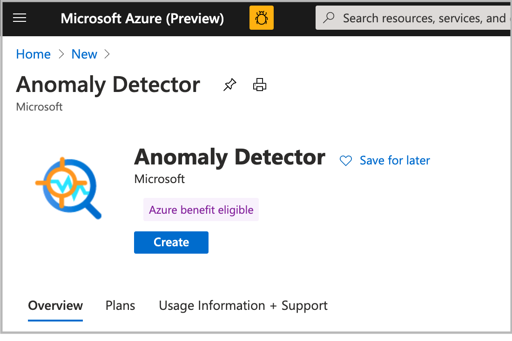
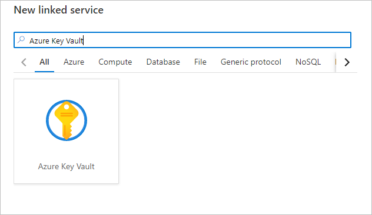

# Tutorial: Prerequisites for using Cognitive Services in Azure Synapse Analytics

In this tutorial, you'll learn how set up the prerequisites for securely using Azure Cognitive Services in Azure Synapse Analytics.

This tutorial covers:
> [!div class="checklist"]
> - Create a Cognitive Services resource like Text Analytics or Anomaly Detector.
> - Store an authentication key to Cognitive Services resources as secrets in Azure Key Vault and configure access for an Azure Synapse Analytics workspace.
> - Create an Azure Key Vault linked service in your Azure Synapse Analytics workspace.

If you don't have an Azure subscription, [create a free account before you begin](https://azure.microsoft.com/free/).

## Prerequisites

- [Azure Synapse Analytics workspace](../get-started-create-workspace.md) with an Azure Data Lake Storage Gen2 storage account configured as the default storage. You need to be the *Storage Blob Data Contributor* of the Azure Data Lake Storage Gen2 file system that you work with.

## Sign in to the Azure portal

Sign in to the [Azure portal](https://portal.azure.com/).

## Create a Cognitive Services resource

[Azure Cognitive Services](../../cognitive-services/index.yml) includes many types of services. Text Analytics and Anomaly Detector are two examples in the Azure Synapse tutorials.

You can create a [Text Analytics](https://ms.portal.azure.com/#create/Microsoft.CognitiveServicesTextAnalytics) resource in the Azure portal:

You can create an [Anomaly Detector](https://ms.portal.azure.com/#create/Microsoft.CognitiveServicesTextAnalytics) resource in the Azure portal:

## Create a key vault and configure secrets and access

1. Create a [key vault](https://ms.portal.azure.com/#create/Microsoft.KeyVault) in the Azure portal.
2. Go to **Key Vault** > **Access policies**, and grant the [Azure Synapse workspace MSI](../security/synapse-workspace-managed-identity.md) permissions to read secrets from Azure Key Vault.

   > [!NOTE]
   > Make sure that the policy changes are saved. This step is easy to miss.

   

3. Go to your Cognitive Services resource. For example, go to **Anomaly Detector** > **Keys and Endpoint**. Then copy either of the two keys to the clipboard.

4. Go to **Key Vault** > **Secret** to create a new secret. Specify the name of the secret, and then paste the key from the previous step into the **Value** field. Finally, select **Create**.

   

   > [!IMPORTANT]
   > Make sure you remember or note down this secret name. You'll use it later when you connect to Cognitive Services from Azure Synapse Studio.

## Create an Azure Key Vault linked service in Azure Synapse

1. Open your workspace in Azure Synapse Studio. 
2. Go to **Manage** > **Linked Services**. Create an **Azure Key Vault** linked service by pointing to the key vault that you just created. 
3. Verify the connection by selecting the **Test connection** button. If the connection is green, select **Create** and then select **Publish all** to save your change.

You're now ready to continue with one of the tutorials for using the Azure Cognitive Services experience in Azure Synapse Studio.

## Next steps

- [Tutorial: Sentiment analysis with Azure Cognitive Services](tutorial-cognitive-services-sentiment.md)
- [Tutorial: Anomaly detection with Azure Cognitive Services](tutorial-cognitive-services-sentiment.md)
- [Tutorial: Machine learning model scoring in Azure Synapse dedicated SQL Pools](tutorial-sql-pool-model-scoring-wizard.md).
- [Machine Learning capabilities in Azure Synapse Analytics](what-is-machine-learning.md)