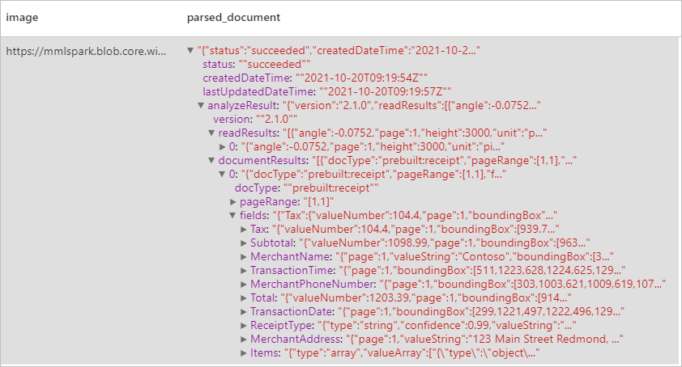

# Tutorial: Form Recognizer with Applied AI Service

[Azure Form Recognizer](../../applied-ai-services/form-recognizer/index.yml) is an [Azure Applied AI Service](../../applied-ai-services/index.yml) that enables you to build automated data processing application using machine learning technology. In this tutorial, you'll learn how to easily enrich your data in Azure Synapse Analytics. You'll use [Form Recognizer](../../applied-ai-services/form-recognizer/index.yml) to analyze your forms and documents, extracts text and data, and returns a structured JSON output. You quickly get accurate results that are tailored to your specific content without excessive manual intervention or extensive data science expertise. 

This tutorial demonstrates using form recognizer with [MMLSpark](https://github.com/Azure/mmlspark) to:

> [!div class="checklist"]
> - Extract text and layout from a given document
> - Detect and extract data from receipts
> - Detect and extract data from business cards
> - Detect and extract data from invoices
> - Detect and extract data from identification documents


If you don't have an Azure subscription, [create a free account before you begin](https://azure.microsoft.com/free/).


## Prerequisites

- [Azure Synapse Analytics workspace](../get-started-create-workspace.md) with an Azure Data Lake Storage Gen2 storage account configured as the default storage. You need to be the *Storage Blob Data Contributor* of the Data Lake Storage Gen2 file system that you work with.
- Spark pool in your Azure Synapse Analytics workspace. For details, see [Create a Spark pool in Azure Synapse](../quickstart-create-sql-pool-studio.md).
- Pre-configuration steps described in the tutorial [Configure Cognitive Services in Azure Synapse](tutorial-configure-cognitive-services-synapse.md).


## Get started
Open Synapse Studio and create a new notebook. To get started, import [MMLSpark](https://github.com/Azure/mmlspark). 

```python
import mmlspark
from mmlspark.cognitive import *
```

## Configure form recognizer 

Use the linked form recognizer you configured in the [pre-configuration steps](tutorial-configure-cognitive-services-synapse.md) . 

```python
cognitive_service_name = "<Your linked service for form recognizer>"
```


## Analyze Layout

Extract text and layout information from a given document. The input document must be of one of the supported content types - 'application/pdf', 'image/jpeg', 'image/png' or 'image/tiff'.

### Example input


```python
from pyspark.sql.functions import col, flatten, regexp_replace, explode, create_map, lit

imageDf = spark.createDataFrame([
  ("https://mmlspark.blob.core.windows.net/datasets/FormRecognizer/layout1.jpg",)
], ["source",])

analyzeLayout = (AnalyzeLayout()
                 .setLinkedService(cognitive_service_name)
                 .setImageUrlCol("source")
                 .setOutputCol("layout")
                 .setConcurrency(5))


display(analyzeLayout
        .transform(imageDf)
        .withColumn("lines", flatten(col("layout.analyzeResult.readResults.lines")))
        .withColumn("readLayout", col("lines.text"))
        .withColumn("tables", flatten(col("layout.analyzeResult.pageResults.tables")))
        .withColumn("cells", flatten(col("tables.cells")))
        .withColumn("pageLayout", col("cells.text"))
        .select("source", "readLayout", "pageLayout"))
```

### Expected results


## Analyze Receipts

Detects and extracts data from receipts using optical character recognition (OCR) and our receipt model, enabling you to easily extract structured data from receipts such as merchant name, merchant phone number, transaction date, transaction total, and more.

### Example input


```python
imageDf2 = spark.createDataFrame([
  ("https://mmlspark.blob.core.windows.net/datasets/FormRecognizer/receipt1.png",),
  ("https://mmlspark.blob.core.windows.net/datasets/FormRecognizer/receipt1.png",)
], ["image",])

analyzeReceipts = (AnalyzeReceipts()
                 .setLinkedService(cognitive_service_name)
                 .setImageUrlCol("image")
                 .setOutputCol("parsed_document")
                 .setConcurrency(5))


results = analyzeReceipts.transform(imageDf2).cache()
display(results.select("image", "parsed_document"))
```

### Expected results


## Analyze business cards
Detects and extracts data from business cards using optical character recognition (OCR) and our business card model, enabling you to easily extract structured data from business cards such as contact names, company names, phone numbers, emails, and more.
### Example input


```python
imageDf3 = spark.createDataFrame([
  ("https://mmlspark.blob.core.windows.net/datasets/FormRecognizer/business_card.jpg",)
], ["source",])

analyzeBusinessCards = (AnalyzeBusinessCards()
                 .setLinkedService(cognitive_service_name)
                 .setImageUrlCol("source")
                 .setOutputCol("businessCards")
                 .setConcurrency(5))

display(analyzeBusinessCards
        .transform(imageDf3)
        .withColumn("documents", explode(col("businessCards.analyzeResult.documentResults.fields")))
        .select("source", "documents"))
```

### Expected results


## Analyze invoices
Detects and extracts data from invoices using optical character recognition (OCR) and our invoice understanding deep learning models, enabling you to easily extract structured data from invoices such as customer, vendor, invoice ID, invoice due date, total, invoice amount due, tax amount, ship to, bill to, line items and more.
### Example input

```python
imageDf4 = spark.createDataFrame([
  ("https://mmlspark.blob.core.windows.net/datasets/FormRecognizer/invoice2.png",)
], ["source",])

analyzeInvoices = (AnalyzeInvoices()
                 .setLinkedService(cognitive_service_name)
                 .setImageUrlCol("source")
                 .setOutputCol("invoices")
                 .setConcurrency(5))

display(analyzeInvoices
        .transform(imageDf4)
        .withColumn("documents", explode(col("invoices.analyzeResult.documentResults.fields")))
        .select("source", "documents"))
```
### Expected results


## Analyze ID documents
Detects and extracts data from identification documents using optical character recognition (OCR) and our ID document model, enabling you to easily extract structured data from ID documents such as first name, last name, date of birth, document number, and more.
### Example input


```python
imageDf5 = spark.createDataFrame([
  ("https://mmlspark.blob.core.windows.net/datasets/FormRecognizer/id1.jpg",)
], ["source",])

analyzeIDDocuments = (AnalyzeIDDocuments()
                 .setLinkedService(cognitive_service_name)
                 .setImageUrlCol("source")
                 .setOutputCol("ids")
                 .setConcurrency(5))

display(analyzeIDDocuments
        .transform(imageDf5)
        .withColumn("documents", explode(col("ids.analyzeResult.documentResults.fields")))
        .select("source", "documents"))

```
### Expected results


## Clean up resources
To ensure the Spark instance is shut down, end any connected sessions(notebooks). The pool shuts down when the **idle time** specified in the Apache Spark pool is reached. You can also select **stop session** from the status bar at the upper right of the notebook.


## Next steps

* [Train a custom form recognizer model](../../applied-ai-services/form-recognizer/label-tool.md)
* [Check out Synapse sample notebooks](https://github.com/Azure-Samples/Synapse/tree/main/MachineLearning) 
* [MMLSpark GitHub Repo](https://github.com/Azure/mmlspark)