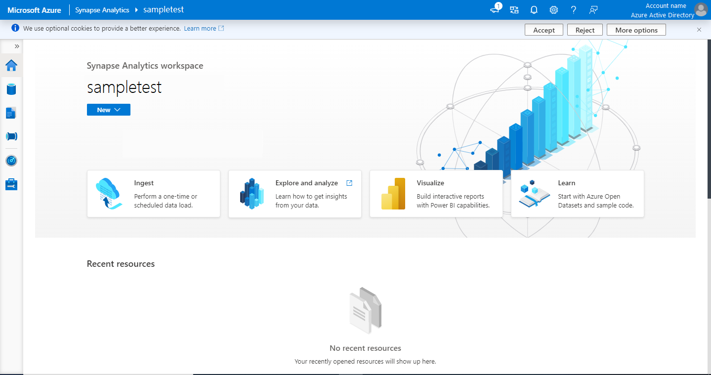
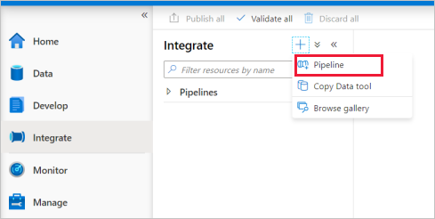
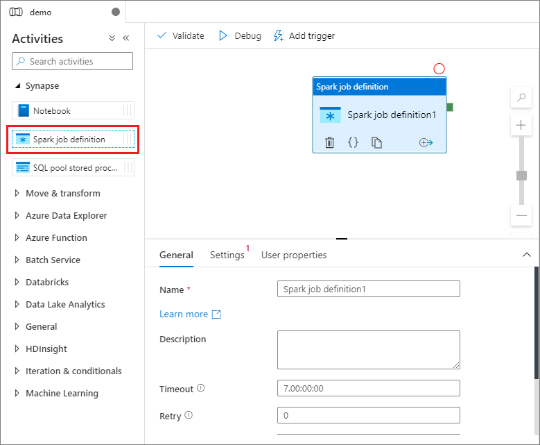
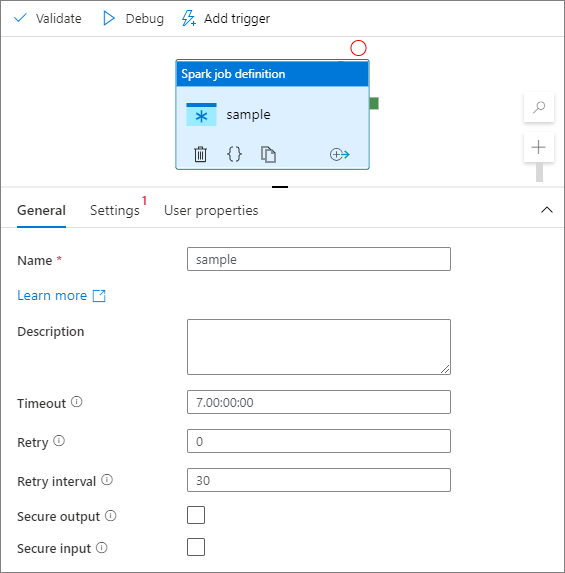
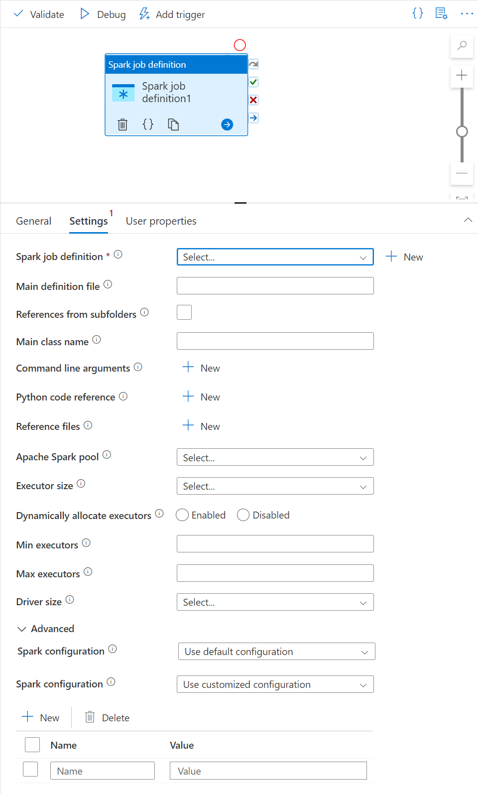
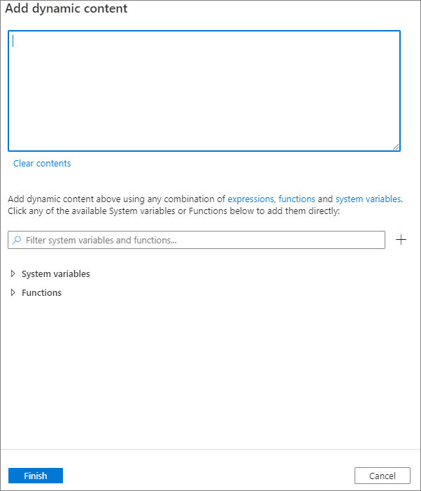

# Quickstart: Transform data using Apache Spark job definition.

In this quickstart, you'll use Azure Synapse Analytics to create a pipeline using Apache Spark job definition.

## Prerequisites

* **Azure subscription**: If you don't have an Azure subscription, create a [free account](https://azure.microsoft.com/free/) before you begin.
* **Azure Synapse workspace**: Create a Synapse workspace using the Azure portal following the instructions in [Quickstart: Create a Synapse workspace](quickstart-create-workspace.md).
* **Apache Spark job definition**: Create an Apache Spark job definition in the Synapse workspace following the instructions in [Tutorial: Create Apache Spark job definition in Synapse Studio](spark/apache-spark-job-definitions.md).

### Navigate to the Synapse Studio

After your Azure Synapse workspace is created, you have two ways to open Synapse Studio:

* Open your Synapse workspace in the [Azure portal](https://ms.portal.azure.com/#home). Select **Open** on the Open Synapse Studio card under Getting started.
* Open [Azure Synapse Analytics](https://web.azuresynapse.net/) and sign in to your workspace.

In this quickstart, we use the workspace named "sampletest" as an example. It will automatically navigate you to the Synapse Studio home page.

## Create a pipeline with an Apache Spark job definition

A pipeline contains the logical flow for an execution of a set of activities. In this section, you'll create a pipeline that contains an Apache Spark job definition activity.

1. Go to the **Integrate** tab. Select the plus icon next to the pipelines header and select **Pipeline**.

     

2. In the **Properties** settings page of the pipeline, enter **demo** for **Name**.

3. Under **Synapse* in the **Activities** pane, drag **Spark job definition** onto the pipeline canvas.

     

## Set Apache Spark job definition canvas

Once you create your Apache Spark job definition, you'll be automatically sent to the Spark job definition canvas.

### General settings

1. Select the spark job definition module on the canvas.

2. In the **General** tab, enter **sample** for **Name**.

3. (Option) You can also enter a description.

4. Timeout: Maximum amount of time an activity can run. Default is seven days, which is also the maximum amount of time allowed. Format is in D.HH:MM:SS.

5. Retry: Maximum number of retry attempts.

6. Retry interval: The number of seconds between each retry attempt.

7. Secure output: When checked, output from the activity won't be captured in logging.

8. Secure input: When checked, input from the activity won't be captured in logging.

     

### Settings tab 

On this panel, you can reference to the Spark job definition to run.

* Expand the Spark job definition list, you can choose an existing Apache Spark job definition. You can also create a new Apache Spark job definition by selecting the **New** button to reference the Spark job definition to be run.

* You can add command-line arguments by clicking the **New** button. It should be noted that adding command-lin arguments will override the command-line arguments defined by the Spark job definition.   *Sample: `abfss://…/path/to/shakespeare.txt` `abfss://…/path/to/result`*  

     

* You can add dynamic content by clicking the **Add Dynamic Content** button or by pressing the shortcut key <kbd>Alt</kbd>+<kbd>Shift</kbd>+<kbd>D</kbd>. In the **Add Dynamic Content** page, you can use any combination of expressions, functions, and system variables to add to dynamic content.

     

### User properties tab

You can add properties for Apache Spark job definition activity in this panel.

## Next steps

Advance to the following articles to learn about Azure Synapse Analytics support:

> [!div class="nextstepaction"]
> [Pipeline and activities](../data-factory/concepts-pipelines-activities.md?bc=%2fazure%2fsynapse-analytics%2fbreadcrumb%2ftoc.json&toc=%2fazure%2fsynapse-analytics%2ftoc.json)
> [Mapping data flow overview](../data-factory/concepts-data-flow-overview.md?bc=%2fazure%2fsynapse-analytics%2fbreadcrumb%2ftoc.json&toc=%2fazure%2fsynapse-analytics%2ftoc.json)
> [Data flow expression language](../data-factory/data-flow-expression-functions.md?bc=%2fazure%2fsynapse-analytics%2fbreadcrumb%2ftoc.json&toc=%2fazure%2fsynapse-analytics%2ftoc.json)