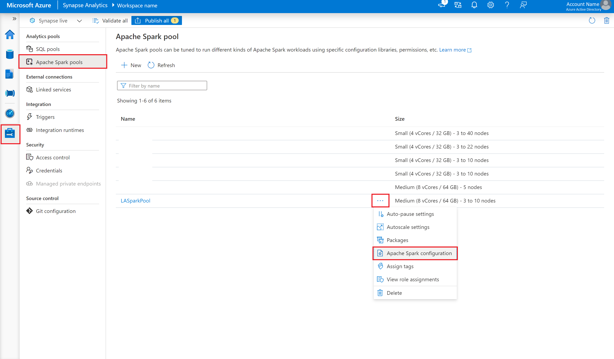
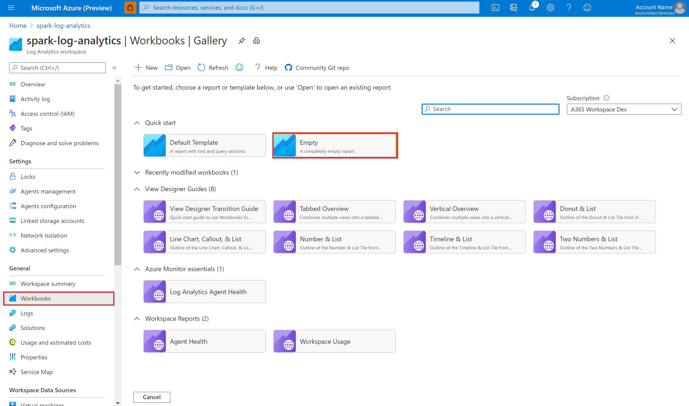
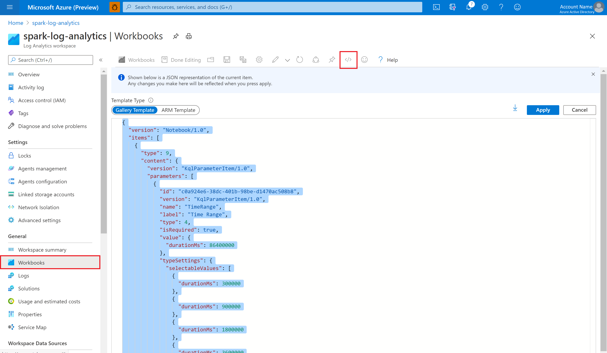
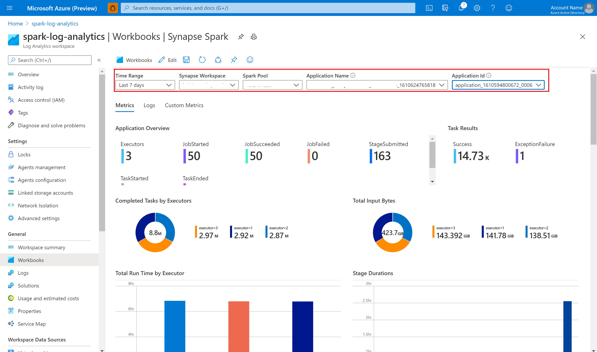
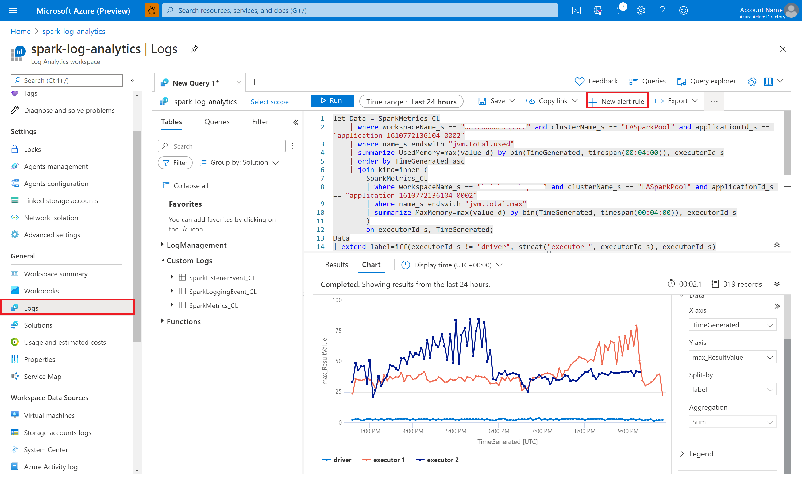

# Tutorial: Use Azure Log Analytics to collect and visualize metrics and logs (Preview)

## Overview

In this tutorial, you will learn how to enable the Synapse built-in Azure Log Analytics connector for collecting and sending the Apache Spark application metrics and logs to your [Azure Log Analytics workspace](/azure/azure-monitor/logs/quick-create-workspace). You can then leverage an Azure monitor workbook to visualize the metrics and logs.

## Configure Azure Log Analytics Workspace information in Synapse Studio

### Step 1: Create an Azure Log Analytics workspace

You can follow below documents to create a Log Analytics workspace:
- [Create a Log Analytics workspace in the Azure portal](https://docs.microsoft.com/azure/azure-monitor/logs/quick-create-workspace)
- [Create a Log Analytics workspace with Azure CLI](https://docs.microsoft.com/azure/azure-monitor/logs/quick-create-workspace-cli)
- [Create and configure a Log Analytics workspace in Azure Monitor using PowerShell](https://docs.microsoft.com/azure/azure-monitor/logs/powershell-workspace-configuration)

### Step 2: Prepare a Spark configuration file

#### Option 1. Configure with Azure Log Analytics Workspace ID and Key 

Copy the following Spark configuration, save it as **"spark_loganalytics_conf.txt"** and fill the parameters:
   - `<LOG_ANALYTICS_WORKSPACE_ID>`: Azure Log Analytics workspace id.
   - `<LOG_ANALYTICS_WORKSPACE_KEY>`: Azure Log Analytics key: **Azure portal > Azure Log Analytics workspace > Agents management > Primary key**

```properties
spark.synapse.logAnalytics.enabled true
spark.synapse.logAnalytics.workspaceId <LOG_ANALYTICS_WORKSPACE_ID>
spark.synapse.logAnalytics.secret <LOG_ANALYTICS_WORKSPACE_KEY>
```

#### Option 2. Configure with an Azure Key Vault

> [!NOTE]
>
> You need to grant read secret permission to the users who will submit Spark applications. Please see [provide access to Key Vault keys, certificates, and secrets with an Azure role-based access control](https://docs.microsoft.com/azure/key-vault/general/rbac-guide)

To configure an Azure Key Vault to store the workspace key, follow the steps:

1. Create and navigate to your key vault in the Azure portal
2. On the Key Vault settings pages, select **Secrets**.
3. Click on **Generate/Import**.
4. On the **Create a secret** screen choose the following values:
   - **Name**: Type a name for the secret, type `"SparkLogAnalyticsSecret"` as default.
   - **Value**: Type the **<LOG_ANALYTICS_WORKSPACE_KEY>** for the secret.
   - Leave the other values to their defaults. Click **Create**.
5. Copy the following Spark configuration, save it as **"spark_loganalytics_conf.txt"** and fill the parameters:
   - `<LOG_ANALYTICS_WORKSPACE_ID>`: Azure Log Analytics workspace id.
   - `<AZURE_KEY_VAULT_NAME>`: The Azure Key Vault name you configured.
   - `<AZURE_KEY_VAULT_SECRET_KEY_NAME>` (Optional): The secret name in the Azure Key Vault for workspace key, default: "SparkLogAnalyticsSecret".

```properties
spark.synapse.logAnalytics.enabled true
spark.synapse.logAnalytics.workspaceId <LOG_ANALYTICS_WORKSPACE_ID>
spark.synapse.logAnalytics.keyVault.name <AZURE_KEY_VAULT_NAME>
spark.synapse.logAnalytics.keyVault.key.secret <AZURE_KEY_VAULT_SECRET_KEY_NAME>
```

> [!NOTE]
>
> You can also store the Log Analytics workspace id to Azure Key vault. Please refer to the above steps and store the workspace id with secret name `"SparkLogAnalyticsWorkspaceId"`. Or use the config `spark.synapse.logAnalytics.keyVault.key.workspaceId` to specify the workspace id secret name in Azure Key vault.

#### Option 3. Configure with an Azure Key Vault linked service

> [!NOTE]
>
> You need to grant read secret permission to the Synapse workspace. Please see [provide access to Key Vault keys, certificates, and secrets with an Azure role-based access control](articles/key-vault/general/rbac-guide.md)

To configure an Azure Key Vault linked service in Synapse Studio to store the workspace key, follow the steps:

1. Follow all the steps in the `Option 2. Configure with an Azure Key Vault` section.
2. Create an Azure Key vault linked service in Synapse Studio:
   - Navigate to **Synapse Studio > Manage > Linked services**, click **New** button.
   - Search **Azure Key Vault** in the search box.
   - Type a name for the linked service.
   - Choose your Azure key vault. Click **Create**.
3. Add a `spark.synapse.logAnalytics.keyVault.linkedServiceName` item to Spark configuration.

```properties
spark.synapse.logAnalytics.enabled true
spark.synapse.logAnalytics.workspaceId <LOG_ANALYTICS_WORKSPACE_ID>
spark.synapse.logAnalytics.keyVault.name <AZURE_KEY_VAULT_NAME>
spark.synapse.logAnalytics.keyVault.key.secret <AZURE_KEY_VAULT_SECRET_KEY_NAME>
spark.synapse.logAnalytics.keyVault.linkedServiceName <LINKED_SERVICE_NAME>
```

#### Available Spark Configuration

| Configuration Name                                  | Default Value                | Description                                                                                                                                                                                                |
| --------------------------------------------------- | ---------------------------- | ---------------------------------------------------------------------------------------------------------------------------------------------------------------------------------------------------------- |
| spark.synapse.logAnalytics.enabled                  | false                        | To enable the Azure Log Analytics sink for the Spark applications, true. Otherwise, false.                                                                                                                  |
| spark.synapse.logAnalytics.workspaceId              | -                            | The destination Azure Log Analytics workspace ID                                                                                                                                                          |
| spark.synapse.logAnalytics.secret                   | -                            | The destination Azure Log Analytics workspace secret.                                                                                                                                                      |
| spark.synapse.logAnalytics.keyVault.linkedServiceName   | -                            | Azure Key vault linked service name for the Azure Log Analytics workspace ID and key                                                                                                                       |
| spark.synapse.logAnalytics.keyVault.name            | -                            | Azure Key vault name for the Azure Log Analytics ID and key                                                                                                                                                |
| spark.synapse.logAnalytics.keyVault.key.workspaceId | SparkLogAnalyticsWorkspaceId | Azure Key vault secret name for the Azure Log Analytics workspace ID                                                                                                                                       |
| spark.synapse.logAnalytics.keyVault.key.secret      | SparkLogAnalyticsSecret      | Azure Key vault secret name for the Azure Log Analytics workspace key                                                                                                                                      |
| spark.synapse.logAnalytics.keyVault.uriSuffix       | ods.opinsights.azure.com     | The destination Azure Log Analytics workspace [URI suffix][uri_suffix]. If your Azure Log Analytics Workspace is not in Azure global, you need to update the URI suffix according to the respective cloud. |

> [!NOTE]  
> - For Azure China clouds, the "spark.synapse.logAnalytics.keyVault.uriSuffix" parameter should be "ods.opinsights.azure.cn". 
> - For Azure Gov clouds, the "spark.synapse.logAnalytics.keyVault.uriSuffix" parameter should be "ods.opinsights.azure.us". 

[uri_suffix]: https://docs.microsoft.com/azure/azure-monitor/logs/data-collector-api#request-uri


### Step 3: Upload your Spark configuration to a Spark pool
You can upload the configuration file to your Synapse Spark pool in Synapse Studio.
   - Navigate to your Apache Spark pool in the Azure Synapse Studio (Manage -> Apache Spark pools)
   - Click the **"..."** button on the right of your Apache Spark pool
   - Select Apache Spark configuration 
   - Click **Upload** and choose the **"spark_loganalytics_conf.txt"** created.
   - Click **Upload** and **Apply**.



> [!NOTE] 
>
> All the Spark application submitted to the Spark pool above will use the configuration setting to push the Spark application metrics and logs to your specified Azure Log Analytics workspace.

## Submit a Spark application and view the logs and metrics in Azure Log Analytics

 1) You can submit a Spark application to the Spark pool configured in the previous step, using one of the following ways:
    - Run a Synapse Studio notebook. 
    - Submit a Synapse Apache Spark batch job through Spark job definition.
    - Run a Pipeline that contains Spark activity.

 2) Go to the specified Azure Log Analytics Workspace, then view the application metrics and logs when the Spark application starts to run.

## Use the Sample Azure Log Analytics Workbook to visualize the metrics and logs

1. [Download the workbook](https://aka.ms/SynapseSparkLogAnalyticsWorkbook) here.
2. Open and **Copy** the workbook file content.
3. Navigate to Azure Log Analytics workbook ([Azure portal](https://portal.azure.com/) > Log Analytics workspace > Workbooks)
4. Open the **"Empty"** Azure Log Analytics Workbook, in **"Advanced Editor"** mode (press the </> icon).
5. **Paste** over any json that exists.
6. Then Press **Apply** then **Done Editing**.





Then, submit your Apache Spark application to the configured Spark pool. After the application goes to running state, choose the running application in the workbook dropdown list.



And you can customize the workbook by Kusto query and configure alerts.



## Sample Kusto queries

1. Query Spark events example.

   ```kusto
   SparkListenerEvent_CL
   | where workspaceName_s == "{SynapseWorkspace}" and clusterName_s == "{SparkPool}" and livyId_s == "{LivyId}"
   | order by TimeGenerated desc
   | limit 100 
   ```

2. Query Spark application driver and executors logs example.

   ```kusto
   SparkLoggingEvent_CL
   | where workspaceName_s == "{SynapseWorkspace}" and clusterName_s == "{SparkPool}" and livyId_s == "{LivyId}"
   | order by TimeGenerated desc
   | limit 100
   ```

3. Query Spark metrics example.

   ```kusto
   SparkMetrics_CL
   | where workspaceName_s == "{SynapseWorkspace}" and clusterName_s == "{SparkPool}" and livyId_s == "{LivyId}"
   | where name_s endswith "jvm.total.used"
   | summarize max(value_d) by bin(TimeGenerated, 30s), executorId_s
   | order by TimeGenerated asc
   ```

## Create and manage alerts using Azure Log Analytics

Azure Monitor alerts allow users to use a Log Analytics query to evaluate metrics and logs every set frequency, and fire an alert based on the results.

For more information, see [Create, view, and manage log alerts using Azure Monitor](https://docs.microsoft.com/azure/azure-monitor/alerts/alerts-log).

## Limitation

 - Azure Synapse Analytics workspace with [managed virtual network](articles/synapse-analytics/security/synapse-workspace-managed-vnet.md) enabled is not supported.
 - The following regions are not yet supported:
   - East US 2
   - Norway East
   - UAE North

## Next steps

 - Learn how to [Use serverless Apache Spark pool in Synapse Studio](https://docs.microsoft.com/azure/synapse-analytics/quickstart-create-apache-spark-pool-studio).
 - Learn how to [Run a Spark application in notebook](https://docs.microsoft.com/azure/synapse-analytics/spark/apache-spark-development-using-notebooks).
 - Learn how to [Create Apache Spark job definition in Synapse Studio](https://docs.microsoft.com/azure/synapse-analytics/spark/apache-spark-job-definitions).