# Create, develop, and maintain Synapse notebooks in Azure Synapse Analytics

A Synapse notebook is a web interface for you to create files that contain live code, visualizations, and narrative text. Notebooks are a good place to validate ideas and use quick experiments to get insights from your data. Notebooks are also widely used in data preparation, data visualization, machine learning, and other Big Data scenarios.

With a Synapse notebook, you can:

* Get started with zero setup effort.
* Keep data secure with built-in enterprise security features.
* Analyze data across raw formats (CSV, txt, JSON, etc.), processed file formats (parquet, Delta Lake, ORC, etc.), and SQL tabular data files against Spark and SQL.
* Be productive with enhanced authoring capabilities and built-in data visualization.

This article describes how to use notebooks in Synapse Studio.

## Preview of the new notebook experience
Synapse team brought the new notebooks component into Synapse Studio to provide consistent notebook experience for Microsoft customers and maximize discoverability, productivity, sharing, and collaboration. The new notebook experience is ready for preview. Check the **Preview Features** button in notebook toolbar to turn it on. The table below captures feature comparison between existing notebook (so called "classical notebook") with the new preview one.  

|Feature|Classical Notebook|Preview Notebook|
|--|--|--|
|%run| Not supported | &#9745;|
|%history| Not supported |&#9745;|
|%load| Not supported |&#9745;|
|%%html| Not supported |&#9745;|
|Drag and drop to move a cell| Not supported |&#9745;|
|Outline (Table of Content)| Not supported |&#9745;|
|Variable explorer| Not supported |&#9745;|
|Format text cell with toolbar buttons|&#9745;| Not available |
|Undo cell operation| &#9745;| &#9745;|
|Comment cell operation| Not supported | &#9745;|


## Create a notebook

There are two ways to create a notebook. You can create a new notebook or import an existing notebook to a Synapse workspace from the **Object Explorer**. Synapse notebooks recognize standard Jupyter Notebook IPYNB files.


## Develop notebooks

Notebooks consist of cells, which are individual blocks of code or text that can be run independently or as a group.

### Add a cell

There are multiple ways to add a new cell to your notebook.

# [Classical Notebook](#tab/classical)

1. Expand the upper left **+ Cell** button, and select **Add code cell** or **Add text cell**.

    

2. Hover over the space between two cells and select **Add code** or **Add text**.

    

3. Use [Shortcut keys under command mode](#shortcut-keys-under-command-mode). Press **A** to insert a cell above the current cell. Press **B** to insert a cell below the current cell.


# [Preview Notebook](#tab/preview)

1. Expand the upper left **+ Cell** button, and select **code cell** or **Markdown cell**.
    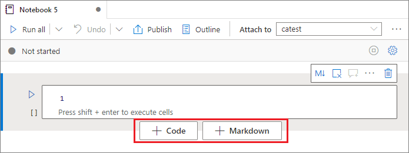
2. Select the plus sign at the beginning of a cell and select **Code cell** or **Markdown cell**.

    

3. Use [aznb Shortcut keys under command mode](#shortcut-keys-under-command-mode). Press **A** to insert a cell above the current cell. Press **B** to insert a cell below the current cell.

---

### Set a primary language

Synapse notebooks support four Apache Spark languages:

* pySpark (Python)
* Spark (Scala)
* SparkSQL
* .NET for Apache Spark (C#)

You can set the primary language for new added cells from the dropdown list in the top command bar.

   

### Use multiple languages

You can use multiple languages in one notebook by specifying the correct language magic command at the beginning of a cell. The following table lists the  magic commands to switch cell languages.

|Magic command |Language | Description |  
|---|------|-----|
|%%pyspark| Python | Execute a **Python** query against Spark Context.  |
|%%spark| Scala | Execute a **Scala** query against Spark Context.  |  
|%%sql| SparkSQL | Execute a **SparkSQL** query against Spark Context.  |
|%%csharp | .NET for Spark C# | Execute a **.NET for Spark C#** query against Spark Context. |

The following image is an example of how you can write a PySpark query using the **%%pyspark** magic command or a SparkSQL query with the **%%sql** magic command in a **Spark(Scala)** notebook. Notice that the primary language for the notebook is set to pySpark.

   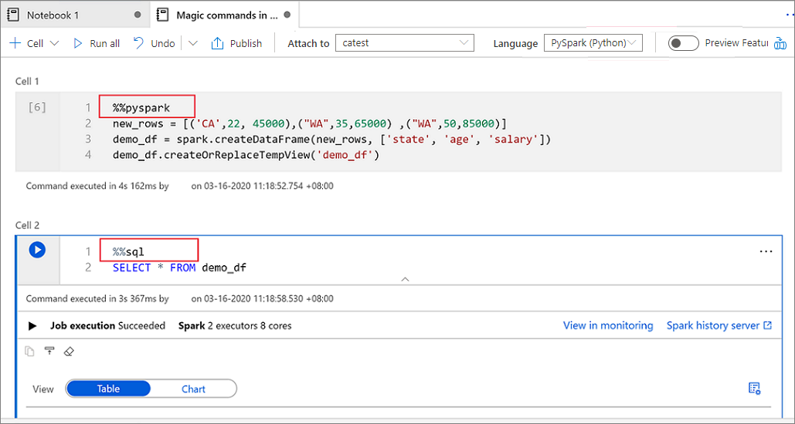

### Use temp tables to reference data across languages

You cannot reference data or variables directly across different languages in a Synapse notebook. In Spark, a temporary table can be referenced across languages. Here is an example of how to read a `Scala` DataFrame in `PySpark` and `SparkSQL` using a Spark temp table as a workaround.

1. In Cell 1, read a DataFrame from a SQL pool connector using Scala and create a temporary table.

   ```scala
   %%scala
   val scalaDataFrame = spark.read.sqlanalytics("mySQLPoolDatabase.dbo.mySQLPoolTable")
   scalaDataFrame.createOrReplaceTempView( "mydataframetable" )
   ```

2. In Cell 2, query the data using Spark SQL.
   
   ```sql
   %%sql
   SELECT * FROM mydataframetable
   ```

3. In Cell 3, use the data in PySpark.

   ```python
   %%pyspark
   myNewPythonDataFrame = spark.sql("SELECT * FROM mydataframetable")
   ```

### IDE-style IntelliSense

Synapse notebooks are integrated with the Monaco editor to bring IDE-style IntelliSense to the cell editor. Syntax highlight, error marker, and automatic code completions help you to write code and identify issues quicker.

The IntelliSense features are at different levels of maturity for different languages. Use the following table to see what's supported.

|Languages| Syntax Highlight | Syntax Error Marker  | Syntax Code Completion | Variable Code Completion| System Function Code Completion| User Function Code Completion| Smart Indent | Code Folding|
|--|--|--|--|--|--|--|--|--|
|PySpark (Python)|Yes|Yes|Yes|Yes|Yes|Yes|Yes|Yes|
|Spark (Scala)|Yes|Yes|Yes|Yes|-|-|-|Yes|
|SparkSQL|Yes|Yes|-|-|-|-|-|-|
|.NET for Spark (C#)|Yes|Yes|Yes|Yes|Yes|Yes|Yes|Yes|

>[!Note]
> An active Spark session is required to benefit the Variable Code Completion, System Function Code Completion，User Function Code Completion for .NET for Spark (C#).

### Code Snippets

Synapse notebooks provide code snippets that make it easier to enter common used code patterns, such as configuring your Spark session, reading data as a Spark DataFrame, or drawing charts with matplotlib etc.

Snippets appear in [IntelliSense](#ide-style-intellisense) mixed with other suggestions. The code snippets contents align with the code cell language. You can see available snippets by typing **Snippet** or any keywords appear in the snippet title in the code cell editor. For example, by typing **read** you can see the list of snippets to read data from various data sources.


### Format text cell with toolbar buttons

# [Classical Notebook](#tab/classical)

You can use the format buttons in the text cells toolbar to do common markdown actions. It includes bolding text, italicizing text, inserting code snippets, inserting unordered list, inserting ordered list and inserting image from URL.

  

# [Preview Notebook](#tab/preview)

Format button toolbar is not available for the preview notebook experience yet. 

---

### Undo cell operations

# [Classical Notebook](#tab/classical)

Select the **Undo** button or press **Ctrl+Z** to revoke the most recent cell operations. Now you can undo up to the latest 20 historical cell operations. 

   

# [Preview Notebook](#tab/preview)

Select the **Undo** button or press **Z** to revoke the most recent cell operations. Now you can undo up to the latest 10 historical cell operations.

   

Supported undo cell operations:
+ Insert/Delete cell: You could revoke the delete operations by selecting **Undo**, the text content will be kept along with the cell.
+ Reorder cell.
+ Toggle parameter.
+ Convert between Code cell and Markdown cell.

> [!NOTE]
> In-cell text operations and comment operations are not undoable.


---

### Comment a cell

# [Classical Notebook](#tab/classical)

Not supported.

# [Preview Notebook](#tab/preview)

We support comment on code cell in Preview Notebook for now.

1. Select **Comments** button on the notebook toolbar to open **Comments** pane.

   

2. Select code in the code cell, click **New** in the **Comments** pane, add comments then click **Post comment** button to save.

   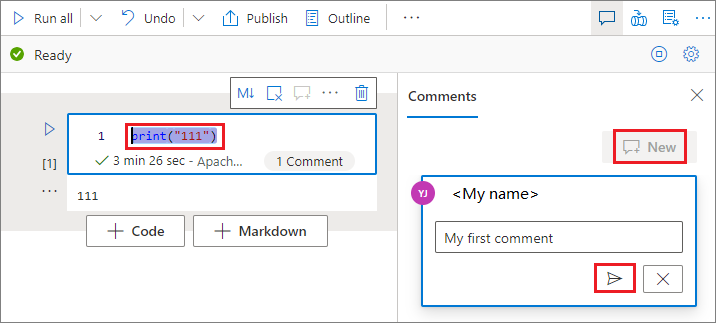

3. You could perform **Edit comment**, **Resolve thread**, or **Delete thread** by clicking the **More** button besides your comment. 

   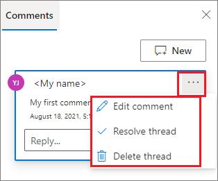

> [!NOTE]
>  If a cell is deleted, its comments will be deleted and could not be revoked by **Redo** operation. 


---


### Move a cell

# [Classical Notebook](#tab/classical)

Select the ellipses (...) to access the other cell actions menu at the far right. Then select **Move cell up** or **Move cell down** to move the current cell. 

You can also use [shortcut keys under command mode](#shortcut-keys-under-command-mode). Press **Ctrl+Alt+↑** to move up the current cell. Press **Ctrl+Alt+↓** to move the current cell down.

   

# [Preview Notebook](#tab/preview)

Click on the left-hand side of a cell and drag it to the desired position. 
    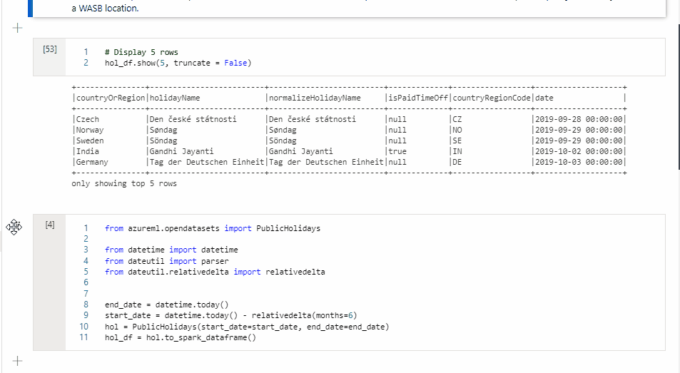

---

### Delete a cell

# [Classical Notebook](#tab/classical)

To delete a cell, select the ellipses (...) to access the other cell actions menu at the far right then select **Delete cell**. 

You can also use [shortcut keys under command mode](#shortcut-keys-under-command-mode). Press **D,D** to delete the current cell.
  
   

# [Preview Notebook](#tab/preview)

To delete a cell, select the delete button at the right hand of the cell. 

You can also use [shortcut keys under command mode](#shortcut-keys-under-command-mode). Press **Shift+D** to delete the current cell. 

   

---

### Collapse a cell input

# [Classical Notebook](#tab/classical)

Select the arrow button at the bottom of the current cell to collapse it. To expand it, select the arrow button while the cell is collapsed.

   

# [Preview Notebook](#tab/preview)

Select the **More commands** ellipses (...) on the cell toolbar and **input** to collapse current cell's input. To expand it, Select the **input hidden** while the cell is collapsed.

   

---

### Collapse a cell output

# [Classical Notebook](#tab/classical)

Select the **collapse output** button at the upper left of the current cell output to collapse it. To expand it, select the **Show cell output** while the cell output is collapsed.

   

# [Preview Notebook](#tab/preview)

Select the **More commands** ellipses (...) on the cell toolbar and **output** to collapse current cell's output. To expand it, select the same button while the cell's output is hidden.

   


---

### Notebook outline

# [Classical Notebook](#tab/classical)

Not supported.

# [Preview Notebook](#tab/preview)

The Outlines (Table of Contents) presents the first markdown header of any markdown cell in a sidebar window for quick navigation. The Outlines sidebar is resizable and collapsible to fit the screen in the best ways possible. You can select the **Outline** button on the notebook command bar to open or hide sidebar

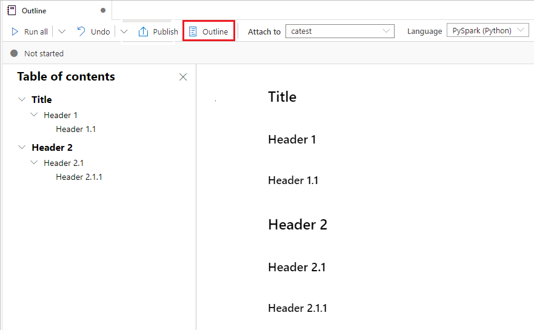

---


## Run notebooks

You can run the code cells in your notebook individually or all at once. The status and progress of each cell is represented in the notebook.

### Run a cell

There are several ways to run the code in a cell.

1. Hover on the cell you want to run and select the **Run Cell** button or press **Ctrl+Enter**.

   
  
2. Use [Shortcut keys under command mode](#shortcut-keys-under-command-mode). Press **Shift+Enter** to run the current cell and select the cell below. Press **Alt+Enter** to run the current cell and insert a new cell below.

---

### Run all cells
Select the **Run All** button to run all the cells in current notebook in sequence.

   


### Run all cells above or below

# [Classical Notebook](#tab/classical)

To Access the other cell actions menu at the far right, select the ellipses (**...**). Then, select **Run cells above** to run all the cells above the current in sequence. Select **Run cells below** to run all the cells below the current in sequence.

   

# [Preview Notebook](#tab/preview)

Expand the dropdown list from **Run all** button, then select **Run cells above** to run all the cells above the current in sequence. Select **Run cells below** to run all the cells below the current in sequence.

   

---

### Cancel all running cells

# [Classical Notebook](#tab/classical)
Select the **Cancel All** button to cancel the running cells or cells waiting in the queue. 
    

# [Preview Notebook](#tab/preview)

Select the **Cancel All** button to cancel the running cells or cells waiting in the queue. 
    

---


### Notebook reference

# [Classical Notebook](#tab/classical)

Not supported.

# [Preview Notebook](#tab/preview)

You can use ```%run <notebook path>``` magic command to reference another notebook within current notebook's context. All the variables defined in the reference notebook are available in the current notebook. ```%run``` magic command supports nested calls but not support recursive calls. You will receive an exception if the statement depth is larger than five.  ```%run``` command currently only supports to pass a notebook path as parameter. 

Example: ``` %run /path/notebookA ```.

Notebook reference works in both interactive mode and Synapse pipeline.

> [!NOTE]
> The referenced notebooks are required to be published. You need to publish the notebooks to reference them. Synapse Studio does not recognize the unpublished notebooks from the Git repo. 
>

---

### Variable explorer

# [Classical Notebook](#tab/classical)

Not supported.

# [Preview Notebook](#tab/preview)

Synapse notebook provides a built-in variables explorer for you to see the list of the variables name, type, length, and value in the current Spark session for PySpark (Python) cells. More variables will show up automatically as they are defined in the code cells. Clicking on each column header will sort the variables in the table.

You can select the **Variables** button on the notebook command bar to open or hide the variable explorer.

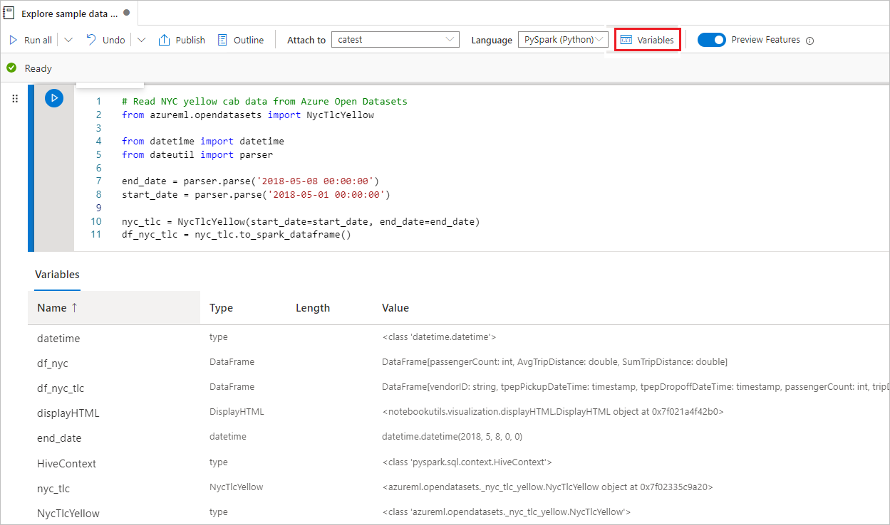


---

### Cell status indicator

A step-by-step cell execution status is displayed beneath the cell to help you see its current progress. Once the cell run is complete, an execution summary with the total duration and end time are shown and kept there for future reference.


### Spark progress indicator

Synapse notebook is purely Spark based. Code cells are executed on the serverless Apache Spark pool remotely. A Spark job progress indicator is provided with a real-time progress bar appears to help you understand the job execution status.
The number of tasks per each job or stage help you to identify the parallel level of your spark job. You can also drill deeper to the Spark UI of a specific job (or stage) via selecting the link on the job (or stage) name.


### Spark session config

You can specify the timeout duration, the number, and the size of executors to give to the current Spark session in **Configure session**. Restart the Spark session is for configuration changes to take effect. All cached notebook variables are cleared.

[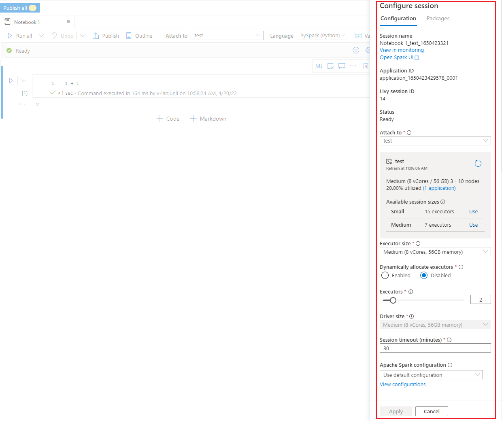](./media/apache-spark-development-using-notebooks/synapse-azure-notebook-spark-session-management.png#lightbox)

#### Spark session config magic command
You can also specify spark session settings via a magic command **%%configure**. The spark session needs to restart to make the settings effect. We recommend you to run the **%%configure** at the beginning of your notebook. Here is a sample, refer to https://github.com/cloudera/livy#request-body for full list of valid parameters. 

```json
%%configure
{
    // refer to https://github.com/cloudera/livy#request-body for a list of valid parameters to config the session.
    "driverMemory":"2g",
    "driverCores":3,
    "executorMemory":"2g",
    "executorCores":2,
    "jars":["myjar1.jar","myjar.jar"],
    "conf":{
        "spark.driver.maxResultSize":"10g"
    }
}
```
> [!NOTE]
> - You can use Spark session config magic command in Synapse pipelines. It only takes effect when it's called in the top level. The %%configure used in referenced notebook is going to be ignored.
> - The Spark configuration properties has to be used in the "conf" body. We do not support top level reference for the Spark configuration properties.
>

## Bring data to a notebook

You can load data from Azure Blob Storage, Azure Data Lake Store Gen 2, and SQL pool as shown in the code samples below.

### Read a CSV from Azure Data Lake Store Gen2 as a Spark DataFrame

```python
from pyspark.sql import SparkSession
from pyspark.sql.types import *
account_name = "Your account name"
container_name = "Your container name"
relative_path = "Your path"
adls_path = 'abfss://%s@%s.dfs.core.windows.net/%s' % (container_name, account_name, relative_path)

df1 = spark.read.option('header', 'true') \
                .option('delimiter', ',') \
                .csv(adls_path + '/Testfile.csv')

```

#### Read a CSV from Azure Blob Storage as a Spark DataFrame

```python

from pyspark.sql import SparkSession

# Azure storage access info
blob_account_name = 'Your account name' # replace with your blob name
blob_container_name = 'Your container name' # replace with your container name
blob_relative_path = 'Your path' # replace with your relative folder path
linked_service_name = 'Your linked service name' # replace with your linked service name

blob_sas_token = mssparkutils.credentials.getConnectionStringOrCreds(linked_service_name)

# Allow SPARK to access from Blob remotely

wasb_path = 'wasbs://%s@%s.blob.core.windows.net/%s' % (blob_container_name, blob_account_name, blob_relative_path)

spark.conf.set('fs.azure.sas.%s.%s.blob.core.windows.net' % (blob_container_name, blob_account_name), blob_sas_token)
print('Remote blob path: ' + wasb_path)

df = spark.read.option("header", "true") \
            .option("delimiter","|") \
            .schema(schema) \
            .csv(wasbs_path)
```

### Read data from the primary storage account

You can access data in the primary storage account directly. There's no need to provide the secret keys. In Data Explorer, right-click on a file and select **New notebook** to see a new notebook with data extractor autogenerated.


## IPython Widgets


# [Classical Notebook](#tab/classical)

Not supported.

# [Preview Notebook](#tab/preview)

Widgets are eventful python objects that have a representation in the browser, often as a control like a slider, textbox etc. IPython Widgets only works in Python environment, it's not supported in other languages (e.g. Scala, SQL, C#) yet. 

### To use IPython Widget
1. You need to import `ipywidgets` module first to use the Jupyter Widget framework.
   ```python
   import ipywidgets as widgets
   ```
2. You can use top-level `display` function to render a widget, or leave a expression of **widget** type at the last line of code cell.
   ```python
   slider = widgets.IntSlider()
   display(slider)
   ```

   ```python
   slider = widgets.IntSlider()
   slider
   ```
   
3. Run the cell, the widget will display at the output area.

   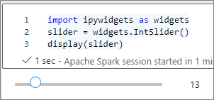

4. You can use multiple `display()` calls to render the same widget instance multiple times, but they will remain in sync with each other.

   ```python
   slider = widgets.IntSlider()
   display(slider)
   display(slider)
   ```

   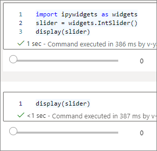

5. To render two widgets independent of each other, create two widget instances:

   ```python
   slider1 = widgets.IntSlider()
   slider2 = widgets.IntSlider()
   display(slider1)
   display(slider2)
   ```


### Supported widgets

|Widgets Type|Widgets|
|--|--|
|Numeric widgets|IntSlider, FloatSlider, FloatLogSlider, IntRangeSlider, FloatRangeSlider, IntProgress, FloatProgress, BoundedIntText, BoundedFloatText, IntText, FloatText|
|Boolean widgets|ToggleButton, Checkbox, Valid|
|Selection widgets|Dropdown, RadioButtons, Select, SelectionSlider, SelectionRangeSlider, ToggleButtons, SelectMultiple|
|String Widgets|Text, Text area, Combobox, Password, Label, HTML, HTML Math, Image, Button|
|Play (Animation) widgets|Date picker, Color picker, Controller|
|Container/Layout widgets|Box, HBox, VBox, GridBox, Accordion, Tabs, Stacked|


### Know issue

The following widgets are not supported yet, you could follow workaround as below:

|Functionality|Workaround|
|--|--|
|`Output` widget|You can use `print()` function instead to write text into stdout.|
|`widgets.jslink()`|You can use `widgets.link()` function to link two similar widgets.|
|`FileUpload` widget| Not support yet.|


---


## Save notebooks

You can save a single notebook or all notebooks in your workspace.

1. To save changes you made to a single notebook, select the **Publish** button on the notebook command bar.

   

2. To save all notebooks in your workspace, select the **Publish all** button on the workspace command bar. 

   

In the notebook properties, you can configure whether to include the cell output when saving.

   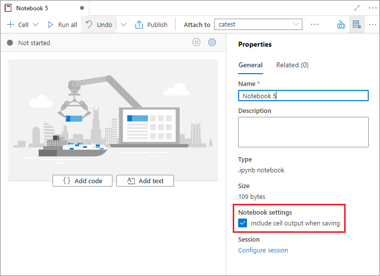

## Magic commands
You can use familiar Jupyter magic commands in Synapse notebooks. Review the following list as the current available magic commands. Tell us [your use cases on GitHub](https://github.com/MicrosoftDocs/azure-docs/issues/new) so that we can continue to build out more magic commands to meet your needs.

> [!NOTE]
> Only following magic commands are supported in Synapse pipeline : %%pyspark, %%spark, %%csharp, %%sql. 
>
>

# [Classical Notebook](#tab/classical)

Available line magics:
[%lsmagic](https://ipython.readthedocs.io/en/stable/interactive/magics.html#magic-lsmagic), [%time](https://ipython.readthedocs.io/en/stable/interactive/magics.html#magic-time), [%timeit](https://ipython.readthedocs.io/en/stable/interactive/magics.html#magic-timeit)

Available cell magics:
[%%time](https://ipython.readthedocs.io/en/stable/interactive/magics.html#magic-time), [%%timeit](https://ipython.readthedocs.io/en/stable/interactive/magics.html#magic-timeit), [%%capture](https://ipython.readthedocs.io/en/stable/interactive/magics.html#cellmagic-capture), [%%writefile](https://ipython.readthedocs.io/en/stable/interactive/magics.html#cellmagic-writefile), [%%sql](#use-multiple-languages), [%%pyspark](#use-multiple-languages), [%%spark](#use-multiple-languages), [%%csharp](#use-multiple-languages),[%%configure](#spark-session-config-magic-command)


# [Preview Notebook](#tab/preview)

Available line magics:
[%lsmagic](https://ipython.readthedocs.io/en/stable/interactive/magics.html#magic-lsmagic), [%time](https://ipython.readthedocs.io/en/stable/interactive/magics.html#magic-time), [%timeit](https://ipython.readthedocs.io/en/stable/interactive/magics.html#magic-timeit), [%history](https://ipython.readthedocs.io/en/stable/interactive/magics.html#magic-history), [%run](#notebook-reference), [%load](https://ipython.readthedocs.io/en/stable/interactive/magics.html#magic-load)

Available cell magics:
[%%time](https://ipython.readthedocs.io/en/stable/interactive/magics.html#magic-time), [%%timeit](https://ipython.readthedocs.io/en/stable/interactive/magics.html#magic-timeit), [%%capture](https://ipython.readthedocs.io/en/stable/interactive/magics.html#cellmagic-capture), [%%writefile](https://ipython.readthedocs.io/en/stable/interactive/magics.html#cellmagic-writefile), [%%sql](#use-multiple-languages), [%%pyspark](#use-multiple-languages), [%%spark](#use-multiple-languages), [%%csharp](#use-multiple-languages), [%%html](https://ipython.readthedocs.io/en/stable/interactive/magics.html#cellmagic-html), [%%configure](#spark-session-config-magic-command)

--- 

## Integrate a notebook

### Add a notebook to a pipeline

Select the **Add to pipeline** button on the upper right corner to add a notebook to an existing pipeline or create a new pipeline.


### Designate a parameters cell

# [Classical Notebook](#tab/classical)

To parameterize your notebook, select the ellipses (...) to access the other cell actions menu at the far right. Then select **Toggle parameter cell** to designate the cell as the parameters cell.


# [Preview Notebook](#tab/preview)

To parameterize your notebook, select the ellipses (...) to access the **more commands** at the cell toolbar. Then select **Toggle parameter cell** to designate the cell as the parameters cell.

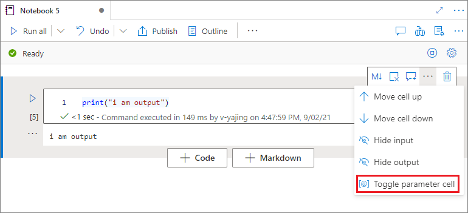

---

Azure Data Factory looks for the parameters cell and treats this cell as defaults for the parameters passed in at execution time. The execution engine will add a new cell beneath the parameters cell with input parameters in order to overwrite the default values. When a parameters cell isn't designated, the injected cell will be inserted at the top of the notebook.


### Assign parameters values from a pipeline

Once you've created a notebook with parameters, you can execute it from a pipeline with the Synapse Notebook activity. After you add the activity to your pipeline canvas, you will be able to set the parameters values under **Base parameters** section on the **Settings** tab. 


When assigning parameter values, you can use the [pipeline expression language](../../data-factory/control-flow-expression-language-functions.md) or [system variables](../../data-factory/control-flow-system-variables.md).


## Shortcut keys

Similar to Jupyter Notebooks,  Synapse notebooks have a modal user interface. The keyboard does different things depending on which mode the notebook cell is in. Synapse notebooks support the following two modes for a given code cell: command mode and edit mode.

1. A cell is in command mode when there is no text cursor prompting you to type. When a cell is in Command mode, you can edit the notebook as a whole but not type into individual cells. Enter command mode by pressing `ESC` or using the mouse to select outside of a cell's editor area.

   

2. Edit mode is indicated by a text cursor prompting you to type in the editor area. When a cell is in edit mode, you can type into the cell. Enter edit mode by pressing `Enter` or using the mouse to select on a cell's editor area.
   
   

### Shortcut keys under command mode

# [Classical Notebook](#tab/classical)

Using the following keystroke shortcuts, you can more easily navigate and run code in Synapse notebooks.

| Action |Synapse notebook Shortcuts  |
|--|--|
|Run the current cell and select below | Shift+Enter |
|Run the current cell and insert below | Alt+Enter |
|Select cell above| Up |
|Select cell below| Down |
|Insert cell above| A |
|Insert cell below| B |
|Extend selected cells above| Shift+Up |
|Extend selected cells below| Shift+Down|
|Move cell up| Ctrl+Alt+↑ |
|Move cell down| Ctrl+Alt+↓ |
|Delete selected cells| D, D |
|Switch to edit mode| Enter |

# [Preview Notebook](#tab/preview)

| Action |Synapse notebook Shortcuts  |
|--|--|
|Run the current cell and select below | Shift+Enter |
|Run the current cell and insert below | Alt+Enter |
|Run current cell| Ctrl+Enter |
|Select cell above| Up |
|Select cell below| Down |
|Select previous cell| K |
|Select next cell| J |
|Insert cell above| A |
|Insert cell below| B |
|Delete selected cells| Shift+D |
|Switch to edit mode| Enter |

---

### Shortcut keys under edit mode


Using the following keystroke shortcuts, you can more easily navigate and run code in Synapse notebooks when in Edit mode.

| Action |Synapse notebook shortcuts  |
|--|--|
|Move cursor up | Up |
|Move cursor down|Down|
|Undo|Ctrl + Z|
|Redo|Ctrl + Y|
|Comment/Uncomment|Ctrl + /|
|Delete word before|Ctrl + Backspace|
|Delete word after|Ctrl + Delete|
|Go to cell start|Ctrl + Home|
|Go to cell end |Ctrl + End|
|Go one word left|Ctrl + Left|
|Go one word right|Ctrl + Right|
|Select all|Ctrl + A|
|Indent| Ctrl +]|
|Dedent|Ctrl + [|
|Switch to command mode| Esc |

---

## Next steps
- [Check out Synapse sample notebooks](https://github.com/Azure-Samples/Synapse/tree/master/Notebooks)
- [Quickstart: Create an Apache Spark pool in Azure Synapse Analytics using web tools](../quickstart-apache-spark-notebook.md)
- [What is Apache Spark in Azure Synapse Analytics](apache-spark-overview.md)
- [Use .NET for Apache Spark with Azure Synapse Analytics](spark-dotnet.md)
- [.NET for Apache Spark documentation](/dotnet/spark)
- [Azure Synapse Analytics](../index.yml)
