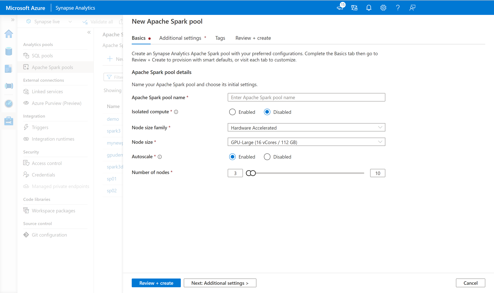

# GPU-accelerated Apache Spark pools in Azure Synapse Analytics
Azure Synapse Analytics now supports Apache Spark pools accelerated with graphics processing units (GPUs). 

By using NVIDIA GPUs, data scientists and engineers can reduce the time necessary to run data integration pipelines, score machine learning models, and more. This article describes how GPU-accelerated pools can be created and used with Azure Synapse Analytics. This article also details the GPU drivers and libraries that are pre-installed as part of the GPU-accelerated runtime.

> [!NOTE]
> Azure Synapse GPU-enabled pools are currently in Public Preview.

## Create a GPU-accelerated pool
To simplify the process for creating and managing pools, Azure Synapse takes care of pre-installing low-level libraries and setting up all the complex networking requirements between compute nodes. This integration allows users to get started with GPU- accelerated pools within just a few minutes. To learn more about how to create a GPU-accelerated pool, you can visit the quickstart on how to [create a GPU-accelerated pool](../quickstart-create-apache-gpu-pool-portal.md).

> [!NOTE]
>  - GPU-accelerated pools can be created in workspaces located in East US, Australia East, and North Europe.
>  - GPU-accelerated pools are only availble with the Apache Spark 3 runtime.
>  - You might need to request a [limit increase](./apache-spark-rapids-gpu.md#quotas-and-resource-constraints-in-azure-synapse-gpu-enabled-pools) in order to create GPU-enabled clusters. 

 
## GPU-accelerated runtime

### NVIDIA GPU driver, CUDA, and cuDNN
Azure Synapse Analytics now offers GPU-accelerated Apache Spark pools, which include various NVIDIA libraries and configurations. By default, Azure Synapse Analytics installs the NVIDIA driver and libraries required to use GPUs on Spark driver and worker instances:
 - CUDA 11.2
 - libnccl2=2.8.4
 - libnccl-dev=2.8.4
 - libcudnn8=8.1.1 
 - libcudnn8-dev=8.1.1

> [!NOTE]
> This software contains source code provided by NVIDIA Corporation. Specifically, to support the GPU-accelerated pools, Azure Synapse Apache Spark pools include code from [CUDA Samples](https://docs.nvidia.com/cuda/eula/#nvidia-cuda-samples-preface).

### NVIDIA End User License Agreement (EULA)
When you select a GPU-accelerated Hardware option in Synapse Spark, you implicitly agree to the terms and conditions outlined in the NVIDIA EULA with respect to:
  - CUDA 11.2: [EULA :: CUDA Toolkit Documentation (nvidia.com)](https://docs.nvidia.com/cuda/eula/index.html)
  - libnccl2=2.8.4: [nccl/LICENSE.txt at master · NVIDIA/nccl (github.com)](https://github.com/NVIDIA/nccl/blob/master/LICENSE.txt)
  - libnccl-dev=2.8.4: [nccl/LICENSE.txt at master · NVIDIA/nccl (github.com)](https://github.com/NVIDIA/nccl/blob/master/LICENSE.txt)
  - libcudnn8=8.1.1: [Software License Agreement :: NVIDIA Deep Learning cuDNN Documentation](https://docs.nvidia.com/deeplearning/cudnn/sla/index.html)
  - libcudnn8-dev=8.1.1: [Software License Agreement :: NVIDIA Deep Learning cuDNN Documentation](https://docs.nvidia.com/deeplearning/cudnn/sla/index.html)
  - The CUDA, NCCL, and cuDNN libraries, and the [NVIDIA End User License Agreement (with NCCL Supplement)](https://docs.nvidia.com/deeplearning/nccl/sla/index.html#overview) for the NCCL library

## Accelerate ETL workloads
With built-in support for NVIDIA’s [RAPIDS Accelerator for Apache Spark](https://nvidia.github.io/spark-rapids/), GPU-accelerated Spark pools in Azure Synapse can provide significant performance improvements compared to standard analytical benchmarks without requiring any code changes. Built on top of NVIDIA CUDA and UCX, NVIDIA RAPIDS enables GPU-accelerated SQL, DataFrame operations, and Spark shuffles. Since there are no code changes required to leverage these accelerations, users can also accelerate their data pipelines that rely on Linux Foundation’s Delta Lake or Microsoft’s Hyperspace indexing. 

To learn more about how you can use the NVIDIA RAPIDS Accelerator with your GPU-accelerated pool in Azure Synapse Analytics, visit this guide on how to [improve performance with RAPIDS](apache-spark-rapids-gpu.md).

## Improve machine learning scoring workloads
Many organizations rely on large batch scoring jobs to frequently execute during narrow windows of time. To achieve improve batch scoring jobs, you can also use GPU-accelerated Spark pools with Microsoft’s [Hummingbird library](https://github.com/Microsoft/hummingbird). With Hummingbird, users can take their traditional, tree-based ML models and compile them into tensor computations. Hummingbird allows users to then seamlessly leverage native hardware acceleration and neural network frameworks to accelerate their ML model scoring without needing to rewrite their models.  

## Next steps
- [Azure Synapse Analytics](../overview-what-is.md)
