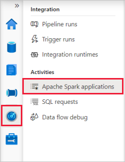
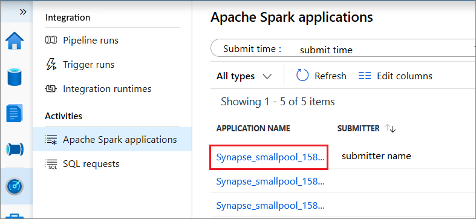
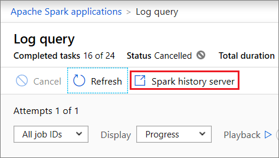
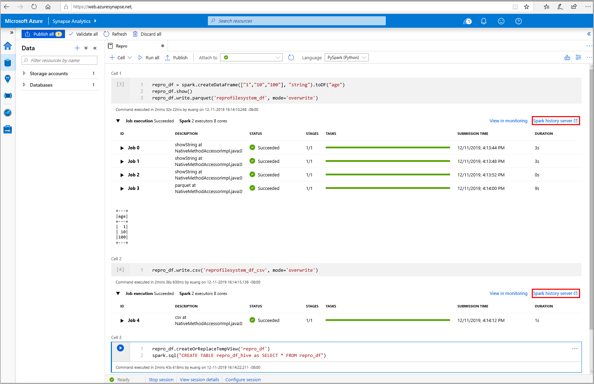
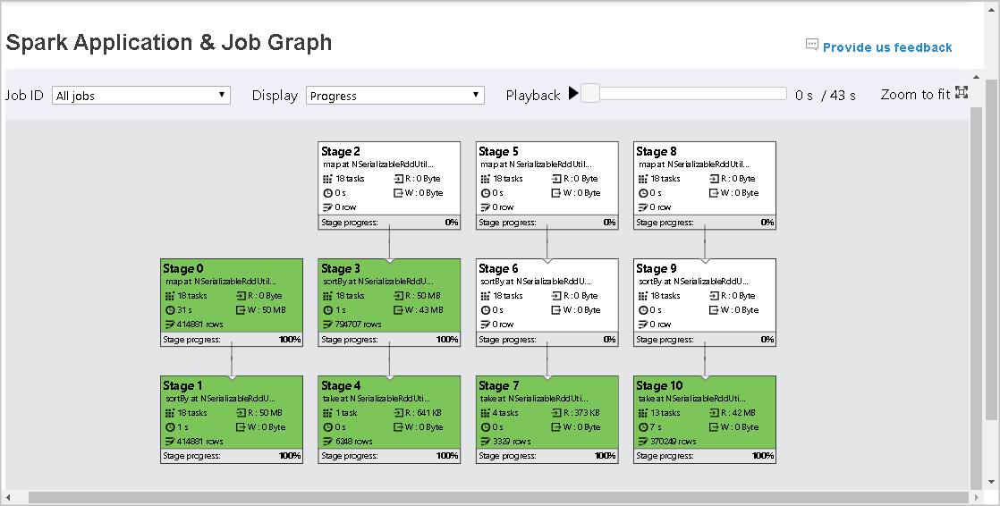
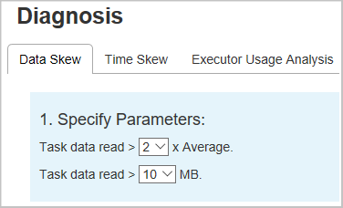
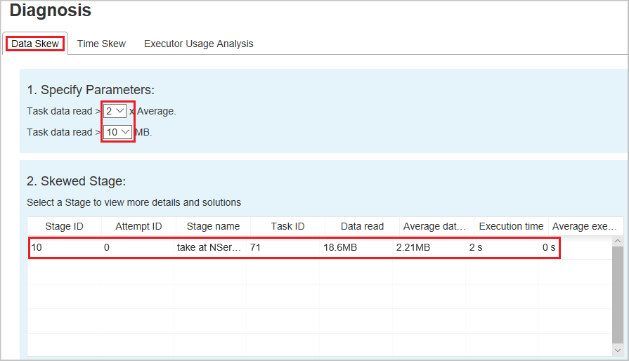

# Use extended Apache Spark history server to debug and diagnose Apache Spark applications

This article provides guidance on how to use the extended Apache Spark history server to debug and diagnose completed and running Spark applications.

The extension includes a data tab, graph tab, and diagnosis tab. Use the **Data** tab to check the input and output data of the Spark job. The **Graph** tab shows you the data flow and replay of the job graph. The **Diagnosis** tab shows you  **Data Skew**, **Time Skew**, and **Executor Usage Analysis**.

## Access the Apache Spark history server

Apache Spark history server is the web user interface for completed and running Spark applications. You can open the Apache Spark history server web interface from the Azure Synapse Analytics.

### Open the Spark History Server web UI from Apache spark applications node

1. Open [Azure Synapse Analytics](https://web.azuresynapse.net/).

2. Select **Monitor**, then select **Apache Spark Applications**.

    

3. Select an application, then open **Log query** by selecting it.

    

4. Select **Spark history server**, then the Spark History Server web UI will show up. For a running Spark application, the button is **Spark UI**.

    
    

### Open the Spark History Server web UI from Data node

1. From your Synapse Studio notebook, select **Spark history server** from the job execution output cell or from the status panel at the bottom of the notebook document. Select **Session details**.

   

2. Select **Spark history server** from the slide out panel.

   


## Graph tab in Apache Spark history server

Select the Job ID for the job you want to view. Then, select **Graph** on the tool menu to get the job graph view.

### Overview

You can see an overview of your job in the generated job graph. By default, the graph shows all jobs. You can filter this view by **Job ID**.


### Display

By default, the **Progress** display is selected. You can check the data flow by selecting **Read** or **Written** in the **Display** dropdown list.


The graph node displays the colors shown in the heatmap legend.


### Playback

To playback the job, select **Playback**. You can select **Stop** at any time to stop. The task colors show different statuses when playing back:

|Color|Meaning|
|-|-|
|Green|Succeeded: The job has completed successfully.|
|Orange|Retried: Instances of tasks that failed but do not affect the final result of the job. These tasks had duplicate or retry instances that may succeed later.|
|Blue|Running: The task is running.|
|White|Waiting or skipped: The task is waiting to run, or the stage has skipped.|
|Red|Failed: The task has failed.|

The following image shows Green, Orange, and Blue status colors.


The following image shows Green and White status colors.



The following image shows Red and Green status colors.


> [!NOTE]  
> Playback for each job is allowed. For incomplete jobs, playback is not supported.

### Zoom

Use your mouse scroll to zoom in and out on the job graph, or select **Zoom to fit** to make it fit to screen.


### Tooltips

Hover on graph node to see the tooltip when there are failed tasks, and select a stage to open its stage page.


On the job graph tab, stages have a tooltip and a small icon displayed if they have tasks that meet the following conditions:

|Condition|Description|
|-|-|
|Data skew|data read size > average data read size of all    tasks inside this stage * 2 and data read size > 10 MB|
|Time skew|execution time > average execution time of all    tasks inside this stage * 2 and execution time > 2 minutes|
   


### Graph node description

The job graph node displays the following information of each stage:

  * ID.
  * Name or description.
  * Total task number.
  * Data read: the sum of input size and shuffle read size.
  * Data write: the sum of output size and shuffle writes size.
  * Execution time: the time between start time of the first attempt and completion time of the last attempt.
  * Row count: the sum of input records, output records, shuffle read records and shuffle write records.
  * Progress.

    > [!NOTE]  
    > By default, the job graph node displays information from the last attempt of each stage (except for stage execution time). However, during playback, the graph node shows information of each attempt.
    >  
    > The data size of read and write is 1MB = 1000 KB = 1000 * 1000 Bytes.

### Provide feedback

Send feedback with issues by selecting **Provide us feedback**.


## Explore the Diagnosis tab in Apache Spark history server

To access the Diagnosis tab, select a job ID. Then select **Diagnosis** on the tool menu to get the job Diagnosis view. The diagnosis tab includes **Data Skew**, **Time Skew**, and **Executor Usage Analysis**.

Check the **Data Skew**, **Time Skew**, and **Executor Usage Analysis** by selecting the tabs respectively.



### Data Skew

When you select the **Data Skew** tab, the corresponding skewed tasks are displayed based on the specified parameters.

* **Specify Parameters** - The first section displays the parameters, which are used to detect Data Skew. The default rule is: Task Data Read is greater than three times of the average task data read, and the task data read is more than 10 MB. If you want to define your own rule for skewed tasks, you can choose your parameters. The **Skewed Stage** and **Skew Char** sections are refreshed accordingly.

* **Skewed Stage** - The second section displays stages, which have skewed tasks meeting the criteria specified above. If there is more than one skewed task in a stage, the skewed stage table only displays the most skewed task (for example, the largest data for data skew).

    

* **Skew Chart** – When a row in the skew stage table is selected, the skew chart displays more task distribution details based on data read and execution time. The skewed tasks are marked in red and the normal tasks are marked in blue. The chart displays up to 100 sample tasks, and the task details are displayed in right bottom panel.

    

### Time Skew

The **Time Skew** tab displays skewed tasks based on task execution time.

* **Specify Parameters** - The first section displays the parameters, which are used to detect Time Skew. The default criteria to detect time skew is: task execution time is greater than three times of average execution time and task execution time is greater than 30 seconds. You can change the parameters based on your needs. The **Skewed Stage** and **Skew Chart** display the corresponding stages and tasks information just like the **Data Skew** tab above.

* Select **Time Skew**, then filtered result is displayed in **Skewed Stage** section according to the parameters set in section **Specify Parameters**. Select one item in **Skewed Stage** section, then the corresponding chart is drafted in section3, and the task details are displayed in right bottom panel.

    

### Executor Usage Analysis

The Executor Usage Graph visualizes the Spark job executor's allocation and running status.  

1. Select **Executor Usage Analysis**, then four types curves about executor usage are drafted, including **Allocated Executors**, **Running Executors**, **Idle Executors**, and **Max Executor Instances**. For allocated executors, each "Executor added" or "Executor removed" event increases or decreases the allocated executors. You can check "Event Timeline" in the "Jobs" tab for more comparison.

   

2. Select the color icon to select or unselect the corresponding content in all drafts.

    

### Trouble shooting guide for 404 in Spark UI 

In some cases, for long-running Spark applications with massive jobs and stages, when opening Spark UI, it may fail with the following page show up:


As a workaround, an extra Spark configuration can be applied to the Spark pool: 
```
spark.synapse.history.rpc.memoryNeeded 1g 
```


For existing running Spark applications, in Spark UI page, add this query string at the end of the browser’s address bar: **?feature.enableStandaloneHS=false**


## Known issues

Input/output data using Resilient Distributed Datasets (RDDs) doesn't show in the data tab.

## Next steps

- [Azure Synapse Analytics](../overview-what-is.md)
- [.NET for Apache Spark documentation](/dotnet/spark)

