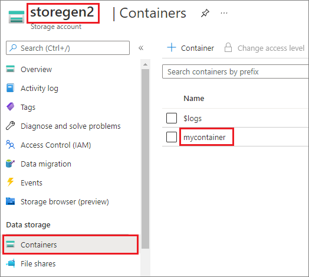
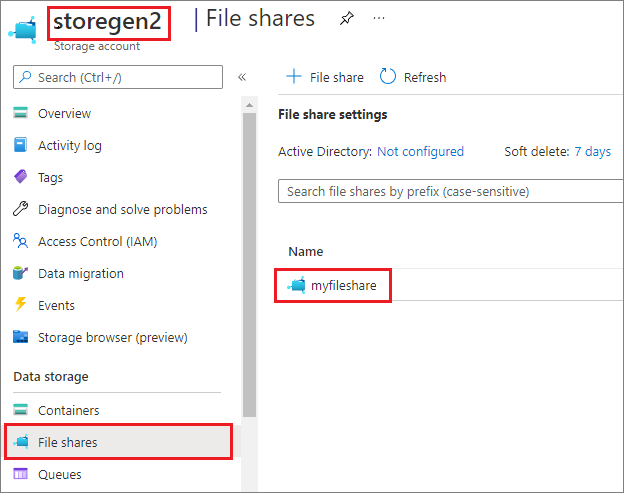

# Introduction to file mount/unmount APIs in Azure Synapse Analytics 

The Azure Synapse Studio team built two new mount/unmount APIs in the Microsoft Spark Utilities (MSSparkUtils) package. You can use these APIs to attach remote storage (Azure Blob Storage or Azure Data Lake Storage Gen2) to all working nodes (driver node and worker nodes). After the storage is in place, you can use the local file API to access data in storage as if it's in the local file system. For more information, see [Introduction to Microsoft Spark Utilities](microsoft-spark-utilities.md).

The article shows you how to use mount/unmount APIs in your workspace. You'll learn: 

+ How to mount Data Lake Storage Gen2 or Blob Storage.
+ How to access files under the mount point via the local file system API. 
+ How to access files under the mount point by using the `mssparktuils fs` API. 
+ How to access files under the mount point by using the Spark Read API.
+ How to unmount the mount point.
 
> [!WARNING]
> Azure file-share mounting is temporarily disabled. You can use Data Lake Storage Gen2 or Azure Blob Storage mounting instead, as described in the next section.
>
> Azure Data Lake Storage Gen1 storage is not supported. You can migrate to Data Lake Storage Gen2 by following the [migration gudiance](../../storage/blobs/data-lake-storage-migrate-gen1-to-gen2-azure-portal.md) before using the mount APIs.


<a id="How-to-mount-Gen2/blob-Storage"></a>
## Mount storage

This section illustrates how to mount Data Lake Storage Gen2 step by step as an example. Mounting Blob Storage works similarly. 

The example assumes that you have one Data Lake Storage Gen2 account named `storegen2`. The account has one container named `mycontainer` that you want to mount to `/test` in your Spark pool. 



To mount the container called `mycontainer`, `mssparkutils` first needs to check whether you have the permission to access the container. Currently, Azure Synapse Analytics supports three authentication methods for the trigger mount operation: `linkedService`, `accountKey`, and `sastoken`. 

### Mount by using a linked service (recommended)

We recommend a trigger mount via linked service. This method avoids security leaks, because `mssparkutils` doesn't store any secret or authentication values itself. Instead, `mssparkutils` always fetches authentication values from the linked service to request blob data from remote storage. 


You can create a linked service for Data Lake Storage Gen2 or Blob Storage. Currently, Azure Synapse Analytics supports two authentication methods when you create a linked service: 

+ **Create a linked service by using an account key**

    

+ **Create a linked service by using a managed identity**

    

> [!NOTE]
> If you create a linked service by using a managed identity as authentication method, make sure that the workspace MSI file has the Storage Blob Data Contributor role of the mounted container. 
> 
> Always check the linked service connection to guarantee that the linked service is created successfully. 

After you create linked service successfully, you can easily mount the container to your Spark pool by using the following Python code: 

```python
mssparkutils.fs.mount( 
    "abfss://mycontainer@<accountname>.dfs.core.windows.net", 
    "/test", 
    {"linkedService":"mygen2account"} 
) 
``` 

> [!NOTE]   
> You might need to import `mssparkutils` if it's not available: 
> ```python
> From notebookutils import mssparkutils 
> ``` 
> We don't recommend that you mount a root folder, no matter which authentication method you use.


### Mount via shared access signature token or account key  

In addition to mounting through a linked service, `mssparkutils` supports explicitly passing an account key or [shared access signature (SAS)](/samples/azure-samples/storage-dotnet-sas-getting-started/storage-dotnet-sas-getting-started/) token as a parameter to mount the target. 

For security reasons, we recommend that you store account keys or SAS tokens in Azure Key Vault (as the following example screenshot shows). You can then retrieve them by using the `mssparkutil.credentials.getSecret` API. For more information, see [Manage storage account keys with Key Vault and the Azure CLI (legacy)](../../key-vault/secrets/overview-storage-keys.md).


 
Here's the sample code: 

```python 
from notebookutils import mssparkutils  

accountKey = mssparkutils.credentials.getSecret("MountKV","mySecret")  
mssparkutils.fs.mount(  
    "abfss://mycontainer@<accountname>.dfs.core.windows.net",  
    "/test",  
    {"accountKey":accountKey}
) 
``` 

> [!NOTE]
> For security reasons, don't store credentials in code.

<!---
## Mount Azure file shares
> [!WARNING]
> File-share mounting is temporarily disabled because of technical limitations. As a workaround, use a Data Lake Storage Gen2 or Blob Storage mount by following the preceding steps.

The following example assumes that you have a Data Lake Storage Gen2 storage account named `storegen2`. The account has one file share named `myfileshare`. You want to mount `myfileshare` to `/test` for your Spark pool.


 
A mounted Azure file share supports only the account key authentication method. The following code example mounts `myfileshare` to `/test`. The example reuses the Azure Key Vault settings of `MountKV`. 

```python 
from notebookutils import mssparkutils  

accountKey = mssparkutils.credentials.getSecret("MountKV","mySecret")  
mssparkutils.fs.mount(  
    "https://myfileshare@<accountname>.file.core.windows.net",  
    "/test",  
    {"accountKey":accountKey}  
) 
``` 

The example predefines the schema format of the source URL for the file share to `https://<filesharename>@<accountname>.file.core.windows.net`. We stored the account key in Key Vault. We retrieved the account key by using the `mssparkutil.credentials.getSecret` API instead of explicitly passing it to the mount API.    

## Access files under the mount point via the local file system API

After the mount runs successfully, you can access the data via the local file system API. The mount point must always be created under the `/synfs` folder of node, and it's scoped to the job/session level. 

For example, if you mount `mycontainer` to the `/test` folder, the created local mount point is `/synfs/{jobid}/test`. If you want to access the mount point via local `fs` APIs after a successful mount, the local path should be `/synfs/{jobid}/test`. 

The following example shows how it works: 

```python 
jobId = mssparkutils.env.getJobId() 
f = open(f"/synfs/{jobId}/test/myFile.txt", "a") 
f.write("Hello world.") 
f.close() 
``` 
--->

## Access files under the mount point by using the mssparktuils fs API 

The main purpose of the mount operation is to let customers access the data stored in a remote storage account by using a local file system API. You can also access the data by using the `mssparkutils fs` API with a mounted path as a parameter. The path format used here is a little different. 

Assume that you mounted the Data Lake Storage Gen2 container `mycontainer` to `/test` by using the mount API. When you access the data by using a local file system API, the path format is like this: 

`/synfs/{jobId}/test/{filename}`

When you want to access the data by using the `mssparkutils fs` API, the path format is like this: 

`synfs:/{jobId}/test/{filename}`

You can see that `synfs` is used as the schema in this case, instead of a part of the mounted path. 

The following three examples show how to access a file with a mount point path by using `mssparkutils fs`. In the examples, `49` is a Spark job ID that we got from calling `mssparkutils.env.getJobId()`. 

+ List directories:  

    ```python 
    mssparkutils.fs.ls("synfs:/49/test") 
    ``` 

+ Read file content: 

    ```python 
    mssparkutils.fs.head("synfs:/49/test/myFile.txt") 
    ``` 

+ Create a directory: 

    ```python 
    mssparkutils.fs.mkdirs("synfs:/49/test/newdir") 
    ``` 

## Access files under the mount point by using the Spark Read API 

You can also use the Spark Read API with a mounted path as a parameter to access the data after mounting. The path format here is the same when you use the `mssparkutils fs` API: 

`synfs:/{jobId}/test/{filename}`

<a id="read-file-from-a-mounted-gen2-storage-account"></a>
### Read a file from a mounted Data Lake Storage Gen2 storage account 

The following example assumes that a Data Lake Storage Gen2 storage account was already mounted, and then you read the file by using a mount path:

```python 
%%pyspark 

df = spark.read.load("synfs:/49/test/myFile.csv", format='csv') 
df.show() 
``` 

### Read a file from a mounted Blob Storage account 

If you mounted a Blob Storage account and want to access it by using `mssparkutils` or the Spark API, you need to explicitly configure the SAS token via Spark configuration before you try to mount the container by using the mount API: 

1. Update the Spark configuration as shown in the following code example if you want to access it by using `mssparkutils` or the Spark API after a trigger mount. You can bypass this step if you want to access the Spark configuration only by using a local file API after mounting.

    ```python 
    blob_sas_token = mssparkutils.credentials.getConnectionStringOrCreds("myblobstorageaccount") 

    spark.conf.set('fs.azure.sas.mycontainer.<blobStorageAccountName>.blob.core.windows.net', blob_sas_token) 
    ``` 

2. Create the link service `myblobstorageaccount` and mount the Blob Storage account by using the link service:

    ```python 
    %%spark 
    mssparkutils.fs.mount( 
        "wasbs://mycontainer@<blobStorageAccountName>.blob.core.windows.net", 
        "/test", 
        Map("linkedService" -> "myblobstorageaccount") 
    ) 
    ``` 

3. Mount the Blob Storage container, and then read the file by using a mount path through the local file API:

    ```python
        with open("/synfs/64/test/myFile.txt") as f:
        print(f.read())
    ```

4. Read the data from mounted Blob Storage container through the Spark Read API:

    ```python
    %%spark
    // mount blob storage container and then read file using mount path
    val df = spark.read.text("synfs:/49/test/myFile.txt")
    df.show()
    ```

## Unmount the mount point 

Use the following code to unmount your mount point (`/test` in this example): 

```python 
mssparkutils.fs.unmount("/test") 
``` 

## Known limitations

+ The `mssparkutils fs help` function hasn't added the description about the mount/unmount part yet. 

+ We plan to support an automatic unmount mechanism to remove the mount point when the application run finished. It's not implemented yet. If you want to unmount the mount point to release the disk space, you need to explicitly call unmount API in your code. Otherwise, the mount point will still exist in the node even after the application run finishes. 

+ Mounting a Data Lake Storage Gen1 storage account is not supported for now. 

## Next steps

- [Get started with Azure Synapse Analytics](../get-started.md)
- [Monitor your Synapse workspace](../get-started-monitor.md)
- [Introduction to Microsoft Spark Utilities](microsoft-spark-utilities.md)