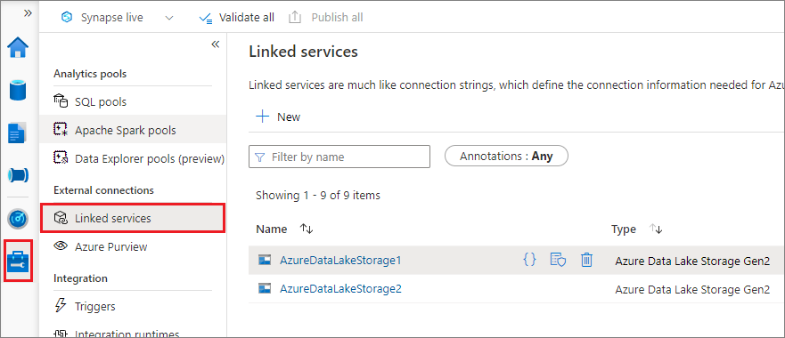
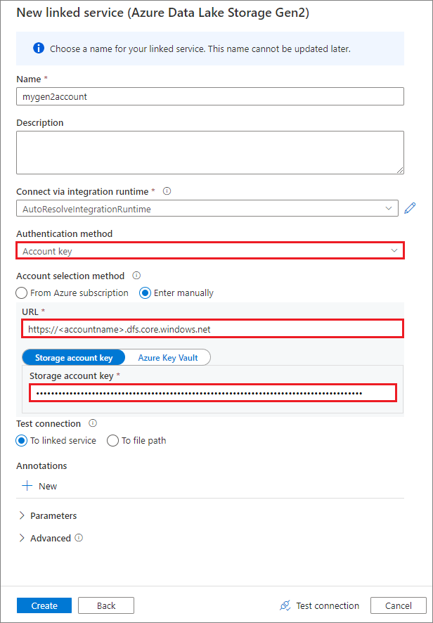

# How to use file mount/unmount API in Synapse 

Synapse studio team built two new mount/unmount APIs in the Microsoft Spark Utilities (MSSparkUtils) package, you can use mount to attach remote storage (Azure Blob Storage, Azure Data Lake Storage (ADLS) Gen2) to all working nodes (driver node and worker nodes). Once in place, you can access data in storage as if they were one the local file system with local file API. For more information, see [Introduction to Microsoft Spark Utilities](microsoft-spark-utilities.md).

The document will show you how to use mount/unmount API in your workspace, mainly includes below sections: 

+ How to mount Azure Data Lake Storage (ADLS) Gen2 or Azure Blob Storage
+ How to access files under mount point via local file system API 
+ How to access files under mount point using `mssparktuils` fs API 
+ How to access files under mount point using Spark Read API
+ How to unmount the mount point
 
> [!WARNING]
> + Azure Fileshare mount is temporarily disabled, you can use ADLS Gen2/blob mount following the [How to mount Gen2/blob Storage](#How-to-mount-Gen2/blob-Storage).
>
> + Azure Data Lake storage Gen1 storage is not supported, you can migrate to ADLS Gen2 following the [Migration gudiance](../../storage/blobs/data-lake-storage-migrate-gen1-to-gen2-azure-portal.md) before using mount APIs.


<a id="How-to-mount-Gen2/blob-Storage">
## How to mount storage

Here we will illustrate how to mount Azure Data Lake Storage (ADLS) Gen2 or Azure Blob Storage step by step as an example, mounting blob storage works similarly. 

Assuming you have one ADLS Gen2 account named `storegen2` and the account has one container name `mycontainer`, and you want to mount the `mycontainer` to `/test` of your Spark pool. 


To mount container `mycontainer`, `mssparkutils` need to check whether you have the permission to access the container at first, currently we support three authentication methods to trigger mount operation, **LinkedService**, **accountKey**, and **sastoken**. 

### Via Linked Service (recommend):

Trigger mount via linked Service is our recommend way, there won't have any security leak issue by this way, since `mssparkutils` doesn't store any secret/auth value itself, and it will always fetch auth value from linked service to request blob data from the remote storage. 



You can create linked service for ADLS Gen2 or blob storage. Currently, two authentication methods are supported when created linked service, one is using account key, another is using managed identity. 

+ **Create linked service using account key**
    

+ **Create linked service using Managed Identity**
    

> [!NOTE]
> + If you create linked service using managed identity as authentication method, please make sure that the workspace MSI has the Storage Blob Data Contributor role of the mounted container. 
> + Please always check the linked service connection to guarantee that the linked service is created successfully. 

After you create linked service successfully, you can easily mount the container to your Spark pool with below Python code. 

```python
mssparkutils.fs.mount( 
    "abfss://mycontainer@<accountname>.dfs.core.windows.net", 
    "/test", 
    {"linkedService":"mygen2account"} 
) 
``` 

**Notice**:   

+ You may need to import `mssparkutils` if it not available. 

    ```python
    From notebookutils import mssparkutils 
    ``` 
+ It's not recommended to mount a root folder, no matter which authentication method is used.


### Via Shared Access Signature Token or Account Key  

In addition to mount with linked service, `mssparkutils` also support explicitly passing account key or [SAS (shared access signature)](/samples/azure-samples/storage-dotnet-sas-getting-started/storage-dotnet-sas-getting-started/) token as parameter to mount the target. 

For security reasons, it is recommended to store Account key or SAS token in Azure Key Vaults (as the below example figure shows), then retrieving them with `mssparkutil.credentials.getSecret` API. For more information, see [Manage storage account keys with Key Vault and the Azure CLI (legacy)](../../key-vault/secrets/overview-storage-keys.md).


 
Here is the sample code. 

```python 
from notebookutils import mssparkutils  

accountKey = mssparkutils.credentials.getSecret("MountKV","mySecret")  
mssparkutils.fs.mount(  
    "abfss://mycontainer@<accountname>.dfs.core.windows.net",  
    "/test",  
    {"accountKey":accountKey}
) 
``` 

> [!Note]
> For security reasons, do not store credentials in code.

<!---
## How to mount Azure File Shares
> [!WARNING]
> Fileshare mount is temporarily disable due to tech limitation issue. Please using blob/gen2 mount following above steps as workaround.

Assuming you have a ADLS Gen2 storage account named `storegen2` and the account has one file share named `myfileshare`, and you want to mount the `myfileshare` to `/test` of your spark pool.

 
Mount azure file share only supports the account key authentication method, below is the code sample to mount **myfileshare** to `/test` and we reuse the Azure Key Value settings of `MountKV` here: 

```python 
from notebookutils import mssparkutils  

accountKey = mssparkutils.credentials.getSecret("MountKV","mySecret")  
mssparkutils.fs.mount(  
    "https://myfileshare@<accountname>.file.core.windows.net",  
    "/test",  
    {"accountKey":accountKey}  
) 
``` 

In the above example, we pre-defined the schema format of source URL for the file share to: `https://<filesharename>@<accountname>.file.core.windows.net`, and we stored the account key in AKV, and retrieving them with `mssparkutil.credentials.getSecret` API instead of explicitly passing it to the mount API. 

   

## How to access files under mount point via local file system API

Once the mount run successfully, you can access data via local file system API, while currently we limit the mount point always be created under **/synfs** folder of node and it was scoped to job/session level. 

So, for example if you mount `mycontainer` to `/test` folder, the created local mount point is `/synfs/{jobid}/test`, that means if you want to access mount point via local fs APIs after a successful mount, the local path used should be `/synfs/{jobid}/test` 

Below is an example to show how it works. 

```python 
jobId = mssparkutils.env.getJobId() 
f = open(f"/synfs/{jobId}/test/myFile.txt", "a") 
f.write("Hello world.") 
f.close() 
``` 
--->

## How to access files under mount point using mssparktuils fs API 

The main purpose of the mount operation is to let customer access the data stored in remote storage account using local file system API, you can also access data using `mssparkutils fs` API with mounted path as a parameter. The path format used here is a little different. 

Assuming you mounted to the ADLS Gen2 container `mycontainer` to `/test` using mount API. 

When you access the data using local file system API, as above section shared, the path format is like 

`/synfs/{jobId}/test/{filename}`

While when you want to access the data with `mssparkutils fs` API, the path format is like: 

`synfs:/{jobId}/test/{filename}`

You can see the `synfs` is used as schema in this case instead of a part of the mounted path. 

Below are three examples to show how to access file with mount point path using `mssparkutils fs`, while **49** is a Spark job ID we got from calling `mssparkutils.env.getJobId()`. 

+ List dirs:  

    ```python 
    mssparkutils.fs.ls("synfs:/49/test") 
    ``` 

+ Read file content: 

    ```python 
    mssparkutils.fs.head("synfs:/49/test/myFile.txt") 
    ``` 

+ Create directory: 

    ```python 
    mssparkutils.fs.mkdirs("synfs:/49/test/newdir") 
    ``` 

 

## How to access files under mount point using Spark Read API 

You can also use Spark read API with mounted path as parameter to access the data after mount as well, the path format here is same with the format of using `mssparkutils fs` API: 

`synfs:/{jobId}/test/{filename} `

Below are two code examples, one is for a mounted ADLS Gen2 storage, another for a mounted blob storage. 

<a id="read-file-from-a-mounted-gen2-storage-account"></a>
### Read file from a mounted ADLS Gen2 storage account 

The below example assumes an ADLS Gen2 storage was already mounted then read file using mount path.

```python 
%%pyspark 

# Assume a ADLS Gen2 storage was already mounted then read file using mount path 

df = spark.read.load("synfs:/49/test/myFile.csv", format='csv') 
df.show() 
``` 

### Read file from a mounted blob storage account 

Notice that if you mounted a blob storage account then want to access it using `mssparkutils` or Spark API, you need to explicitly configure the sas token via spark configuration at first before try to mount container using mount API. 

1. Update Spark configuration as below code example if you want to access it using `mssparkutils` or Spark API after trigger mount, you can bypass this step if you only want to access it using local file api after mount:

    ```python 
    blob_sas_token = mssparkutils.credentials.getConnectionStringOrCreds("myblobstorageaccount") 

    spark.conf.set('fs.azure.sas.mycontainer.<blobStorageAccountName>.blob.core.windows.net', blob_sas_token) 
    ``` 

2. Create link service `myblobstorageaccount` and mount blob storage account with link service:

    ```python 
    %%spark 
    mssparkutils.fs.mount( 
        "wasbs://mycontainer@<blobStorageAccountName>.blob.core.windows.net", 
        "/test", 
        Map("linkedService" -> "myblobstorageaccount") 
    ) 
    ``` 

3. Mount the blob storage container and then read file using mount path through the local file API:

    ```python
    # mount blob storage container and then read file using mount path
    with open("/synfs/64/test/myFile.txt") as f:
        print(f.read())
    ```

4. Read data from mounted blob storage through Spark read API:

    ```python
    %%spark
    // mount blob storage container and then read file using mount path
    val df = spark.read.text("synfs:/49/test/myFile.txt")
    df.show()
    ```

## How to unmount the mount point 

Unmount with your mount point, `/test` in our example: 

```python 
mssparkutils.fs.unmount("/test") 
``` 

## Known limitations

+ The `mssparkutils fs help` function hasn't added the description about mount/unmount part yet. 

+ In further, we will support auto unmount mechanism to remove the mount point when application run finished, currently it not implemented yet. If you want to unmount the mount point to release the disk space, you need to explicitly call unmount API in your code, otherwise, the mount point will still exist in the node even after the application run finished. 

+ Mounting ADLS Gen1 storage account is not supported for now. 

## Next steps

- [Get Started with Azure Synapse Analytics](../get-started.md)
- [Monitor your Synapse Workspace](../get-started-monitor.md)
- [Introduction to Microsoft Spark Utilities](microsoft-spark-utilities.md)