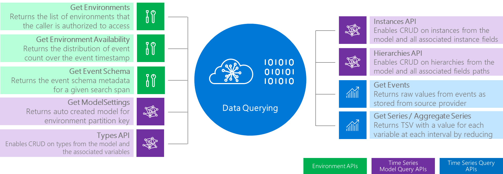

---
title: 'Querying Data - Azure Time Series Insights Gen2 | Microsoft Docs'
description: Data querying concepts and REST API overview in Azure Time Series Insights Gen2.
author: shreyasharmamsft
ms.author: shresha
manager: dpalled
ms.workload: big-data
ms.service: time-series-insights
services: time-series-insights
ms.topic: conceptual
ms.date: 10/01/2020
ms.custom: seodec18
---

# Querying Data from Azure Time Series Insights Gen2

Azure Time Series Insights Gen2 enables data querying on events and metadata stored in the environment via public surface APIs. These APIs also are used by the [Azure Time Series Insights TSI Explorer](./concepts-ux-panels.md).

Three primary API categories are available in Azure Time Series Insights Gen2:

* **Environment APIs**: These APIs enable queries on the Azure Time Series Insights Gen2 environment itself. These can be used to gather the list of environments the caller has access to and environment metadata.
* **Time Series Model-Query (TSM-Q) APIs**: Enables create, read, update, and delete (CRUD) operations on metadata stored in the Time Series Model of the environment. These can be used to access and edit the instances, types, and hierarchies.
* **Time Series Query (TSQ) APIs**: Enables retrieval of telemetry or events data as it's recorded from the source provider and enables performant computations and aggregations on the data using advanced scalar and aggregate functions.

Azure Time Series Insights Gen2 uses a rich string-based expression language, [Time Series Expression (TSX)](/rest/api/time-series-insights/reference-time-series-expression-syntax), for expressing calculations in [Time Series Variables](./concepts-variables.md).

## Azure Time Series Insights Gen2 APIs overview

The following core APIs are supported.

## Environment APIs

* [Get Environments API](/rest/api/time-series-insights/management(gen1/gen2)/accesspolicies/listbyenvironment): Returns the list of environments that the caller is authorized to access.
* [Get Environments Availability API](/rest/api/time-series-insights/dataaccessgen2/query/getavailability): Returns the distribution of event count over the event timestamp `$ts`. This API helps determine if there are any events in the environment by returning the count of events broken into intervals of time, if any exist.
* [Get Event Schema API](/rest/api/time-series-insights/dataaccessgen2/query/geteventschema): Returns the event schema metadata for a given search span. This API helps retrieve all metadata and properties available in the schema for the given search span.

## Time Series Model-Query (TSM-Q) APIs

Most of these APIs support batch execution operation to enable batch CRUD operations on multiple Time Series Model entities:

* [Model Settings API](/rest/api/time-series-insights/reference-model-apis): Enables *GET* and *PATCH* on the default type and the model name of the environment.
* [Types API](/rest/api/time-series-insights/reference-model-apis#types-api): Enables CRUD on Time Series types and their associated variables.
* [Hierarchies API](/rest/api/time-series-insights/reference-model-apis#hierarchies-api): Enables CRUD on Time Series hierarchies and their associated field paths.
* [Instances API](/rest/api/time-series-insights/reference-model-apis#instances-api): Enables CRUD on Time Series instances and their associated instance fields. Additionally, the Instances API supports the following operations:
  * [Search](/rest/api/time-series-insights/dataaccessgen2/timeseriesinstances/search): Retrieves a partial list of hits on search for time series instances based on instance attributes.
  * [Suggest](/rest/api/time-series-insights/dataaccessgen2/timeseriesinstances/suggest): Searches and suggests a partial list of hits on search for time series instances based on instance attributes.

## Time Series Query (TSQ) APIs

These APIs are available across both stores (Warm and Cold) in our multilayered storage solution. 

* [Get Events API](/rest/api/time-series-insights/dataaccessgen2/query/execute#getevents): Enables query and retrieval of raw events and the associated event timestamps as they're recorded in Azure Time Series Insights Gen2 from the source provider. This API allows retrieval of raw events for a given Time Series ID and search span. This API supports pagination to retrieve the complete response dataset for the selected input.

  > [!IMPORTANT]
  > As part of the [upcoming changes to JSON flattening and escaping rules](./ingestion-rules-update.md), arrays will be stored as **Dynamic** type. Payload properties stored as this type are **ONLY accessible through the Get Events API**.

* [Get Series API](/rest/api/time-series-insights/dataaccessgen2/query/execute#getseries): Enables query and retrieval of computed values and the associated event timestamps by applying calculations defined by variables on raw events. These variables can be defined in either the Time Series Model or provided inline in the query. This API supports pagination to retrieve the complete response dataset for the selected input.

* [Aggregate Series API](/rest/api/time-series-insights/dataaccessgen2/query/execute#aggregateseries): Enables query and retrieval of aggregated values and the associated interval timestamps by applying calculations defined by variables on raw events. These variables can be defined in either the Time Series Model or provided inline in the query. This API supports pagination to retrieve the complete response dataset for the selected input.
  
  For a specified search span and interval, this API returns an aggregated response per interval per variable for a Time Series ID. The number of intervals in the response dataset is calculated by counting epoch ticks (the number of milliseconds that have elapsed since Unix epoch - Jan 1st, 1970) and dividing the ticks by the interval span size specified in the query.

  The timestamps returned in the response set are of the left interval boundaries, not of the sampled events from the interval.

### Selecting Store Type

The above APIs can only execute against one of the two storage types (Cold or Warm) in a single call. Query URL parameters are used to specify the [store type](/rest/api/time-series-insights/dataaccessgen2/query/execute#uri-parameters) the query should execute on. 

If no parameter is specified, the query will be executed on Cold Store, by default. If a query spans a time range overlapping both Cold and Warm store, it is recommended to route the query to Cold store for the best experience since Warm store will only contain partial data. 

The [Azure Time Series Insights Explorer](./concepts-ux-panels.md) and [Power BI Connector](./how-to-connect-power-bi.md) make calls to the above APIs and will automatically select the correct storeType to parameter where relevant. 

## Next steps

* Read more about different variables that can be defined in the [Time Series Model](./concepts-model-overview.md).
* Read more about how to query data from the [Azure Time Series Insights Explorer](./concepts-ux-panels.md).