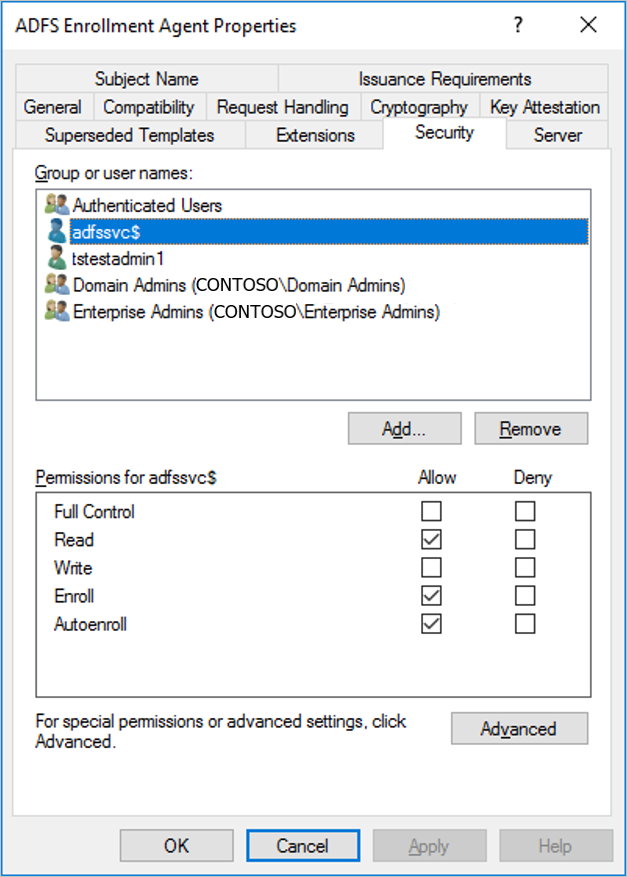
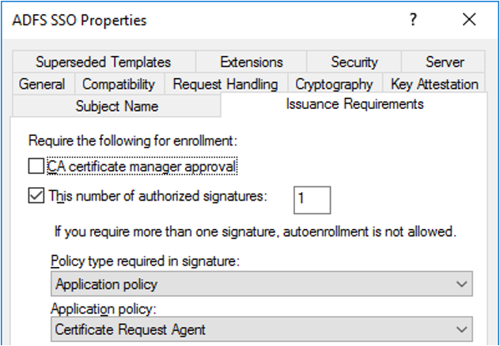
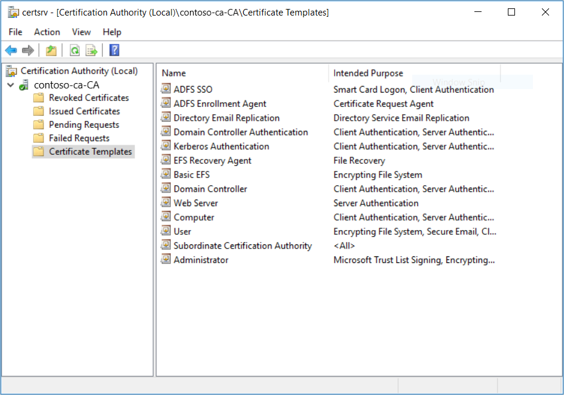

# Configure AD FS single sign-on for Windows Virtual Desktop
This article will walk you through the process of configuring Active Directory Federation Service (AD FS) single sign-on (SSO) for Windows Virtual Desktop.

> [!IMPORTANT]
> AD FS single sign-on is currently in public preview.
> This preview version is provided without a service level agreement, and we don't recommend using it for production workloads. Certain features might not be supported or might have constrained capabilities.
> For more information, see [Supplemental Terms of Use for Microsoft Azure Previews](https://azure.microsoft.com/support/legal/preview-supplemental-terms/).

## Prerequisites
Before configuring AD FS single sign-on, you must have the following setup running in your environment:

- **Active Directory Certificate Services** - For the Active Directory Certificate Services role, make sure the servers running the role are domain-joined, have the latest Windows updates installed, and are configured as [enterprise certificate authorities](https://docs.microsoft.com/previous-versions/windows/it-pro/windows-server-2008-R2-and-2008/cc731183%28v%3dws.10%29).
- **Active Directory Federation Services (AD FS)** - The servers running this role must be domain-joined, have the latest Windows Updates installed, and running Windows Server 2016 or later. See this [federation tutorial](https://docs.microsoft.com/azure/active-directory/hybrid/tutorial-federation) to get started.
- **Web Application Proxy** - Recommended to secure the environment as a frontend to the AD FS servers. The servers running this role must have the latest Windows Updates installed, and running Windows Server 2016 or later. See this [Web Application Proxy guide](https://docs.microsoft.com/previous-versions/windows/it-pro/windows-server-2012-R2-and-2012/dn383662(v=ws.11)) to get started.
- **Azure AD Connect** - For the Azure Active Directory (AD) Connect role, your service must be configured in [federation mode](https://docs.microsoft.com/azure/active-directory/connect/active-directory-aadconnect-get-started-custom).
- **PowerShell** - [Set up your PowerShell environment](powershell-module.md) for Windows Virtual Desktop on the AD FS server.

## Supported clients

This feature is currently supported on the following Windows Virtual Desktop Clients.

- [Windows Desktop client](connect-windows-7-10.md)
- [Windows Store client](connect-microsoft-store.md)
- [Web client](connect-web.md)

## Configure the certificate authority to issue certificates

You must properly configure the following certificate templates so that AD FS can use SSO:

* Exchange Enrollment Agent (Offline Request) – AD FS uses the Exchange Enrollment Agent certificate template to request smart card logon certificates on the user's behalf. The smart card logon certificate template is the foundation of the smart card logon certificate.
* Smart card logon – AD FS will use this certificate template as the basis of the smart card logon certificate.

Once you create these certificate templates, you must enable them on the certificate authority so AD FS can request them.

### Configure the enrollment agent certificate template

Depending on your environment, you may already have configured an enrollment agent certificate template for other purposes like Windows Hello for Business, Logon certificates or VPN certificates. If so, you will need to modify it to support SSO. If not, you can create a new template.

To determine if you are already using an enrollment agent certificate template, run the following PowerShell command on the AD FS server and see if a value is returned. If it's empty, [create a new enrollment agent certificate template](#create-a-new-enrollment-agent-certificate-template). Otherwise, remember the name and [update an existing enrollment agent certificate template](#update-an-existing-enrollment-agent-certificate-template).

```powershell
  (Get-AdfsCertificateAuthority).EnrollmentAgentCertificateTemplateName
  ```

#### Create a new enrollment agent certificate template

1. On the certificate authority, run **mmc.exe** from the Start menu to launch the **Microsoft Management Console**.
2. Select **File...** > **Add/Remote Snap-in...** > **Certificate Templates** > **Add >** > **OK** to view the list of certificate templates.
3. Expand the **Certificate Templates**, right-click **Exchange Enrollment Agent (Offline Request)** and select **Duplicate Template**.
4. Select the **General** tab, then enter "ADFS Enrollment Agent" into the **Template display name** field. This will automatically set the template name to "ADFSEnrollmentAgent".
5. Select the **Security** tab, then select **Add...**.
6. Next, select **Object Types...**, then **Service Accounts**, and then **OK**.
7. Enter the service account name for AD FS and select **OK**.
     * In an isolated AD FS setup, the service account will be named `adfssvc$`.
     * If you setup AD FS via Azure AD Connect, the service account will be named `aadcsvc$`.
8. After the service account is added and is visible in the **Security** tab, select it in the **Group or user names** pane, select **Allow** for both "Enroll" and "Autoenroll" in the **Permissions for Authenticated Users** pane, then select **OK** to save.

    

#### Update an existing enrollment agent certificate template

1. On the certificate authority, run **mmc.exe** from the Start menu to launch the **Microsoft Management Console**.
2. Select **File...** > **Add/Remote Snap-in...** > **Certificate Templates** > **Add >** > **OK** to view the list of certificate templates.
3. Expand the **Certificate Templates**, double-click the template that corresponds to the one configured on the AD FS server. On the **General** tab, the template name should match the name you found above.
5. Select the **Security** tab, then select **Add...**.
6. Next, select **Object Types...**, then **Service Accounts**, and then **OK**.
7. Enter the service account name for AD FS and select **OK**.
     * In an isolated AD FS setup, the service account will be named `adfssvc$`.
     * If you setup AD FS via Azure AD Connect, the service account will be named `aadcsvc$`.
8. After the service account is added and is visible in the **Security** tab, select it in the **Group or user names** pane, select **Allow** for both "Enroll" and "Autoenroll" in the **Permissions for Authenticated Users** pane, then select **OK** to save.

### Configure the smart card logon certificate template for interactive logon

1. On the certificate authority, run **mmc.exe** from the Start menu to launch the **Microsoft Management Console**.
2. Select **File...** > **Add/Remote Snap-in...** > **Certificate Templates** > **Add** > **OK** to view the list of certificate templates.
3. Expand the **Certificate Templates**, right-click **Smartcard Logon** and select **Duplicate Template**.
4. Select the **General** tab, then enter "ADFS SSO" into the **Template display name** field. This will automatically set the template name to "ADFSSSO".
   > [!NOTE]
   > Since this certificate is requested on-demand, we recommend shortening the validity period to 8 hours and the renewal period to 1 hour.

5. Select the **Subject name** tab and then select **Supply in the request**. Accept the warning by clicking OK.
  
    [  ](media/adfs-sso-properties-subject-expanded.png#lightbox)

6. Select the **Issuance Requirements** tab.
7. Select **This number of authorized signatures** and enter the value of **1**.
   
    [  ](media/adfs-sso-properties-issuance-expanded.png#lightbox)

8. For **Application policy**, select **Certificate Request Agent**.
9.  Select the **Security** tab, then select **Add...**.
10. Select **Object Types...**, **Service Accounts**, and **OK**.
11. Enter the service account name for AD FS just like you did in the [Configure the enrollment agent certificate template](#configure-the-enrollment-agent-certificate-template) section.
     * In an isolated AD FS setup, the service account will be named `adfssvc$`.
     * If you setup AD FS via Azure AD Connect, the service account will be named `aadcsvc$`.

12. After the service account is added and is visible in the **Security** tab, select it in the **Group or user names** pane, select **Allow** for both "Enroll" and "Autoenroll", then select **OK** to save.

     

### Enable the new certificate templates on the certificate authority

1. On the certificate authority, launch **MMC** from the Start menu.
2. Select **File...** > **Add/Remove Snap-in...** > **Certification Authority** > **Add >** > **Finish** > and **OK** to view the Certification Authority.
3. Expand the Certification Authority on the left-hand pane and open **Certificate Templates**.
4. Right-click in the middle-pane with the list of certificate templates, select **New**, and select **Certificate Template to Issue**.
5. Select both **ADFS Enrollment Agent** and **ADFS SSO**, then select **OK**. You should see both templates in the middle-pane.
    

   > [!NOTE]
   > If you already have an enrollment agent certificate template configured, you may only need to add the ADFS SSO template.

## Configure the AD FS Servers

You must configure the AD FS servers to leverage the new certificate templates and set the relying-party trust to support SSO.

### Configure the certificate authority on your AD FS

On the AD FS VMs, run the following PowerShell command to configure AD FS to use the certificate templates defined above:
  
```powershell
Set-AdfsCertificateAuthority -EnrollmentAgentCertificateTemplate "ADFSEnrollmentAgent" -LogonCertificateTemplate "ADFSSSO" -EnrollmentAgent
```
 > [!NOTE]
 > If you already have an EnrollmentAgentCertificateTemplate configured, ensure you use the existing template name instead of ADFSEnrollmentAgent.

### Configure a relying-party trust on your AD FS

You must create a relying-party trust between your AD FS server and the Windows Virtual Desktop service so single sign-on certificate requests can be forwarded correctly to your domain environment.

When configuring AD FS single sign-on you must choose shared key or certificate:

- If you have a single AD FS server, you can choose shared key or certificate. 
- If you have multiple AD FS servers,  it's required to choose certificate.

The shared key or certificate used to generate the token to sign in to Windows must be stored securely in [Azure Key Vault](https://docs.microsoft.com/azure/key-vault/general/overview). You can store the secret in an existing Key Vault or deploy a new one. In either case, you must ensure to set the right access policy so the Windows Virtual Desktop service can access it.

The PowerShell script **ConfigureWVDSSO.ps1** available in the [PowerShell Gallery](https://www.powershellgallery.com/packages/ConfigureWVDSSO) will configure your AD FS server for the relying-party trust.

This script only has one required parameter:

- *ADFSAuthority* - This is the URL that resolves to your AD FS and uses "/adfs" as its suffix. For example, `https://adfs.contoso.com/adfs`.

### Configure AD FS single sign-on

> [!Note]
> You need the `$config` variable values to complete the next part of the instructions, so don't close the PowerShell window you used to complete the previous instructions. You can either keep using the same PowerShell window or leave it open while launching a new PowerShell session.

- If using shared key in Key Vault, run the following PowerShell cmdlet on the AD FS server with ADFSServiceUrl replaced with the full URL to reach your AD FS service:

  ```powershell
  Install-Script ConfigureWVDSSO
  $config = ConfigureWVDSSO.ps1 -ADFSAuthority "<ADFSServiceUrl>" [-WvdWebAppAppIDUri "<WVD Web App URI>"] [-RdWebURL "<RDWeb URL>"]
  ```

  > [!Note]
  > The WvdWebAppAppIDUri and RdWebURL properties are needed when configuring an environment in a sovereign cloud like Azure Government. In the Azure Commercial Cloud, these are automatically set to `https://www.wvd.microsoft.com` and `https://rdweb.wvd.microsoft.com` respectively.

- If using certificate in Key Vault, run the following PowerShell cmdlet on the AD FS server with ADFSServiceUrl replaced with the full URL to reach your AD FS service:

  ```powershell
  Install-Script ConfigureWVDSSO
  $config = ConfigureWVDSSO.ps1 -ADFSAuthority "<ADFSServiceUrl>" -UseCert -CertPath "<Path to the pfx file>" -CertPassword <Password to the pfx file> [-WvdWebAppAppIDUri "<WVD Web App URI>"] [-RdWebURL "<RDWeb URL>"]
  ```

  > [!Note]
  > The WvdWebAppAppIDUri and RdWebURL properties are needed when configuring an environment in a sovereign cloud like Azure Government. In the Azure Commercial Cloud, these are automatically set to `https://www.wvd.microsoft.com` and `https://rdweb.wvd.microsoft.com` respectively.

### Set the access policy on the Azure Key Vault

- To set the access policy on the Key Vault, run the following in PowerShell:

  ```powershell
  Set-AzKeyVaultAccessPolicy -VaultName "<Key Vault Name>" -ServicePrincipalName 9cdead84-a844-4324-93f2-b2e6bb768d07 -PermissionsToSecrets get
  ```

### Store the shared key or certificate in Azure Key Vault

- If using shared key in Key Vault, run the following in PowerShell:

  ```powershell
  $hp = Get-AzWvdHostPool -Name "<Host Pool Name>" -ResourceGroupName "<Host Pool Resource Group Name>" 
  $secret = Set-AzKeyVaultSecret -VaultName "<Key Vault Name>" -Name "adfsssosecret" -SecretValue (ConvertTo-SecureString -String $config.SSOClientSecret  -AsPlainText -Force) -Tag @{ 'AllowedWVDSubscriptions' = $hp.Id.Split('/')[2]}
  ```

- If using certificate in Key Vault, run the following in PowerShell:

  ```powershell
  $hp = Get-AzWvdHostPool -Name "<Host Pool Name>" -ResourceGroupName "<Host Pool Resource Group Name>" 
  $secret = Import-AzKeyVaultCertificate -VaultName "<Key Vault Name>" -Name "adfsssosecret" -Tag @{ 'AllowedWVDSubscriptions' = $hp.Id.Split('/')[2]} -FilePath "<Path to pfx>" -Password (ConvertTo-SecureString -String "<pfx password>"  -AsPlainText -Force)
  ```

## Configure your Windows Virtual Desktop Host Pool

It's time to configure the AD FS SSO parameters on your Windows Virtual Desktop Host Pool. To do this, [set up your PowerShell environment](powershell-module.md) for Windows Virtual Desktop if you haven't already and connect to your account.

After that, update the SSO information for your Host Pool by running the following cmdlet in the same PowerShell window on the AD FS VM.

- If using shared key in Key Vault, run the following in PowerShell:

  ```powershell
  Update-AzWvdHostPool -Name "<Host Pool Name>" -ResourceGroupName "<Host Pool Resource Group Name>" -SsoadfsAuthority "<ADFSServiceUrl>" -SsoClientId "<WVD Web App URI>" -SsoSecretType SharedKeyInKeyVault -SsoClientSecretKeyVaultPath $secret.Id
  ```

  > [!Note]
  > The SsoClientId property needs to be set to match the Azure cloud you are deploying in. In the Azure Commercial Cloud, it should be set to `https://www.wvd.microsoft.com`. It will be different for other clouds like Azure Government.

- If using certificate in Key Vault, run the following in PowerShell:

  ```powershell
  Update-AzWvdHostPool -Name "<Host Pool Name>" -ResourceGroupName "<Host Pool Resource Group Name>" -SsoadfsAuthority "<ADFSServiceUrl>" -SsoClientId "<WVD Web App URI>" -SsoSecretType CertificateInKeyVault -SsoClientSecretKeyVaultPath $secret.Id
  ```

  > [!Note]
  > The SsoClientId property needs to be set to match the Azure cloud you are deploying in. In the Azure Commercial Cloud, it should be set to `https://www.wvd.microsoft.com`. It will be different for other clouds like Azure Government.

### Configure additional host pool

When you need to configure additional host pool later on, you can retrieve the settings from an existing host pool and use the same to configure the new one.

To retrieve the configuration of the existing host pool, run the following in PowerShell:

```powershell
Get-AzWvdHostPool -Name "<Host Pool Name>" -ResourceGroupName "<Host Pool Resource Group Name>" | fl *
```

Follow the steps to Configure a host pool above using the same SsoClientId, SsoClientSecretKeyVaultPath, SsoSecretType, and SsoadfsAuthority values.

## Removing SSO

- To disable SSO on the Host Pool, run the following cmdlet:

  ```powershell
  Update-AzWvdHostPool -Name "<Host Pool Name>" -ResourceGroupName "<Host Pool Resource Group Name>" -SsoadfsAuthority '' -SsoClientId '' -SsoSecretType SharedKeyInKeyVault -SsoClientSecretKeyVaultPath ''
  ```

- To also remove the configuration from your AD FS server, run the following:

  ```powershell
  Install-Script UnConfigureWVDSSO
  UnConfigureSSOClient.ps1 -WvdWebAppAppIDUri "<WVD Web App URI>" -WvdClientAppApplicationID "a85cf173-4192-42f8-81fa-777a763e6e2c"
  ```

  > [!Note]
  > The WvdWebAppAppIDUri property needs to be set to match the Azure cloud you are deploying in. In the Azure Commercial Cloud, it should be set to `https://www.wvd.microsoft.com`. It will be different for other clouds like Azure Government.

## Next steps

Now that you've configured single sign-on, you can sign in to a supported Windows Virtual Desktop client to test it as part of a user session. These next two How-tos will tell you how to connect to a session using two of the clients:

- [Connect with the Windows Desktop client](connect-windows-7-10.md)
- [Connect with the web client](connect-web.md)
