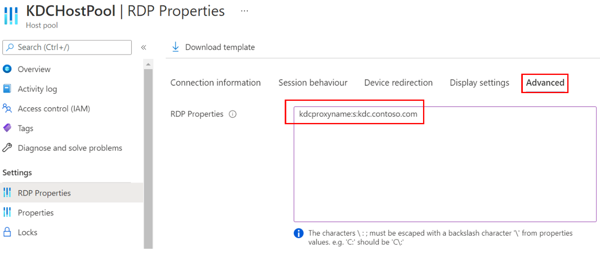

# Configure KDC proxy

This article will show you how to configure a KDC proxy for your host pool. This proxy lets organizations authenticate with Kerberos outside of their enterprise boundaries. For example, you can use the KDC proxy to enable Smartcard authentication for external clients.

To configure the KDC proxy:

1. Sign in to the Azure portal as an administrator.

2. Go to the Windows Virtual Desktop page.

3. Select the host pool you want to enable the KDC Proxy for, then select **RDP Properties**.

    > [!div class="mx-imgBorder"]
    > 

4. Select the **Advanced** tab, then enter a value in the following format without spaces:

    > kdcproxyname:s:\<fqdn\>

    > [!div class="mx-imgBorder"]
    > 

5. Select **Save**.

6. The selected host pool should now begin to issue RDP connection files with the kdcproxyname field that you entered included.

>[!NOTE]
>The RDGateway role in Remote Desktop Services includes a KDC Proxy service. See [Deploy the RD Gateway role in Windows Virtual Desktop](rdgateway-role.md) for how to set one up to be a target for Windows Virtual Desktop.
