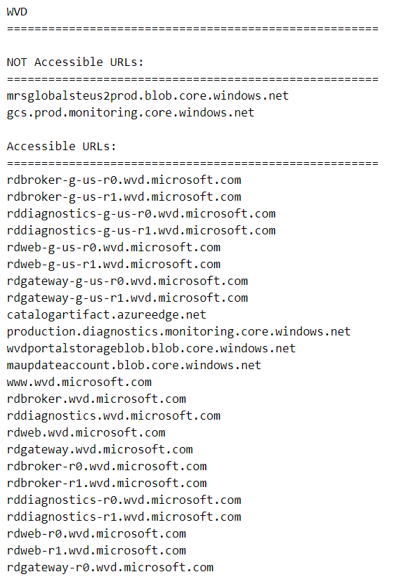

# Required URL Check tool

In order to deploy and make Azure Virtual Desktop available to your users, you must allow specific URLs that your session host virtual machines (VMs) can access them anytime. You can find the list of URLs at [Required URL list](safe-url-list.md). The Required URL Check tool will validate these URLs and show whether your session host VMs can access them. If not, then the tool will list the inaccessible URLs so you can unblock them and then retest, if needed.

> [!NOTE]
> - You can only use the Required URL Check tool for deployments in commercial clouds.
> - The Required URL Check tool can't verify URLs that wildcard entries are unblocked, only specific entries within those wildcards, so make sure the wildcard entries are unblocked first.

## Prerequisites

You need the following things to use the Required URL Check tool:

- Your session host VM must have a .NET 4.6.2 framework
- RDAgent version 1.0.2944.400 or higher
- The `WVDAgentUrlTool.exe` file must be in the same folder as the `WVDAgentUrlTool.config` file

### Use the Required URL Check tool

To use the Required URL Check tool:

1. Open a command prompt as an administrator on one of your session host VMs.

1. Run the following command to change the directory to the same folder as the current build agent (RDAgent_1.0.2944.1200 in this example):

    ```console
    cd "C:\Program Files\Microsoft RDInfra\RDAgent_1.0.2944.1200"
    ```

1. Run the following command:

    ```console
    WVDAgentUrlTool.exe
    ```
 
1. Once you run the file, you'll see a list of accessible and inaccessible URLs.

    For example, the following screenshot shows a scenario where you'd need to unblock two required non-wildcard URLs:

    > [!div class="mx-imgBorder"]
    > 
    
    Here's what the output should look like once you've unblocked all required non-wildcard URLs:

    > [!div class="mx-imgBorder"]
    > 

1. You can repeat these steps on your other session host VMs, particularly if they are in a different Azure region or use a different virtual network.