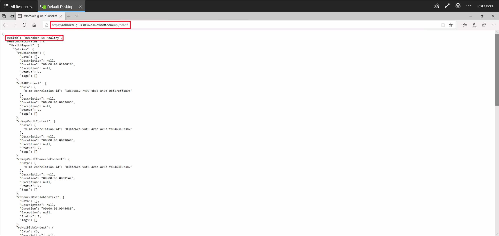
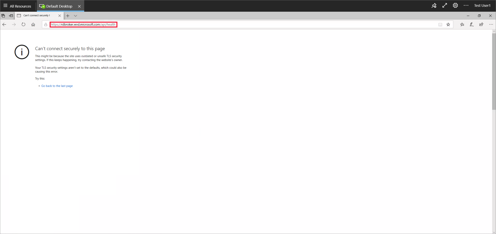
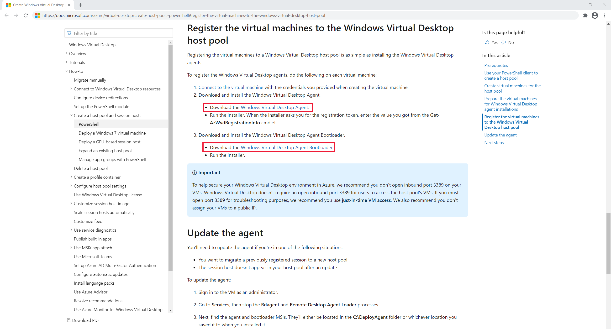

# Troubleshoot common Windows Virtual Desktop Agent issues

The Windows Virtual Desktop Agent can cause connection issues because of multiple factors:
   - An error on the broker that causes the agent stop the service.
   - Problems with updates.
   - Issues with installing the stack while the agent is being installed, thus interfering with connection to the session host.

This article will guide you through solutions to these common scenarios and how to address connection issues.

## Restart the BootLoader

Follow these instructions if you're having issues with the agent bootloader not running or if you're receiving an INVALID_REGISTRATION_TOKEN error.

### Error: The RDAgentBootLoader has stopped running.

**Cause:** If you're seeing that *RDAgentBootLoader* is either stopped or not running, this means that the bootloader, which loads the agent, was unable to install the agent properly and the agent service isn't running.

**Fix:** Start the RDAgent BootLoader.

1. In the Services window, right-click *Remote Desktop Agent Loader*.
2. Select *Start*. If this option is greyed out for you, you don't have administrator permissions and will need that to start the service.
3. Wait 10 seconds, and then right-click *Remote Desktop Agent Loader*.
4. Select *Refresh*.
5. If the service stops after you started and refreshed it, you may have a registration failure. For more information, see [INVALID_REGISTRATION_TOKEN](#error-invalidregistrationtoken).

### Error: INVALID_REGISTRATION_TOKEN

**Cause:** The registration token that you have isn't recognized as valid.

**Fix:** Create a new registration token, change IsRegistered to 0, restart the RDAgent BootLoader, and check that IsRegistered is 1.

**Create a new registration token.**

1. Follow steps 1-5 to [generate a new registration key for the VM](#generate-a-new-registration-key-for-the-vm).

**Change IsRegistered to 0.**

2. Open the Registry Editor (in the Start menu, type *regedit*). 
3. Navigate to HKEY_LOCAL_MACHINE\SOFTWARE\Microsoft\RDInfraAgent. 
4. Double-click *IsRegistered*. 
5. In the *Value data:* entry box, type *0* and select *Ok*. 
6. Double-click *RegistrationToken*. 
7. In the *Value data:* entry box, paste the registration token from step 1. 

   > [!div class="mx-imgBorder"]
   > 

**Stop and restart the RDAgentBootLoader.**

8. Open your Command Prompt (in Start menu, type *cmd*) as an administrator.
9. Type *net stop RDAgentBootLoader*. 
10. Type *net start RDAgentBootLoader*. 

**Check that IsRegistered is 1 and RegistrationToken is empty.**

11. Open the Registry Editor (in the Start menu, type *regedit*).
12. Navigate to HKEY_LOCAL_MACHINE\SOFTWARE\Microsoft\RDInfraAgent.
13. Verify that *IsRegistered* is set to 1 and there is nothing in the data column for *RegistrationToken*. 

   > [!div class="mx-imgBorder"]
   > 

## Ensure that your VMs can connect to the broker and gateway

Follow these instructions if you're having issues with service connectivity because you cannot connect to the broker, you're receiving an INVALID_FORM error, or you're receiving any 3019, 3703, or 3702 event.

### Error: *Agent cannot connect to broker with error NOT_FOUND. URL:* or INVALID_FORM.

**Cause:** The agent cannot connect to the broker and is unable to reach a particular URL. This may be because of your firewall or DNS settings.

**Fix:** Check that both BrokerURI and BrokerURIGlobal are reachable.
1. Open the Registry Editor (in Start menu, type *regedit*). 
2. Navigate to HKEY_LOCAL_MACHINE\Software\Microsoft\RDInfraAgent. 
3. Make note of the values for *BrokerURI* and *BrokerURIGlobal*.

   > [!div class="mx-imgBorder"]
   > 

 
4. Open a browser and go to *\<BrokerURI\>api/health*. 
   - Make sure that in place of *BrokerURI* in the above link, you put the actual value from step 3. In this case, it would be https://rdbroker-g-us-r0.wvd.microsoft.com/api/health.
5. Open another tab in the browser and go to *\<BrokerURIGlobal\>api/health*. 
   - Make sure that in place of *BrokerURIGlobal* in the above link, you put the actual value from step 3. In this case, it would be https://rdbroker.wvd.microsoft.com/api/health.
6. If the network isn't blocking broker connection, both pages will load successfully and will show *RDBroker is Healthy*, as shown below. 

   > [!div class="mx-imgBorder"]
   > 

   > [!div class="mx-imgBorder"]
   > 
 

7. If the network is blocking broker connection, the pages will not load, as shown below. 

   > [!div class="mx-imgBorder"]
   > 

   > [!div class="mx-imgBorder"]
   > 

8. If the network is blocking these URLs, you will need to unblock the required URLs. For more information, see [Required URL List](https://docs.microsoft.com/azure/virtual-desktop/safe-url-list).

### Error: Any 3703 error (that is, RDGateway URL isn't accessible), 3702 warning, or 3019 error.

**Cause:** This error is raised when the WebSocket Transport URLs or RDGateway URLs cannot be reached. To ensure connectivity on your session host and allow network traffic to these endpoints to bypass restrictions, you must unblock the URLs from the [Required URL List](https://docs.microsoft.com/azure/virtual-desktop/safe-url-list). Also, ensure that your firewall or proxy settings don't block these URLs. Unblocking these URLs is a prerequisite to using WVD.

**Fix:** Verify that your firewall and/or DNS settings are not blocking these URLs.
1. [Use Azure Firewall to protect WVD deployments.](https://docs.microsoft.com/azure/firewall/protect-windows-virtual-desktop)
2. Configure your [Azure Firewall DNS settings](https://docs.microsoft.com/azure/firewall/dns-settings).

## Ensure that you don't have any conflicting group policies enabled

Follow these instructions if you have any group policies enabled. Some group policies, disable the installation of the agent through Windows installer or the command prompt. If this installation is disabled, you will receive an InstallMsiException or a Win32Exception.

### Error: InstallMsiException.

**Cause:** This exception is thrown when the installer is already running for another application and you're trying to install the agent at the same time, or the msiexec.exe is blocked. To ensure that agent updates get installed on your session host, don't enable any policies or configurations that block Windows Installer or msiexec.exe; this will also block the agent installation and cause it to fail.

**Fix:** Disable the following policies:
   - Turn off Windows Installer  
      - Category Path: Computer Configuration\Administrative Templates\Windows Component\Windows Installer\ 
    
>[!NOTE]
>This isn't a comprehensive list of policies, just the ones that we have come across.

### Error: Win32Exception.

**Cause:** This exception is thrown when there is a policy enabled that blocks cmd.exe from launching. Enabling such policies blocks the ability to run the console window, which is what is used to restart the service when there is an agent update.

**Fix:** Disable the following policies:
   - Prevent access to the command prompt   
      - Category Path: User Configuration\Administrative Templates\System\ 
    
>[!NOTE]
>This isn't a comprehensive list of policies, just the ones that we have come across.

## Make Regkey changes

Follow these instructions if you're having issues with the stack listener not working, your VMs show as Unavailable, or your VMs are missing a heartbeat to the service.

### Error: Stack listener isn't working or your VM shows as Unavailable, and you're running on Windows 10 2004.

**Cause:** Run *qwinsta* in your Command Prompt and make note of the version number that is shown next to *rdp-sxs*. If you're not seeing the *rdp-tcp* and *rdp-sxs* components say *Listen* next to them or they are not showing up at all after running *qwinsta*, it means that there is a stack issue. Stack updates get installed along with agent updates, and when this installation goes awry, the WVD listener will not work.

**Fix:** Change fEnableWinStation and fReverseConnectMode to 1.
1. Open the Registry Editor (in Start menu, type *regedit*).
2. Navigate to HKEY_LOCAL_MACHINE\SYSTEM\CurrentControlSet\Control\Terminal Server\WinStations. 
3. Under *WinStations* you may see several folders for different stack versions, select the folder that matches the version information that you made note of when running *qwinsta* in your Command Prompt. 
4. Scroll to find *fReverseConnectMode* and verify that its data value is 1. Also verify that *fEnableWinStation* is set to 1.

   > [!div class="mx-imgBorder"]
   > 

5. If *fReverseConnectMode* isn't set to 1, double-click on *fReverseConnectMode* and enter the value 1 for its field. 
6. If *fEnableWinStation* isn't set to 1, double-click on *fEnableWinStation* and enter the value 1 for its field.  

>[!NOTE]
>To change the *fReverseConnectMode* or *fEnableWinStation* mode for multiple VMs at one time, you can either 1) export the registry key from the machine that you already have working and import it into all the other machines that need this change, or 2) create a GPO to set the registry key value for the machines that need the change.

7. Navigate to HKEY_LOCAL_MACHINE\SYSTEM\CurrentControlSet\Control\Terminal Server\ClusterSettings.
8. Under *ClusterSettings*, scroll to find *SessionDirectoryListener* and verify that its data value is *rdp-sxs...*. 
9. If *SessionDirectoryListener* isn't set to *rdp-sxs...*, you need to follow steps to [reinstall the agent and bootloader](#re-register-your-vm-and-reinstall-the-agent-and-bootloader), and this will reinstall the side-by-side stack.

### Error: *CheckSessionHostDomainIsReachableAsync -SessionHost unhealthy.*

**Cause:** You may be facing this disconnection issue if your server is missing a heartbeat to the WVD service. 

**Fix:** Change the threshold for the heartbeats.
1. Open your Command Prompt (in Start menu, type *cmd*) as an administrator.
2. Type and run *qwinsta*.
3. There should be two stack components displayed: *rdp-tcp* and *rdp-sxs*. 
   - Depending on the version of your OS, *rdp-sxs* may be followed by the build number as shown below. If it is, be sure to make note of this build number.
4. Open the Registry Editor (in Start menu, type *regedit*).
5. Navigate to HKEY_LOCAL_MACHINE\SYSTEM\CurrentControlSet\Control\Terminal Server\WinStations. 
6. Under *WinStations* you may see several folders for different stack versions, select the folder that matches the version information that you made note of in part 3.
7. Create the following new registry DWORD (right-click in registry editor -> New -> DWORD (32-bit) Value) with the corresponding decimal values: 
   - HeartbeatInterval: 10000
   - HeartbeatWarnCount: 30 
   - HeartbeatDropCount: 60 
8. Restart your VM.

## Increase VM capacity

Follow these instructions if you're having capacity issues on your VM. This may be evidenced by your VMs  showing as unavailable, or you receiving the error *Connection not found: RDAgent does not have an active connection to the broker.*

### Error: DownloadMsiException.

**Cause:** This exception is thrown when there isn't enough space on the disk for the RDAgent to be downloaded.

**Fix:** Make space on your disk by:
   - Deleting files that are no longer in user
   - Increasing the storage capacity of your VM

### Error: VMs are showing as Unavailable or you're receiving *Connection not found: RDAgent does not have an active connection to the broker* error.

**Cause:** It is possible that your machines have exceeded or are at the memory/storage/resource utilization limit so the VM is unable to accept new connections.

**Fix:** You can resolve this issue by:
   - Decreasing the max session limit; this will ensure that the resource utilization is more evenly distributed across session hosts and will decrease the likelihood of resource depletion
   - Increasing the resource capacity of the VMs.

## Re-register your VM and reinstall the agent and bootloader

Follow these instructions if one or more of the following apply to you:
- Your VM is stuck in upgrading or unavailable
- Your stack listener isn't working and you're running on Windows 10 1809, 1903, or 1904
- You're receiving an EXPIRED_REGISTRATION_TOKEN error
- You're not seeing your VMs show up in the session hosts list

### Uninstall all agent, bootloader, and stack component programs.

1. Log in to your VM as an administrator. 
2. Go to Programs and Features (in Start menu, type *Control Panel*, and navigate to Control Panel\Programs\Programs and Features).
3. Remove the following programs:
   - Remote Desktop Agent Boot Loader
   - Remote Desktop Services Infrastructure Agent
   - Remote Desktop Services Infrastructure Geneva Agent
   - Remote Desktop Services SxS Network Stack
   
>[!NOTE]
>You may see multiple instances of these programs, remove all of them.

   > [!div class="mx-imgBorder"]
   > 

### Remove the session host from the host pool.

1. Go to the *Overview* page for the host pool that your VM is in, in the [Azure portal](https://portal.azure.com). 
2. Go to the *Session Hosts* tab to see the list of all session hosts in that host pool.
3. Select the VM from the list of session hosts that is having issues.
4. Select *Remove* from the options along the top.  

   > [!div class="mx-imgBorder"]
   > 

### Generate a new registration key for the VM.

1. Go to the *Overview* page for the host pool that your VM is in, in the [Azure portal](https://portal.azure.com).
2. Select *Registration key*, just to the right of the search bar.

   > [!div class="mx-imgBorder"]
   > 

3. Select *Generate new key* in the *Registration key* blade.
4. Enter the expiration date and then select *Ok*.  

>[!NOTE]
>The expiration date can be no less than an hour and no longer than 27 days from its generation time and date. It is best practice to set the expiration date to be 27 days from now.

5. Copy the newly generated key to your clipboard; you will need this key later.

### Reinstall the agent and bootloader.

1. Log in to your VM as an administrator and go to this link [here](https://docs.microsoft.com/azure/virtual-desktop/create-host-pools-powershell#register-the-virtual-machines-to-the-windows-virtual-desktop-host-pool).
2. Download the *Windows Virtual Desktop Agent* and the *Windows Virtual Desktop Agent Bootloader* that are linked in parts 2 and 3 under *Register the virtual machines to the Windows Virtual Desktop host pool*.

   > [!div class="mx-imgBorder"]
   > 

3. Right-click the downloaded installers (both the agent and the bootloader).
4. Select *Properties*.
5. Select *Unblock*.
6. Select *Ok*. This will allow your system to trust the installer.
7. Run the agent installer by double-clicking it.
8. When the installer asks you for the registration token, paste the registration key from your clipboard. 

   > [!div class="mx-imgBorder"]
   > 

9. Run the bootloader installer by double-clicking it.
10. Go to the *Overview* page for the host pool that your VM is in, in the [Azure portal](https://portal.azure.com).
11. Go to the *Session Hosts* tab to see the list of all session hosts in that host pool.
12. You should now see the session host registered in the host pool with the status *Available*. 

   > [!div class="mx-imgBorder"]
   > 

## Recreate the VM.

Follow these instructions if you're operating an unsupported VM OS or if you're receiving a NAME_ALREADY_REGISTERED error.

### Error: Operating an Unsupported VM OS.

**Cause:** The side-by-side stack is only supported by Windows Enterprise or Windows Server SKUs (that is, Pro VM isn't supported). If you don't have an Enterprise or Server SKU, the stack will be installed on your VM, but won't be activated, so you won't see it show up when you run *qwinsta* in your command line.

**Fix:** Create a VM that is Windows Enterprise or Windows Server.
1. Follow steps 1-12 under [Virtual Machine Details](https://docs.microsoft.com/azure/virtual-desktop/create-host-pools-azure-marketplace#virtual-machine-details). The recommended images for your VM are:
   - Windows 10 Enterprise multi-session, Version 1909
   - Windows 10 Enterprise multi-session, Version 1909 + Microsoft 365 Apps
   - Windows Server 2019 Datacenter
   - Windows 10 Enterprise multi-session, Version 2004
   - Windows 10 Enterprise multi-session, Version 2004 + Microsoft 365 Apps
2. Select *Review and Create*.

### Error: NAME_ALREADY_REGISTERED.

**Cause:** The name of your VM has already been registered and is probably a duplicate.

**Fix:** Remove the session host from the host pool and create another one.
1. Follow steps 1-4 to [remove the session host from the host pool](#remove-the-session-host-from-the-host-pool).
2. [Create another VM](https://docs.microsoft.com/azure/virtual-desktop/expand-existing-host-pool#add-virtual-machines-with-the-azure-portal). Make sure to choose a name for this VM that is different from all the other names in the host pool.
1. Go to the *Overview* page for the host pool that your VM was in, in the [Azure portal](https://portal.azure.com). 
1. Go to the *Session Hosts* tab to see the list of all session hosts in that host pool.
1. Wait for 5-10 minutes for the session host to show *Available*.

   > [!div class="mx-imgBorder"]
   > 

## Next steps

If any of the above steps did not resolve your issue, create a support case and include detailed information about the problem you're having, in addition to the steps you have taken to resolve it. Below is a list of other resources that you can use to troubleshoot issues that you may have with your Windows Virtual Desktop deployment.

- For an overview on troubleshooting Windows Virtual Desktop and the escalation tracks, see [Troubleshooting overview, feedback, and support](troubleshoot-set-up-overview.md).
- To troubleshoot issues while creating a host pool in a Windows Virtual Desktop environment, see [Environment and host pool creation](troubleshoot-set-up-issues.md).
- To troubleshoot issues while configuring a virtual machine (VM) in Windows Virtual Desktop, see [Session host virtual machine configuration](troubleshoot-vm-configuration.md).
- To troubleshoot issues with Windows Virtual Desktop client connections, see [Windows Virtual Desktop service connections](troubleshoot-service-connection.md).
- To troubleshoot issues with Remote Desktop clients, see [Troubleshoot the Remote Desktop client](troubleshoot-client.md)
- To troubleshoot issues when using PowerShell with Windows Virtual Desktop, see [Windows Virtual Desktop PowerShell](troubleshoot-powershell.md).
- To learn more about the service, see [Windows Virtual Desktop environment](environment-setup.md).
- To go through a troubleshoot tutorial, see [Tutorial: Troubleshoot Resource Manager template deployments](../azure-resource-manager/templates/template-tutorial-troubleshoot.md).
- To learn about auditing actions, see [Audit operations with Resource Manager](../azure-resource-manager/management/view-activity-logs.md).
- To learn about actions to determine the errors during deployment, see [View deployment operations](../azure-resource-manager/templates/deployment-history.md).

Furthermore, we would love to hear your feedback about your experience with this troubleshooting guide. We hope that it was helpful and are constantly working to improve it. Submit and view feedback for this guide [here](https://aka.ms/rddesktopfeedback). 