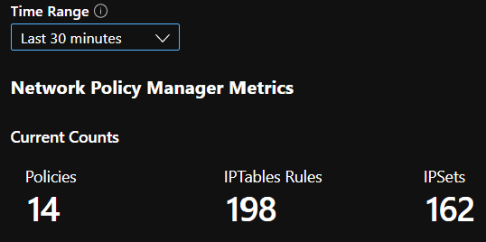
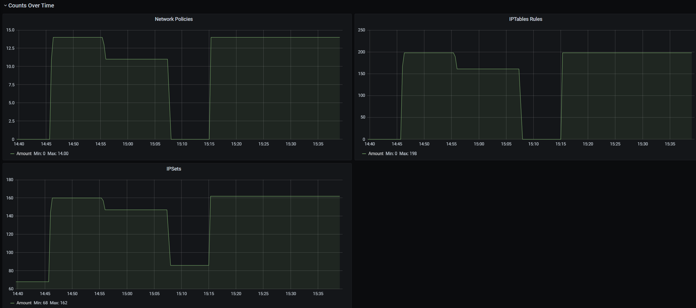
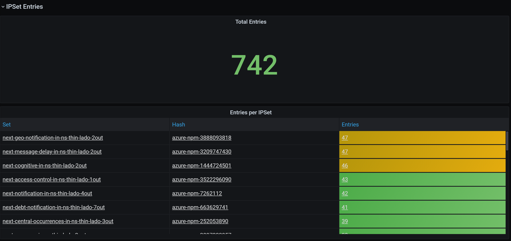
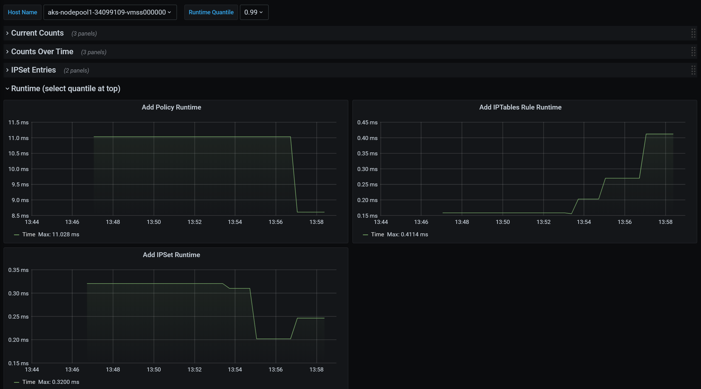

# Azure Kubernetes Network Policies 

## Overview
Network Policies provides micro-segmentation for pods just like Network Security Groups (NSGs) provide micro-segmentation for VMs. The Azure Network Policy Manager (also known as Azure NPM) implementation supports the standard Kubernetes Network Policy specification. You can use labels to select a group of pods and define a list of ingress and egress rules to filter traffic to and from these pods. Learn more about the Kubernetes network policies in the [Kubernetes documentation](https://kubernetes.io/docs/concepts/services-networking/network-policies/).


Azure NPM implementation works in conjunction with the Azure CNI that provides VNet integration for containers. NPM is supported only on Linux and Windows Server 2022 today. The implementation enforces traffic filtering by configuring allow and deny IP rules in Linux IPTables or Windows HNS ACLPolicies based on the defined policies. These rules are grouped together using Linux IPSets or Windows HNS SetPolicies.

## Planning security for your Kubernetes cluster
When implementing security for your cluster, use network security groups (NSGs) to filter traffic entering and leaving your cluster subnet (North-South traffic). Use Azure NPM for traffic between pods in your cluster (East-West traffic).

## Using Azure NPM
Azure NPM can be used in the following ways to provide micro-segmentation for pods.

### Azure Kubernetes Service (AKS)
NPM is available natively in AKS and can be enabled at the time of cluster creation. Learn more about it in [Secure traffic between pods using network policies in Azure Kubernetes Service (AKS)](../aks/use-network-policies.md).

### Do it yourself (DIY) Kubernetes clusters in Azure
 For DIY clusters, first install the CNI plug-in and enable it on every virtual machine in a cluster. For detailed instructions, see [Deploy the plug-in for a Kubernetes cluster that you deploy yourself](deploy-container-networking.md#deploy-plug-in-for-a-kubernetes-cluster).

Once the cluster is deployed run the following `kubectl` command to download and apply the Azure NPM *daemon set* to the cluster.

For Linux:

  ```
  kubectl apply -f https://github.com/Azure/azure-container-networking/blob/master/npm/azure-npm.yaml
  ```

For Windows:

 ```
  kubectl apply -f https://github.com/Azure/azure-container-networking/blob/master/npm/examples/windows/azure-npm.yaml
  ```

The solution is also open source and the code is available on the [Azure Container Networking repository](https://github.com/Azure/azure-container-networking/tree/master/npm).

## Monitor and Visualize Network Configurations with Azure NPM
Azure NPM includes informative Prometheus metrics that allow you to monitor and better understand your configurations. It provides built-in visualizations in either the Azure portal or Grafana Labs. You can start collecting these metrics using either Azure Monitor or a Prometheus Server.

### Benefits of Azure NPM Metrics
Users previously were only able to learn about their Network Configuration with `iptables` and `ipset` commands run inside a cluster node, which yields a verbose and difficult to understand output.

Overall, the metrics provide:
- counts of policies, ACL rules, ipsets, ipset entries, and entries in any given ipset
- execution times for individual OS calls and for handling kubernetes resource events (median, 90th percentile, and 99th percentile)
- failure info for handling kubernetes resource events (these will fail when an OS call fails)

#### Example Metrics Use Cases
##### Alerts via a Prometheus AlertManager
See a [configuration for these alerts](#setup-alerts-for-alertmanager) below.
1. Alert when NPM has a failure with an OS call or when translating a Network Policy.
2. Alert when the median time to apply changes for a create event was more than 100 milliseconds.

##### Visualizations and Debugging via our Grafana Dashboard or Azure Monitor Workbook
1. See how many IPTables rules your policies create (having a massive amount of IPTables rules may increase latency slightly).
2. Correlate cluster counts (e.g. ACLs) to execution times.
3. Get the human-friendly name of an ipset in a given IPTables rule (e.g. "azure-npm-487392" represents "podlabel-role:database").
 
### All supported metrics
The following is the list of supported metrics. Any `quantile` label has possible values `0.5`, `0.9`, and `0.99`. Any `had_error` label has possible values `false` and `true`, representing whether the operation succeeded or failed.

| Metric Name                          | Description                                    | Prometheus Metric Type | Labels         |
| -----                                | -----                                          | -----    |  -----                       |
| `npm_num_policies`                   | number of network policies                     | Gauge    |  -                           |
| `npm_num_iptables_rules`             | number of IPTables rules                       | Gauge    |  -                           |
| `npm_num_ipsets`                     | number of IPSets                               | Gauge    |  -                           |
| `npm_num_ipset_entries`              | number of IP address entries in all IPSets     | Gauge    |  -                           |
| `npm_add_iptables_rule_exec_time`    | runtime for adding an IPTables rule            | Summary  | `quantile`                   |
| `npm_add_ipset_exec_time`            | runtime for adding an IPSet                    | Summary  | `quantile`                   |
| `npm_ipset_counts` (advanced)        | number of entries within each individual IPSet | GaugeVec | `set_name` & `set_hash`      |
| `npm_add_policy_exec_time`           | runtime for adding a network policy            | Summary  | `quantile` & `had_error`     |
| `npm_controller_policy_exec_time`    | runtime for updating/deleting a network policy | Summary  | `quantile` & `had_error` & `operation` (with values `update` or `delete`)            |
| `npm_controller_namespace_exec_time` | runtime for creating/updating/deleting a namespace      | Summary  | `quantile` & `had_error` & `operation` (with values `create`, `update`, or `delete`) |
| `npm_controller_pod_exec_time`       | runtime for creating/updating/deleting a pod            | Summary  | `quantile` & `had_error` & `operation` (with values `create`, `update`, or `delete`) |

There are also "exec_time_count" and "exec_time_sum" metrics for each "exec_time" Summary metric.

The metrics can be scraped through Azure Monitor for containers or through Prometheus.

### Set up for Azure Monitor
The first step is to enable Azure Monitor for containers for your Kubernetes cluster. Steps can be found in [Azure Monitor for containers Overview](../azure-monitor/containers/container-insights-overview.md). Once you have Azure Monitor for containers enabled, configure the [Azure Monitor for containers ConfigMap](https://aka.ms/container-azm-ms-agentconfig) to enable NPM integration and collection of Prometheus NPM metrics. Azure Monitor for containers ConfigMap has an ```integrations``` section with settings to collect NPM metrics. These settings are disabled by default in the ConfigMap. Enabling the basic setting ```collect_basic_metrics = true```, will collect basic NPM metrics. Enabling advanced setting ```collect_advanced_metrics = true``` will collect advanced metrics in addition to basic metrics. 

After editing the ConfigMap, save it locally and apply the ConfigMap to your cluster as follows.

`kubectl apply -f container-azm-ms-agentconfig.yaml`

Below is a snippet from the [Azure Monitor for containers ConfigMap](https://aka.ms/container-azm-ms-agentconfig), which shows the NPM integration enabled with advanced metrics collection.
```
integrations: |-
    [integrations.azure_network_policy_manager]
        collect_basic_metrics = false
        collect_advanced_metrics = true
```
Advanced metrics are optional, and turning them on will automatically turn on basic metrics collection. Advanced metrics currently include only `npm_ipset_counts`

Learn more about [Azure Monitor for containers collection settings in config map](../azure-monitor/containers/container-insights-agent-config.md)

### Visualization Options for Azure Monitor
Once NPM metrics collection is enabled, you can view the metrics in the Azure portal using Container Insights or in Grafana.

#### Viewing in Azure portal under Insights for the cluster
Open Azure portal. Once in your cluster's Insights, navigate to "Workbooks" and open "Network Policy Manager (NPM) Configuration".

Besides viewing the workbook (pictures below), you can also directly query the Prometheus metrics in "Logs" under the Insights section. For example, this query will return all the metrics being collected.
| where TimeGenerated > ago(5h)
| where Name contains "npm_"

You can also query Log Analytics directly for the metrics. Learn more about it with [Getting Started with Log Analytics Queries](../azure-monitor/containers/container-insights-log-query.md) 

#### Viewing in Grafana Dashboard
Set up your Grafana Server and configure a Log Analytics Data Source as described [here](https://grafana.com/grafana/plugins/grafana-azure-monitor-datasource). Then, import [Grafana Dashboard with a Log Analytics backend](https://grafana.com/grafana/dashboards/10956) into your Grafana Labs.

The dashboard has visuals similar to the Azure Workbook. You can add panels to chart & visualize NPM metrics from InsightsMetrics table.

### Set up for Prometheus Server
Some users may choose to collect metrics with a Prometheus Server instead of Azure Monitor for containers. You merely need to add two jobs to your scrape config to collect NPM metrics.

To install a simple Prometheus Server, add this helm repo on your cluster
```
helm repo add stable https://kubernetes-charts.storage.googleapis.com
helm repo update
```
then add a server
```
helm install prometheus stable/prometheus -n monitoring \
--set pushgateway.enabled=false,alertmanager.enabled=false, \
--set-file extraScrapeConfigs=prometheus-server-scrape-config.yaml
```
where `prometheus-server-scrape-config.yaml` consists of
```
- job_name: "azure-npm-node-metrics"
  metrics_path: /node-metrics
  kubernetes_sd_configs:
  - role: node
  relabel_configs:
  - source_labels: [__address__]
    action: replace
    regex: ([^:]+)(?::\d+)?
    replacement: "$1:10091"
    target_label: __address__
- job_name: "azure-npm-cluster-metrics"
  metrics_path: /cluster-metrics
  kubernetes_sd_configs:
  - role: service
  relabel_configs:
  - source_labels: [__meta_kubernetes_namespace]
    regex: kube-system
    action: keep
  - source_labels: [__meta_kubernetes_service_name]
    regex: npm-metrics-cluster-service
    action: keep
# Comment from here to the end to collect advanced metrics: number of entries for each IPSet
  metric_relabel_configs:
  - source_labels: [__name__]
    regex: npm_ipset_counts
    action: drop
```


You can also replace the `azure-npm-node-metrics` job  with the content below or incorporate it into a pre-existing job for Kubernetes pods:
```
- job_name: "azure-npm-node-metrics-from-pod-config"
  metrics_path: /node-metrics
  kubernetes_sd_configs:
  - role: pod
  relabel_configs:
  - source_labels: [__meta_kubernetes_namespace]
    regex: kube-system
    action: keep
  - source_labels: [__meta_kubernetes_pod_annotationpresent_azure_npm_scrapeable]
    action: keep
  - source_labels: [__address__]
    action: replace
    regex: ([^:]+)(?::\d+)?
    replacement: "$1:10091"
    target_label: __address__
```

#### Set up Alerts for AlertManager
If you use a Prometheus Server, you can set up an AlertManager like so. Here is an example config for [the two alerting rules described above](#alerts-via-a-prometheus-alertmanager):
```
groups:
- name: npm.rules
  rules:
  # fire when NPM has a new failure with an OS call or when translating a Network Policy (suppose there's a scraping interval of 5m)
  - alert: AzureNPMFailureCreatePolicy
    # this expression says to grab the current count minus the count 5 minutes ago, or grab the current count if there was no data 5 minutes ago
    expr: (npm_add_policy_exec_time_count{had_error='true'} - (npm_add_policy_exec_time_count{had_error='true'} offset 5m)) or npm_add_policy_exec_time_count{had_error='true'}
    labels:
      severity: warning
      addon: azure-npm
    annotations:
      summary: "Azure NPM failed to handle a policy create event"
      description: "Current failure count since NPM started: {{ $value }}"
  # fire when the median time to apply changes for a pod create event is more than 100 milliseconds.
  - alert: AzureNPMHighControllerPodCreateTimeMedian
    expr: topk(1, npm_controller_pod_exec_time{operation="create",quantile="0.5",had_error="false"}) > 100.0
    labels:
      severity: warning
      addon: azure-npm
    annotations:
      summary: "Azure NPM controller pod create time median > 100.0 ms"
      # could have a simpler description like the one for the alert above,
      # but this description includes the number of pod creates that were handled in the past 10 minutes, 
      # which is the retention period for observations when calculating quantiles for a Prometheus Summary metric
      description: "value: [{{ $value }}] and observation count: [{{ printf `(npm_controller_pod_exec_time_count{operation='create',pod='%s',had_error='false'} - (npm_controller_pod_exec_time_count{operation='create',pod='%s',had_error='false'} offset 10m)) or npm_controller_pod_exec_time_count{operation='create',pod='%s',had_error='false'}` $labels.pod $labels.pod $labels.pod | query | first | value }}] for pod: [{{ $labels.pod }}]"
```

### Visualization Options for Prometheus
When using a Prometheus Server only Grafana Dashboard is supported. 

If you haven't already, set up your Grafana Server and configure a Prometheus Data Source. Then, import our [Grafana Dashboard with a Prometheus backend](https://grafana.com/grafana/dashboards/13000) into your Grafana Labs.

The visuals for this dashboard are identical to the dashboard with a Container Insights/Log Analytics backend.

### Sample Dashboards
Following are some sample dashboard for NPM metrics in Container Insights (CI) and Grafana

#### CI Summary Counts


#### CI Counts over Time
[](media/kubernetes-network-policies/workbook-counts-over-time.png#lightbox)

#### CI IPSet Entries
[](media/kubernetes-network-policies/workbook-ipset-entries.png#lightbox)

#### CI Runtime Quantiles


#### Grafana Dashboard Summary Counts


#### Grafana Dashboard Counts over Time
[](media/kubernetes-network-policies/grafana-counts-over-time.png#lightbox)

#### Grafana Dashboard IPSet Entries
[](media/kubernetes-network-policies/grafana-ipset-entries.png#lightbox)

#### Grafana Dashboard Runtime Quantiles
[](media/kubernetes-network-policies/grafana-runtime-quantiles.png#lightbox)


## Next steps
- Learn about [Azure Kubernetes Service](../aks/intro-kubernetes.md).
-  Learn about [container networking](container-networking-overview.md).
- [Deploy the plug-in](deploy-container-networking.md) for Kubernetes clusters or Docker containers.