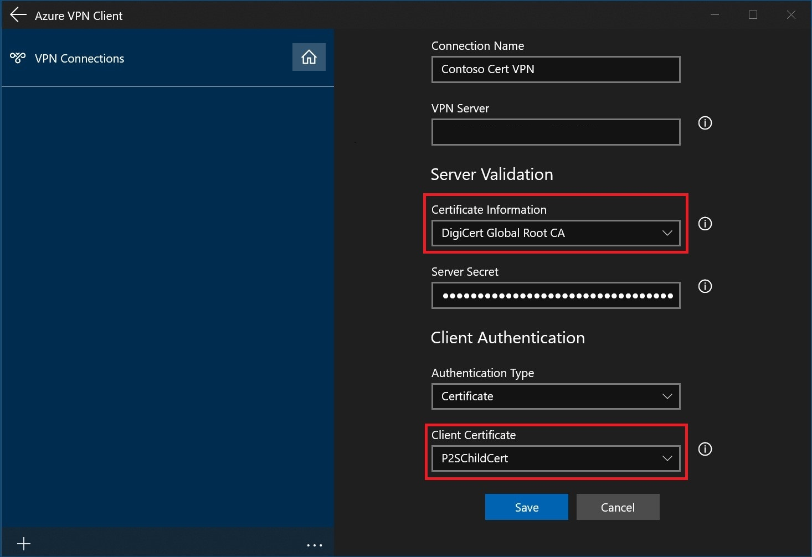
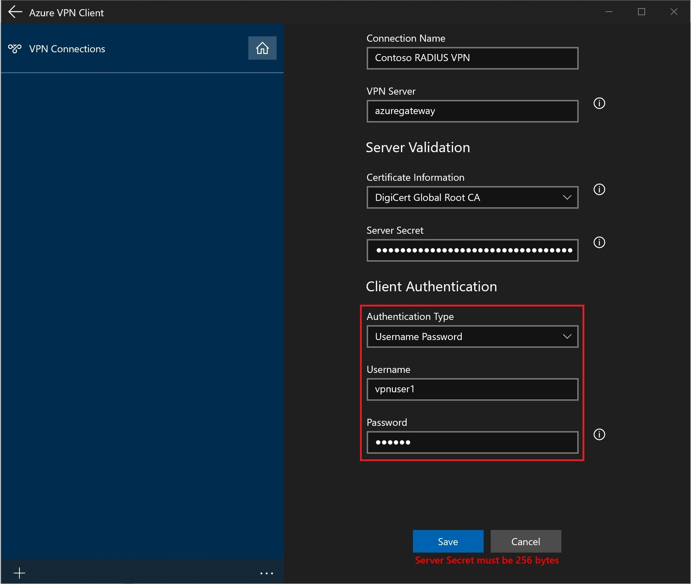
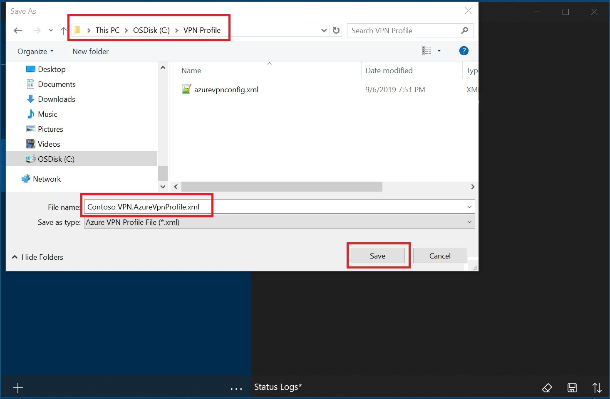
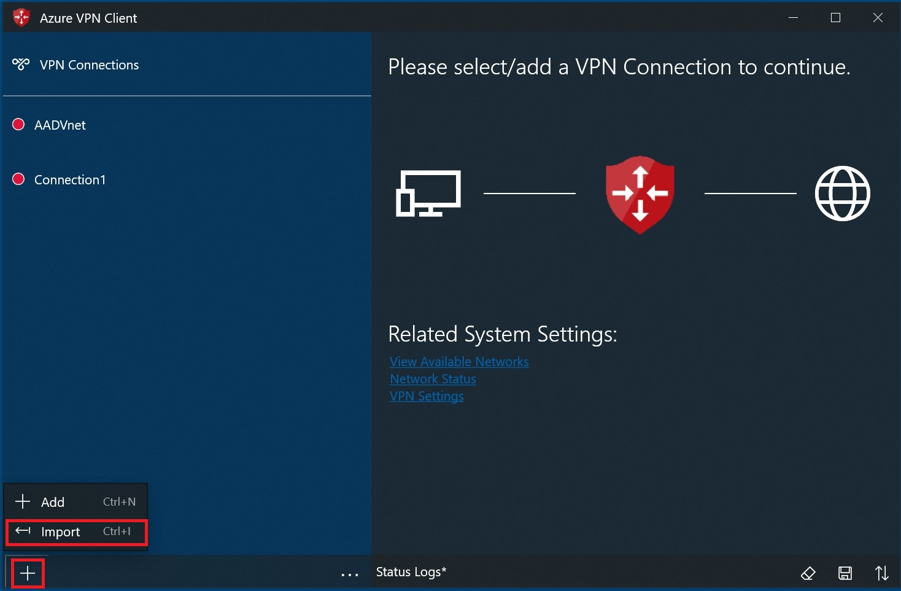
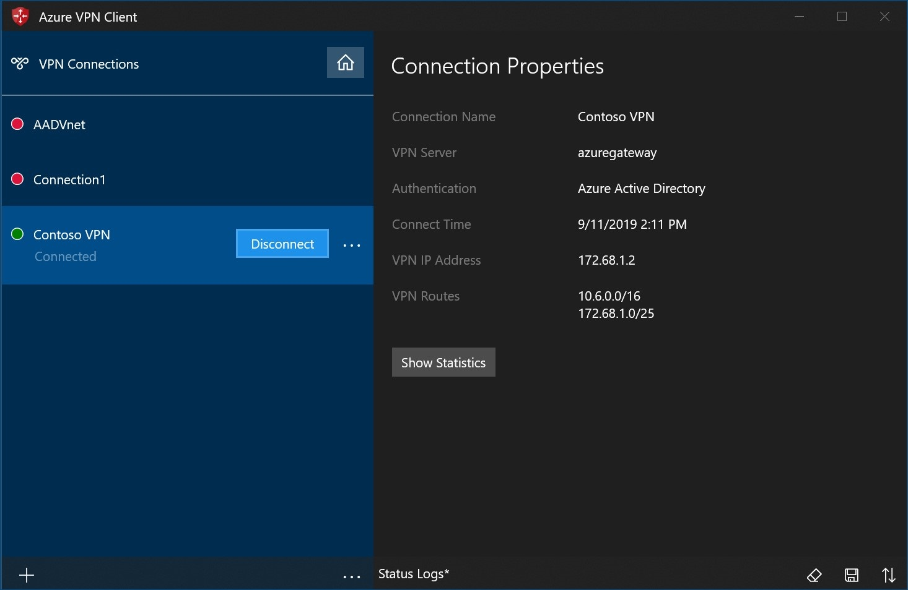
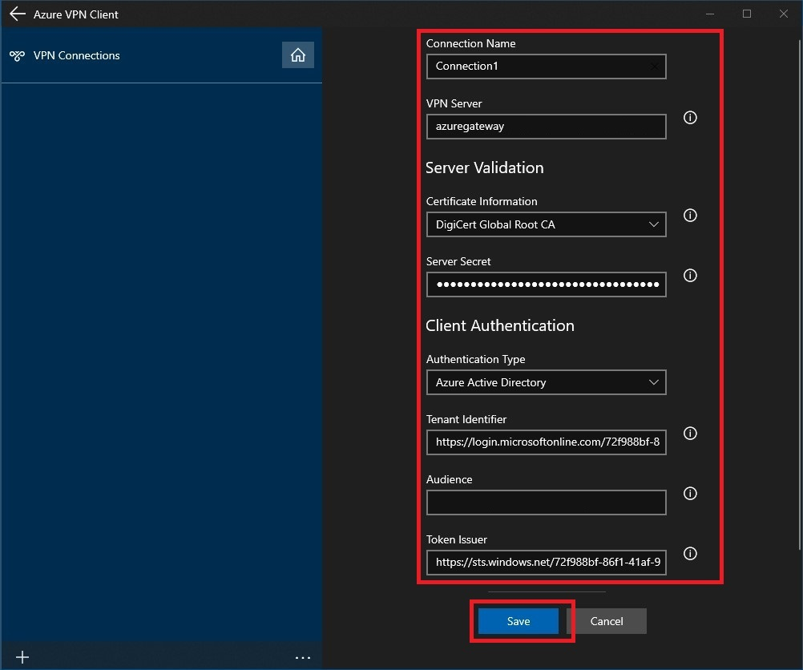
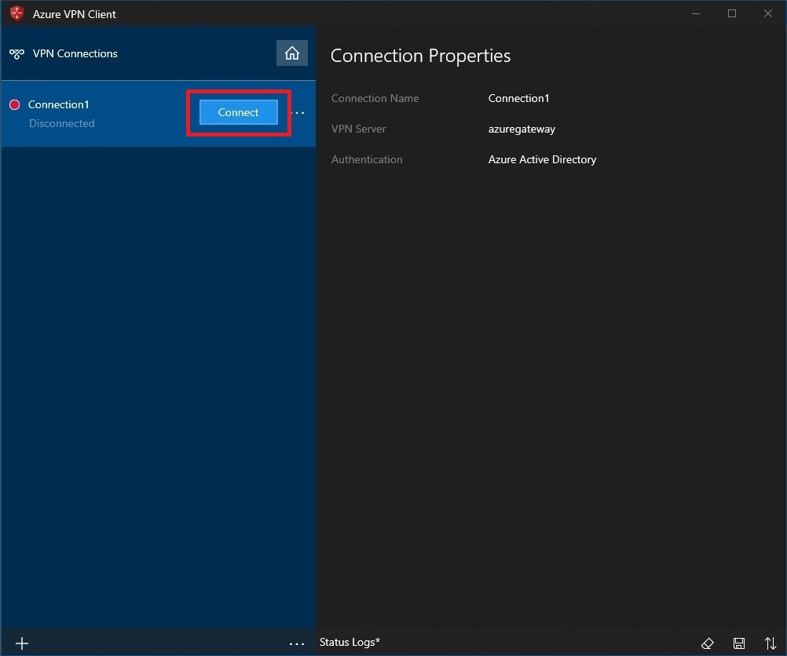
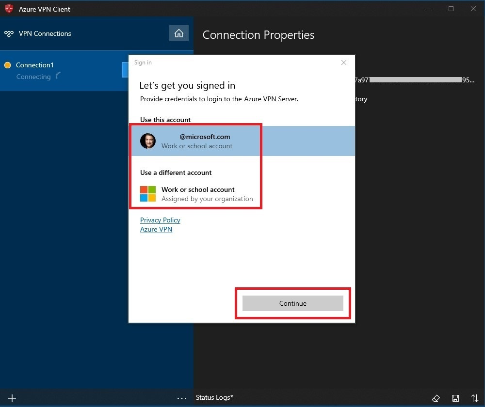
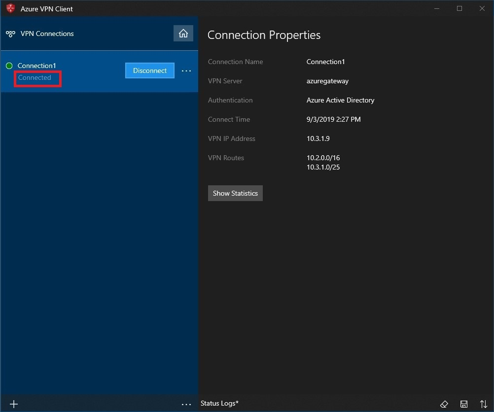
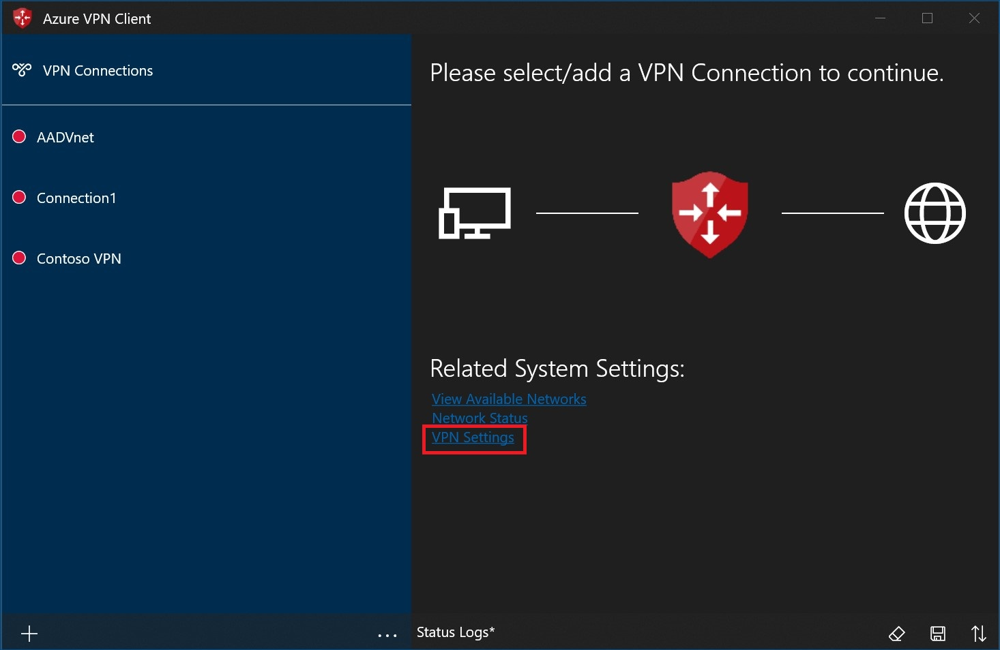

# Configure a VPN client for P2S OpenVPN protocol connections: Azure AD authentication

This article helps you configure a VPN client to connect using point-to-site VPN and Azure Active Directory authentication. Before you can connect and authenticate using Azure AD, you must first configure your Azure AD tenant. For more information, see [Configure an Azure AD tenant](openvpn-azure-ad-tenant.md).

> [!NOTE]
> Azure AD authentication is supported only for OpenVPN® protocol connections.
>

## <a name="profile"></a>Working with client profiles

For every computer that wants to connect to the VNet via the VPN client, you need to download the Azure VPN Client for the computer, and also configure a VPN client profile. If you want to configure multiple computers, you can create a client profile on one computer, export it, and then import it to other computers.

### To download the Azure VPN client

[!INCLUDE [Download Azure VPN client](../../includes/vpn-gateway-download-vpn-client.md)]

### <a name="cert"></a>To create a certificate-based client profile

When working with a certificate-based profile, make sure that the appropriate certificates are installed on the client computer. You can install and specify more than one certificate when using the Azure VPN client version 2.1963.44.0 or higher. For more information about certificates, see [Install client certificates](certificates-point-to-site.md).



### <a name="radius"></a>To create a RADIUS client profile


  
> [!NOTE]
> The Server Secret can be exported in the P2S VPN client profile. To export a client profile, see [User VPN client profiles](about-vpn-profile-download.md).
>

### <a name="export"></a>To export and distribute a client profile

Once you have a working profile and need to distribute it to other users, you can export it using the following steps:

1. Highlight the VPN client profile that you want to export, select the **...**, then select **Export**.

    

2. Select the location that you want to save this profile to, leave the file name as is, then select **Save** to save the xml file.

    

### <a name="import"></a>To import a client profile

1. On the page, select **Import**.

    

2. Browse to the profile xml file and select it. With the file selected, select **Open**.

    

3. Specify the name of the profile and select **Save**.

    

4. Select **Connect** to connect to the VPN.

    

5. Once connected, the icon will turn green and say **Connected**.

    

### <a name="delete"></a>To delete a client profile

1. Select the ellipses next to the client profile that you want to delete. Then, select **Remove**.

    

2. Select **Remove** to delete.

    

## <a name="connection"></a>Create a connection

1. On the page, select **+**, then **+ Add**.

    

2. Fill out the connection information. If you are unsure of the values, contact your administrator. After filling out the values, select **Save**.

    

3. Select **Connect** to connect to the VPN.

    

4. Select the proper credentials, then select **Continue**.

    

5. Once successfully connected, the icon will turn green and say **Connected**.

    

### <a name="autoconnect"></a>To connect automatically

These steps help you configure your connection to connect automatically with Always-on.

1. On the home page for your VPN client, select **VPN Settings**.

    

2. Select **Yes** on the switch apps dialogue box.

    

3. Make sure the connection that you want to set is not already connected, then highlight the profile and check the **Connect automatically** check box.

    

4. Select **Connect** to initiate the VPN connection.

    

## <a name="diagnose"></a>Diagnose connection issues

1. To diagnose connection issues, you can use the **Diagnose** tool. Select the **...** next to the VPN connection that you want to diagnose to reveal the menu. Then select **Diagnose**.

    

2. On the **Connection Properties** page, select **Run Diagnosis**.

    

3. Sign in with your credentials.

    

4. View the diagnosis results.

    

## FAQ

### <a name="add-suffix"></a>How do I add DNS suffixes to the VPN client?

You can modify the downloaded profile XML file and add the **\<dnssuffixes>\<dnssufix> \</dnssufix>\</dnssuffixes>** tags.

```
<azvpnprofile>
<clientconfig>

    <dnssuffixes>
          <dnssuffix>.mycorp.com</dnssuffix>
          <dnssuffix>.xyz.com</dnssuffix>
          <dnssuffix>.etc.net</dnssuffix>
    </dnssuffixes>
    
</clientconfig>
</azvpnprofile>
```

### <a name="custom-dns"></a>How do I add custom DNS servers to the VPN client?

You can modify the downloaded profile XML file and add the **\<dnsservers>\<dnsserver> \</dnsserver>\</dnsservers>** tags.

```
<azvpnprofile>
<clientconfig>

	<dnsservers>
		<dnsserver>x.x.x.x</dnsserver>
        <dnsserver>y.y.y.y</dnsserver>
	</dnsservers>
    
</clientconfig>
</azvpnprofile>
```

> [!NOTE]
> The OpenVPN Azure AD client utilizes DNS Name Resolution Policy Table (NRPT) entries, which means DNS servers will not be listed under the output of `ipconfig /all`. To confirm your in-use DNS settings, please consult [Get-DnsClientNrptPolicy](/powershell/module/dnsclient/get-dnsclientnrptpolicy) in PowerShell.
>

### <a name="multi-cert"></a>Can I specify multiple certificates for the VPN client?

If you have 2 hubs for your virtual WAN that are each configured for P2S User VPN and use the same VPN configuration, and that configuration is configured to use multiple certificates, you can now configure the VPN clients for multiple certificates. This means that if one certificate can't be used for any reason, the other certificate can still be used for authentication. Previously, you couldn't configure the client with the settings for both certificates. Go to the Virtual WAN -> User VPN configurations page, select the User VPN configuration used by both hubs, then select **Download virtual WAN user VPN profile** to download the global user VPN profile (rather than the hub profile). The files you download contain the root end certificates. You can configure multiple certificate support on the client side by either using the Azure VPN Client interface (version 2.1963.44.0 or higher), or by using a multiple certificate tag in the xml profile.

### <a name="custom-routes></a>How do I add custom routes to the VPN client?

You can modify the downloaded profile XML file and add the **\<includeroutes>\<route>\<destination>\<mask> \</destination>\</mask>\</route>\</includeroutes>** tags.

```
<azvpnprofile>
<clientconfig>

	<includeroutes>
		<route>
			<destination>x.x.x.x</destination><mask>24</mask>
		</route>
	</includeroutes>
    
</clientconfig>
</azvpnprofile>
```

### <a name="force-tunneling"></a>How do I direct all traffic to the VPN tunnel (force tunnel)?

You can modify the downloaded profile XML file and add the **\<includeroutes>\<route>\<destination>\<mask> \</destination>\</mask>\</route>\</includeroutes>** tags.

```
<azvpnprofile>
<clientconfig>

	<includeroutes>
		<route>
			<destination>0.0.0.0</destination><mask>1</mask>
		</route>
		<route>
			<destination>128.0.0.0</destination><mask>1</mask>
		</route>
	</includeroutes>
    
</clientconfig>
</azvpnprofile>
```

### <a name="exclude-routes"></a>How do I block (exclude) routes from the VPN client?

You can modify the downloaded profile XML file and add the **\<excluderoutes>\<route>\<destination>\<mask> \</destination>\</mask>\</route>\</excluderoutes>** tags.

```
<azvpnprofile>
<clientconfig>

	<excluderoutes>
		<route>
			<destination>x.x.x.x</destination><mask>24</mask>
		</route>
	</excluderoutes>
    
</clientconfig>
</azvpnprofile>
```

### <a name="import-profile"></a>Can I import the profile from a command-line prompt?

You can import the profile from a command-line prompt by placing the downloaded **azurevpnconfig.xml** file in the **%userprofile%\AppData\Local\Packages\Microsoft.AzureVpn_8wekyb3d8bbwe\LocalState** folder and running the following command:

```
azurevpn -i azurevpnconfig.xml 
```
To force the import, use the **-f** switch.


## Next steps

For more information, see [Create an Azure Active Directory tenant for P2S Open VPN connections that use Azure AD authentication](openvpn-azure-ad-tenant.md).
