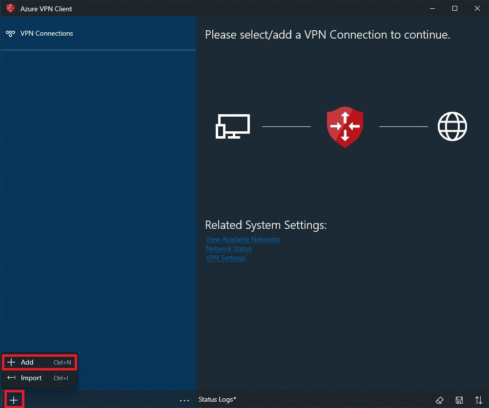
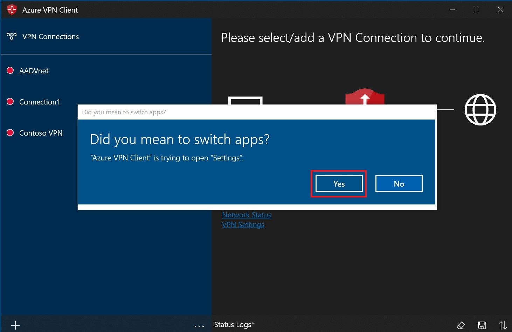
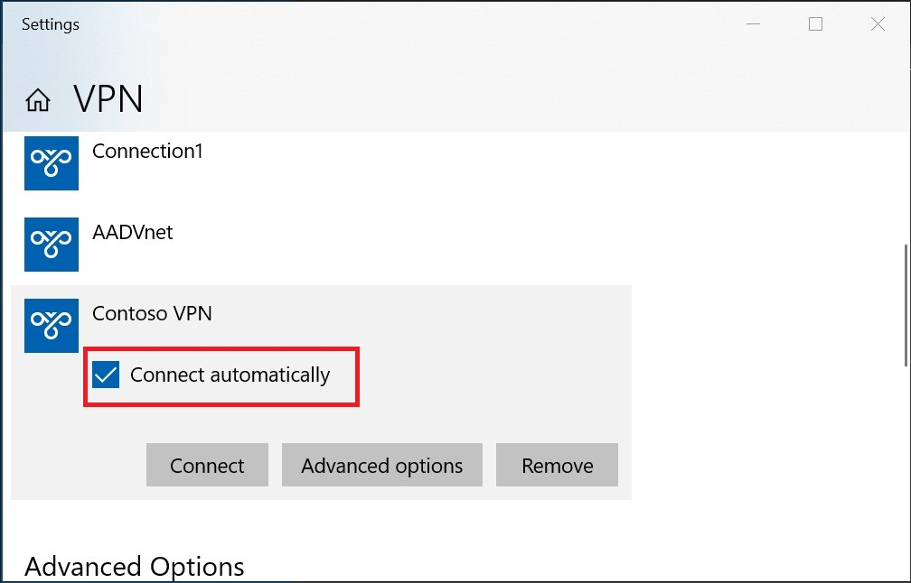
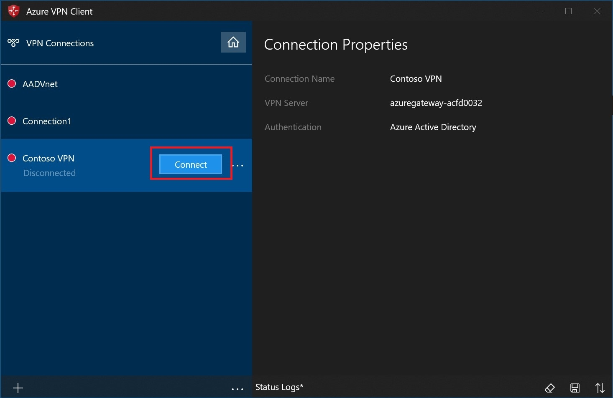
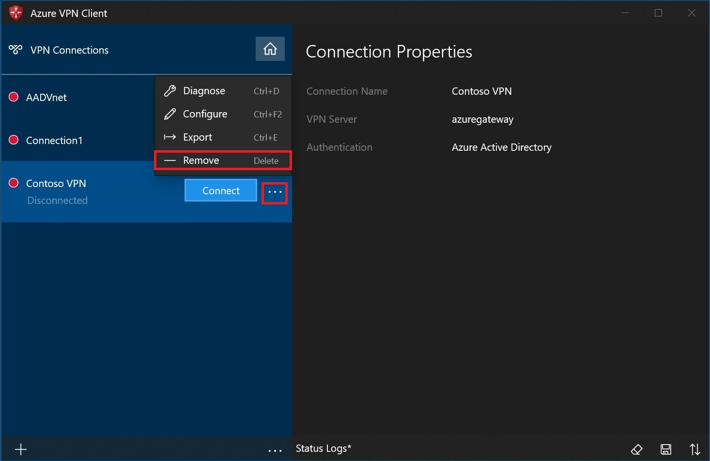
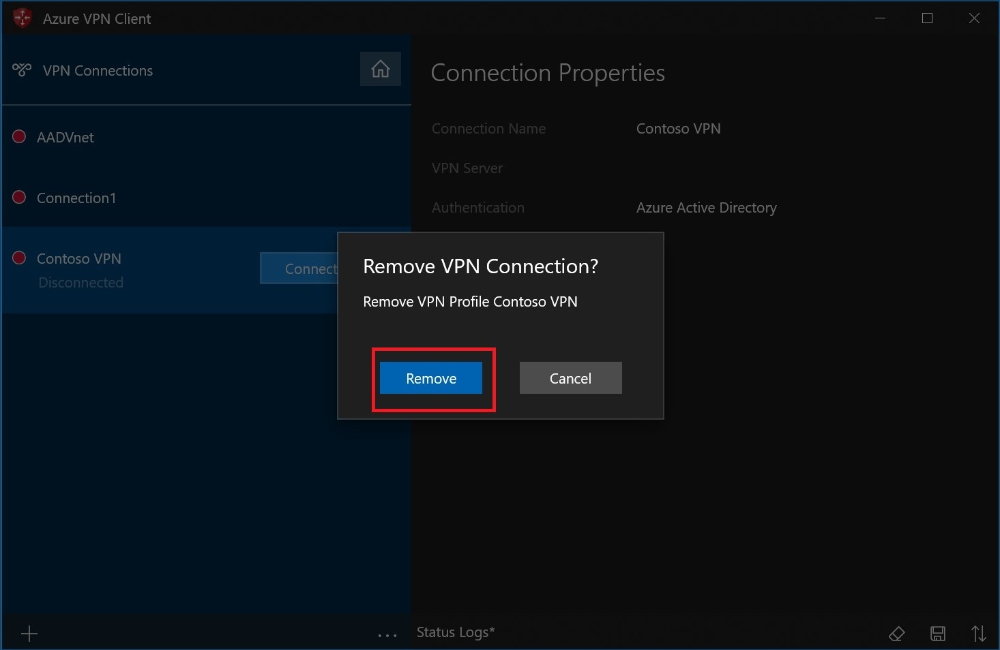

# Configure the Azure VPN Client - Azure AD authentication - Windows

This article helps you configure the Azure VPN Client on a Windows computer to connect to a virtual network using a VPN Gateway point-to-site (P2S) VPN and Azure Active Directory authentication. Before you can connect and authenticate using Azure AD, you must first configure your Azure AD tenant. For more information, see [Configure an Azure AD tenant](openvpn-azure-ad-tenant.md). For more information about point-to-site, see [About point-to-site VPN](point-to-site-about.md). The Azure VPN Client supported with Windows FIPS mode with the [KB4577063](https://support.microsoft.com/help/4577063/windows-10-update-kb4577063) hotfix.

[!INCLUDE [OpenVPN note](../../includes/vpn-gateway-openvpn-auth-include.md)]

## Workflow

After your Azure VPN Gateway P2S configuration is complete, your next steps are as follows:

1. Download and install the Azure VPN Client.
1. Generate the VPN client profile configuration package.
1. Import the client profile settings to the VPN client.
1. Create a connection.
1. Optional - export the profile settings from the client and import to other client computers.

## Download the Azure VPN Client

[!INCLUDE [Download Azure VPN Client](../../includes/vpn-gateway-download-vpn-client.md)]

## Generate VPN client profile configuration files

1. To generate the VPN client profile configuration package, see [Working with P2S VPN client profile files](about-vpn-profile-download.md).
1. Download and extract the VPN client profile configuration files.

## Import VPN client profile configuration files

For Azure AD authentication configurations, the **azurevpnconfig.xml** is used. The file is located in the **AzureVPN** folder of the VPN client profile configuration package.

1. On the page, select **Import**.

    

1. Browse to the profile xml file and select it. With the file selected, select **Open**.

    

1. Specify the name of the profile and select **Save**.

    

1. Select **Connect** to connect to the VPN.

    

1. Once connected, the icon will turn green and say **Connected**.

    

## Create a connection

1. On the page, select **+**, then **+ Add**.

    

1. Fill out the connection information. If you're unsure of the values, contact your administrator. After filling out the values, select **Save**.

1. Select **Connect** to connect to the VPN.

1. Select the proper credentials, then select **Continue**.

1. Once successfully connected, the icon will turn green and say **Connected**.

### To connect automatically

These steps help you configure your connection to connect automatically with Always-on.

1. On the home page for your VPN client, select **VPN Settings**.

    

1. Select **Yes** on the switch apps dialogue box.

    

1. Make sure the connection that you want to set isn't already connected, then highlight the profile and check the **Connect automatically** check box.

    

1. Select **Connect** to initiate the VPN connection.

    

## Export and distribute a client profile

Once you have a working profile and need to distribute it to other users, you can export it using the following steps:

1. Highlight the VPN client profile that you want to export, select the **...**, then select **Export**.

    

1. Select the location that you want to save this profile to, leave the file name as is, then select **Save** to save the xml file.

    

## Delete a client profile

1. Select the ellipses next to the client profile that you want to delete. Then, select **Remove**.

    

1. Select **Remove** to delete.

    

## Diagnose connection issues

1. To diagnose connection issues, you can use the **Diagnose** tool. Select the **...** next to the VPN connection that you want to diagnose to reveal the menu. Then select **Diagnose**.

    

1. On the **Connection Properties** page, select **Run Diagnosis**.

    

1. Sign in with your credentials.

    

1. View the diagnosis results.

    

## Optional Azure VPN Client configuration settings

You can configure the Azure VPN Client with optional configuration settings such as additional DNS servers, custom DNS, forced tunneling, custom routes, and other additional settings. For a description of the available optional settings and configuration steps, see [Azure VPN Client optional settings](azure-vpn-client-optional-configurations.md).

## Azure VPN Client version information

For Azure VPN Client version information, see [Azure VPN Client versions](vpn-client-versions.md).
  
## Next steps

For more information, see [Create an Azure AD tenant for P2S Open VPN connections that use Azure AD authentication](openvpn-azure-ad-tenant.md).