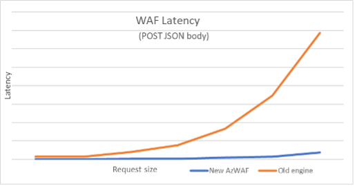

# Azure WAF engine on Azure Application Gateway

The Azure Web Application Firewall (WAF) engine is the component that inspects traffic and determines whether a request includes a signature that represents a potential attack and takes appropriate action depending on the configuration.

## Next generation of WAF engine

The new WAF engine is a high-performance, scalable Microsoft proprietary engine and has significant improvements over the previous WAF engine. The previous version of WAF engine on Azure Application Gateway is implemented based on [ModSecurity](https://github.com/SpiderLabs/ModSecurity). ModSecurity provides support for its [Core Rule Set (CRS)](https://github.com/SpiderLabs/owasp-modsecurity-crs), which is an industry standard that has existed for the past two decades and is mandated for protecting against the top 10 OWASP attacks by many organizations. 

The new engine, released with CRS 3.2, provides the following benefits:

* **Improved performance:** Significant reduction in WAF latency, including P99 POST and GET latencies.
* **Increased scale:** Higher RPS using the same compute power and ability to process larger request sizes.
* **Better protection:** Redesigned engine with efficient regex processing offers better protection against RegEx DOS attacks. 
* **Richer feature set:** New features and future enhancement are available only through the new engine.

## Support for new features

There are many new features that are only supported in the Azure WAF engine. The features include:

* [CRS 3.2](application-gateway-crs-rulegroups-rules.md#owasp-crs-32)
  * Increased request body size limit to 2 MB
  * Increased file upload limit to 4 GB
* [WAF v2 metrics](application-gateway-waf-metrics.md#application-gateway-waf-v2-metrics)
* *Any* operator in custom rules
* [Per rule exclusions](application-gateway-waf-configuration.md) and support for exclusion attributes by name

New WAF features will only be released with later versions of CRS on the new WAF engine. 

## Performance comparison

The following charts show some performance comparisons. Comparison is done between the new WAF engine (New AzWAF) and the previous WAF engine (old engine). During the test, WAF was configured in Prevention Mode. Each gateway was configured with two instances. 

### Latency improvements

In our testing lab, the new engine resulted in up to ~24x reduction in WAF latencies for JSON POST requests with different payload sizes.

We also observed significant improvements in P99 tail latencies with up to \~8x reduction in POST requests and \~4x reduction in GET requests. The following two charts show the comparison of P99 latencies of the new WAF engine and the old WAF engine.

### Increased scale

Our next-gen engine can scale up to 8 times more RPS using the same compute power and has an ability to process 16 times larger request sizes (up to 2MB sizes), which was not possible earlier with the previous engine.

The following charts shows the scale improvements with POST and GET requests per second with the new engine and with different payload sizes.

### Better protection

Under a regex DoS (ReDoS) attack simulation on the previous engine, we observed that latency of post request increased exponentially as the request size increased. The same attack simulation on the new engine introduces only a slight increase in latency and results in a fairly linear graph, demonstrating superior protection against such ReDoS attack patterns.

The following chart shows how the existing WAF engine vs new WAF engine performs against ReDOS attacks.

## Request logging for custom rules

There's a difference between how the previous engine and the new WAF engine log requests when a custom rule defines the action type as *Log*.

When your WAF runs in prevention mode, the previous engine logs the request's action type as *Blocked* even though the request is allowed through by the custom rule. In detection mode, the previous engine logs the same request's action type as *Detected*.

In contrast, the new WAF engine logs the request action type as *Log*, whether the WAF is running in prevention or detection mode.

## Next steps

Learn more about [WAF managed rules](application-gateway-crs-rulegroups-rules.md).
