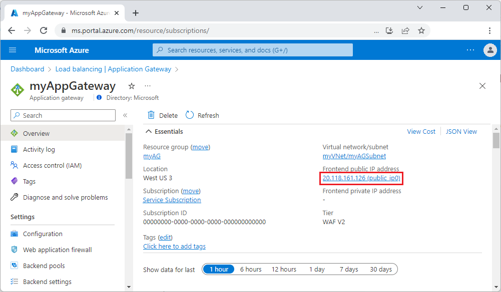

# Quickstart: Create an Azure Web Application Firewall v2 by using an ARM template

In this quickstart, you use an Azure Resource Manager template (ARM template) to create an Azure Web Application Firewall (WAF) v2 on Azure Application Gateway.

[!INCLUDE [About Azure Resource Manager](../../../includes/resource-manager-quickstart-introduction.md)]

[!INCLUDE [updated-for-az](../../../includes/updated-for-az.md)]

If your environment meets the prerequisites and you're familiar with using ARM templates, you can select the **Deploy to Azure** button to open the template in the Azure portal.

[](https://portal.azure.com/#create/Microsoft.Template/uri/https%3A%2F%2Fraw.githubusercontent.com%2FAzure%2Fazure-quickstart-templates%2Fmaster%2Fdemos%2Fag-docs-wafv2%2Fazuredeploy.json)

## Prerequisites

- An Azure account with an active subscription. If you don't have one, you can [create an account for free](https://azure.microsoft.com/free/?WT.mc_id=A261C142F).

## Review the template

This template creates a simple Web Application Firewall v2 on Azure Application Gateway. The template creates a public IP frontend IP address, HTTP settings, a rule with a basic listener on port 80, and a backend pool. A WAF policy with a custom rule blocks traffic to the backend pool based on an IP address match type.

The template defines the following Azure resources:

- [Microsoft.Network/applicationgateways](/azure/templates/microsoft.network/applicationgateways)
- [Microsoft.Network/ApplicationGatewayWebApplicationFirewallPolicies](/azure/templates/microsoft.network/ApplicationGatewayWebApplicationFirewallPolicies)
- [Microsoft.Network/publicIPAddresses](/azure/templates/microsoft.network/publicipaddresses), one for the application gateway and two for the virtual machines (VMs)
- [Microsoft.Network/networkSecurityGroups](/azure/templates/microsoft.network/networksecuritygroups)
- [Microsoft.Network/virtualNetworks](/azure/templates/microsoft.network/virtualnetworks)
- [Microsoft.Compute/virtualMachines](/azure/templates/microsoft.compute/virtualmachines), two VMs
- [Microsoft.Network/networkInterfaces](/azure/templates/microsoft.network/networkinterfaces), one for each VM
- [Microsoft.Compute/virtualMachine/extensions](/azure/templates/microsoft.compute/virtualmachines/extensions) to configure IIS and the web pages

This template is from [Azure Quickstart Templates](https://azure.microsoft.com/resources/templates/ag-docs-wafv2/).

:::code language="json" source="~/quickstart-templates/demos/ag-docs-wafv2/azuredeploy.json":::

## Deploy the template

Deploy the ARM template to Azure:

1. Select **Deploy to Azure** to sign in to Azure and open the template. The template creates an application gateway, the network infrastructure, and two VMs in the backend pool running IIS.

   [](https://portal.azure.com/#create/Microsoft.Template/uri/https%3A%2F%2Fraw.githubusercontent.com%2FAzure%2Fazure-quickstart-templates%2Fmaster%2Fdemos%2Fag-docs-wafv2%2Fazuredeploy.json)

1. Select or create a resource group.
1. Select **Review + create**, and when validation passes, select **Create**. The deployment can take 10 minutes or longer to complete.

## Validate the deployment

Although IIS isn't required, the template installs IIS on the backend servers so you can verify that Azure successfully created a WAF v2 on the application gateway.

Use IIS to test the application gateway:

1. Copy the public IP address for the application gateway from its **Overview** page.

   

   You can also search for *application gateways* in the Azure search box. The list of application gateways shows the public IP addresses in the **Public IP address** column.

1. Paste the IP address into the address bar of your browser to browse that address.
1. Check the response. A **403 Forbidden** response verifies that the WAF is successfully blocking connections to the backend pool.
1. To change the custom rule to allow traffic, run the following Azure PowerShell script, replacing your resource group name:

   ```azurepowershell
   $rg = "<your resource group name>"
   $AppGW = Get-AzApplicationGateway -Name myAppGateway -ResourceGroupName $rg
   $pol = Get-AzApplicationGatewayFirewallPolicy -Name WafPol01 -ResourceGroupName $rg
   $pol[0].customrules[0].action = "allow"
   $rule = $pol.CustomRules
   Set-AzApplicationGatewayFirewallPolicy -Name WafPol01 -ResourceGroupName $rg -CustomRule $rule
   $AppGW.FirewallPolicy = $pol
   Set-AzApplicationGateway -ApplicationGateway $AppGW
   ```

1. Refresh your browser several times. You should see connections to both myVM1 and myVM2.

## Clean up resources

When you no longer need the resources you created in this quickstart, delete the resource group to remove the application gateway and all its related resources.

To delete the resource group, call the `Remove-AzResourceGroup` cmdlet:

```azurepowershell-interactive
Remove-AzResourceGroup -Name "<your resource group name>"
```

## Next steps

> [!div class="nextstepaction"]
> [Tutorial: Create an application gateway with a Web Application Firewall by using the Azure portal](application-gateway-web-application-firewall-portal.md)
