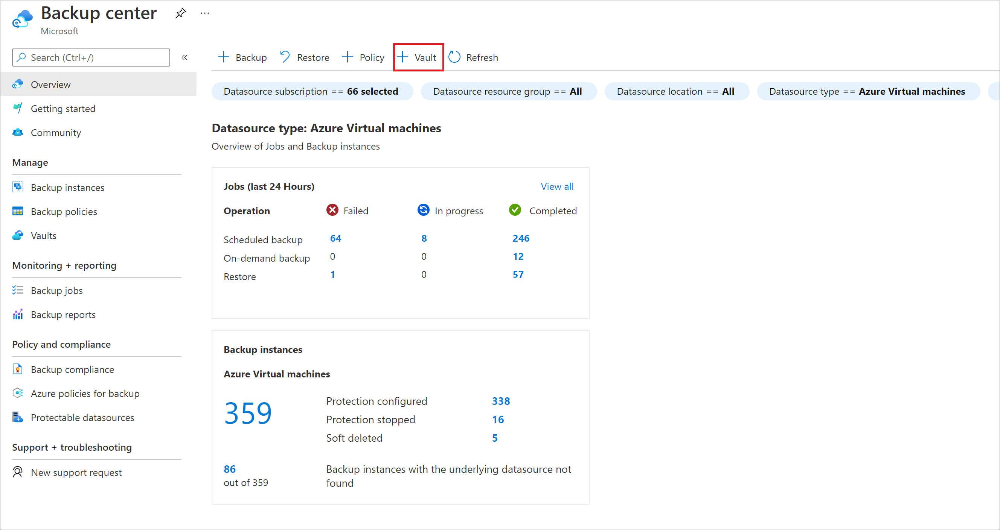
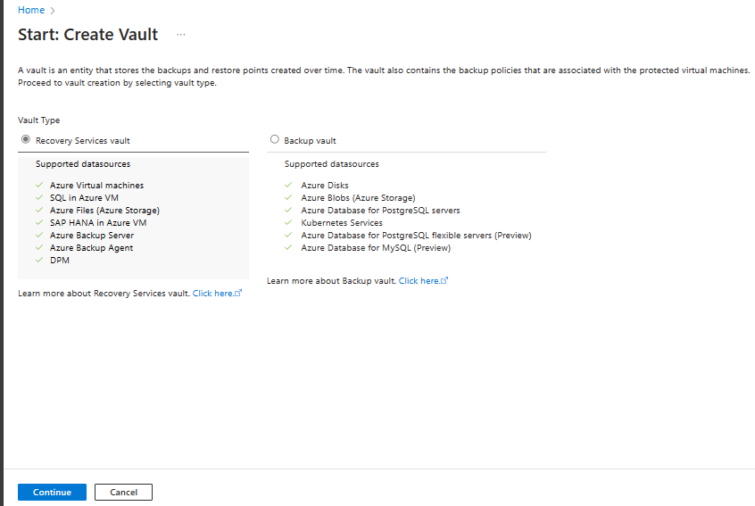
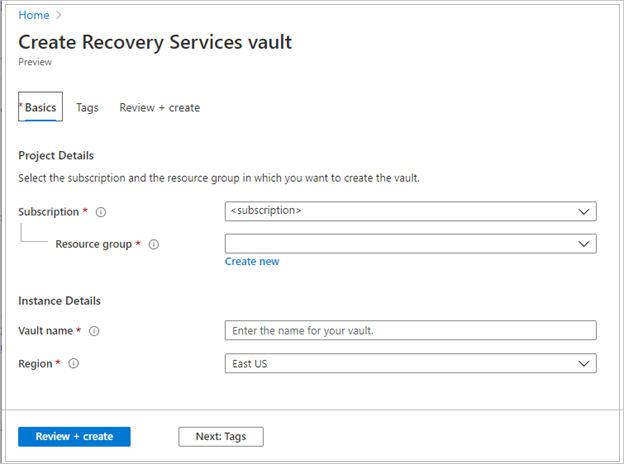

## Create a Recovery Services vault

A Recovery Services vault is a management entity that stores recovery points created over time and provides an interface to perform backup-related operations. These operations include taking on-demand backups, performing restores, and creating backup policies.

To create a Recovery Services vault, follow these steps:

1. Sign in to your subscription in the [Azure portal](https://portal.azure.com/).

1. Search for **Backup center** in the Azure portal, and go to the **Backup Center** dashboard.

    

1. Select **+Vault** from the **Overview** tab.

     

1. Select **Recovery Services vault** > **Continue**.

     

1. The **Recovery Services vault** dialog opens. Provide the following values:    

   - **Subscription**: Choose the subscription to use. If you're a member of only one subscription, you'll see that name. If you're not sure which subscription to use, use the default (suggested) subscription. There are multiple choices only if your work or school account is associated with more than one Azure subscription.
   - **Resource group**: Use an existing resource group or create a new one. To see the list of available resource groups in your subscription, select **Use existing**, and then select a resource from the dropdown list. To create a new resource group, select **Create new** and enter the name. For more information about resource groups, see [Azure Resource Manager overview](../articles/azure-resource-manager/management/overview.md).
   - **Vault name**: Enter a friendly name to identify the vault. The name must be unique to the Azure subscription. Specify a name that has at least 2 but not more than 50 characters. The name must start with a letter and consist only of letters, numbers, and hyphens.
   - **Region**: Select the geographic region for the vault. To create a vault to protect any data source, the vault *must* be in the same region as the data source.

      > [!IMPORTANT]
      > If you're not sure of the location of your data source, close the dialog. Go to the list of your resources in the portal. If you have data sources in multiple regions, create a Recovery Services vault for each region. Create the vault in the first location before you create the vault for another location. There's no need to specify storage accounts to store the backup data. The Recovery Services vault and Azure Backup handle that automatically.
      >
      >

    

1. After you provide the values, select **Review + create**.

    

1. When you're ready to create the Recovery Services vault, select **Create**.

    

1. It can take a while to create the Recovery Services vault. Monitor the status notifications in the **Notifications** area at the upper-right corner of the portal. After your vault is created, it's visible in the list of Recovery Services vaults. If you don't see your vault, select **Refresh**.

    

>[!IMPORTANT]
> We highly recommend you review the default settings for **Storage Replication type** and **Security settings** before you configure backups in the vault. For more information, see the [Set storage redundancy](../articles/backup/backup-create-rs-vault.md#set-storage-redundancy) section.