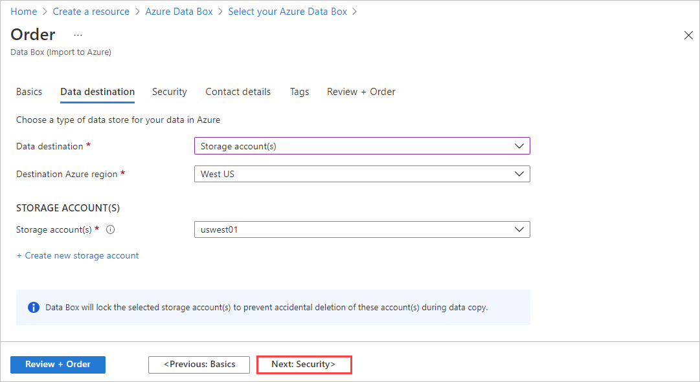
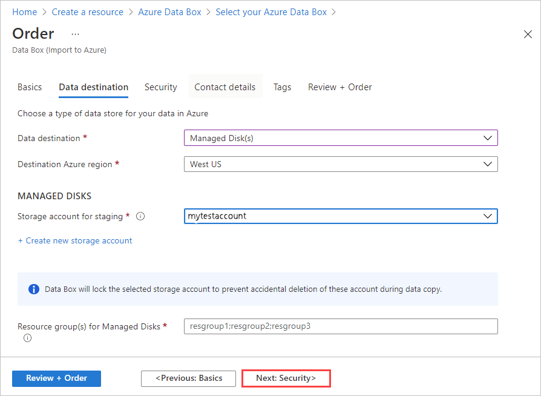
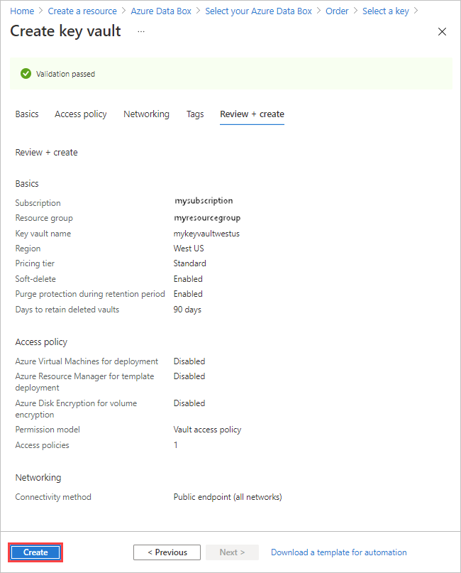
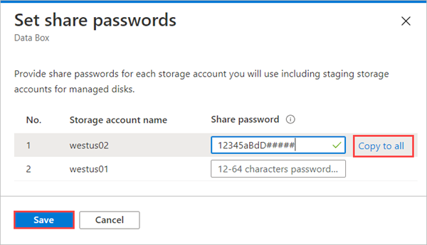
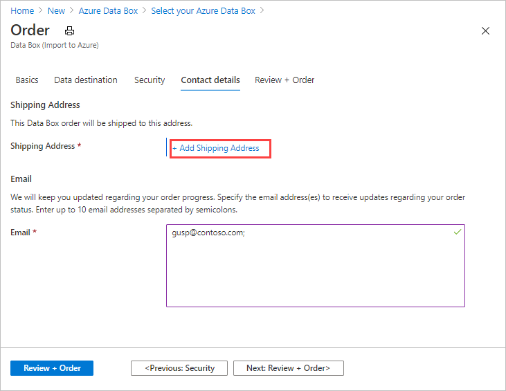

Do the following steps in the Azure portal to order a device.

1. Use your Microsoft Azure credentials to sign in at this URL: [https://portal.azure.com](https://portal.azure.com).
2. Select **+ Create a resource** and search for *Azure Data Box*. Select **Azure Data Box**.

   

3. Select **Create**.

   <!--Check: "Useful links" list no longer included?-->

4. Check if Data Box service is available in your region. Enter or select the following information and select **Apply**.

    |Setting  |Value  |
    |---------|---------|
    |Transfer type     | Select **Import to Azure**.        |
    |Subscription     | Select an EA, CSP, or Azure sponsorship subscription for Data Box service.   The subscription is linked to your billing account.       |
    |Resource Group | Select an existing resource group. A resource group is a logical container for the resources that can be managed or deployed together. |
    |Source country/region    |    Select the country/region where your data currently resides.         |
    |Destination Azure region     |     Select the Azure region where you want to transfer data.   For more information, go to [region availability](data-box-overview.md#region-availability).            |

    

5. Select **Data Box**. The maximum usable capacity for a single order is 80 TB. You can create multiple orders for larger data sizes.

    

6. In **Order**, go to the **Basics** tab. Enter or select the following information and select **Next: Data destination>**.

    |Setting  |Value  |
    |---------|---------|
    |Subscription      | The subscription is automatically populated based on your earlier selection.|
    |Resource group    | The resource group you selected previously. |
    |Import order name | Provide a friendly name to track the order.   The name can have between 3 and 24 characters that can be letters, numbers, and hyphens.   The name must start and end with a letter or a number.    |

    

7. On the **Data destination** screen, select the **Data destination** - either storage accounts or managed disks.

    If using **storage account(s)** as the storage destination, you see the following screen:

    

    Based on the specified Azure region, select one or more storage accounts from the filtered list of existing storage accounts. Data Box can be linked with up to 10 storage accounts. You can also create a new **General-purpose v1**, **General-purpose v2**, or **Blob storage account**.

   > [!NOTE]
   > - If you select Azure Premium FileStorage accounts, the provisioned quota on the storage account share will increase to the size of data being copied to the file shares. After the quota is increased, it isn't adjusted again, for example, if for some reason the Data Box can't copy your data.
   > - This quota is used for billing. After your data is uploaded to the datacenter, you should adjust the quota to meet your needs. For more information, see [Understanding billing](../../articles/storage/files/understanding-billing.md).

    Storage accounts with virtual networks are supported. To allow Data Box service to work with secured storage accounts, enable the trusted services within the storage account network firewall settings. For more information, see how to [Add Azure Data Box as a trusted service](../storage/common/storage-network-security.md#exceptions).

    If using Data Box to create **Managed disk(s)** from the on-premises virtual hard disks (VHDs), you will also need to provide the following information:

    |Setting  |Value  |
    |---------|---------|
    |Resource groups     | Create new resource groups if you intend to create managed disks from on-premises VHDs. You can use an existing resource group only if the resource group was created previously when creating a Data Box order for managed disks by the Data Box service.   Specify multiple resource groups separated by semi-colons. A maximum of 10 resource groups are supported.|

    

    The storage account specified for managed disks is used as a staging storage account. The Data Box service uploads the VHDs as page blobs to the staging storage account before converting it into managed disks and moving it to the resource groups. For more information, see [Verify data upload to Azure](data-box-deploy-picked-up.md#verify-data-upload-to-azure).

   > [!NOTE]
   > If a page blob isn't successfully converted to a managed disk, it stays in the storage account and you're charged for storage.

8. Select **Next: Security** to continue.

    The **Security** screen lets you use your own encryption key and your own device and share passwords, and choose to use double encryption.

    All settings on the **Security** screen are optional. If you don't change any settings, the default settings will apply.

    

9. If you want to use your own customer-managed key to protect the unlock passkey for your new resource, expand **Encryption type**.

    Configuring a customer-managed key for your Azure Data Box is optional. By default, Data Box uses a Microsoft managed key to protect the unlock passkey.

    A customer-managed key doesn't affect how data on the device is encrypted. The key is only used to encrypt the device unlock passkey.

    If you don't want to use a customer-managed key, skip to Step 15.

   

10. Select **Customer managed key** as the key type. Then select **Select a key vault and key**.
   
    

11. In the **Select key from Azure Key Vault** blade, the subscription is automatically populated.

    - For **Key vault**, you can select an existing key vault from the dropdown list.

      

    - You can also select **Create new** to create a new key vault. On the **Create key vault** screen, enter the resource group and a key vault name. Ensure that **Soft delete** and **Purge protection** are enabled. Accept all other defaults, and select **Review + Create**.

      

      Review the information for your key vault, and select **Create**. Wait for a couple minutes for key vault creation to complete.

      

12. In **Select key from Azure Key Vault**, you can select an existing key in the key vault.

    

    If you want to create a new key, select **Create new**. You must use an RSA key. The size can be 2048 or greater. Enter a name for your new key, accept the other defaults, and select **Create**.

      

      You'll be notified when the key has been created in your key vault.

13. Select the **Version** of the key to use, and then choose **Select**.

      

    If you want to create a new key version, select **Create new**.

    

    Choose settings for the new key version, and select **Create**.

    

    The **Encryption type** settings on the **Security** screen show your key vault and key.

    

14. Select a user identity that you'll use to manage access to this resource. Choose **Select a user identity**. In the panel on the right, select the subscription and the managed identity to use. Then choose **Select**.

    A user-assigned managed identity is a stand-alone Azure resource that can be used to manage multiple resources. For more information, see [Managed identity types](../active-directory/managed-identities-azure-resources/overview.md).  

    If you need to create a new managed identity, follow the guidance in [Create, list, delete, or assign a role to a user-assigned managed identity using the Azure portal](../active-directory/managed-identities-azure-resources/how-to-manage-ua-identity-portal.md).
    
    

    The user identity is shown in **Encryption type** settings.

    

15. If you don't want to use the system-generated passwords that Azure Data Box uses by default, expand **Bring your own password** on the **Security** screen.

    The system-generated passwords are secure, and are recommended unless your organization requires otherwise.

     

   - To use your own password for your new device, by **Set preference for the device password**, select **Use your own password**, and type a password that meets the security requirements.
     
     The password must be alphanumeric and contain from 12 to 15 characters, with at least one uppercase letter, one lowercase letter, one special character, and one number. 

     - Allowed special characters: @ # - $ % ^ ! + = ; : _ ( )
     - Characters not allowed: I i L o O 0
   
     

 - To use your own passwords for shares:

   1. By **Set preference for share passwords**, select **Use your own passwords** and then **Select passwords for the shares**.
     
       

    1. Type a password for each storage account in the order. The password will be used on all shares for the storage account.
    
       The password must be alphanumeric and contain from 12 to 64 characters, with at least one uppercase letter, one lowercase letter, one special character, and one number.

       - Allowed special characters: @ # - $ % ^ ! + = ; : _ ( )
       - Characters not allowed: I i L o O 0
     
    1. To use the same password for all of the storage accounts, select **Copy to all**. 

    1. When you finish, select **Save**.
     
       

    On the **Security** screen, you can use **View or change passwords** to change the passwords.

16. In **Security**, if you want to enable software-based double encryption, expand **Double-encryption (for highly secure environments)**, and select **Enable double encryption for the order**.

    

    The software-based encryption is performed in addition to the  AES-256 bit encryption of the data on the Data Box.

    > [!NOTE]
    > Enabling this option could make order processing and data copy take longer. You can't change this option after you create your order.

    Select **Next: Contact details** to continue.

17. In **Contact details**, select **+ Add Shipping Address**.<!--Has this been simplified to "Add Address"?-->

    <!--Edit screen to remove "Shipping" from "Add Shipping Address"?-->

18. In the **Shipping address**, provide your first and last name, name and postal address of the company, and a valid phone number. Select **Validate address**. The service validates the shipping address for service availability. If the service is available for the specified shipping address, you receive a notification to that effect.

    

    If you selected self-managed shipping, you will receive an email notification after the order is placed successfully. For more information about self-managed shipping, see [Use self-managed shipping](data-box-portal-customer-managed-shipping.md).

19. Select **Add Shipping Address** once the shipping details have been validated successfully. You will return to the **Contact details** tab.

20. After you return to **Contact details**, add one or more email addresses. The service sends email notifications regarding any updates to the order status to the specified email addresses.

    We recommend that you use a group email so that you continue to receive notifications if an admin in the group leaves.

    

21. Review the information in **Review + Order** related to the order, contact, notification, and privacy terms. Check the box corresponding to the agreement to privacy terms.

22. Select **Order**. The order takes a few minutes to be created.

    