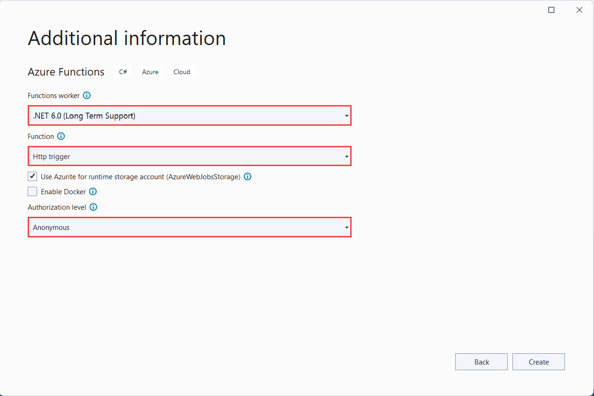

The Azure Functions project template in Visual Studio creates a C# class library project that you can publish to a function app in Azure. You can use a function app to group functions as a logical unit for easier management, deployment, scaling, and sharing of resources.

1. From the Visual Studio menu, select **File** > **New** > **Project**.

1. In **Create a new project**, enter *functions* in the search box, choose the **Azure Functions** template, and then select **Next**.

1. In **Configure your new project**, enter a **Project name** for your project, and then select **Create**. The function app name must be valid as a C# namespace, so don't use underscores, hyphens, or any other nonalphanumeric characters.

1. For the **Create a new Azure Functions application** settings, use the values in the following table:

    # [In-process](#tab/in-process) 

    | Setting      | Value  | Description                      |
    | ------------ |  ------- |----------------------------------------- |
    | **.NET version** | **.NET Core 3 (LTS)** | This value creates a function project that runs in-process with version 3.x of the Azure Functions runtime. Azure Functions 1.x supports the .NET Framework. For more information, see [Azure Functions runtime versions overview](../articles/azure-functions/functions-versions.md).   |
    | **Function template** | **HTTP trigger** | This value creates a function triggered by an HTTP request. |
    | **Storage account (AzureWebJobsStorage)**  | **Storage emulator** | Because a function app in Azure requires a storage account, one is assigned or created when you publish your project to Azure. An HTTP trigger doesn't use an Azure Storage account connection string; all other trigger types require a valid Azure Storage account connection string.  |
    | **Authorization level** | **Anonymous** | The created function can be triggered by any client without providing a key. This authorization setting makes it easy to test your new function. For more information about keys and authorization, see [Authorization keys](../articles/azure-functions/functions-bindings-http-webhook-trigger.md#authorization-keys) and [HTTP and webhook bindings](../articles/azure-functions/functions-bindings-http-webhook.md). |
    
    
    

    # [Isolated process](#tab/isolated-process)

    | Setting      | Value  | Description                      |
    | ------------ |  ------- |----------------------------------------- |
    | **.NET version** | **.NET 5 (Isolated)** | This value creates a function project that runs in an isolatedd process, which supports .NET 5.0. For more information, see [Azure Functions runtime versions overview](../articles/azure-functions/functions-versions.md).   |
    | **Function template** | **HTTP trigger** | This value creates a function triggered by an HTTP request. |
    | **Storage account (AzureWebJobsStorage)**  | **Storage emulator** | Because a function app in Azure requires a storage account, one is assigned or created when you publish your project to Azure. An HTTP trigger doesn't use an Azure Storage account connection string; all other trigger types require a valid Azure Storage account connection string.  |
    | **Authorization level** | **Anonymous** | The created function can be triggered by any client without providing a key. This authorization setting makes it easy to test your new function. For more information about keys and authorization, see [Authorization keys](../articles/azure-functions/functions-bindings-http-webhook-trigger.md#authorization-keys) and [HTTP and webhook bindings](../articles/azure-functions/functions-bindings-http-webhook.md). |
    
    
    

    ---

    Make sure you set the **Authorization level** to **Anonymous**. If you choose the default level of **Function**, you're required to present the [function key](../articles/azure-functions/functions-bindings-http-webhook-trigger.md#authorization-keys) in requests to access your function endpoint.

1. Select **Create** to create the function project and HTTP trigger function.
