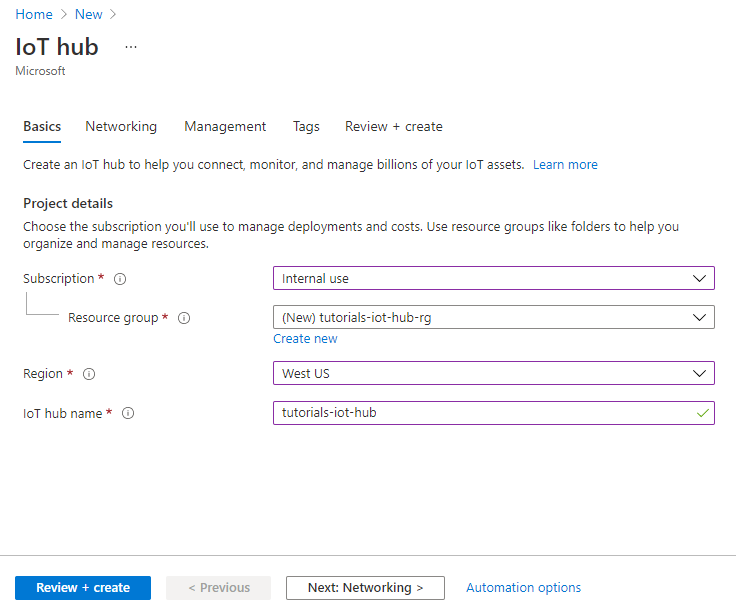
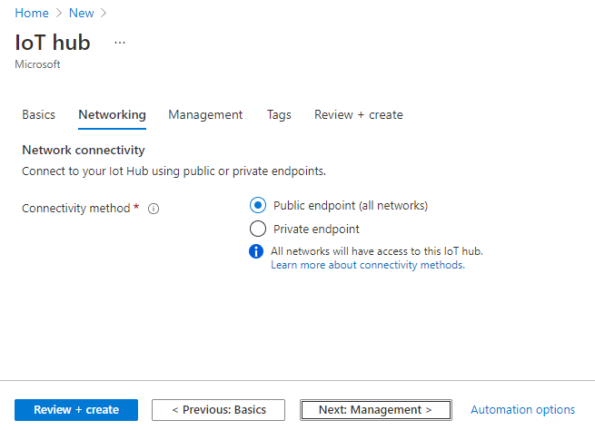
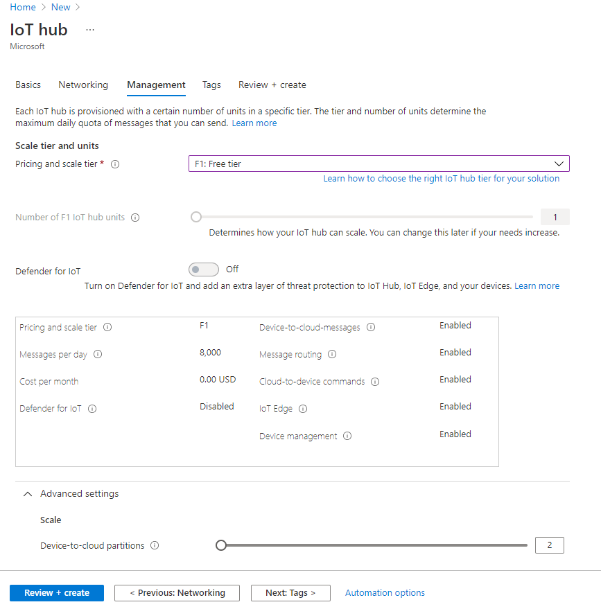
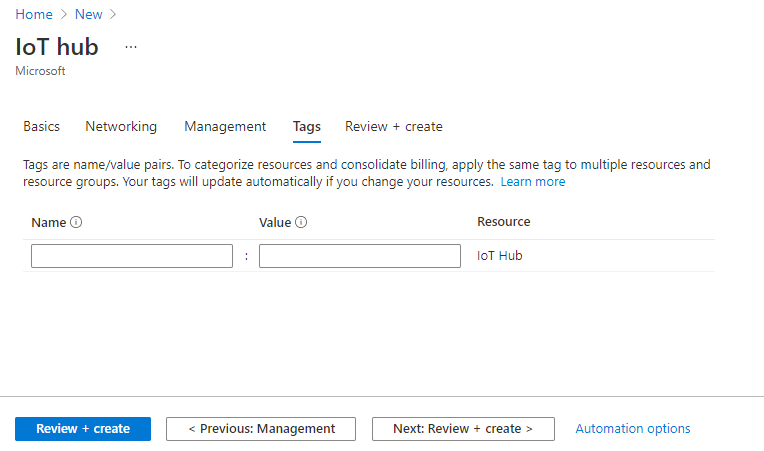
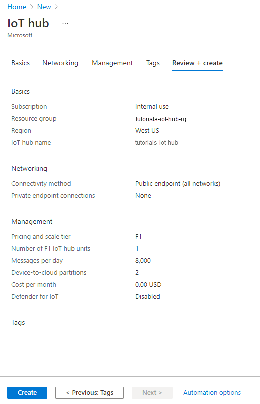

To create an IoT Hub using the Azure portal:

1. Sign in to the [Azure portal](https://portal.azure.com).

1. From the Azure homepage, select the **+ Create a resource** button, and then enter *IoT Hub* in the **Search the Marketplace** field.

1. Select **IoT Hub** from the search results, and then select **Create**.

1. On the **Basics** tab, complete the fields as follows.

   - **Subscription**: Select the subscription to use for your hub.

   - **Resource Group**: Select a resource group or create a new one. To create a new one, select **Create new** and fill in the name you want to use. To use an existing resource group, select that resource group. For more information, see [Manage Azure Resource Manager resource groups](../articles/azure-resource-manager/management/manage-resource-groups-portal.md). This tutorial uses the name **tutorials-iot-hub-rg**.

   - **Region**: Select the region in which you want your hub to be located. Select the location closest to you. Some features, such as [IoT Hub device streams](../articles/iot-hub/iot-hub-device-streams-overview.md), are only available in specific regions. For these limited features, you must select one of the supported regions. This tutorial uses the **West US** region.

   - **IoT Hub Name**: Enter a name for your hub. This name must be globally unique. This tutorial uses **tutorials-iot-hub**. You must choose your own unique name when you create your hub.

   [!INCLUDE [iot-hub-pii-note-naming-hub](iot-hub-pii-note-naming-hub.md)]

   

1. Select **Next: Networking** to continue creating your hub.

   Choose the endpoints that can connect to your IoT Hub. You can select the default setting **Public endpoint (all networks)**, or choose **Public endpoint (selected IP ranges)**, or **Private endpoint**. Accept the default setting for this tutorial.

   

1. Select **Next: Management** to continue creating your hub.

    

    You can accept the default settings here. If desired, you can modify any of the following fields:

    - **Pricing and scale tier**: Your selected tier. Choose the free tier. The free tier is intended for testing and evaluation. It allows 500 devices to be connected to the hub and up to 8,000 messages per day. Each Azure subscription can create one IoT hub in the free tier.

    - **IoT Hub units**: The number of messages allowed per unit per day depends on your hub's pricing tier. For example, if you want the hub to support ingress of 700,000 messages, you choose two S1 tier units.
    Each Azure subscription can create one IoT hub in the free tier. For details about the other tier options, see [Choosing the right IoT Hub tier](../articles/iot-hub/iot-hub-scaling.md).

    - **Defender for IoT**: Turn this on to add an extra layer of threat protection to IoT and your devices. This option is not available for hubs in the free tier. For more information about this feature, see [Azure Security Center for IoT](/azure/asc-for-iot/).

    - **Advanced Settings** > **Device-to-cloud partitions**: This property relates the device-to-cloud messages to the number of simultaneous readers of the messages. Most hubs need only four partitions. A free tier hub is limited to two partitions.

1.  Select **Next: Tags** to continue to the next screen.

    Tags are name/value pairs. You can assign the same tag to multiple resources and resource groups to categorize resources and consolidate billing. For more information, see [Use tags to organize your Azure resources](../articles/azure-resource-manager/management/tag-resources.md).

    

1.  Select **Next: Review + create** to review your choices. You see something similar to this screen, but with the values you selected when creating the hub.

    

1. Make a note of the IoT hub name you chose. You use this value later in the tutorial.
