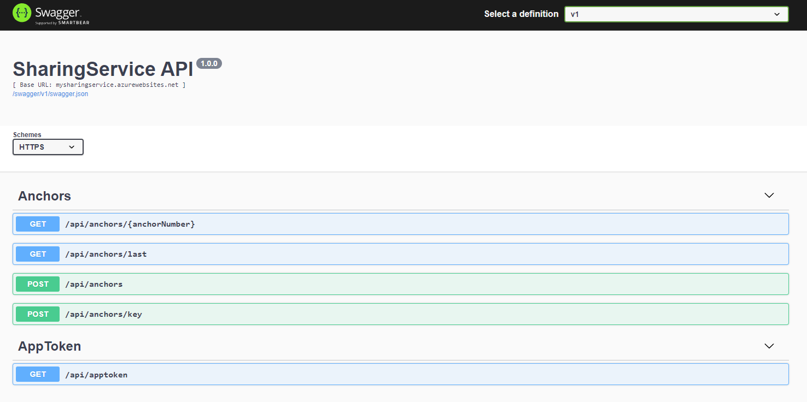

### Open the publish wizard

In **Solution Explorer**, right-click the **SharingService** project, and then select **Publish...**.

The Publish Wizard starts. 

1. Select Target **Azure** > **Next**. 
1. Select Specific Target **Azure App Service (Windows)** > **Next**
1. Sign in to the Azure portal.
1. Select the green "+" to **Create an Azure App Service**
    1. **Name:** Give your service a unique name
    1. **Subscription Name:** Select your preferred Azure subscription
    1. **Resource Group:** [!INCLUDE [resource group intro text](resource-group.md)]. Select an existing resource group or create a new one and call it _myResourceGroup_
    1. **Hosting Plan:**[!INCLUDE [app-service-plan](app-service-plan.md)]. 
    Select **New...**
        
| Setting | Suggested value | Description |
|-|-|-|
|Hosting Plan| MySharingServicePlan | Give your hosting plan a unique name |
| Location | West US | The datacenter where the web app is hosted. Choose a location closest to the physical location your application will be used |
| Size | Free | The [pricing tier](https://azure.microsoft.com/pricing/details/app-service/?ref=microsoft.com&utm_source=microsoft.com&utm_medium=docs&utm_campaign=visualstudio) that determines hosting features |

5. Select **Create** to create the App Service
6. Once the app service is created select it in the "App service instances" list and select **Finish**
7. On the **SharingService: Publish** tab select **Publish**

Once the ASP.NET Core web app has been published to Azure you can go to `https://<your_app_name>.azurewebsites.net` or click the link next to **Site:** on the **SharingService: Publish** tab. Copy this URL to a text editor for later use.

  
