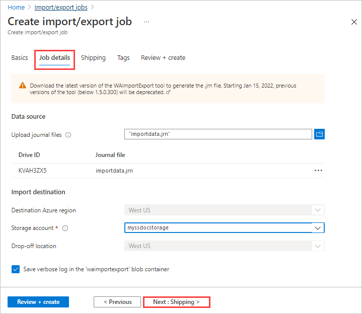
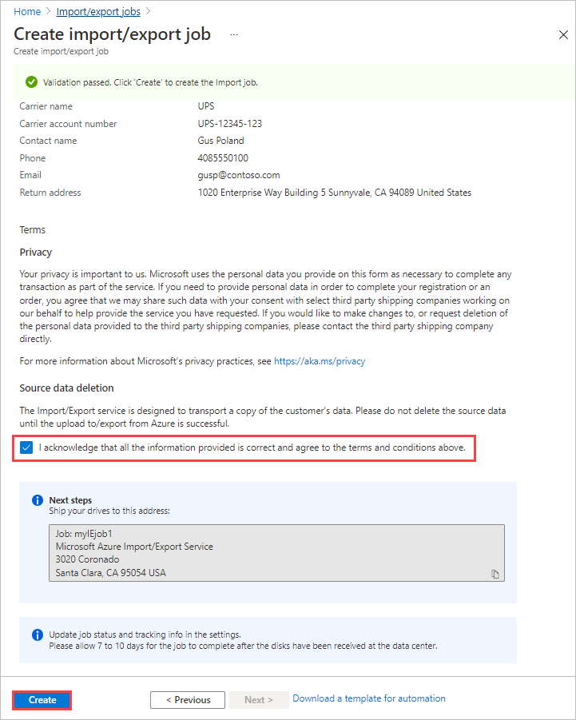

Do the following steps to create an import job in the Azure portal using the classic Azure Import/Export service.

1. Log on to https://portal.azure.com/.
2. Search for **import/export jobs**.

    

3. Select **+ Create**.

    

4. In **Basics**:

   1. Select a subscription.
   1. Select a resource group, or select **Create new** and create a new one.
   1. Enter a descriptive name for the job. Use the name to track the progress of your jobs.
      * The name must have from 3 to 24 characters.
      * The name must include only letters, numbers, and hyphens.
      * The name must start and end with a letter or number

   1. Select **Import into Azure**.
   1. Select the **Destination Azure region** for the order.

      If the new import/export experience is available in the selected region, you'll see a note inviting you to try the new experience. Select **Try now**, and follow the steps on the **Portal (Preview)** tab of this section to try the new experience with this order.

    

    Select **Next: Job details >** to proceed.

5. In **Job details**:

   1. Upload the journal files that you created during the preceding [Step 1: Prepare the drives](../../articles/import-export/storage-import-export-data-to-blobs.md#step-1-prepare-the-drives). If `waimportexport.exe version1` was used, upload one file for each drive that you prepared. If the journal file size exceeds 2 MB, then you can use the `<Journal file name>_DriveInfo_<Drive serial ID>.xml` also created with the journal file.
   1. Select the storage account for the import.
      
      The dropoff location is automatically populated based on the region of the storage account selected.

   1. If you don't want to save a verbose log, clear the **Save verbose log in the 'waimportexport' blob container** option.

   

   Select **Next: Shipping >** to proceed.

6. [!INCLUDE [storage-import-export-shipping-step.md](./storage-import-export-shipping-step.md)]

7. In the order summary:

   1. Review the **Terms**, and then select "I acknowledge that all the information provided is correct and agree to the terms and conditions." Validation is then performed.
   1. Review the job information provided in the summary. Make a note of the job name and the Azure datacenter shipping address to ship disks back to Azure. This information is used later on the shipping label.
   1. Select **Create**.

     
