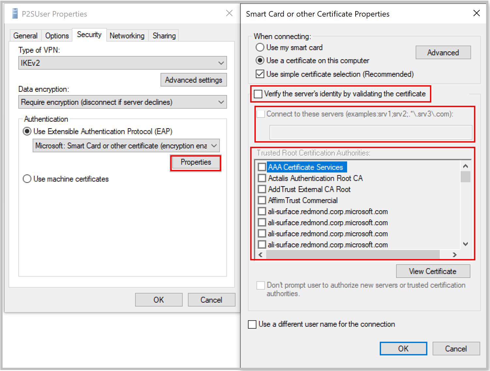

[!INCLUDE [P2S FAQ All](vpn-gateway-faq-p2s-all-include.md)]

### What should I do if I'm getting a certificate mismatch when connecting using certificate authentication?

Uncheck **"Verify the server's identity by validating the certificate"** or **add the server FQDN along with the certificate** when creating a profile manually. You can do this by running **rasphone** from a command prompt and picking the profile from the drop-down list.

Bypassing server identity validation isn't recommended in general, but with Azure certificate authentication, the same certificate is being used for server validation in the VPN tunneling protocol (IKEv2/SSTP) and the EAP protocol. Since the server certificate and FQDN is already validated by the VPN tunneling protocol, it's redundant to validate the same again in EAP.

### Can I use my own internal PKI root CA to generate certificates for Point-to-Site connectivity?

Yes. Previously, only self-signed root certificates could be used. You can still upload 20 root certificates.

### Can I use certificates from Azure Key Vault?

No.

### What tools can I use to create certificates?

You can use your Enterprise PKI solution (your internal PKI), Azure PowerShell, MakeCert, and OpenSSL.

### Are there instructions for certificate settings and parameters?

* **Internal PKI/Enterprise PKI solution:** See the steps to [Generate certificates](../articles/vpn-gateway/vpn-gateway-howto-point-to-site-resource-manager-portal.md#generatecert).

* **Azure PowerShell:** See the [Azure PowerShell](../articles/vpn-gateway/vpn-gateway-certificates-point-to-site.md) article for steps.

* **MakeCert:** See the [MakeCert](../articles/vpn-gateway/vpn-gateway-certificates-point-to-site-makecert.md) article for steps.

* **OpenSSL:**

  * When exporting certificates, be sure to convert the root certificate to Base64.

  * For the client certificate:

    * When creating the private key, specify the length as 4096.
    * When creating the certificate, for the *-extensions* parameter, specify *usr_cert*.
